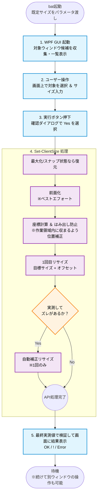

## 概要

所属している企業のセキュリティポリシーによって、気軽にソフト・拡張機能を導入できない環境用にPowerShellスクリプトを作成してみました。

## この記事のターゲット

- 企業のポリシーなどで気軽にソフトやブラウザの拡張機能が導入できない方
- 指定したpx（ピクセル）単位で設定したい方
- ブラウザに限らず汎用的なリサイズツールを使用したい方

## 対象環境

Windows 10 (1703+) / Windows 11、Windows PowerShell 5.1 / PowerShell 7

---

## 処理フロー



---

## 使い方

### 単体実行

```powershell
# 既定（1366x768、ブラウザ系を一覧表示）
.\Set-WindowClientSize.ps1

# サイズ指定・全ウィンドウ対象
.\Set-WindowClientSize.ps1 -Width 1280 -Height 720 -ProcessNames @()

# 固定的なズレを微調整（実測が指定より2px小さい環境）
.\Set-WindowClientSize.ps1 -OffsetWidth 2
```

### バッチファイルから起動（サイズプリセット）

サイズごとに `.bat` を用意しておくと、ダブルクリックで起動できます。

```bat:SetWindowSize_1366x768.bat
@echo off
cd /d %~dp0

REM ==============================
REM 設定エリア
REM ==============================

REM クライアント領域(描画域)の既定サイズ(px)
set TARGET_WIDTH=1366
set TARGET_HEIGHT=768

REM ==============================
REM 実行処理
REM ==============================

REM ../Set-WindowClientSize.ps1 を起動します。
REM 実行後にウィンドウ選択 → サイズ入力(上記が既定値) の順で操作します。
REM 結果を確認できるよう pause で停止します。

powershell -NoProfile -ExecutionPolicy RemoteSigned -File "../Set-WindowClientSize.ps1" -Width %TARGET_WIDTH% -Height %TARGET_HEIGHT%

pause
```

> `SetWindowSize_1366x768.bat` のように、サイズ違いのbatをコピーして使い分けると運用が楽です。

---

## パラメーター 一覧

| パラメーター | 既定値 | 説明 |
| --- | --- | --- |
| `-Width` | 1366 | クライアント領域の幅(px) |
| `-Height` | 768 | クライアント領域の高さ(px) |
| `-OffsetWidth` | 0 | 幅の微調整オフセット(px) |
| `-OffsetHeight` | 0 | 高さの微調整オフセット(px) |
| `-Tolerance` | 1 | 実測検証で許容する誤差(px) |
| `-ProcessNames` | ブラウザ各種 | 一覧に出すプロセス名。`@()` で全ウィンドウ対象 |

---

## ソースコード全文

:::details ここをクリックしてコードを表示

```powershell:Set-WindowClientSize.ps1
#Requires -Version 5.1
<#
.SYNOPSIS
    任意のウィンドウのクライアント領域(描画域)を指定ピクセルサイズに変更する WPF ツール。
.PARAMETER Width
    クライアント領域の幅(px)の既定値。既定 1366。
.PARAMETER Height
    クライアント領域の高さ(px)の既定値。既定 768。
.PARAMETER OffsetWidth
    幅の微調整オフセット(px)。DPI 差が残る場合の補正用。通常 0。
.PARAMETER OffsetHeight
    高さの微調整オフセット(px)。通常 0。
.PARAMETER Tolerance
    実測検証で許容する誤差(px)。既定 1。
.PARAMETER ProcessNames
    一覧に出すプロセス名の絞り込み。@() で全ウィンドウ対象。
.PARAMETER Language
    UI の言語。'ja'（日本語・既定）または 'en'（英語）。
.EXAMPLE
    .\Set-WindowClientSize.ps1
    .\Set-WindowClientSize.ps1 -Width 1280 -Height 720 -ProcessNames @()
    .\Set-WindowClientSize.ps1 -Language en
#>
param(
    [int]$Width        = 1366,
    [int]$Height       = 768,
    [int]$OffsetWidth  = 0,
    [int]$OffsetHeight = 0,
    [int]$Tolerance    = 1,
    [string[]]$ProcessNames = @('msedge','chrome','firefox','brave','opera','vivaldi'),
    [ValidateSet('en','ja')]
    [string]$Language  = 'ja'
)

#region ── Win32 P/Invoke ────────────────────────────────────────────────────
Add-Type @'
using System;
using System.Runtime.InteropServices;
public class Win32 {
    [StructLayout(LayoutKind.Sequential)]
    public struct RECT { public int Left, Top, Right, Bottom; }
    [StructLayout(LayoutKind.Sequential)]
    public struct WINDOWPLACEMENT {
        public int length, flags, showCmd;
        public System.Drawing.Point ptMinPosition, ptMaxPosition;
        public RECT rcNormalPosition;
    }
    [DllImport("user32.dll", SetLastError=true)] public static extern bool MoveWindow(IntPtr h, int x, int y, int w, int ht, bool r);
    [DllImport("user32.dll", SetLastError=true)] public static extern bool GetWindowRect(IntPtr h, out RECT r);
    [DllImport("user32.dll", SetLastError=true)] public static extern bool GetClientRect(IntPtr h, out RECT r);
    [DllImport("user32.dll", SetLastError=true)] public static extern bool SetForegroundWindow(IntPtr h);
    [DllImport("user32.dll", SetLastError=true)] public static extern bool ShowWindow(IntPtr h, int cmd);
    [DllImport("user32.dll", SetLastError=true)] public static extern bool GetWindowPlacement(IntPtr h, ref WINDOWPLACEMENT wp);
    [DllImport("user32.dll")] public static extern bool IsWindow(IntPtr h);
    [DllImport("user32.dll")] public static extern bool SetProcessDpiAwarenessContext(IntPtr v);
    [DllImport("user32.dll")] public static extern bool SetProcessDPIAware();
    public static readonly IntPtr DPI_AWARENESS_CONTEXT_PER_MONITOR_AWARE_V2 = (IntPtr)(-4);
    public const int SW_RESTORE = 9;
}
'@ -ReferencedAssemblies System.Drawing

# DPI awareness を WPF ロードより前に設定する（GetWindowRect 等を物理 px 基準にするため）
try {
    if (-not [Win32]::SetProcessDpiAwarenessContext([Win32]::DPI_AWARENESS_CONTEXT_PER_MONITOR_AWARE_V2)) {
        [Win32]::SetProcessDPIAware() | Out-Null
    }
} catch { try { [Win32]::SetProcessDPIAware() | Out-Null } catch {} }
#endregion

#region ── アセンブリ ────────────────────────────────────────────────────────
Add-Type -AssemblyName PresentationFramework, PresentationCore, WindowsBase
Add-Type -AssemblyName System.Windows.Forms   # Screen.FromHandle 用
#endregion

#region ── UI 文字列（多言語対応）────────────────────────────────────────────
# Manage-NetworkAdapters.ps1 と同じパターン：$lang を DataContext に渡して {Binding} で参照
$uiStrings = @{
    en = @{
        WindowTitle    = 'Window Client Size Tool'
        Header         = 'Select Target Window'
        BtnRefresh     = 'Refresh'
        BtnExecute     = 'Execute'
        BtnCopySize    = 'Current Size'
        LblWidth       = 'Width (px):'
        LblHeight      = 'Height (px):'
        LblNotSelected = 'No window selected. Select a row from the list.'
        LblSelected    = 'Target: {0}  [{1}]'
        TipRefresh     = 'Reload the window list.  [F5]'
        TipExecute     = 'Resize the client area of the selected window.'
        TipCopySize    = "Copy the selected window's current client size."
        ColProcess     = 'Process'
        ColTitle       = 'Window Title'
        ColClientW     = 'Client W'
        ColClientH     = 'Client H'
        FilterHint     = 'Filter by title or process name...'
        StatusReady    = 'Ready.'
        StatusOk       = '[OK]  [{0}]  Client area = {1} x {2} px'
        StatusWarn     = '[!]  Target: {0}x{1}  /  Measured: {2}x{3}  — adjust with -OffsetWidth / -OffsetHeight'
        StatusError    = '[Error]  {0}'
        ConfirmTitle   = 'Confirm'
        ConfirmMsg     = "Resize '{0}' to {1} x {2} px?"
    }
    ja = @{
        WindowTitle    = 'ウィンドウ クライアント領域 リサイズ'
        Header         = 'リサイズ対象のウィンドウを選択'
        BtnRefresh     = '更新'
        BtnExecute     = '実行'
        BtnCopySize    = '現在のサイズ'
        LblWidth       = '幅 (px):'
        LblHeight      = '高さ (px):'
        LblNotSelected = 'ウィンドウが未選択です。上のリストから対象行を選択してください。'
        LblSelected    = '対象: {0}  [{1}]'
        TipRefresh     = 'ウィンドウ一覧を最新状態に更新します。  [F5]'
        TipExecute     = '選択したウィンドウのクライアント領域を指定サイズに変更します。'
        TipCopySize    = '選択ウィンドウの現在のクライアントサイズを入力欄にコピーします。'
        ColProcess     = 'プロセス'
        ColTitle       = 'ウィンドウタイトル'
        ColClientW     = '現在幅'
        ColClientH     = '現在高さ'
        FilterHint     = 'タイトルまたはプロセス名でフィルター...'
        StatusReady    = '準備完了'
        StatusOk       = '[OK]  [{0}]  クライアント領域 = {1} x {2} px'
        StatusWarn     = '[!]  指定: {0}x{1}  /  実測: {2}x{3}  — ズレが続く場合は -OffsetWidth / -OffsetHeight で調整'
        StatusError    = '[エラー]  {0}'
        ConfirmTitle   = '確認'
        ConfirmMsg     = "'{0}' を {1} x {2} px にリサイズしますか？"
    }
}
$lang = $uiStrings[$Language]
#endregion

#region ── XAML 定義 ──────────────────────────────────────────────────────────
# UI テキストは {Binding PropertyName} で DataContext から取得する。
# DataGridTextColumn はビジュアルツリー外のため Name 属性が使えない。
# 列ヘッダーとバインディングはロード後にインデックスでアクセスして設定する。
$xaml = @'
<Window xmlns="http://schemas.microsoft.com/winfx/2006/xaml/presentation"
        xmlns:x="http://schemas.microsoft.com/winfx/2006/xaml"
        Title="{Binding WindowTitle}" Height="540" Width="900"
        MinHeight="380" MinWidth="600"
        WindowStartupLocation="CenterScreen"
        Background="#F2F2F2"
        FontFamily="Yu Gothic UI, Segoe UI, sans-serif" FontSize="13">
    <Window.Resources>

        <Style TargetType="Button">
            <Setter Property="Padding"         Value="12,0"/>
            <Setter Property="Cursor"          Value="Hand"/>
            <Setter Property="BorderThickness" Value="1"/>
            <Setter Property="Template">
                <Setter.Value>
                    <ControlTemplate TargetType="Button">
                        <Border x:Name="bd"
                                Background="{TemplateBinding Background}"
                                BorderBrush="{TemplateBinding BorderBrush}"
                                BorderThickness="{TemplateBinding BorderThickness}"
                                CornerRadius="4" Padding="{TemplateBinding Padding}">
                            <ContentPresenter HorizontalAlignment="Center" VerticalAlignment="Center"/>
                        </Border>
                        <ControlTemplate.Triggers>
                            <Trigger Property="IsMouseOver" Value="True">  <Setter TargetName="bd" Property="Opacity" Value="0.78"/> </Trigger>
                            <Trigger Property="IsPressed"   Value="True">  <Setter TargetName="bd" Property="Opacity" Value="0.58"/> </Trigger>
                            <Trigger Property="IsEnabled"   Value="False"> <Setter TargetName="bd" Property="Opacity" Value="0.35"/> </Trigger>
                        </ControlTemplate.Triggers>
                    </ControlTemplate>
                </Setter.Value>
            </Setter>
        </Style>

        <Style TargetType="TextBox">
            <Setter Property="Padding"                  Value="6,0"/>
            <Setter Property="VerticalContentAlignment" Value="Center"/>
            <Setter Property="BorderBrush"              Value="#C0C0C0"/>
            <Setter Property="Background"               Value="White"/>
        </Style>

        <Style TargetType="DataGrid">
            <Setter Property="AutoGenerateColumns"      Value="False"/>
            <Setter Property="IsReadOnly"               Value="True"/>
            <Setter Property="CanUserAddRows"           Value="False"/>
            <Setter Property="CanUserDeleteRows"        Value="False"/>
            <Setter Property="SelectionMode"            Value="Single"/>
            <Setter Property="SelectionUnit"            Value="FullRow"/>
            <Setter Property="HeadersVisibility"        Value="Column"/>
            <Setter Property="GridLinesVisibility"      Value="Horizontal"/>
            <Setter Property="HorizontalGridLinesBrush" Value="#E0E0E0"/>
            <Setter Property="RowBackground"            Value="White"/>
            <Setter Property="AlternatingRowBackground" Value="#F7F7F7"/>
            <Setter Property="BorderBrush"              Value="#D0D0D0"/>
            <Setter Property="RowHeight"                Value="32"/>
        </Style>

        <Style TargetType="DataGridColumnHeader">
            <Setter Property="Background"      Value="#E5E5E5"/>
            <Setter Property="Padding"         Value="8,6"/>
            <Setter Property="BorderBrush"     Value="#D0D0D0"/>
            <Setter Property="BorderThickness" Value="0,0,1,1"/>
            <Setter Property="FontWeight"      Value="SemiBold"/>
            <Setter Property="Height"          Value="34"/>
        </Style>

        <Style TargetType="DataGridRow">
            <Style.Triggers>
                <Trigger Property="IsSelected" Value="True">
                    <Setter Property="Background" Value="#C8E0F8"/>
                    <Setter Property="Foreground" Value="#003366"/>
                </Trigger>
                <MultiTrigger>
                    <MultiTrigger.Conditions>
                        <Condition Property="IsMouseOver" Value="True"/>
                        <Condition Property="IsSelected"  Value="False"/>
                    </MultiTrigger.Conditions>
                    <Setter Property="Background" Value="#EBF4FF"/>
                </MultiTrigger>
            </Style.Triggers>
        </Style>

        <Style TargetType="DataGridCell">
            <Setter Property="BorderThickness" Value="0"/>
            <Setter Property="Padding"         Value="8,0"/>
            <Setter Property="Template">
                <Setter.Value>
                    <ControlTemplate TargetType="DataGridCell">
                        <Border Padding="{TemplateBinding Padding}" Background="{TemplateBinding Background}">
                            <ContentPresenter VerticalAlignment="Center"/>
                        </Border>
                    </ControlTemplate>
                </Setter.Value>
            </Setter>
        </Style>

    </Window.Resources>

    <Grid Margin="16,14,16,14">
        <Grid.RowDefinitions>
            <RowDefinition Height="Auto"/>
            <RowDefinition Height="Auto"/>
            <RowDefinition Height="*"/>
            <RowDefinition Height="Auto"/>
            <RowDefinition Height="Auto"/>
        </Grid.RowDefinitions>

        <TextBlock Grid.Row="0" Text="{Binding Header}"
                   FontSize="17" FontWeight="Bold" Foreground="#1A1A1A" Margin="0,0,0,12"/>

        <Grid Grid.Row="1" Margin="0,0,0,8">
            <Grid.ColumnDefinitions>
                <ColumnDefinition Width="*"/>
                <ColumnDefinition Width="Auto"/>
            </Grid.ColumnDefinitions>
            <TextBox  Name="FilterBox"     Grid.Column="0" Height="32" Margin="0,0,8,0"/>
            <Button   Name="RefreshButton" Grid.Column="1" Height="32" MinWidth="90"
                      Content="{Binding BtnRefresh}" ToolTip="{Binding TipRefresh}"
                      Background="White" BorderBrush="#C0C0C0" Foreground="#333333"/>
        </Grid>

        <DataGrid Name="WindowDataGrid" Grid.Row="2">
            <DataGrid.Columns>
                <DataGridTextColumn Width="140" MinWidth="80"/>
                <DataGridTextColumn Width="*"   MinWidth="200">
                    <DataGridTextColumn.ElementStyle>
                        <Style TargetType="TextBlock">
                            <Setter Property="TextTrimming" Value="CharacterEllipsis"/>
                        </Style>
                    </DataGridTextColumn.ElementStyle>
                </DataGridTextColumn>
                <DataGridTextColumn Width="80" MinWidth="60">
                    <DataGridTextColumn.ElementStyle>
                        <Style TargetType="TextBlock">
                            <Setter Property="TextAlignment" Value="Right"/>
                            <Setter Property="Margin"        Value="0,0,14,0"/>
                        </Style>
                    </DataGridTextColumn.ElementStyle>
                </DataGridTextColumn>
                <DataGridTextColumn Width="80" MinWidth="60">
                    <DataGridTextColumn.ElementStyle>
                        <Style TargetType="TextBlock">
                            <Setter Property="TextAlignment" Value="Right"/>
                            <Setter Property="Margin"        Value="0,0,14,0"/>
                        </Style>
                    </DataGridTextColumn.ElementStyle>
                </DataGridTextColumn>
            </DataGrid.Columns>
        </DataGrid>

        <Border Grid.Row="3" Background="White" BorderBrush="#D0D0D0" BorderThickness="1"
                CornerRadius="6" Padding="16,12" Margin="0,10,0,0">
            <Grid>
                <Grid.RowDefinitions>
                    <RowDefinition Height="Auto"/>
                    <RowDefinition Height="Auto"/>
                </Grid.RowDefinitions>
                <TextBlock Name="SelectedLabel" Grid.Row="0"
                           FontSize="12" Foreground="#777777"
                           TextTrimming="CharacterEllipsis" Margin="0,0,0,10"/>
                <Grid Grid.Row="1">
                    <Grid.ColumnDefinitions>
                        <ColumnDefinition Width="Auto"/>
                        <ColumnDefinition Width="88"/>
                        <ColumnDefinition Width="18"/>
                        <ColumnDefinition Width="Auto"/>
                        <ColumnDefinition Width="88"/>
                        <ColumnDefinition Width="*"/>
                        <ColumnDefinition Width="Auto"/>
                        <ColumnDefinition Width="8"/>
                        <ColumnDefinition Width="Auto"/>
                    </Grid.ColumnDefinitions>
                    <TextBlock Grid.Column="0" Text="{Binding LblWidth}"  VerticalAlignment="Center" Margin="0,0,8,0"/>
                    <TextBox   Name="WidthBox"  Grid.Column="1" Height="32" TextAlignment="Right"/>
                    <TextBlock Grid.Column="3" Text="{Binding LblHeight}" VerticalAlignment="Center" Margin="0,0,8,0"/>
                    <TextBox   Name="HeightBox" Grid.Column="4" Height="32" TextAlignment="Right"/>
                    <Button Name="CopyCurrentButton" Grid.Column="6"
                            Content="{Binding BtnCopySize}" ToolTip="{Binding TipCopySize}"
                            Height="32" MinWidth="110" IsEnabled="False"
                            Background="#F0F0F0" BorderBrush="#C0C0C0" Foreground="#444444"/>
                    <Button Name="ExecuteButton" Grid.Column="8"
                            Content="{Binding BtnExecute}" ToolTip="{Binding TipExecute}"
                            Height="32" MinWidth="90" IsEnabled="False"
                            Background="#0078D4" BorderBrush="#005A9E" Foreground="White"
                            FontWeight="SemiBold"/>
                </Grid>
            </Grid>
        </Border>

        <Border Grid.Row="4" Background="#E8E8E8" CornerRadius="4" Padding="10,6" Margin="0,8,0,0">
            <TextBlock Name="StatusText" FontSize="12" Foreground="#555555"/>
        </Border>
    </Grid>
</Window>
'@
#endregion

#region ── バックエンド関数 ────────────────────────────────────────────────────

function Get-WindowList {
    param([string[]]$ProcessFilter, [string]$TitleFilter = '')
    $query = Get-Process | Where-Object { $_.MainWindowHandle -ne [IntPtr]::Zero -and $_.MainWindowTitle -ne '' }
    if ($ProcessFilter.Count -gt 0) {
        $query = $query | Where-Object { $_.ProcessName -in $ProcessFilter }
    }
    if ($TitleFilter) {
        $query = $query | Where-Object {
            $_.MainWindowTitle -like "*$TitleFilter*" -or $_.ProcessName -like "*$TitleFilter*"
        }
    }
    foreach ($p in $query) {
        $cli = New-Object Win32+RECT
        $cw = $null; $ch = $null
        if ([Win32]::GetClientRect($p.MainWindowHandle, [ref]$cli)) {
            $cw = $cli.Right - $cli.Left
            $ch = $cli.Bottom - $cli.Top
        }
        [PSCustomObject]@{
            ProcessName      = $p.ProcessName
            MainWindowTitle  = $p.MainWindowTitle
            MainWindowHandle = $p.MainWindowHandle
            ClientWidth      = $cw
            ClientHeight     = $ch
        }
    }
}

function Set-ClientSize {
    param(
        [IntPtr]$Handle,
        [int]$ClientWidth,
        [int]$ClientHeight,
        [int]$OffsetWidth  = 0,
        [int]$OffsetHeight = 0,
        [int]$Tolerance    = 1
    )
    if (-not [Win32]::IsWindow($Handle)) {
        return @{ Ok = $false; Width = 0; Height = 0; Error = 'ウィンドウが存在しません。' }
    }

    # 最大化 / スナップ状態を復元（MoveWindow が効くようにする）
    $wp = New-Object Win32+WINDOWPLACEMENT
    $wp.length = [System.Runtime.InteropServices.Marshal]::SizeOf($wp)
    if ([Win32]::GetWindowPlacement($Handle, [ref]$wp) -and $wp.showCmd -ne 1) {
        [Win32]::ShowWindow($Handle, [Win32]::SW_RESTORE) | Out-Null
        Start-Sleep -Milliseconds 150
    }

    # 外枠サイズを計算して MoveWindow を呼ぶ内部関数
    function Invoke-Move([int]$tw, [int]$th) {
        $win = New-Object Win32+RECT; $cli = New-Object Win32+RECT
        if (-not [Win32]::GetWindowRect($Handle, [ref]$win)) { return $false }
        if (-not [Win32]::GetClientRect($Handle, [ref]$cli)) { return $false }
        $bw = ($win.Right - $win.Left) - ($cli.Right - $cli.Left)
        $bh = ($win.Bottom - $win.Top) - ($cli.Bottom - $cli.Top)
        $nw = $tw + $bw; $nh = $th + $bh
        $sc = [System.Windows.Forms.Screen]::FromHandle($Handle); $wa = $sc.WorkingArea
        $x  = [Math]::Max($wa.Left, [Math]::Min($win.Left, $wa.Right  - $nw))
        $y  = [Math]::Max($wa.Top,  [Math]::Min($win.Top,  $wa.Bottom - $nh))
        return [Win32]::MoveWindow($Handle, $x, $y, $nw, $nh, $true)
    }

    [Win32]::SetForegroundWindow($Handle) | Out-Null

    # 1回目リサイズ
    if (-not (Invoke-Move ($ClientWidth + $OffsetWidth) ($ClientHeight + $OffsetHeight))) {
        return @{ Ok = $false; Width = 0; Height = 0; Error = 'MoveWindow に失敗しました。' }
    }
    Start-Sleep -Milliseconds 120

    # 実測 → ズレがあれば 1 回だけ自動補正
    $cli = New-Object Win32+RECT
    [Win32]::GetClientRect($Handle, [ref]$cli) | Out-Null
    $aw = $cli.Right - $cli.Left; $ah = $cli.Bottom - $cli.Top
    $dw = $ClientWidth - $aw;     $dh = $ClientHeight - $ah
    if ([Math]::Abs($dw) -gt $Tolerance -or [Math]::Abs($dh) -gt $Tolerance) {
        if (Invoke-Move ($ClientWidth + $OffsetWidth + $dw) ($ClientHeight + $OffsetHeight + $dh)) {
            Start-Sleep -Milliseconds 120
            [Win32]::GetClientRect($Handle, [ref]$cli) | Out-Null
            $aw = $cli.Right - $cli.Left; $ah = $cli.Bottom - $cli.Top
        }
    }

    $ok = ([Math]::Abs($ClientWidth - $aw) -le $Tolerance) -and ([Math]::Abs($ClientHeight - $ah) -le $Tolerance)
    return @{ Ok = $ok; Width = $aw; Height = $ah; Error = '' }
}
#endregion

#region ── GUI 初期化 ─────────────────────────────────────────────────────────
try { $Window = [Windows.Markup.XamlReader]::Parse($xaml) }
catch { Write-Error "XAML 読み込み失敗: $($_.Exception.Message)"; return }

# DataContext で UI テキストをバインディング設定（Manage-NetworkAdapters.ps1 と同パターン）
# Hashtable を PSCustomObject に変換することで WPF のプロパティバインディングが有効になる
$Window.DataContext = New-Object -TypeName PSObject -Property $lang

# コントロール取得
$WindowDataGrid    = $Window.FindName('WindowDataGrid')
$FilterBox         = $Window.FindName('FilterBox')
$RefreshButton     = $Window.FindName('RefreshButton')
$WidthBox          = $Window.FindName('WidthBox')
$HeightBox         = $Window.FindName('HeightBox')
$ExecuteButton     = $Window.FindName('ExecuteButton')
$CopyCurrentButton = $Window.FindName('CopyCurrentButton')
$SelectedLabel     = $Window.FindName('SelectedLabel')
$StatusText        = $Window.FindName('StatusText')

# DataGrid 列ヘッダーとバインディングをインデックスで設定
# DataGridTextColumn は VisualTree 外のため Name 属性が使えず FindName も不可
$colDefs = @(
    @{ Header = $lang.ColProcess; Path = 'ProcessName'     }
    @{ Header = $lang.ColTitle;   Path = 'MainWindowTitle' }
    @{ Header = $lang.ColClientW; Path = 'ClientWidth'     }
    @{ Header = $lang.ColClientH; Path = 'ClientHeight'    }
)
for ($i = 0; $i -lt $colDefs.Count; $i++) {
    $c          = $WindowDataGrid.Columns[$i]
    $c.Header   = $colDefs[$i].Header
    $c.Binding  = New-Object System.Windows.Data.Binding $colDefs[$i].Path
}

# 初期値
$WidthBox.Text      = $Width.ToString()
$HeightBox.Text     = $Height.ToString()
$SelectedLabel.Text = $lang.LblNotSelected
$StatusText.Text    = $lang.StatusReady
#endregion

#region ── ヘルパー関数 ──────────────────────────────────────────────────────
$script:filterActive = $false   # フィルターボックスがプレースホルダー状態かどうか

function Set-Status([string]$msg, [string]$level = 'info') {
    $StatusText.Text       = $msg
    $StatusText.Foreground = switch ($level) {
        'ok'    { [System.Windows.Media.Brushes]::DarkGreen }
        'warn'  { [System.Windows.Media.Brushes]::DarkGoldenrod }
        'error' { [System.Windows.Media.Brushes]::Crimson }
        default { [System.Windows.Media.Brushes]::DimGray }
    }
}

function Update-List {
    $f = if ($script:filterActive) { $FilterBox.Text } else { '' }
    $WindowDataGrid.ItemsSource = @(Get-WindowList -ProcessFilter $ProcessNames -TitleFilter $f)
    Set-Status $lang.StatusReady
}

function Update-ExecuteState {
    $hasSelection = $null -ne $WindowDataGrid.SelectedItem
    $w = 0; $h = 0
    $wOk = [int]::TryParse($WidthBox.Text,  [ref]$w) -and $w -ge 100 -and $w -le 10000
    $hOk = [int]::TryParse($HeightBox.Text, [ref]$h) -and $h -ge 100 -and $h -le 10000
    $WidthBox.BorderBrush  = if ($wOk -or [string]::IsNullOrEmpty($WidthBox.Text))  { [System.Windows.Media.Brushes]::LightGray } else { [System.Windows.Media.Brushes]::OrangeRed }
    $HeightBox.BorderBrush = if ($hOk -or [string]::IsNullOrEmpty($HeightBox.Text)) { [System.Windows.Media.Brushes]::LightGray } else { [System.Windows.Media.Brushes]::OrangeRed }
    $ExecuteButton.IsEnabled = $hasSelection -and $wOk -and $hOk
}

# リサイズ処理の本体（ボタンクリックと Enter キーの両方から呼ぶ）
function Invoke-Execute {
    $item = $WindowDataGrid.SelectedItem
    if (-not $item -or -not $ExecuteButton.IsEnabled) { return }
    $w   = [int]$WidthBox.Text
    $h   = [int]$HeightBox.Text
    $msg = [string]::Format($lang.ConfirmMsg, $item.MainWindowTitle, $w, $h)
    if ([System.Windows.MessageBox]::Show($msg, $lang.ConfirmTitle, 'YesNo', 'Question') -ne 'Yes') { return }
    $r = Set-ClientSize -Handle $item.MainWindowHandle `
                        -ClientWidth $w -ClientHeight $h `
                        -OffsetWidth $OffsetWidth -OffsetHeight $OffsetHeight -Tolerance $Tolerance
    if     ($r.Error)  { Set-Status ([string]::Format($lang.StatusError, $r.Error)) 'error' }
    elseif ($r.Ok)     { Set-Status ([string]::Format($lang.StatusOk,    $item.ProcessName, $r.Width, $r.Height)) 'ok'   }
    else               { Set-Status ([string]::Format($lang.StatusWarn,  $w, $h, $r.Width, $r.Height)) 'warn'  }
    Update-List
}
#endregion

#region ── イベントハンドラー ────────────────────────────────────────────────

# ─── フィルターボックス（プレースホルダー + ライブフィルター）
$FilterBox.Text       = $lang.FilterHint
$FilterBox.Foreground = [System.Windows.Media.Brushes]::Gray
$FilterBox.add_GotFocus({
    if (-not $script:filterActive) {
        $script:filterActive  = $true
        $FilterBox.Text       = ''
        $FilterBox.Foreground = [System.Windows.Media.Brushes]::Black
    }
})
$FilterBox.add_LostFocus({
    if ([string]::IsNullOrWhiteSpace($FilterBox.Text)) {
        $script:filterActive  = $false
        $FilterBox.Text       = $lang.FilterHint
        $FilterBox.Foreground = [System.Windows.Media.Brushes]::Gray
    }
})
$FilterBox.add_TextChanged({ if ($script:filterActive) { Update-List } })

# ─── 更新ボタン / F5
$RefreshButton.add_Click({ Update-List })
$Window.add_KeyDown({
    param($s, $e)
    if ($e.Key -eq [System.Windows.Input.Key]::F5) { Update-List; $e.Handled = $true }
})

# ─── 行選択変更
$WindowDataGrid.add_SelectionChanged({
    $item = $WindowDataGrid.SelectedItem
    if ($item) {
        $SelectedLabel.Text       = [string]::Format($lang.LblSelected, $item.MainWindowTitle, $item.ProcessName)
        $SelectedLabel.Foreground = [System.Windows.Media.Brushes]::Black
        $CopyCurrentButton.IsEnabled = $true
    } else {
        $SelectedLabel.Text       = $lang.LblNotSelected
        $SelectedLabel.Foreground = [System.Windows.Media.Brushes]::Gray
        $CopyCurrentButton.IsEnabled = $false
    }
    Update-ExecuteState
})

# ─── サイズ入力（TextChanged でバリデーション、Enter で実行）
$WidthBox.add_TextChanged({  Update-ExecuteState })
$HeightBox.add_TextChanged({ Update-ExecuteState })
$enterHandler = {
    param($s, $e)
    if ($e.Key -eq [System.Windows.Input.Key]::Return) { Invoke-Execute; $e.Handled = $true }
}
$WidthBox.add_KeyDown($enterHandler)
$HeightBox.add_KeyDown($enterHandler)

# ─── 現在サイズをコピー
$CopyCurrentButton.add_Click({
    $item = $WindowDataGrid.SelectedItem
    if ($item) {
        $WidthBox.Text  = $item.ClientWidth.ToString()
        $HeightBox.Text = $item.ClientHeight.ToString()
    }
})

# ─── 実行ボタン
$ExecuteButton.add_Click({ Invoke-Execute })
#endregion

#region ── 起動 ──────────────────────────────────────────────────────────────
Update-List
$Window.ShowDialog() | Out-Null
#endregion
```

:::

---

## ツールのポイント（仕様）

### 1. クライアント領域基準で計算する

`GetWindowRect`（外枠）と `GetClientRect`（描画域）の差分を「枠の厚み」として求め、目標の描画域サイズに枠の厚みを足した値を外枠サイズとして `MoveWindow` します。

```
外枠サイズ = 目標の描画域サイズ + (外枠 - 描画域)
```

### 2. リサイズ後に「実測 → 自動補正」する

1回リサイズした後、再度 `GetClientRect` で**実測**し、目標とのズレが許容誤差を超えていたら、その差分を上乗せしてもう1回だけリサイズします。これによりDPIや拡張フレーム差による微小なズレを吸収します。

```
1回目: 目標 + オフセット で移動
   ↓ 実測
ズレ > 許容誤差 なら
2回目: 目標 + オフセット + ズレ分 で移動（自動補正）
   ↓ 実測して最終検証
```

### 3. DPI awareness を明示する

プロセスを **Per-Monitor DPI Aware v2** に設定してから座標を扱うことで、`GetWindowRect` などが物理ピクセル基準で返るようにします。未対応OSでは従来の `SetProcessDPIAware()` にフォールバックします。

> ※ この設定は **ウィンドウを生成する前（WinForms読込前）** に行う必要があります。

### 4. 最大化/スナップは復元してからリサイズ

`GetWindowPlacement` で状態を確認し、通常状態（`showCmd=1`）でなければ `ShowWindow(SW_RESTORE)` で復元してからサイズ変更します。

### 5. 微調整用のオフセット定数

環境によってわずかに固定的なズレが残る場合に備え、`-OffsetWidth / -OffsetHeight` パラメーターで最終補正できるようにしています。自動補正と二重加算で暴走しないよう、オフセットは初期目標に加算し、過不足は自動補正の差分で相殺される設計です。

### 6. WPFによる統合GUIと実測検証

- 最後に実測値が許容誤差内かを判定し、画面下部のステータスバーに `[OK]` / `[!]`（ズレあり）を明示
- UIにはXAML（WPF）を採用。ウィンドウの一覧表示・絞り込みからサイズ入力までを1つの画面で完結させ、直感的な操作性を実現
- Win32 APIは実行後に戻り値を確認し、失敗した場合はステータスバーにエラー（例：`MoveWindow に失敗しました。`）を表示して安全に処理を中断

---

## 既知の限界

実用上は問題になりにくいものの、以下は割り切っています。

| 項目 | 内容 | 回避策 |
| --- | --- | --- |
| スナップ状態 | Windows のスナップ（左右半分など）は `showCmd=1` のままのことがあり、復元判定を取りこぼす場合がある | 実測検証で `[!]` 表示されるので再実行・手動解除 |
| 親プロセスのDPI確定済み | すでにDPI awarenessが確定しているホストでは設定変更が効かない場合がある（Windowsの仕様） | 別プロセス（bat経由の新規powershell）で起動する |
| ウィンドウ取得方式 | `Get-Process` の `MainWindowHandle` 依存のため、PWA・複数ウィンドウ構成では拾えないことがある | 対象を通常ウィンドウとして起動 |

DPIスケーリングは、本ツールの「実測→自動補正」と `-Offset*` で実害をほぼ吸収できますが、**100% / 125% / 150% で一度ずつ動作確認しておく**と安心です。

---

## まとめ

- ウィンドウの**描画域**を正確なpxに合わせるには、「外枠と描画域の差分計算」「DPI awareness」「実測→自動補正」が要点
- Win32 API（`MoveWindow` / `GetWindowRect` / `GetClientRect` 等）の戻り値はちゃんと見る
- WPFを用いたGUIツール化により、PowerShellスクリプトでありながら専用アプリのような直感的な操作性を確保
- ブラウザ専用にせず、**任意のウィンドウに適用できる汎用ツール**として作ると応用が利く

エビデンスのサイズ統一は地味ですが、レビューや手順書の品質に直結します。
企業のセキュリティによって気軽にリサイズツールを導入できないという同じ悩みのある方の参考・運用改善になれば幸いです。
