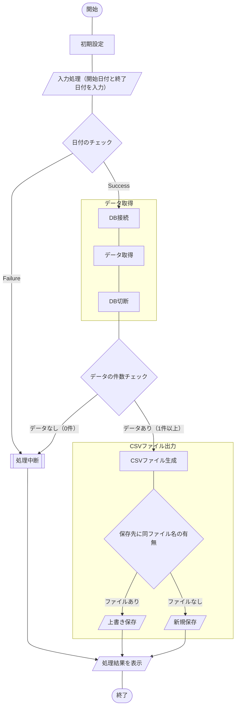

## 概要

[こちらの記事](https://haretokidoki-blog.com/pasocon_powershell-startup/)で文字だけを表示するスクリプトを使い、
PowerShellのはじめ方を紹介しましたが、より実践に近いサンプルコード（サンプルプログラム）を作成しました。

今回作成したPowerShellスクリプトはデータベース、MySQLよりデータを取得し、
CSVファイルでダウンロードするという内容です。

PowerShellの始め方（スタートアップ）としても、ご参考頂ければと思います。
https://haretokidoki-blog.com/pasocon_powershell-startup/

## この記事のターゲット

- PowerShellユーザーの方
- PowerShellでMySQLのデータをCSVファイルで収集したい方
- 初心者でPowerShellスクリプト作成の参考にしたい方

## サンプルプログラムの紹介

サンプルプログラムのシナリオは、定期的（月／1回など）にMySQLのデータベースより集計データをCSVファイルで取得するという、シナリオを想定したツール。

### サンプルプログラム

https://github.com/akiGAMEBOY/PowerShell_mysql-to-csv

PowerShellでMySQLに接続する為にはMySQLバージョンに対応している「MySQL Connector/NET バージョン」を事前にインストールが必要。
MySQLとMySQL Connector/NETの対応表（紐づけ表）については[こちらの記事](https://zenn.dev/haretokidoki/articles/a29a84f3048cfb)をご参考ください。
https://zenn.dev/haretokidoki/articles/a29a84f3048cfb

### MySQL Connector/NETのインストールとDLLのコピー

接続先のデータベース、MySQLのバージョンは`5.1`を想定し、MySQL Connector/NETは`6.8.7`をインストールした。

MySQL Connector/NETのインストール後に`C:\Program Files (x86)\MySQL\MySQL Connector Net 6.8.7\Assemblies\v4.5\MySql.Data.dll`のDLLファイルをプログラムの格納フォルダー[^1]にコピー。
サンプルプログラムでは、このコピー先の`MySql.Data.dll`[^2]を参照してMySQLに接続する。
[^1]: サンプルプログラムでは`PowerShell_mySQL-to-csv\source配下`
[^2]: サンプルプログラムでは`PowerShell_mySQL-to-csv\source\MySql.Data.dll`

コピー先の`MySql.Data.dll`ではなく、MySQL Connector/NETのインストールフォルダーを直接参照する場合は、
インストールしたバージョンに合わせてパスの指定を変更する事が必要となる。

- インストールフォルダーの変化点（変化点を太文字で表記）
C:\Program Files (x86)\MySQL\\**MySQL Connector Net X.X.X**\Assemblies\\**vX.X**\MySql.Data.dll

```diff powershell:DLLの参照先をインストールフォルダーに変更する場合（ファイル名：Main.ps1）
 [System.String]$current_dir=Split-Path ( & { $myInvocation.ScriptName } ) -parent                                      # 他でも使用している為、削除しない
-[System.String]$dll_path = $current_dir + "\MySQL.Data.dll"                                                            # コピー先
+[System.String]$dll_path = "C:\Program Files (x86)\MySQL\MySQL Connector Net 6.8.7\Assemblies\v4.5\MySql.Data.dll"     # インストール先
```

### 仕様

プログラム起動用：batファイルとプログラムの本体：ps1ファイル、個別の設定ファイル：setup.iniファイル、
MySQL接続用DLLファイル：MySql.Data.dll、
の4つで構成されたプログラム。

なお、MySQLに接続する為の下記情報は設定ファイルにより変更可能とする。

1. ホスト名、またはIPアドレス
1. ポート番号
1. ユーザー名
1. パスワード[^3]
1. データベース名
1. SQL文

[^3]: 平文でパスワードを保存しています。必要に応じて暗号化・複合化の処理を追加してください。



#### 画面仕様

バッチファイル（batファイル）を使いPowerShellスクリプトを実行するので、
画面操作はコマンドプロンプト上で行う。
画面操作は表示された文字列に従ってキーボード入力する。
入力操作は入力の応答待ちで指示された内容を入力する画面と、
確認画面で一時停止している処理を「Enterキー」で続行する2種類の操作方法が主となる。

#### 機能仕様

1. 初期設定
    - MySQL接続用のDLL読み込み
    - ダウンロードフォルダーのパスを取得
    - 設定ファイルの読み込み
        1. ホスト名、またはIPアドレス
        1. ポート番号
        1. ユーザー名
        1. パスワード[^3]
        1. データベース名
        1. SQL文
1. 入力処理
    1. 集計開始日付の入力
    書式は[ yyyymmdd ]
    1. 集計終了日付の入力
    書式は[ yyyymmdd ]
1. 日付チェック
    1. 日付の書式チェック
    下記の書式が正しいかチェック。
        - 集計開始日付
        - 集計終了日付
    1. 日付の期間チェック
    下記の関係性かチェック。
        - 集計開始日付 <= 集計終了日付
1. データ取得
MySQL接続用のDLL（MySQL Connector/NET）を使用し、MySQLのデータベースに接続。
接続後、SQL文を実行しデータを取得する。
なお、取得後のデータが0件の場合は処理を中断する。
1. CSVファイル出力
ダウンロードフォルダー（C:¥Users¥`ユーザー名`\Downloads 等）の配下に、
ファイル名「MySQL-to-csv_`集計開始日付`-`集計終了日付`.csv」で新規保存。
既にファイルが存在する場合は上書き保存する。

#### 入出力ファイル

##### 入力ファイル

- 販売実績テーブル（PROD_ENV.SALES_JISSEKI）
    | 項目名 | ORDER_NUM | SALES_DATE | CUSTOMER | UNITS | PRICE |
    | ---- | ---- | ---- | ---- | ---- | ---- |
    | 説明 | 注文番号 | 販売実績日 | 顧客名 | 販売台数 | 販売単価 |
    | 集計条件 |  | ＊ |  |  |  |
    | ID | 入力1 | 入力2 | 入力3 | 入力4 | 入力5 |

##### 出力ファイル

- CSVファイル（MySQL-to-csv_`YYYYMMDD`-`YYYYMMDD`.csv）
    保存先：ダウンロードフォルダー（C:¥Users¥`ユーザー名`\Downloads 等）
    | 注文番号 | 販売実績日 | 顧客名 | 販売台数 | 販売単価 |
    | ---- | ---- | ---- | ---- | ---- |
    | 入力1 | 入力2 | 入力3 | 入力4 | 入力5 |

### GitHub Repository

https://github.com/akiGAMEBOY/PowerShell_mysql-to-csv

#### フォルダー構成

```
PowerShell_mysql-to-csv
│  mysql-to-csv.bat     ・・・起動用バッチファイル
│  LICENSE.md
│  README.md
│
└─source
        Main.ps1        ・・・プログラム本体
        MySql.Data.dll  ・・・MySQL接続用DLLファイル
        setup.ini       ・・・設定ファイル
```

### 参考記事

- 流用元
    https://zenn.dev/haretokidoki/articles/f1634c386ffc1d
- 使いやすいSQLクライアントツール（DBeaver）
    https://wonwon-eater.com/dbeaver-review/

## 関連記事

https://haretokidoki-blog.com/pasocon_powershell-startup/
https://zenn.dev/haretokidoki/articles/7e6924ff0cc960
