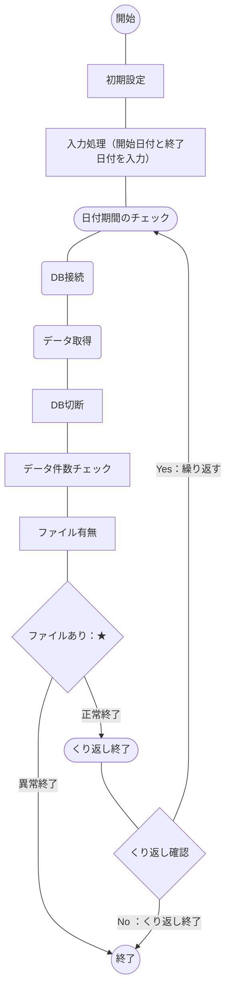

## 概要
[こちらの記事](https://haretokidoki-blog.com/pasocon_powershell-startup/)で文字だけを表示するスクリプトを使い、
PowerShellのはじめ方を紹介しましたが、より実践に近いサンプルプログラムを作成しました。

今回作成したPowerShellスクリプトはデータベース、MySQLよりデータを取得し、
CSVファイルでダウンロードするという内容です。

PowerShellの始め方（スタートアップ）としても、ご参考頂ければと思います。
https://haretokidoki-blog.com/pasocon_powershell-startup/
## ターゲット
- PowerShellユーザーの方
- PowerShellでMySQLのデータをCSVファイルで収集したい方
- 初心者でPowerShellスクリプト作成の参考にしたい方
## サンプルプログラムの紹介
サンプルプログラムのシナリオは、定期的（月／1回など）にMySQLのデータベースより集計データをCSVファイルで取得するという、シナリオを想定したツール。

PowerShellでMySQLに接続する為にはMySQLバージョンに対応している「MySQL Connector/NET バージョン」を事前にインストールが必要。
MySQLとMySQL Connector/NETの対応表（紐づけ表）については[こちらの記事](https://zenn.dev/haretokidoki/articles/a29a84f3048cfb)をご参考ください。
https://zenn.dev/haretokidoki/articles/a29a84f3048cfb
### 事前準備
#### MySQL Connector/NETのインストールとDLLのコピー
MySQLのバージョンは`5.1`を想定し、MySQL Connector/NETは`6.8.7`をインストールした。
インストール後に`C:\Program Files (x86)\MySQL\MySQL Connector Net 6.8.7\Assemblies\v4.5\MySql.Data.dll`のDLLファイルをプログラムの格納フォルダ[^1]にコピーし、コピー先の`MySql.Data.dll`[^2]を参照して接続する。
[^1]: サンプルプログラムでは`PowerShell_mySQL-to-csv\source配下`
[^2]: サンプルプログラムでは`PowerShell_mySQL-to-csv\source\MySql.Data.dll`

コピー先の`MySql.Data.dll`ではなく、MySQL Connector/NETのインストールフォルダを直接参照する場合は、
インストールしたMySQL Connector/NETのバージョンに合わせたパスの指定が必要。
「C:\Program Files (x86)\MySQL\\**MySQL Connector Net X.X.X**\Assemblies\\**vX.X**\MySql.Data.dll」
```diff powershell:Main.ps1
 [System.String]$current_dir=Split-Path ( & { $myInvocation.ScriptName } ) -parent                                      # 他でも使用している為、削除しない
-[System.String]$dll_path = $current_dir + "\MySQL.Data.dll"                                                            # コピー先
+[System.String]$dll_path = "C:\Program Files (x86)\MySQL\MySQL Connector Net 6.8.7\Assemblies\v4.5\MySql.Data.dll"     # インストール先
```
### 仕様
プログラム起動用：batファイルとプログラムの本体：ps1ファイル、個別の設定ファイル：setup.iniファイル、
MySQL接続用DLLファイル：MySql.Data.dll、
の4つで構成されたプログラム。

なお、MySQLに接続する為の下記情報は設定ファイルにより変更可能とする。
1. ホスト名、またはIPアドレス
2. ポート番号
3. ユーザ名
4. パスワード
5. データベース名
6. SQL文


#### 画面仕様
#### 機能仕様
#### 入出力ファイル
##### 入力ファイル
- 販売実績テーブル（PROD_ENV.SALES_JISSEKI）

| 項目名 | ORDER_NUM | SALES_DATE | CUSTOMER | UNITS | PRICE |
| ---- | ---- | ---- | ---- | ---- | ---- |
| 説明 | 注文番号 | 販売実績日 | 顧客名 | 販売台数 | 販売単価 |
| 集計条件 |  | ＊ |  |  |  |
| ID | 入力1 | 入力2 | 入力3 | 入力4 | 入力5 |


##### 出力ファイル
- CSVファイル（MySQL-to-csv_YYYYMMDD-YYYYMMDD.csv）
保存先：ダウンロードフォルダー
| 注文番号 | 販売実績日 | 顧客名 | 販売台数 | 販売単価 |
| ---- | ---- | ---- | ---- | ---- |
| 入力1 | 入力2 | 入力3 | 入力4 | 入力5 |
### GitHub
#### フォルダ構成
### 参考記事