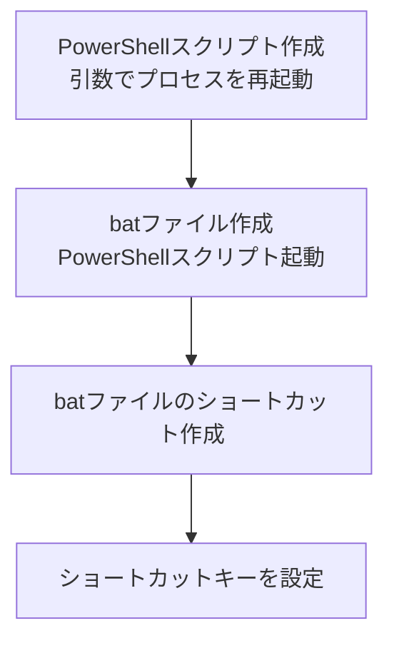
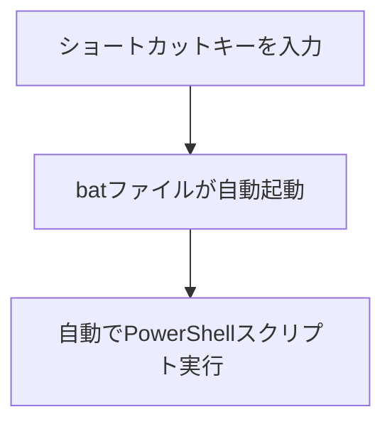

## 概要

最近使っているノートパソコンのメモリが16GBで、2026年さまざまなツールを併用する開発用途という意味では決して十分ではないメモリサイズです。

実際でもメモリサイズを多く使用するアプリ（たとえば[Slack](https://ja.wikipedia.org/wiki/Slack_(%E3%82%BD%E3%83%95%E3%83%88%E3%82%A6%E3%82%A7%E3%82%A2))や[DB接続クライアントツール](https://ja.wikipedia.org/wiki/%E3%83%87%E3%83%BC%E3%82%BF%E3%83%99%E3%83%BC%E3%82%B9%E6%8E%A5%E7%B6%9A%E3%82%AF%E3%83%A9%E3%82%A4%E3%82%A2%E3%83%B3%E3%83%88)）を使用した場合、頻繁に画面がフリーズしてマウス操作やショートカットキーを受け付けなくなるケースが多くなってきました。

各アプリの設定を最適化してもフリーズしてしまう状況が変わらず、発生する度にタスクマネージャー経由でプロセスを終了するオペレーションが面倒になってきたので、
今回はショートカットキーでプロセスを再起動するPowerShellを作ってみました。

私と同じように、なるべくWindows標準のものを使って気軽に対策したい方にオススメの記事です。

## この記事のターゲット

- Windows ユーザーの方
- アプリ（プロセス）の再起動をショートカットキーで簡単に行いたい方
- ビジネス的な用件でフリーソフトなどが使えずWindows標準の機能を活用して対応したい方

## 全体のフロー

### 設定時



### 実行時



## 設定方法

ファイルの配置先は各々の最適な場所でカスタマイズしてください。

1. PowerShellスクリプト「`RestartProcess.ps1`」を作成

    ```powershell:RestartProcess.ps1
    # RestartProcess.ps1
    # 汎用プロセス再起動スクリプト
    # 引数:
    #   -ProcessName : プロセス名 (拡張子なし。例: slack)
    #   -DisplayName : 表示名 (メッセージ用。例: Slack)

    Param(
        [Parameter(Mandatory=$true)][string]$ProcessName,
        [string]$DisplayName = $ProcessName # 指定がなければプロセス名をそのまま表示
    )

    # アセンブリのロード (WPFを使用するため)
    Add-Type -AssemblyName PresentationFramework

    # ==================================================
    # 1. 実行ファイルパスの特定ロジック
    # ==================================================
    $TargetExePath = $null

    # 現在実行中のプロセスからパスを取得
    try {
        $proc = Get-Process -Name $ProcessName -ErrorAction SilentlyContinue | Select-Object -First 1
        if ($proc -and $proc.Path) {
            $TargetExePath = $proc.Path
        }
    } catch {
        # 権限不足などで取得できない場合は無視
    }

    # 実行中ではない場合、よくある場所から検索
    if (-not $TargetExePath) {
        # 検索するベースフォルダのリスト
        $SearchBasePaths = @(
            "$($env:LOCALAPPDATA)\Microsoft\WindowsApps",       # ストアアプリ/エイリアス
            "$($env:LOCALAPPDATA)\$($DisplayName)",             # ユーザー別インストール(名前フォルダ)
            "$($env:LOCALAPPDATA)\Programs\$($DisplayName)",    # Electron系の一部
            "$($env:ProgramFiles)\$($DisplayName)",             # 64bit インストール
            "${env:ProgramFiles(x86)}\$($DisplayName)"          # 32bit インストール
        )

        foreach ($basePath in $SearchBasePaths) {
            # 「フォルダ/プロセス名.exe」を組み立てて存在チェック
            $candidate = Join-Path $basePath "$ProcessName.exe"
            if (Test-Path $candidate) {
                $TargetExePath = $candidate
                break # 見つかったら終了
            }
        }
    }

    # デバッグ用: パスが見つからない場合のデフォルト(パス指定なしで実行を試みる用)
    if (-not $TargetExePath) {
        # パスが見つからなくても、start slack.exe で動く可能性にかけて名前だけ入れておく
        $TargetExePath = "$($ProcessName).exe" 
        $PathMessage = "（自動検出できませんでした。パス環境変数に依存して起動を試みます）"
    } else {
        $PathMessage = "検出パス: [$($TargetExePath)]"
    }

    # ==================================================
    # 2. 確認ダイアログ (WPF)
    # ==================================================
    $MessageText = "$($DisplayName) の応答がありませんか？プロセスを強制終了して再起動します。`n`n$($PathMessage)"

    $Result = [System.Windows.MessageBox]::Show(
        $MessageText, 
        "プロセス再起動ツール（対象：$($DisplayName).exe）", 
        [System.Windows.MessageBoxButton]::YesNo, 
        [System.Windows.MessageBoxImage]::Question
    )

    # [いいえ] なら終了
    if ($Result -ne [System.Windows.MessageBoxResult]::Yes) { exit }

    # ==================================================
    # 3. 再起動実行
    # ==================================================

    # プロセスの強制終了
    Stop-Process -Name $ProcessName -Force -ErrorAction SilentlyContinue

    # 完全に落ちるまで少し待機
    Start-Sleep -Seconds 1

    # 再起動
    try {
        Start-Process $TargetExePath
    } catch {
        [System.Windows.MessageBox]::Show(
            "再起動に失敗しました。`nパス: $($TargetExePath)`n`n手動で起動してください。", 
            "起動エラー", 
            [System.Windows.MessageBoxButton]::OK, 
            [System.Windows.MessageBoxImage]::Error
        )
    }
    ```

1. 「`C:\Users\"ユーザー名”\OneDrive\ドキュメント\PowerShell\RestartProcess.ps1`」に文字コード**UTF-8 BOM付き**で保存
    PowerShellスクリプト内に日本語などマルチバイト文字がなく、すべて英数の場合はUTF-8の保存（BOMなし）で問題ないです。

1. batファイル「`RestartProcess_Slack.bat`」を作成

    ```bat:RestartProcess_Slack.bat
    @echo off
    cd /d %~dp0

    REM ==============================
    REM 設定エリア
    REM ==============================

    REM プロセス名 (タスクマネージャー上の名前 exe除く)
    set TARGET_PROCESS_NAME=slack

    REM 表示名 (メッセージボックスに表示する名前)
    set TARGET_DISPLAY_NAME=Slack

    REM ==============================
    REM 実行処理
    REM ==============================

    REM 設定した変数を %変数名% の形で埋め込む
    start "" /min powershell -NoProfile -ExecutionPolicy RemoteSigned -WindowStyle Hidden -File "../RestartProcess.ps1" -ProcessName "%TARGET_PROCESS_NAME%" -DisplayName "%TARGET_DISPLAY_NAME%"

    exit /b %ERRORLEVEL%
    ```

1. 「`C:\Users\"ユーザー名”\OneDrive\ドキュメント\PowerShell\bat\RestartProcess_Slack.bat`」に文字コード**SJIS**で保存
    PowerShellスクリプト内に日本語などマルチバイト文字がなく、すべて英数の場合はUTF-8の保存（BOMなし）でも問題ないです。

1. 「`C:\Users\"ユーザー名”\OneDrive\ドキュメント\PowerShell\bat\RestartProcess_Slack.bat`」を右クリックしてショートカットを作成

1. Winキー + R でファイル名を指定して実行を起動し「`shell:programs`」を入力し実行

1. 「`C:\Users\"ユーザー名”\AppData\Roaming\Microsoft\Windows\Start Menu\Programs`」配下にbatファイルのショートカットを配置
    ショートカットを配置する場所は**デスクトップ直下か、プログラム一覧配下で設定が必要**です。
    詳細は、[こちら](https://haretokidoki-blog.com/pasocon_windows-shortcut-key-not-responding/)のブログをチェック！

1. 配置したショートカットを選択し、右クリックしてコンテキストメニューから「プロパティ」を選択

1. ショートカットタブから`ショートカットキー(K)`の入力欄を選択して、任意のショートカットキーを入力しOKボタンをクリック
    私の場合は「Ctrl + Alt + 任意のアルファベットキー」などで設定していますね。
    

1. おつかれさました。設定完了です。

## 実行方法

1. 設定したショートカットキーを入力
    （自動でbatが実行され最終的にはPowerShellスクリプトが動きます。）
1. （対象のプロセス名が見つかった場合）プロセスを再起動するか Yes / No を選択する
1. プロセス再起動実行！

## まとめ

今回作成したSlack用のbatファイル「`RestartProcess_Slack.bat`」のように、メモリ使用量の多いアプリ（プロセス）別に作成し、
あわせてショートカットキーを設定することで対応できそうです。
（一番良いのは、メモリサイズを増やすことなのでメモリ増設検討してみます。）

## 参考文献

https://haretokidoki-blog.com/pasocon_windows-shortcut-key-not-responding/

## 関連記事

https://haretokidoki-blog.com/pasocon_powershell-startup/
https://zenn.dev/haretokidoki/articles/7e6924ff0cc960
https://zenn.dev/haretokidoki/articles/fb6830f9155de5
