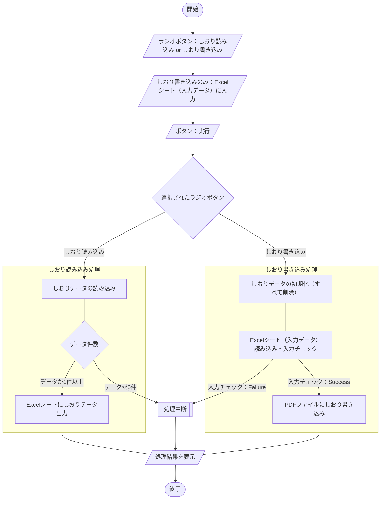

## 概要
[こちらの記事](https://zenn.dev/haretokidoki/articles/8bde585e299549)で紹介した自作モジュールを使用して、
Excel VBA（xlsmファイル）のサンプルコード（サンプルプログラム）を作成してみました。
作成したプログラムの機能は、しおりデータを含むPDFファイルを読み込み**リストで出力する機能**と、
Excel上に手入力したリストを元にPDFファイルに**しおりデータを書き込む機能**の2点があるプログラムです。

初心者の方は「インターネットで個々の情報は収集できるが、その情報を集約し実装する方法がわからない」という、
悩みをお持ちの方がいると思います。
（私が初心者の時は、そのような悩みを持っていました。）

PDFファイルのしおり作成ツールとしての参考情報だけでなく、私個人で作成してみた[自作モジュール](https://zenn.dev/haretokidoki/articles/8bde585e299549)の使い方や、
Excel VBAの始め方（スタートアップ）としても、ご参考いただければと思います。
https://zenn.dev/haretokidoki/articles/8bde585e299549
## この記事のターゲット
- Excel VBAユーザーの方
- Excel VBAでPDFファイルのしおりを作成したい方
- 初心者の方（モジュールの使い方が分からない方）
## サンプルプログラムの紹介
::::message alert
**ツールを動かすための前提条件**

本ツールを動かすためには、ツールと同じ環境下にPDFの編集が可能な有償ツール「**Adobe Acrobat**」が必要です。

現在、動作確認できている環境は「**Adobe Acrobat XI Pro**」のみとなります。

::: details 未検証の他バージョン（このエリアを選択すると詳細が表示）
2023年4月現在、最新のサブスクリプション版「Adobe Acrobat Standard/Pro DC」や「Adobe Acrobat DC for teams/enterprise」、
最新のライセンス版「Adobe Acrobat 2020」、過去のバージョンなどでは未検証です。

[こちら](https://pdf-file.nnn2.com/?p=204)で紹介されているライセンス版の過去バージョンに関しては、おそらく動作可能かと思います。
:::
::::
サンプルプログラムのシナリオは、とある帳票（PDFファイル）に対し、しおりデータを書き込むというシナリオ。

なお、しおりデータを含むPDFファイルを読み込んだ場合はExcelシート上にリスト出力できる機能もあり。
### サンプルプログラム
https://github.com/akiGAMEBOY/ExcelVBA_CreatePdfBookmark

サンプルプログラムでは既に参照設定を設定済みの為、そのままサンプルプログラムを使う場合は設定不要だが、
サンプルプログラムを参考に**Excel VBAツールを新規作成する場合**は下記の参照設定を行う必要がある。
#### 参照設定
VBAエディター[^1]のメニューバー[`ツール(T)`] -> [`参照設定(R)`]で、
「**Acrobat**[^2]」をチェックを入れてOK。
[^1]: Microsoft Visual Basic for Application：ショートカットキーは[`Alt + F11`]で起動
[^2]: Adobe Acrobat XI Proの場合


- 参考情報：Adobe Acrobatバージョン毎の設定方法
    http://pdf-file.nnn2.com/?p=204
### 仕様
Excel VBA(xlsmファイル)でPDFのしおり書き込みを行う。（読み込みも可）

画面はユーザフォームではなくExcelシートを直接操作する。
Excelシート上のセルにある入力欄や直接配置されたボタンを操作する事でツールを実行する。

入力ファイルはPDFファイル。

しおりデータの書き込み実行時には、
ツールを実行しているパソコン内の「Adobe Acrobat」がバックグラウンドで起動され、
Excel VBA経由で操作して、しおりデータを書き込む。

しおりデータの読み込み実行時には、
ツールを実行しているパソコン内の「Adobe Acrobat」がバックグラウンドで起動され、
Excel VBA経由で操作して、しおりデータがExcelシートにリスト出力される。

#### 画面仕様
##### 画面構成
7種類のExcelシートで構成。
1. シート「設定情報」
変化点の情報を外だししたシート。
　
ツールの根幹（基本的な仕様）は変わらず一部内容（入出力ファイルの構成など）のみが変化する場合、
ツールを流用しやすくする為、変化点の情報を外だししている。
1. シート「改版履歴」
改版履歴。
1. シート「メイン」
ユーザーが操作するメインのシート。
　
入出力データの参照先やボタンが配置されている。
1. シート「エラー情報」
ツールで発生したエラー情報が自動的に蓄積されるシート。
　
エラーが発生した際、エラーメッセージがポップアップで表示されるが、ポップアップ表示のみだと、
ユーザーが見落としてしまう可能性があり、ツール管理者に正確な情報が伝わる事を目的に作成。
1. シート「入力データ」
PDFファイルにしおりを書き込む際の入力データとなるシート。
　
しおりはルートを0階層とし9階層までを入力限度（階層00～階層09）としている。
1. シート「出力データ」
PDFファイルのしおりを読み込んだ際に出力されるシート。
　
上記の入力データと同様、ルートを0階層とし9階層までを表示限度（階層00～階層09）としている。
#### 機能仕様
1. しおり読み込み
対象PDFファイルのしおりデータを読み込み、Excelシート上の“出力データ”にリスト出力する。
　
表示限度は9階層まで（00階層～09階層）。限度を超えたPDFファイルを読み込むと例外エラーが発生する。
1. しおり書き込み
Excelシート上の“入力データ”を元にしおりデータを書き込む。
　
入力限度は9階層まで（00階層～09階層）。
　
対象PDFファイルにしおりを書き込む際は、最初にしおりを初期化（すべて削除）した後、
しおりを書き込む仕様となる。
#### 入出力ファイル
##### PDFファイル
メインシートにある対象ファイル欄で参照先を指定する。
　
ラジオボタンでしおり読み込みが選択されている際は、対象ファイル欄のPDFファイル内のしおりデータが読み込まれる。
ラジオボタンでしおり書き込みが選択されている際は、対象ファイル欄のPDFファイルにしおりデータが書き込まれる。
### GitHub Repository
https://github.com/akiGAMEBOY/ExcelVBA_CreatePdfBookmark
#### フォルダ構成
```:ExcelVBA_CreatePdfBookmarkフォルダ内
ExcelVBA_CreatePdfBookmark
│  LICENSE.md
│  README.md
│  vbac.wsf                                         ・・・ソース管理支援ツール（ariawase）
│  vbac_Export.bat                                  ・・・xlsmファイル to テキストファイル（dcm or bas ...）
│  vbac_Import.bat                                  ・・・テキストファイル to xlsmファイル
│
├─bin
│  │  ExcelVBA_CreatePdfBookmark.xlsm               ・・・ツール本体
│  │
│  └─sampledata                                    ・・・サンプルの入力データ
│          pdf-bookmark-empty.pdf
│          pdf-bookmark-exists.pdf
│          pdf-bookmark-exists_over-diretory10.pdf
│          pdf-sourcedata.xlsx
│
└─src
    └─ExcelVBA_CreatePdfBookmark.xlsm               ・・・テキストファイル群（vbac_Export.batの結果）
            clsBookmarkdata.cls
            mdlAcrobat.bas                              ・・・Acrobat系の処理
            mdlCommon.bas                               ・・・自作モジュール
            Sheet1.dcm                                  ・・・設定情報の処理（初期化ボタン）
            Sheet3.dcm                                  ・・・メインの処理（しおり作成）
```
### 参考記事
#### 流用したサンプルプログラム
https://zenn.dev/haretokidoki/articles/cb016a39a1562e
#### プログラム作成時に参考にした記事
- 参考にした画面レイアウト
    https://kyenglab.wordpress.com/2015/08/05/excel-vba-でpdf文書の操作にチャレンジ！/
- Excel VBAでAdobeを操作
    https://community.adobe.com/t5/acrobatフォーラム-discussions/excelのシートをvbaを使用して-pdfのしおりに出来るプログラムはありますか/m-p/11951113?profile.language=ja
- Excel VBA - Dictionaryの使い方
    https://qiita.com/nkojima/items/dad1a4b34ddeff2da59a
    https://freefly3104.hatenablog.com/entry/2018/01/25/215136
- Excel VBA と Adobe連携の情報サイト
    https://pdf-file.nnn2.com/
- Excel VBA で しおりの出力方法
    https://www.ka-net.org/blog/?p=13440
- しおりのジャンプをページ番号から座標にする方法【未検証】
    - 検索した文字列のページ番号や座標を返す処理
        https://pdf-file.nnn2.com/?p=1099
        上記を参考にすることでジャンプ先をページ番号ではなく座標で設定できる可能性はあるが、
        実装の労力と対応結果が釣り合わない為、今回は断念。
- PDF編集が可能なフリーソフト
    - フリーソフト「pdf_as」の紹介
        http://uchijyu.s601.xrea.com/wordpress/pdf_as/
    - “pdf_as”を使ってテキストファイルを元にしおり登録
        https://freebsd.sing.ne.jp/tool/12/03/03.html
    - フリーソフト「JPdfBookmarks」の紹介
        https://katocpta.blogspot.com/2012/03/pdf.html
