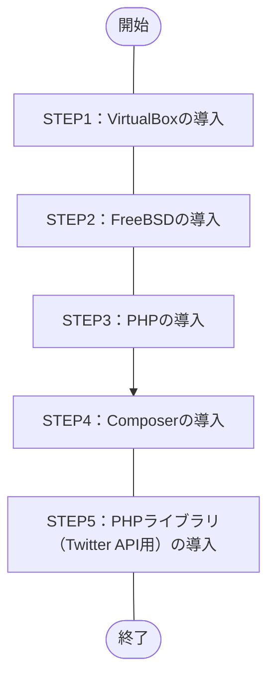

## 概要
目標をTwitter API用のPHPライブラリである「[twitteroauth](https://twitteroauth.com/)」の導入までとし構築作業を実施したので紹介。

ざっくりした作業内容は、下記の通り。
1. Windows OSにホストOS型のハイパーバイザ、[Oracle VM VirtulBox](https://ja.wikipedia.org/wiki/VirtualBox)をインストール
1. VirtualBoxにUNIX系のOS、[FreeBSD](https://ja.wikipedia.org/wiki/FreeBSD)をインストール
1. FreeBSD上にプログラム言語、[PHP](https://ja.wikipedia.org/wiki/PHP_(プログラミング言語)) 8.1をインストール
1. PHPのパッケージ管理システム、[Composer](https://ja.wikipedia.org/wiki/Composer)をインストール
1. Composer経由でPHPライブラリ（Twitter API用）、[twitteroauth](https://twitteroauth.com/)をインストール
## この記事のターゲット
- 近しい環境でTwitter API用のPHPライブラリを導入したい方
    - VirtualBox 7.0.6（ハイパーバイザ）
    - Windows 10 Pro（仮想ホストOS）
    - FreeBSD 13.1（仮想ゲストOS）
    - PHP 8.1
    - Composer 2.5.8
    - twitteroauth 5.0.0
## 作業フロー


## 構築手順
### 詳細な環境
- ハイパーバイザ（仮想化OS）
    Oracle VirtualBox **7.0.6**
    
    *画像：`Oracle VM VirtualBox マネージャー -> ヘルプ(H) -> VirtualBox について(A)` より*

- ホストOS
    Windows **10 Pro**
    ```powershell:Get-WmiObjectコマンド
    PS C:\Windows> Get-WmiObject Win32_OperatingSystem


    SystemDirectory : C:\WINDOWS\system32
    Organization    :
    BuildNumber     : 19045
    RegisteredUser  : XXXXX                     # マスク
    SerialNumber    : 00000-00000-00000-AAAAA   # マスク
    Version         : 10.0.19045
    ```
    - 参考記事：PowerShellでWindowsバージョンを確認する方法
        https://macruby.info/powershell/powershell-os-version.html
    
- ゲストOS
    FreeBSD **13.1**
    ```command-line
    root@dev-api:/ # uname -a
    FreeBSD dev-api 13.1-RELEASE FreeBSD 13.1-RELEASE GENERIC amd64
    root@dev-api:/ # 
    ```
    
    *画像：FreeBSD ブートメニュー*

- プログラム言語
    PHP **8.1**
    ```command-line
    root@dev-api:/ # php -v
    PHP 8.1.17 (cli) (built: May  4 2023 01:24:49) (NTS)
    Copyright (c) The PHP Group
    Zend Engine v4.1.17, Copyright (c) Zend Technologies
    root@dev-api:/ #
    ```

- PHPパッケージ管理システム
    Composer **2.5.8**
    ```command-line
    root@dev-api:/ # composer -V
    Composer version 2.5.8 2023-06-09 17:13:21
    root@dev-api:/ #
    ```

- PHPライブラリ（Twitter API用）
    twitteroauth **5.0.0**
    ```command-line
    root@dev-api:/ # composer show
    abraham/twitteroauth 5.0.0 The most popular PHP library for use with the Twitter OAuth REST API.
    composer/ca-bundle   1.3.6 Lets you find a path to the system CA bundle, and includes a fallback...
    root@dev-api:/ #
    ```

### STEP1：VirtualBoxの導入
#### システム要件
2023年6月現在、[こちらの公式ページ](https://www.virtualbox.org/manual/ch01.html#hostossupport)より、下記がサポートするWindows OS。
- Windows 8.1
- Windows 10
- Windows 11 21H2
- Windows Server 2012
- Windows Server 2012 R2
- Windows Server 2016
- Windows Server 2019
- Windows Server 2022

::::details その他 OSのサポート対象
- macOS（64bit）
    - 10.15 (Catalina)
    - 11 (Big Sur)
    - 12 (Monterey)
- Linux（64bit）
    - Ubuntu 18.04 LTS, 20.04 LTS and 22.04
    - Debian GNU/Linux 10 ("Buster") and 11 ("Bullseye")
    - Oracle Linux 7, 8 and 9
    - CentOS/Red Hat Enterprise Linux 7, 8 and 9
    - Fedora 35 and 36
    - Gentoo Linux
    - SUSE Linux Enterprise server 12 and 15
    - openSUSE Leap 15.3
- Oracle Solaris（64bit）
    - Oracle Solaris 11.4
::::

#### 作業手順
##### VirtualBoxのインストール
1. 公式サイトよりEXEファイルをダウンロード
公式サイトの[ダウンロードページ](https://www.virtualbox.org/wiki/Downloads)にある `VirtualBox 7.0.X platform packages` の `Windows hosts` より、
「VirtualBox-7.0.X-XXXXXX-Win.exe（7.0.8の場合、`VirtualBox-7.0.8-156879-Win.exe`）」をダウンロード。

1. EXEファイルを実行
1. インストーラー（Setup Wizard）に従いインストール
- 参考情報
    https://sukkiri.jp/technologies/virtualizers/virtualbox/virtualbox-win_install.html

### STEP2：FreeBSDの導入
#### システム要件
2023年6月現在、[こちらの公式ページ](https://www.freebsd.org/releases/13.1R/hardware/)にシステム要件（ハードウェア要件）の記載があり。
- CPU
    - amd64（64bit CPU）
        - Intel CPU（Intel Core i シリーズなど）
        - AMD CPU（AMD Ryzen シリーズなど）
    - i386（32bit CPU）
    - powerpc（Apple）
    - sparc64（富士通）
- メモリ
    13.1 ハードウェア要件に記載なし
- ディスク容量
    13.1 ハードウェア要件に記載なし

#### インストール前の準備
##### Free BSD isoデータのダウンロード
1. [公式サイトのダウンロードページ](https://www.freebsd.org/where/)より `FreeBSD 13.1-RELEASE` -> `Installer` -> **amd64** を選択
    
    *画像：ダウンロードページ より `amd64` を選択*
1. 下記のisoファイルを選択しダウンロード
    - **FreeBSD-13.1-RELEASE-amd64-dvd1.iso**
        File Size：`4621281280`（約4.6GB）、Date：`2022-May-12 09:32`（2023年6月現在）
        空き領域に余裕が無い場合、CDのisoファイル（`FreeBSD-13.1-RELEASE-amd64-disc1.iso`）でも可。
##### Tera Termのインストール（任意）
Windows OS から Free BSD にSSH接続しコマンド実行やクリップボード使用、ログファイル保存などの用途で、
端末エミュレーターの[Tera Term](https://ja.wikipedia.org/wiki/Tera_Term)を導入。
作業は任意だが、導入した方が便利。
1. [ダウンロードページ](https://ja.osdn.net/projects/ttssh2/releases/) で インストーラー版（exeファイル形式） か ポータブル版（zipファイル形式） をダウンロード
    公式サイト：http://ttssh2.osdn.jp/
1. インストーラー版をダウンロードした場合、exeファイルを起動し画面に従いインストール
#### Free BSDのインストール
インストール済みのOracle VM Oracle VirtualBoxを使用し、Free BSDを導入。
1. Oracle VM VirtualBox マネージャーの `新規(N)` を選択
1. `仮想マシンの作成（1ページ目）`画面で下記内容で選択し、次へ
    - 名前(N)：任意の名前
        私の場合、`Dev-Api` とした。
    - Folder：任意の場所
        私の場合、`G:\Virtual Machines\FreeBSD` とした。
    - ISO Image：前述でダウンロードしたDVDのisoファイルを参照
        私の場合、`G:\Virtual Machines\FreeBSD\FreeBSD-13.1-RELEASE-amd64-dvd1.iso` とした。
    - タイプ(T)：BSD
    - バージョン(V)：FreeBSD(32-bit) or FreeBSD(64-bit)
        私の場合、Intel CPU 64bitを使用している為、`FreeBSD(64-bit)` とした。
1. `仮想マシンの作成（2ページ目）`画面で下記内容で選択し、次へ
    - メインメモリー(M)：`1024` MB → `4096` MB
    - Processors：`1` CPU → `2` CPU
1. `仮想マシンの作成（3ページ目）`画面で下記内容で選択し、次へ
    - Create a Virtual Hard Disk Now
        `16.00` GB → `50.00` GB
1. `仮想マシンの作成（3ページ目）`画面で設定内容を確認し、完了
1. Oracle VM VirtualBox マネージャー より 作成した仮想マシンを選択し、起動ボタンをクリック
    
    *画像：ヘッドレス起動するとバックグラウンドで実行可能な為、便利*
1. 下記のサイトを参考にFree BSDをインストール
    https://zeke.jp/freebsd/freebsd-os
    参考サイトはIPアドレスを固定して設定しているが、私の場合はDHCPを有効とし、IPアドレスを自動割り振りとした。
1. 下記のサイトを参考にsshdの設定を実施（任意）
    https://zeke.jp/freebsd/freebsd-config
    TeraTermでSSH接続する為に設定。
    ::::details 設定後の/etc/ssh/sshd_configの中身
    ```command-line
    root@dev-api:~ # cat /etc/ssh/sshd_config
    #       $OpenBSD: sshd_config,v 1.104 2021/07/02 05:11:21 dtucker Exp $
    #       $FreeBSD$

    # This is the sshd server system-wide configuration file.  See
    # sshd_config(5) for more information.

    # This sshd was compiled with PATH=/usr/bin:/bin:/usr/sbin:/sbin

    # The strategy used for options in the default sshd_config shipped with
    # OpenSSH is to specify options with their default value where
    # possible, but leave them commented.  Uncommented options override the
    # default value.

    # Note that some of FreeBSD's defaults differ from OpenBSD's, and
    # FreeBSD has a few additional options.

    #Port 22
    #AddressFamily any
    #ListenAddress 0.0.0.0
    #ListenAddress ::

    #HostKey /etc/ssh/ssh_host_rsa_key
    #HostKey /etc/ssh/ssh_host_ecdsa_key
    #HostKey /etc/ssh/ssh_host_ed25519_key

    # Ciphers and keying
    #RekeyLimit default none

    # Logging
    #SyslogFacility AUTH
    #LogLevel INFO

    # Authentication:

    #LoginGraceTime 2m
    #PermitRootLogin no
    PermitRootLogin yes
    #StrictModes yes
    #MaxAuthTries 6
    #MaxSessions 10

    #PubkeyAuthentication yes

    # The default is to check both .ssh/authorized_keys and .ssh/authorized_keys2
    # but this is overridden so installations will only check .ssh/authorized_keys
    AuthorizedKeysFile      .ssh/authorized_keys

    #AuthorizedPrincipalsFile none

    #AuthorizedKeysCommand none
    #AuthorizedKeysCommandUser nobody

    # For this to work you will also need host keys in /etc/ssh/ssh_known_hosts
    #HostbasedAuthentication no
    # Change to yes if you don't trust ~/.ssh/known_hosts for
    # HostbasedAuthentication
    #IgnoreUserKnownHosts no
    # Don't read the user's ~/.rhosts and ~/.shosts files
    #IgnoreRhosts yes

    # Change to yes to enable built-in password authentication.
    #PasswordAuthentication no
    PasswordAuthentication yes
    #PermitEmptyPasswords no

    # Change to no to disable PAM authentication
    #KbdInteractiveAuthentication yes

    # Kerberos options
    #KerberosAuthentication no
    #KerberosOrLocalPasswd yes
    #KerberosTicketCleanup yes
    #KerberosGetAFSToken no

    # GSSAPI options
    #GSSAPIAuthentication no
    #GSSAPICleanupCredentials yes

    # Set this to 'no' to disable PAM authentication, account processing,
    # and session processing. If this is enabled, PAM authentication will
    # be allowed through the KbdInteractiveAuthentication and
    # PasswordAuthentication.  Depending on your PAM configuration,
    # PAM authentication via KbdInteractiveAuthentication may bypass
    # the setting of "PermitRootLogin without-password".
    # If you just want the PAM account and session checks to run without
    # PAM authentication, then enable this but set PasswordAuthentication
    # and KbdInteractiveAuthentication to 'no'.
    #UsePAM yes

    #AllowAgentForwarding yes
    #AllowTcpForwarding yes
    #GatewayPorts no
    #X11Forwarding yes
    #X11DisplayOffset 10
    #X11UseLocalhost yes
    #PermitTTY yes
    #PrintMotd yes
    #PrintLastLog yes
    #TCPKeepAlive yes
    #PermitUserEnvironment no
    #Compression delayed
    #ClientAliveInterval 0
    #ClientAliveCountMax 3
    #UseDNS yes
    UseDNS yes
    #PidFile /var/run/sshd.pid
    #MaxStartups 10:30:100
    #PermitTunnel no
    #ChrootDirectory none
    #UseBlacklist no
    #VersionAddendum FreeBSD-20211221

    # no default banner path
    #Banner none

    # override default of no subsystems
    Subsystem       sftp    /usr/libexec/sftp-server

    # Example of overriding settings on a per-user basis
    #Match User anoncvs
    #       X11Forwarding no
    #       AllowTcpForwarding no
    #       PermitTTY no
    #       ForceCommand cvs server
    root@dev-api:~ #
    ```
    ::::
1. 下記のサイトを参考にntpd、ntpdateの設定を実施（任意）
    https://zeke.jp/freebsd/freebsd-config
    NTPで時刻同期する為に設定。
    ::::details 設定後の/etc/ntp.confの中身
    ```command-line
    root@dev-api:~ # cat /etc/ntp.conf
    #
    # $FreeBSD$
    #
    # Default NTP servers for the FreeBSD operating system.
    #
    # Don't forget to enable ntpd in /etc/rc.conf with:
    # ntpd_enable="YES"
    #
    # The driftfile is by default /var/db/ntpd.drift, check
    # /etc/defaults/rc.conf on how to change the location.
    #

    #
    # Set the target and limit for adding servers configured via pool statements
    # or discovered dynamically via mechanisms such as broadcast and manycast.
    # Ntpd automatically adds maxclock-1 servers from configured pools, and may
    # add as many as maxclock*2 if necessary to ensure that at least minclock
    # servers are providing good consistent time.
    #
    tos minclock 3 maxclock 6

    #
    # The following pool statement will give you a random set of NTP servers
    # geographically close to you.  A single pool statement adds multiple
    # servers from the pool, according to the tos minclock/maxclock targets.
    # See http://www.pool.ntp.org/ for details.  Note, pool.ntp.org encourages
    # users with a static IP and good upstream NTP servers to add a server
    # to the pool. See http://www.pool.ntp.org/join.html if you are interested.
    #
    # The option `iburst' is used for faster initial synchronization.
    #
    pool 0.freebsd.pool.ntp.org iburst

    #
    # If you want to pick yourself which country's public NTP server
    # you want to sync against, comment out the above pool, uncomment
    # the next one, and replace CC with the country's abbreviation.
    # Make sure that the hostname resolves to a proper IP address!
    #
    # pool 0.CC.pool.ntp.org iburst

    #
    # To configure a specific server, such as an organization-wide local
    # server, add lines similar to the following.  One or more specific
    # servers can be configured in addition to, or instead of, any server
    # pools specified above.  When both are configured, ntpd first adds all
    # the specific servers, then adds servers from the pool until the tos
    # minclock/maxclock targets are met.
    #
    #server time.my-internal.org iburst

    #
    # Security:
    #
    # By default, only allow time queries and block all other requests
    # from unauthenticated clients.
    #
    # The "restrict source" line allows peers to be mobilized when added by
    # ntpd from a pool, but does not enable mobilizing a new peer association
    # by other dynamic means (broadcast, manycast, ntpq commands, etc).
    #
    # See http://support.ntp.org/bin/view/Support/AccessRestrictions
    # for more information.
    #
    restrict default limited kod nomodify notrap noquery nopeer
    restrict source  limited kod nomodify notrap noquery

    #
    # Alternatively, the following rules would block all unauthorized access.
    #
    #restrict default ignore
    #
    # In this case, all remote NTP time servers also need to be explicitly
    # allowed or they would not be able to exchange time information with
    # this server.
    #
    # Please note that this example doesn't work for the servers in
    # the pool.ntp.org domain since they return multiple A records.
    #
    #restrict 0.pool.ntp.org nomodify nopeer noquery notrap
    #restrict 1.pool.ntp.org nomodify nopeer noquery notrap
    #restrict 2.pool.ntp.org nomodify nopeer noquery notrap
    #
    # The following settings allow unrestricted access from the localhost
    restrict 127.0.0.1
    restrict ::1

    #
    # If a server loses sync with all upstream servers, NTP clients
    # no longer follow that server. The local clock can be configured
    # to provide a time source when this happens, but it should usually
    # be configured on just one server on a network. For more details see
    # http://support.ntp.org/bin/view/Support/UndisciplinedLocalClock
    # The use of Orphan Mode may be preferable.
    #
    #server 127.127.1.0
    #fudge 127.127.1.0 stratum 10
    server ntp.nict.jp

    # See http://support.ntp.org/bin/view/Support/ConfiguringNTP#Section_6.14.
    # for documentation regarding leapfile. Updates to the file can be obtained
    # from ftp://time.nist.gov/pub/ or ftp://tycho.usno.navy.mil/pub/ntp/.
    # Use either leapfile in /etc/ntp or periodically updated leapfile in /var/db.
    #leapfile "/etc/ntp/leap-seconds"
    leapfile "/var/db/ntpd.leap-seconds.list"

    # Specify the number of megabytes of memory that should be allocated and
    # locked. -1 (default) means "do not lock the process into memory".
    # 0 means "lock whatever memory the process wants into memory". Any other
    # number means to lock up to that number of megabytes into memory.
    # 0 may result in a segfault when ASLR with stack gap randomization
    # is enabled.
    #rlimit memlock 32
    root@dev-api:~ #
    ```
    ::::

##### pkg update でエラー
```command-line:修正後の/etc/resolv.conf
root@dev-api:~ # cat /etc/resolv.conf
# Generated by resolvconf
nameserver 192.168.XXX.1 👈 デフォルトゲートウェイ
#nameserver XXX.XXX.XXX.XXX 👈 DNS1（おそらく自動で割り振られたIP）
#nameserver XXX.XXX.XXX.XXX 👈 DNS2（おそらく自動で割り振られたIP）

#nameserver 127.0.0.1
options edns0
root@dev-api:~ #
```

##### Free BSD セキュリティパッチのアップデート（任意）
https://blog.it-see.net/it-dokata/freebsd/freebsd-update/#toc9
```comannd-line:freebsd-update fetch
root@dev-api:~ # freebsd-update fetch
Looking up update.FreeBSD.org mirrors... 2 mirrors found.
Fetching metadata signature for 13.1-RELEASE from update2.freebsd.org... done.
Fetching metadata index... done.
Inspecting system... done.
Preparing to download files... done.
The following files will be removed as part of updating to
13.1-RELEASE-p8:
/usr/share/zoneinfo/SystemV
/usr/src/contrib/tzdata/pacificnew
/usr/src/contrib/tzdata/systemv
/usr/src/contrib/tzdata/yearistype.sh
/usr/src/contrib/tzdata/zoneinfo2tdf.pl
(END)(END) ESCESCESCESC(END) ESCESCOOBB(END) ::qqThe following files will be added as part of updating to
13.1-RELEASE-p8:
/usr/share/zoneinfo/America/Ciudad_Juarez
/usr/share/zoneinfo/Europe/Kyiv
/usr/share/zoneinfo/GMT
/usr/src/crypto/openssl/crypto/bn/rsa_sup_mul.c
(END)(END) ::qqThe following files will be updated as part of updating to 👈 (END) が最終行に表示された後、「:q」を何度か入力してプロンプトに戻る
13.1-RELEASE-p8:
/bin/freebsd-version
/boot/kernel/cam.ko
/boot/kernel/if_ena.ko
/boot/kernel/if_ix.ko
/boot/kernel/kernel
/boot/kernel/mpr.ko
/boot/kernel/zfs.ko
/boot/kernel/zlib.ko
/boot/loader
/boot/loader.efi
/boot/loader_4th
/boot/loader_4th.efi
/boot/loader_lua
/boot/loader_lua.efi
/boot/loader_simp
/boot/loader_simp.efi
/boot/pxeboot
/boot/userboot.so
/boot/userboot_4th.so
/boot/userboot_lua.so
/boot/zfsloader
/etc/mtree/BSD.usr.dist
/lib/geom/geom_eli.so
/lib/libcrypto.so.111
/lib/libz.so.6
/lib/libzpool.so.2
/rescue/[
:root@dev-api:~ # 
```
```comannd-line:freebsd-update install
root@dev-api:~ # freebsd-update install
Installing updates...Scanning //usr/share/certs/blacklisted for certificates...
Scanning //usr/share/certs/trusted for certificates...
Scanning //usr/local/share/certs for certificates...
 done.
root@dev-api:~ #
```

#### 参考情報
- FreeBSD ハンドブック -> 最小ハードウェア要件
    https://docs.freebsd.org/ja/books/handbook/bsdinstall/#bsdinstall-hardware
- FreeBSD 13.1 ハードウェア要件
    https://www.freebsd.org/releases/13.1R/hardware/
- FreeBSD 9.X ハードウェア要件
    https://people.freebsd.org/~blackend/en_US.ISO8859-1/books/handbook/bsdinstall-hardware.html
- i386/amd64とは
    https://blog.future.ad.jp/small-talk-about-it-001-why-is-amd64-even-though-the-intel-cpu
    https://blog.framinal.life/entry/2020/04/22/041548
### STEP3：PHPの導入
### STEP4：Composerの導入
### STEP5：PHPライブラリ（Twitter API用）の導入

## IPv6の対応状況
https://www.soumu.go.jp/main_content/000825585.pdf