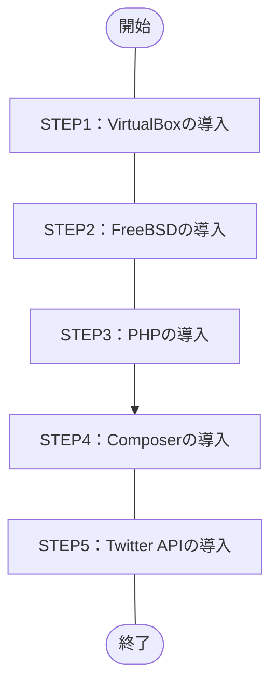

## 概要
目標をPHPのTwitter APIである「[twitteroauth](https://twitteroauth.com/)」の導入までとし構築作業を実施したので紹介。

ざっくりした作業内容は、下記の通り。
1. Windows OSにホストOS型のハイパーバイザ、Oracle VM VirtulBoxをインストール
1. VirtualBoxにUNIX系のOS、[FreeBSD](https://ja.wikipedia.org/wiki/FreeBSD)をインストール
1. FreeBSD上にプログラム言語、PHP8.1をインストール
1. PHPのパッケージ管理システム、[Composer](https://ja.wikipedia.org/wiki/Composer)をインストール
1. Composer経由でTwitter API、[twitteroauth](https://twitteroauth.com/)をインストール
## この記事のターゲット
- 近しい環境でTwitter APIを導入したい方
    - Windows 10 Pro（仮想ホストOS）
    - VirtualBox 7.0.6
    - FreeBSD 13.1（仮想ゲストOS）
    - PHP 8.1
    - Composer 2.5.8
    - twitteroauth 5.0.0
## 作業フロー

## 構築手順
### 詳細な環境
- ホストOS
    Windows **10 Pro**
    ```powershell:Get-WmiObjectコマンド
    PS C:\Windows> Get-WmiObject Win32_OperatingSystem


    SystemDirectory : C:\WINDOWS\system32
    Organization    :
    BuildNumber     : 19045
    RegisteredUser  : XXXXX                     # マスク
    SerialNumber    : 00000-00000-00000-AAAAA   # マスク
    Version         : 10.0.19045
    ```
    - 参考記事：PowerShellでWindowsバージョンを確認する方法
        https://macruby.info/powershell/powershell-os-version.html
- ハイパーバイザ（仮想化OS）
    Oracle VirtualBox **7.0.6**
    
- ゲストOS
    FreeBSD **13.1**
    ```command-line
    root@dev-api:/ # uname -a
    FreeBSD dev-api 13.1-RELEASE FreeBSD 13.1-RELEASE GENERIC amd64
    root@dev-api:/ # 
    ```
- プログラム言語
    PHP **8.1**
    ```command-line
    root@dev-api:/ # php -v
    PHP 8.1.17 (cli) (built: May  4 2023 01:24:49) (NTS)
    Copyright (c) The PHP Group
    Zend Engine v4.1.17, Copyright (c) Zend Technologies
    root@dev-api:/ #
    ```
- PHPパッケージ管理システム
    Composer **2.5.8**
    ```command-line
    root@dev-api:/ # composer -V
    Composer version 2.5.8 2023-06-09 17:13:21
    root@dev-api:/ #
    ```
- Twitter API
    twitteroauth **5.0.0**
    ```
    ```

### STEP1:VirtualBoxの導入
公式サイトの[ダウンロードページ](https://www.virtualbox.org/wiki/Downloads)より、