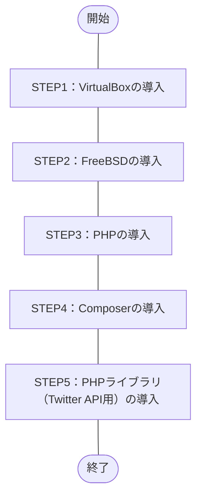

## 概要
今回、作業の目標を“Twitter API用のPHPライブラリである「[twitteroauth](https://twitteroauth.com/)」の導入” とし、
環境を構築したので作業手順を紹介します。

ざっくりした作業内容は、下記の通り。
1. Windows OSにホストOS型のハイパーバイザ、[Oracle VM VirtulBox](https://ja.wikipedia.org/wiki/VirtualBox)をインストール
1. VirtualBoxにUNIX系のOS、[FreeBSD](https://ja.wikipedia.org/wiki/FreeBSD)をインストール
1. FreeBSD上にプログラム言語、[PHP](https://ja.wikipedia.org/wiki/PHP_(プログラミング言語)) 8.1をインストール
1. PHPのパッケージ管理システム、[Composer](https://ja.wikipedia.org/wiki/Composer)をインストール
1. Composer経由でPHPライブラリ（Twitter API用）、[twitteroauth](https://twitteroauth.com/)をインストール
## この記事のターゲット
- 近しい環境でTwitter API用のPHPライブラリ「twitteroauth」を導入したい方
    - VirtualBox 7.0.6（ハイパーバイザ）
    - Windows 10 Pro（仮想ホストOS）
    - FreeBSD 13.1（仮想ゲストOS）
    - PHP 8.1
    - Composer 2.5.8
    - twitteroauth 5.0.0
## 作業フロー


## 作業手順（STEP1 ～ STEP5）
### 構築する環境の詳細
- ハイパーバイザ（仮想化OS）
    Oracle VirtualBox **7.0.6**
    
    *画像：`Oracle VM VirtualBox マネージャー -> ヘルプ(H) -> VirtualBox について(A)` より*

- 仮想ホストOS
    Windows **10 Pro**
    ```powershell:Get-WmiObjectコマンド
    PS C:\Windows> Get-WmiObject Win32_OperatingSystem


    SystemDirectory : C:\WINDOWS\system32
    Organization    :
    BuildNumber     : 19045
    RegisteredUser  : XXXXX                     # マスク
    SerialNumber    : 00000-00000-00000-AAAAA   # マスク
    Version         : 10.0.19045
    ```
    - 参考記事：PowerShellでWindowsバージョンを確認する方法
        https://macruby.info/powershell/powershell-os-version.html
    
- 仮想ゲストOS
    FreeBSD **13.1**
    ```vim
    root@dev-api:/ # uname -a
    FreeBSD dev-api 13.1-RELEASE FreeBSD 13.1-RELEASE GENERIC amd64
    root@dev-api:/ # 
    ```
    
    *画像：FreeBSD ブートメニュー*

- プログラム言語
    PHP **8.1**
    ```vim
    root@dev-api:/ # php -v
    PHP 8.1.17 (cli) (built: May  4 2023 01:24:49) (NTS)
    Copyright (c) The PHP Group
    Zend Engine v4.1.17, Copyright (c) Zend Technologies
    root@dev-api:/ #
    ```

- PHPパッケージ管理システム
    Composer **2.5.8**
    ```vim
    root@dev-api:/ # composer -V
    Composer version 2.5.8 2023-06-09 17:13:21
    root@dev-api:/ #
    ```

- PHPライブラリ（Twitter API用）
    twitteroauth **5.0.0**
    ```vim
    root@dev-api:/ # composer show
    abraham/twitteroauth 5.0.0 The most popular PHP library for use with the Twitter OAuth REST API.
    composer/ca-bundle   1.3.6 Lets you find a path to the system CA bundle, and includes a fallback...
    root@dev-api:/ #
    ```

### STEP1：VirtualBoxの導入
#### システム要件
2023年6月現在、[こちらの公式ページ](https://www.virtualbox.org/manual/ch01.html#hostossupport)より、下記がサポートするWindows OS。
- Windows 8.1
- Windows 10
- Windows 11 21H2
- Windows Server 2012
- Windows Server 2012 R2
- Windows Server 2016
- Windows Server 2019
- Windows Server 2022

:::details その他 OSのサポート対象
- macOS（64bit）
    - 10.15 (Catalina)
    - 11 (Big Sur)
    - 12 (Monterey)
- Linux（64bit）
    - Ubuntu 18.04 LTS, 20.04 LTS and 22.04
    - Debian GNU/Linux 10 ("Buster") and 11 ("Bullseye")
    - Oracle Linux 7, 8 and 9
    - CentOS/Red Hat Enterprise Linux 7, 8 and 9
    - Fedora 35 and 36
    - Gentoo Linux
    - SUSE Linux Enterprise server 12 and 15
    - openSUSE Leap 15.3
- Oracle Solaris（64bit）
    - Oracle Solaris 11.4
:::

#### 作業手順（STEP1）
##### VirtualBoxのインストール
1. 公式サイトよりEXEファイルをダウンロード
公式サイトの[ダウンロードページ](https://www.virtualbox.org/wiki/Downloads)にある `VirtualBox 7.0.X platform packages` の `Windows hosts` より、
「VirtualBox-7.0.X-XXXXXX-Win.exe（7.0.8の場合、`VirtualBox-7.0.8-156879-Win.exe`）」をダウンロード。

1. EXEファイルを実行
1. インストーラー（Setup Wizard）に従いインストール
- 参考情報
    https://sukkiri.jp/technologies/virtualizers/virtualbox/virtualbox-win_install.html

### STEP2：FreeBSDの導入
#### システム要件
2023年6月現在、[こちらの公式ページ](https://www.freebsd.org/releases/13.1R/hardware/)にシステム要件（ハードウェア要件）の記載があり。
- CPU
    - amd64（64bit CPU）
        - Intel CPU（Intel Core i シリーズなど）
        - AMD CPU（AMD Ryzen シリーズなど）
    - i386（32bit CPU）
    - powerpc（Apple）
    - sparc64（富士通）
- メモリ
    FreeBSD 13.1のハードウェア要件に記載なし
- ディスク容量
    FreeBSD 13.1のハードウェア要件に記載なし

#### 作業手順（STEP2）
##### STEP2-1：インストール前の準備
###### Free BSD isoデータのダウンロード
1. [公式サイトのダウンロードページ](https://www.freebsd.org/where/)より `FreeBSD 13.1-RELEASE` -> `Installer` -> **amd64** を選択
    
    *画像：ダウンロードページ より `amd64` を選択*
1. 下記のisoファイルを選択しダウンロード
    - **FreeBSD-13.1-RELEASE-amd64-dvd1.iso**
        File Size：`4621281280`（約4.6GB）、Date：`2022-May-12 09:32`（2023年6月現在）
        空き領域に余裕が無い場合、CDのisoファイル（`FreeBSD-13.1-RELEASE-amd64-disc1.iso`）でも可。
###### （任意）Tera Termのインストール
Windows OS から Free BSD にSSH接続しコマンド実行やクリップボード使用、ログファイル保存などの用途で、
端末エミュレーターの[Tera Term](https://ja.wikipedia.org/wiki/Tera_Term)を導入。
必須の作業ではないが、導入した方が便利。
1. [ダウンロードページ](https://ja.osdn.net/projects/ttssh2/releases/) で インストーラー版（exeファイル形式） か ポータブル版（zipファイル形式） をダウンロード
    公式サイト：http://ttssh2.osdn.jp/
1. （私の場合）インストーラー版のダウンロード完了後、exeファイルを起動し画面に従いインストール
##### STEP2-2：Free BSDのインストール
前の工程で導入したOracle VM Oracle VirtualBoxを使用し、Free BSDを導入。
1. Oracle VM VirtualBox マネージャーの `新規(N)` を選択
1. `仮想マシンの作成（1ページ目）`画面で下記内容で選択し、次へ
    - 名前(N)：任意の名前
        私の場合、`Dev-Api` とした。
    - Folder：任意の場所
        私の場合、`G:\Virtual Machines\FreeBSD` とした。
    - ISO Image：前述でダウンロードしたDVDのisoファイルを参照
        私の場合、`G:\Virtual Machines\FreeBSD\FreeBSD-13.1-RELEASE-amd64-dvd1.iso` とした。
    - タイプ(T)：BSD
    - バージョン(V)：FreeBSD(32-bit) or FreeBSD(64-bit)
        私の場合、Intel CPU 64bitを使用している為、`FreeBSD(64-bit)` とした。
1. `仮想マシンの作成（2ページ目）`画面で下記内容で選択し、次へ
    - メインメモリー(M)：`1024` MB → `4096` MB
    - Processors：`1` CPU → `2` CPU
1. `仮想マシンの作成（3ページ目）`画面で下記内容で選択し、次へ
    - Create a Virtual Hard Disk Now
        `16.00` GB → `50.00` GB
1. `仮想マシンの作成（4ページ目）`画面で設定内容を確認し、完了
1. 作成した仮想マシンを選択し、起動ボタンをクリック
    必須ではないが起動する際に“ヘッドレス起動”で実行すると、VirtulBoxの画面を表示していなくてもバックグラウンドで実行可能。
    
    *画像：ヘッドレス起動を行う操作*
1. 下記のサイトを参考にFree BSDをインストール
    https://zeke.jp/freebsd/freebsd-os
    参考サイトはIPアドレスを固定して設定しているが、私の場合はDHCPを有効とし、IPアドレスを自動割り振りとした。
#### 参考情報
- VirtualBoxで設定できるCPUの最大値と物理CPU コア数（もしくはスレッド数）と異なっている
    [こちら](https://superuser.com/questions/540407/why-does-virtualbox-show-more-cpus-than-available)の情報を参考にするとVirtualBoxの`Processor`の設定値は、
    多くとも物理CPUの `スレッド数 - 1`（スレッド数が4の場合は、3が最大値） にしないといけない。
    仮に物理CPUのスレッド数以上で設定してしまうと、ホストOSの挙動がおかしくなる可能性ありとの事。
    なぜ、VirtualBox側でスレッド数を超える値が設定できるのかという点は、よくわからなかった。
    - 参考情報
        https://superuser.com/questions/540407/why-does-virtualbox-show-more-cpus-than-available
        https://atmarkit.itmedia.co.jp/ait/articles/1010/14/news128.html#:~:text=VirtualBoxの仕様では,倍までしか設定できない。
##### STEP2-3：DNSの設定
:::details なぜDNSの設定を行ったか
FreeBSDインストール直後、インターネット接続（外部接続）を伴うコマンド（pkgコマンド）でエラーが発生した。
エラーを調べた結果、**DNSの設定に問題があった事**が判明。
```vim:“pkg update”でエラー
root@dev-api:~ # pkg update
The package management tool is not yet installed on your system.
Do you want to fetch and install it now? [y/N]: y 👈 「y」を入力し実行
Bootstrapping pkg from pkg+http://pkg.FreeBSD.org/FreeBSD:13:amd64/quarterly, please wait...
pkg: Error fetching http://pkg.FreeBSD.org/FreeBSD:13:amd64/quarterly/Latest/pkg.txz: No address record
Address resolution failed for http://pkg.FreeBSD.org/FreeBSD:13:amd64/quarterly.
Consider changing PACKAGESITE.
root@dev-api:~ # 
```
```vim:“pkg search”でもエラー
root@dev-api:~ # pkg search php8
The package management tool is not yet installed on your system.
Do you want to fetch and install it now? [y/N]: y
Bootstrapping pkg from pkg+http://pkg.FreeBSD.org/FreeBSD:13:amd64/quarterly, please wait...
pkg: Error fetching http://pkg.FreeBSD.org/FreeBSD:13:amd64/quarterly/Latest/pkg.txz: No address record
Address resolution failed for http://pkg.FreeBSD.org/FreeBSD:13:amd64/quarterly.
Consider changing PACKAGESITE.
root@dev-api:~ # 
```
:::

###### 対応方法
DVDのisoファイルを使用しインストールしていた際に一部のネットワーク情報は入力した。
インストールした後に`/etc/resolv.conf`を確認すると、
設定したIPアドレスは、全てコメント化された状態で「`nameserver 127.0.0.1`」のみが有効となっていた。
configファイルのnameserverの記述部分をコメントアウトまたはコメント解除した事により、
接続するDNSサーバーを変更した。
```vim:修正前の/etc/resolv.conf
root@dev-api:~ # cat /etc/resolv.conf
# Generated by resolvconf
#nameserver 192.168.XXX.1 👈 デフォルトゲートウェイのIP（インストール時に設定）
#nameserver XXX.XXX.XXX.XXX 👈 DNS1（おそらく自動で割り振られたIP）
#nameserver XXX.XXX.XXX.XXX 👈 DNS2（おそらく自動で割り振られたIP）

nameserver 127.0.0.1
options edns0
root@dev-api:~ #
```
```vim:修正後の/etc/resolv.conf
root@dev-api:~ # cat /etc/resolv.conf
# Generated by resolvconf
nameserver 192.168.XXX.1 👈 コメント解除
nameserver XXX.XXX.XXX.XXX 👈 コメント解除
nameserver XXX.XXX.XXX.XXX 👈 コメント解除

#nameserver 127.0.0.1 👈 コメントアウト
options edns0
root@dev-api:~ #
```

###### 参考情報
https://qiita.com/networkelements/items/0bc5ed6a80c57b2bb56f

#### STEP2-4：Free BSDのインストール後の設定
#####  （任意）sshdの設定
Teratermを使用する場合、下記サイトの項目「sshdの設定」を参考に設定。
https://zeke.jp/freebsd/freebsd-config
```vim:設定後の/etc/ssh/sshd_config（抜粋）
root@dev-api:~ # vi /etc/ssh/sshd_config
PermitRootLogin yes 👈 追加
PasswordAuthentication yes 👈 追加
UseDNS yes  👈 追加
root@dev-api:~ #
```
:::details 参考情報：設定後の/etc/ssh/sshd_config（すべて）
```vim:設定後の/etc/ssh/sshd_config（すべて）
root@dev-api:~ # cat /etc/ssh/sshd_config
#       $OpenBSD: sshd_config,v 1.104 2021/07/02 05:11:21 dtucker Exp $
#       $FreeBSD$

# This is the sshd server system-wide configuration file.  See
# sshd_config(5) for more information.

# This sshd was compiled with PATH=/usr/bin:/bin:/usr/sbin:/sbin

# The strategy used for options in the default sshd_config shipped with
# OpenSSH is to specify options with their default value where
# possible, but leave them commented.  Uncommented options override the
# default value.

# Note that some of FreeBSD's defaults differ from OpenBSD's, and
# FreeBSD has a few additional options.

#Port 22
#AddressFamily any
#ListenAddress 0.0.0.0
#ListenAddress ::

#HostKey /etc/ssh/ssh_host_rsa_key
#HostKey /etc/ssh/ssh_host_ecdsa_key
#HostKey /etc/ssh/ssh_host_ed25519_key

# Ciphers and keying
#RekeyLimit default none

# Logging
#SyslogFacility AUTH
#LogLevel INFO

# Authentication:

#LoginGraceTime 2m
#PermitRootLogin no
PermitRootLogin yes 👈 追加
#StrictModes yes
#MaxAuthTries 6
#MaxSessions 10

#PubkeyAuthentication yes

# The default is to check both .ssh/authorized_keys and .ssh/authorized_keys2
# but this is overridden so installations will only check .ssh/authorized_keys
AuthorizedKeysFile      .ssh/authorized_keys

#AuthorizedPrincipalsFile none

#AuthorizedKeysCommand none
#AuthorizedKeysCommandUser nobody

# For this to work you will also need host keys in /etc/ssh/ssh_known_hosts
#HostbasedAuthentication no
# Change to yes if you don't trust ~/.ssh/known_hosts for
# HostbasedAuthentication
#IgnoreUserKnownHosts no
# Don't read the user's ~/.rhosts and ~/.shosts files
#IgnoreRhosts yes

# Change to yes to enable built-in password authentication.
#PasswordAuthentication no
PasswordAuthentication yes 👈 追加
#PermitEmptyPasswords no

# Change to no to disable PAM authentication
#KbdInteractiveAuthentication yes

# Kerberos options
#KerberosAuthentication no
#KerberosOrLocalPasswd yes
#KerberosTicketCleanup yes
#KerberosGetAFSToken no

# GSSAPI options
#GSSAPIAuthentication no
#GSSAPICleanupCredentials yes

# Set this to 'no' to disable PAM authentication, account processing,
# and session processing. If this is enabled, PAM authentication will
# be allowed through the KbdInteractiveAuthentication and
# PasswordAuthentication.  Depending on your PAM configuration,
# PAM authentication via KbdInteractiveAuthentication may bypass
# the setting of "PermitRootLogin without-password".
# If you just want the PAM account and session checks to run without
# PAM authentication, then enable this but set PasswordAuthentication
# and KbdInteractiveAuthentication to 'no'.
#UsePAM yes

#AllowAgentForwarding yes
#AllowTcpForwarding yes
#GatewayPorts no
#X11Forwarding yes
#X11DisplayOffset 10
#X11UseLocalhost yes
#PermitTTY yes
#PrintMotd yes
#PrintLastLog yes
#TCPKeepAlive yes
#PermitUserEnvironment no
#Compression delayed
#ClientAliveInterval 0
#ClientAliveCountMax 3
#UseDNS yes
UseDNS yes  👈 追加
#PidFile /var/run/sshd.pid
#MaxStartups 10:30:100
#PermitTunnel no
#ChrootDirectory none
#UseBlacklist no
#VersionAddendum FreeBSD-20211221

# no default banner path
#Banner none

# override default of no subsystems
Subsystem       sftp    /usr/libexec/sftp-server

# Example of overriding settings on a per-user basis
#Match User anoncvs
#       X11Forwarding no
#       AllowTcpForwarding no
#       PermitTTY no
#       ForceCommand cvs server
root@dev-api:~ #
```
:::

##### （任意）ntpd、ntpdateの設定
時刻同期を設定する場合、下記サイトの項目「ntpd、ntpdateの設定」を参考に設定。
https://zeke.jp/freebsd/freebsd-config
なお、設定したNTPサーバーは[NICT（国立研究開発法人情報通信研究機構）のNTPサーバー](https://jjy.nict.go.jp/tsp/PubNtp/index.html)を設定した。
```vim:設定後の/etc/ntp.conf（抜粋）
server ntp.nict.jp 👈 追加
root@dev-api:~ #
```
:::details 参考情報：設定後の/etc/ntp.conf（すべて）
```vim:設定後の/etc/ntp.conf（すべて）
root@dev-api:~ # cat /etc/ntp.conf
#
# $FreeBSD$
#
# Default NTP servers for the FreeBSD operating system.
#
# Don't forget to enable ntpd in /etc/rc.conf with:
# ntpd_enable="YES"
#
# The driftfile is by default /var/db/ntpd.drift, check
# /etc/defaults/rc.conf on how to change the location.
#

#
# Set the target and limit for adding servers configured via pool statements
# or discovered dynamically via mechanisms such as broadcast and manycast.
# Ntpd automatically adds maxclock-1 servers from configured pools, and may
# add as many as maxclock*2 if necessary to ensure that at least minclock
# servers are providing good consistent time.
#
tos minclock 3 maxclock 6

#
# The following pool statement will give you a random set of NTP servers
# geographically close to you.  A single pool statement adds multiple
# servers from the pool, according to the tos minclock/maxclock targets.
# See http://www.pool.ntp.org/ for details.  Note, pool.ntp.org encourages
# users with a static IP and good upstream NTP servers to add a server
# to the pool. See http://www.pool.ntp.org/join.html if you are interested.
#
# The option `iburst' is used for faster initial synchronization.
#
pool 0.freebsd.pool.ntp.org iburst

#
# If you want to pick yourself which country's public NTP server
# you want to sync against, comment out the above pool, uncomment
# the next one, and replace CC with the country's abbreviation.
# Make sure that the hostname resolves to a proper IP address!
#
# pool 0.CC.pool.ntp.org iburst

#
# To configure a specific server, such as an organization-wide local
# server, add lines similar to the following.  One or more specific
# servers can be configured in addition to, or instead of, any server
# pools specified above.  When both are configured, ntpd first adds all
# the specific servers, then adds servers from the pool until the tos
# minclock/maxclock targets are met.
#
#server time.my-internal.org iburst

#
# Security:
#
# By default, only allow time queries and block all other requests
# from unauthenticated clients.
#
# The "restrict source" line allows peers to be mobilized when added by
# ntpd from a pool, but does not enable mobilizing a new peer association
# by other dynamic means (broadcast, manycast, ntpq commands, etc).
#
# See http://support.ntp.org/bin/view/Support/AccessRestrictions
# for more information.
#
restrict default limited kod nomodify notrap noquery nopeer
restrict source  limited kod nomodify notrap noquery

#
# Alternatively, the following rules would block all unauthorized access.
#
#restrict default ignore
#
# In this case, all remote NTP time servers also need to be explicitly
# allowed or they would not be able to exchange time information with
# this server.
#
# Please note that this example doesn't work for the servers in
# the pool.ntp.org domain since they return multiple A records.
#
#restrict 0.pool.ntp.org nomodify nopeer noquery notrap
#restrict 1.pool.ntp.org nomodify nopeer noquery notrap
#restrict 2.pool.ntp.org nomodify nopeer noquery notrap
#
# The following settings allow unrestricted access from the localhost
restrict 127.0.0.1
restrict ::1

#
# If a server loses sync with all upstream servers, NTP clients
# no longer follow that server. The local clock can be configured
# to provide a time source when this happens, but it should usually
# be configured on just one server on a network. For more details see
# http://support.ntp.org/bin/view/Support/UndisciplinedLocalClock
# The use of Orphan Mode may be preferable.
#
#server 127.127.1.0
#fudge 127.127.1.0 stratum 10
server ntp.nict.jp 👈 追加

# See http://support.ntp.org/bin/view/Support/ConfiguringNTP#Section_6.14.
# for documentation regarding leapfile. Updates to the file can be obtained
# from ftp://time.nist.gov/pub/ or ftp://tycho.usno.navy.mil/pub/ntp/.
# Use either leapfile in /etc/ntp or periodically updated leapfile in /var/db.
#leapfile "/etc/ntp/leap-seconds"
leapfile "/var/db/ntpd.leap-seconds.list"

# Specify the number of megabytes of memory that should be allocated and
# locked. -1 (default) means "do not lock the process into memory".
# 0 means "lock whatever memory the process wants into memory". Any other
# number means to lock up to that number of megabytes into memory.
# 0 may result in a segfault when ASLR with stack gap randomization
# is enabled.
#rlimit memlock 32
root@dev-api:~ #
```
:::

##### （任意）Free BSD セキュリティパッチの適用
[こちら](https://blog.it-see.net/it-dokata/freebsd/freebsd-update/#toc9)の記事を参考にセキュリティパッチを適用。
1. FreeBSD セキュリティパッチのダウンロード
    ```vim:ダウンロード時のコマンド結果（抜粋）
    root@dev-api:~ # freebsd-update fetch
    Looking up update.FreeBSD.org mirrors... 2 mirrors found.
    Fetching metadata signature for 13.1-RELEASE from update2.freebsd.org... done.
    Fetching metadata index... done.
    Inspecting system... done.
    Preparing to download files... done.
    The following files will be removed as part of updating to
    13.1-RELEASE-p8:
    /usr/share/zoneinfo/SystemV
    /usr/src/contrib/tzdata/pacificnew
    /usr/src/contrib/tzdata/systemv
    /usr/src/contrib/tzdata/yearistype.sh
    /usr/src/contrib/tzdata/zoneinfo2tdf.pl
    (END)(END) ESCESCESCESC(END) ESCESCOOBB(END) ::qqThe following files will be added as part of updating to
    👆 最終行に“(END)”が表示され、エディターの終了コマンド「:q」を何度か入力し通常のプロンプトに戻る

     ～～～ 省略 ～～～
    
    /lib/geom/geom_eli.so
    /lib/libcrypto.so.111
    /lib/libz.so.6
    /lib/libzpool.so.2
    /rescue/[
    :root@dev-api:~ # 
    ```
    :::details 参考情報：FreeBSD ダウンロード時のコマンド結果（すべて）
    ```vim:ダウンロード時のコマンド結果（すべて）
    root@dev-api:~ # freebsd-update fetch
    Looking up update.FreeBSD.org mirrors... 2 mirrors found.
    Fetching metadata signature for 13.1-RELEASE from update2.freebsd.org... done.
    Fetching metadata index... done.
    Inspecting system... done.
    Preparing to download files... done.
    The following files will be removed as part of updating to
    13.1-RELEASE-p8:
    /usr/share/zoneinfo/SystemV
    /usr/src/contrib/tzdata/pacificnew
    /usr/src/contrib/tzdata/systemv
    /usr/src/contrib/tzdata/yearistype.sh
    /usr/src/contrib/tzdata/zoneinfo2tdf.pl
    (END)(END) ESCESCESCESC(END) ESCESCOOBB(END) ::qqThe following files will be added as part of updating to
    👆 最終行に“(END)”が表示され、エディターの終了コマンド「:q」を何度か入力し通常のプロンプトに戻る
    13.1-RELEASE-p8:
    /usr/share/zoneinfo/America/Ciudad_Juarez
    /usr/share/zoneinfo/Europe/Kyiv
    /usr/share/zoneinfo/GMT
    /usr/src/crypto/openssl/crypto/bn/rsa_sup_mul.c
    (END)(END) ::qqThe following files will be updated as part of updating to
    👆 最終行に“(END)”が表示され、エディターの終了コマンド「:q」を何度か入力し通常のプロンプトに戻る
    13.1-RELEASE-p8:
    /bin/freebsd-version
    /boot/kernel/cam.ko
    /boot/kernel/if_ena.ko
    /boot/kernel/if_ix.ko
    /boot/kernel/kernel
    /boot/kernel/mpr.ko
    /boot/kernel/zfs.ko
    /boot/kernel/zlib.ko
    /boot/loader
    /boot/loader.efi
    /boot/loader_4th
    /boot/loader_4th.efi
    /boot/loader_lua
    /boot/loader_lua.efi
    /boot/loader_simp
    /boot/loader_simp.efi
    /boot/pxeboot
    /boot/userboot.so
    /boot/userboot_4th.so
    /boot/userboot_lua.so
    /boot/zfsloader
    /etc/mtree/BSD.usr.dist
    /lib/geom/geom_eli.so
    /lib/libcrypto.so.111
    /lib/libz.so.6
    /lib/libzpool.so.2
    /rescue/[
    :root@dev-api:~ # 
    ```
    :::
1. FreeBSD セキュリティパッチの適用（インストール）
    ```vim
    root@dev-api:~ # freebsd-update install
    Installing updates...Scanning //usr/share/certs/blacklisted for certificates...
    Scanning //usr/share/certs/trusted for certificates...
    Scanning //usr/local/share/certs for certificates...
    done.
    root@dev-api:~ #
    ```
1. サーバー再起動
    ```vim
    root@dev-api:/usr/src/sys/amd64/compile/GENERIC # shutdown -r now
    Shutdown NOW!
    shutdown: [pid 67181]
    root@dev-api:/usr/src/sys/amd64/compile/GENERIC #                                                                                
    *** FINAL System shutdown message from root@dev-api ***                      

    System going down IMMEDIATELY                                                  
    ```

#### 参考情報
- FreeBSD ハンドブック -> 最小ハードウェア要件
    https://docs.freebsd.org/ja/books/handbook/bsdinstall/#bsdinstall-hardware
- FreeBSD 13.1 ハードウェア要件
    https://www.freebsd.org/releases/13.1R/hardware/
- FreeBSD 9.X ハードウェア要件
    https://people.freebsd.org/~blackend/en_US.ISO8859-1/books/handbook/bsdinstall-hardware.html
- i386/amd64とは
    https://blog.future.ad.jp/small-talk-about-it-001-why-is-amd64-even-though-the-intel-cpu
    https://blog.framinal.life/entry/2020/04/22/041548
### STEP3：PHPの導入
#### STEP3-1：インストール方法の検討
この環境構築では、PHPのカスタマイズは不要な為、簡潔な**pkgコマンド**によるインストールを選択。
- pkgとportsの違い
    - pkgとは
        コンパイル済みのバイナリデータを使用しインストールする方法。
        ダウンロードするデータ総容量は大きいが、**簡単＆速くインストール可能**。
    - ports（/usr/ports配下）とは
        ソースファイルのコンパイルやインストールを手動で実行しインストールする方法。
        作業手順は多いが、**ダウンロードするデータ総容量が少ない＆細かくカスタマイズしインストール可能**。
        なお、インストール方法によっては、デフォルトでportsデータがない環境もあるが、
        [portsのセットアップ（未検証）](https://retrotecture.jp/freebsd/app2_ports.html#setup)を実施する事により使用できるようになるらしい。

- 参考情報：pkgとportsの違い
    https://docs.freebsd.org/ja/books/handbook/ports/
    https://freebsd.sing.ne.jp/fbsd/1101/03/01.html
- 参考情報：pkgコマンドを使ったインストール方法
    https://kaworu.jpn.org/freebsd/pkg
    https://hacolab.hatenablog.com/entry/2020/02/16/170000
- 参考情報：/usr/portsを使ったインストール方法
    https://zeke.jp/freebsd/freebsd-ports
#### STEP3-2：PHPのインストール（pkgコマンド）
```vim:インストール時のコマンド結果（抜粋）
root@dev-api:~ # pkg install php81-8.1.17
Updating FreeBSD repository catalogue...
FreeBSD repository is up to date.
All repositories are up to date.
Updating database digests format:   0%Updating database digests format:   0%Updating database digests format: 100%
The following 21 package(s) will be affected (of 0 checked):

New packages to be INSTALLED:
	ca_root_nss: 3.89
	curl: 8.1.1
	icu: 72.1,1
	indexinfo: 0.3.1
	libargon2: 20190702
	libidn2: 2.3.4
	libnghttp2: 1.52.0
	libpsl: 0.21.2_2
	libssh2: 1.10.0_1,3
	libunistring: 1.1
	libxml2: 2.10.4
	oniguruma: 6.9.8_1
	pcre2: 10.42
	php81: 8.1.17
	php81-ctype: 8.1.17
	php81-curl: 8.1.17
	php81-filter: 8.1.17
	php81-intl: 8.1.17
	php81-mbstring: 8.1.17
	php81-phar: 8.1.17
	readline: 8.2.1

Number of packages to be installed: 21

The process will require 115 MiB more space.
23 MiB to be downloaded.

Proceed with this action? [y/N]: y 👈 「y」を入力し実行

 ～～～ 省略 ～～～

 --
This file has been added to automatically load the installed extension:
/usr/local/etc/php/ext-20-intl.ini
=====
Message from php81-ctype-8.1.17:

--
This file has been added to automatically load the installed extension:
/usr/local/etc/php/ext-20-ctype.ini
root@dev-api:~ # 
```
:::details 参考情報：インストール時のコマンド結果（すべて）
```vim:インストール時のコマンド結果（すべて）
root@dev-api:~ # pkg install php81-8.1.17
Updating FreeBSD repository catalogue...
FreeBSD repository is up to date.
All repositories are up to date.
Updating database digests format:   0%Updating database digests format:   0%Updating database digests format: 100%
The following 21 package(s) will be affected (of 0 checked):

New packages to be INSTALLED:
	ca_root_nss: 3.89
	curl: 8.1.1
	icu: 72.1,1
	indexinfo: 0.3.1
	libargon2: 20190702
	libidn2: 2.3.4
	libnghttp2: 1.52.0
	libpsl: 0.21.2_2
	libssh2: 1.10.0_1,3
	libunistring: 1.1
	libxml2: 2.10.4
	oniguruma: 6.9.8_1
	pcre2: 10.42
	php81: 8.1.17
	php81-ctype: 8.1.17
	php81-curl: 8.1.17
	php81-filter: 8.1.17
	php81-intl: 8.1.17
	php81-mbstring: 8.1.17
	php81-phar: 8.1.17
	readline: 8.2.1

Number of packages to be installed: 21

The process will require 115 MiB more space.
23 MiB to be downloaded.

Proceed with this action? [y/N]: y 👈 「y」を入力し実行
[1/21] Fetching indexinfo-0.3.1.pkg:   0%[1/21] Fetching indexinfo-0.3.1.pkg: 100%    6 KiB   5.7kB/s    00:01    
[2/21] Fetching libnghttp2-1.52.0.pkg:   0%[2/21] Fetching libnghttp2-1.52.0.pkg: 100%  130 KiB 132.8kB/s    00:01    
[3/21] Fetching libxml2-2.10.4.pkg:   0%[3/21] Fetching libxml2-2.10.4.pkg: 100%    1 MiB   1.2MB/s    00:01    
[4/21] Fetching php81-phar-8.1.17.pkg:   0%[4/21] Fetching php81-phar-8.1.17.pkg: 100%  107 KiB 109.6kB/s    00:01    
[5/21] Fetching php81-8.1.17.pkg:   0%[5/21] Fetching php81-8.1.17.pkg: 100%    4 MiB   2.3MB/s    00:02    
[6/21] Fetching php81-filter-8.1.17.pkg:   0%[6/21] Fetching php81-filter-8.1.17.pkg: 100%   21 KiB  21.9kB/s    00:01    
[7/21] Fetching icu-72.1,1.pkg:   0%[7/21] Fetching icu-72.1,1.pkg: 100%   11 MiB   3.8MB/s    00:03    
[8/21] Fetching libidn2-2.3.4.pkg:   0%[8/21] Fetching libidn2-2.3.4.pkg: 100%  134 KiB 137.1kB/s    00:01    
[9/21] Fetching libargon2-20190702.pkg:   0%[9/21] Fetching libargon2-20190702.pkg: 100%   63 KiB  64.3kB/s    00:01    
[10/21] Fetching php81-curl-8.1.17.pkg:   0%[10/21] Fetching php81-curl-8.1.17.pkg: 100%   36 KiB  36.7kB/s    00:01    
[11/21] Fetching php81-mbstring-8.1.17.pkg:   0%[11/21] Fetching php81-mbstring-8.1.17.pkg: 100%  748 KiB 765.5kB/s    00:01    
[12/21] Fetching oniguruma-6.9.8_1.pkg:   0%[12/21] Fetching oniguruma-6.9.8_1.pkg: 100%  229 KiB 234.1kB/s    00:01    
[13/21] Fetching libunistring-1.1.pkg:   0%[13/21] Fetching libunistring-1.1.pkg:  17%   96 KiB  98.3kB/s    00:04 ETA[14/21] Fetching libunistring-1.1.pkg: 100%  555 KiB 568.6kB/s    00:01    
[14/21] Fetching pcre2-10.42.pkg:   0%[14/21] Fetching pcre2-10.42.pkg:   7%   96 KiB  98.3kB/s    00:12 ETA[14/21] Fetching pcre2-10.42.pkg: 100%    1 MiB   1.4MB/s    00:01    
[15/21] Fetching readline-8.2.1.pkg:   0%[15/21] Fetching readline-8.2.1.pkg: 100%  367 KiB 375.7kB/s    00:01    
[16/21] Fetching libssh2-1.10.0_1,3.pkg:   0%[16/21] Fetching libssh2-1.10.0_1,3.pkg:  61%  152 KiB 155.7kB/s    00:00 ETA[16/21] Fetching libssh2-1.10.0_1,3.pkg: 100%  248 KiB 254.4kB/s    00:01    
[17/21] Fetching libpsl-0.21.2_2.pkg:   0%[17/21] Fetching libpsl-0.21.2_2.pkg: 100%   61 KiB  62.9kB/s    00:01    
[18/21] Fetching curl-8.1.1.pkg:   0%[18/21] Fetching curl-8.1.1.pkg:   3%   48 KiB  49.2kB/s    00:29 ETA[18/21] Fetching curl-8.1.1.pkg: 100%    1 MiB   1.5MB/s    00:01    
[19/21] Fetching php81-intl-8.1.17.pkg:   0%[19/21] Fetching php81-intl-8.1.17.pkg: 100%  129 KiB 131.7kB/s    00:01    
[20/21] Fetching ca_root_nss-3.89.pkg:   0%[20/21] Fetching ca_root_nss-3.89.pkg:  62%  168 KiB 172.0kB/s    00:00 ETA[21/21] Fetching ca_root_nss-3.89.pkg: 100%  267 KiB 273.3kB/s    00:01    
[21/21] Fetching php81-ctype-8.1.17.pkg:   0%[21/21] Fetching php81-ctype-8.1.17.pkg: 100%    6 KiB   6.5kB/s    00:01    
Checking integrity... done (0 conflicting)
[1/21] Installing indexinfo-0.3.1...
[1/21] Extracting indexinfo-0.3.1:   0%[1/21] Extracting indexinfo-0.3.1: 100%
[2/21] Installing libunistring-1.1...
[2/21] Extracting libunistring-1.1:   0%[2/21] Extracting libunistring-1.1: 100%
[3/21] Installing libidn2-2.3.4...
[3/21] Extracting libidn2-2.3.4:   0%[3/21] Extracting libidn2-2.3.4: 100%
[4/21] Installing readline-8.2.1...
[4/21] Extracting readline-8.2.1:   0%[4/21] Extracting readline-8.2.1: 100%
[5/21] Installing libnghttp2-1.52.0...
[5/21] Extracting libnghttp2-1.52.0:   0%[5/21] Extracting libnghttp2-1.52.0: 100%
[6/21] Installing libxml2-2.10.4...
[6/21] Extracting libxml2-2.10.4:   0%[6/21] Extracting libxml2-2.10.4: 100%
[7/21] Installing libargon2-20190702...
[7/21] Extracting libargon2-20190702:   0%[7/21] Extracting libargon2-20190702: 100%
[8/21] Installing pcre2-10.42...
[8/21] Extracting pcre2-10.42:   0%[8/21] Extracting pcre2-10.42: 100%
[9/21] Installing libssh2-1.10.0_1,3...
[9/21] Extracting libssh2-1.10.0_1,3:   0%[9/21] Extracting libssh2-1.10.0_1,3: 100%
[10/21] Installing libpsl-0.21.2_2...
[10/21] Extracting libpsl-0.21.2_2:   0%[10/21] Extracting libpsl-0.21.2_2: 100%
[11/21] Installing ca_root_nss-3.89...
[11/21] Extracting ca_root_nss-3.89:   0%[11/21] Extracting ca_root_nss-3.89: 100%
[12/21] Installing php81-8.1.17...
[12/21] Extracting php81-8.1.17:   0%[12/21] Extracting php81-8.1.17: 100%
[13/21] Installing icu-72.1,1...
[13/21] Extracting icu-72.1,1:   0%[13/21] Extracting icu-72.1,1: 100%
[14/21] Installing oniguruma-6.9.8_1...
[14/21] Extracting oniguruma-6.9.8_1:   0%[14/21] Extracting oniguruma-6.9.8_1: 100%
[15/21] Installing curl-8.1.1...
[15/21] Extracting curl-8.1.1:   0%[15/21] Extracting curl-8.1.1: 100%
[16/21] Installing php81-phar-8.1.17...
[16/21] Extracting php81-phar-8.1.17:   0%[16/21] Extracting php81-phar-8.1.17:   0%[16/21] Extracting php81-phar-8.1.17: 100%
[17/21] Installing php81-filter-8.1.17...
[17/21] Extracting php81-filter-8.1.17:   0%[17/21] Extracting php81-filter-8.1.17: 100%
[18/21] Installing php81-curl-8.1.17...
[18/21] Extracting php81-curl-8.1.17:   0%[18/21] Extracting php81-curl-8.1.17: 100%
[19/21] Installing php81-mbstring-8.1.17...
[19/21] Extracting php81-mbstring-8.1.17:   0%[19/21] Extracting php81-mbstring-8.1.17: 100%
[20/21] Installing php81-intl-8.1.17...
[20/21] Extracting php81-intl-8.1.17:   0%[20/21] Extracting php81-intl-8.1.17: 100%
[21/21] Installing php81-ctype-8.1.17...
[21/21] Extracting php81-ctype-8.1.17:   0%[21/21] Extracting php81-ctype-8.1.17: 100%
=====
Message from ca_root_nss-3.89:

--
FreeBSD does not, and can not warrant that the certification authorities
whose certificates are included in this package have in any way been
audited for trustworthiness or RFC 3647 compliance.

Assessment and verification of trust is the complete responsibility of the
system administrator.


This package installs symlinks to support root certificates discovery by
default for software that uses OpenSSL.

This enables SSL Certificate Verification by client software without manual
intervention.

If you prefer to do this manually, replace the following symlinks with
either an empty file or your site-local certificate bundle.

  * /etc/ssl/cert.pem
  * /usr/local/etc/ssl/cert.pem
  * /usr/local/openssl/cert.pem
=====
Message from php81-phar-8.1.17:

--
This file has been added to automatically load the installed extension:
/usr/local/etc/php/ext-20-phar.ini
=====
Message from php81-filter-8.1.17:

--
This file has been added to automatically load the installed extension:
/usr/local/etc/php/ext-20-filter.ini
=====
Message from php81-curl-8.1.17:

--
This file has been added to automatically load the installed extension:
/usr/local/etc/php/ext-20-curl.ini
=====
Message from php81-mbstring-8.1.17:

--
This file has been added to automatically load the installed extension:
/usr/local/etc/php/ext-20-mbstring.ini
=====
Message from php81-intl-8.1.17:

--
This file has been added to automatically load the installed extension:
/usr/local/etc/php/ext-20-intl.ini
=====
Message from php81-ctype-8.1.17:

--
This file has been added to automatically load the installed extension:
/usr/local/etc/php/ext-20-ctype.ini
root@dev-api:~ # 
```
:::

### STEP4：Composerの導入
パッケージ（pkgコマンド）でも`php81-composer2-2.5.5`が配布されているようだが、
公式サイトにあるphpコマンド使った[こちらの方法](https://getcomposer.org/download/)を参考に導入。
1. 一時的な作業用ディレクトリを作成
    ```vim
    root@dev-api:~ # mkdir /tmp/20230621
    root@dev-api:~ # 
    root@dev-api:~ # cd /tmp/20230621
    root@dev-api:/tmp/20230621 # 
    root@dev-api:/tmp/20230621 # pwd
    /tmp/20230621
    root@dev-api:/tmp/20230621 # 
    ```
1. 公式サイトより最新のインストーラーを取得
    ```vim
    root@dev-api:/tmp/20230621 # php -r "copy('https://getcomposer.org/installer', 'composer-setup.php');"
    root@dev-api:/tmp/20230621 # 
    root@dev-api:/tmp/20230621 # ls -l
    total 60
    -rw-r--r--  1 root  wheel  58140 Jun 21 16:50 composer-setup.php
    root@dev-api:/tmp/20230621 # 
    ```
1. ダウンロードしたインストーラーが最新か判定（改ざんがない事を確認）
    :::message
    **コマンド結果が「Installer corrupt」の場合**

    直訳すると“インストーラーが壊れている”となり、この結果はダウンロードしたインストーラーが、
    “最新ではない”もしくは“改ざんされている”という判定結果となる。
    この判定になるとカレントディレクトリにダウンロードしたインストーラー「composer-setup.php」は、
    自動的で削除される。

    最新か否かの判断は、ここで実行したコマンドに含まれているハッシュ値（sha384）と
    ダウンロードした最新のインストーラーデータのハッシュ値を比較している。

    2023年6月現在のコマンド内にあるハッシュ値は、
    「`55ce33d7678c5a611085589f1f3ddf8b 3c52d662cd01d4ba75c0ee0459970c2200a51f492d557530c71c15d8dba01eae`」
    となっているが、
    この記事を投稿した後、**インストーラーが更新された場合はデータのハッシュ値も変わっている**為、
    まず最初に**コマンドのハッシュ値が古くないか**という点を疑った方が良い。

    最新のコマンドは、[こちらの公式サイト](https://getcomposer.org/download/)より入手可能。
    :::
    ```vim:コマンド結果が「Installer verified」の場合、最新のインストーラーと判断
    root@dev-api:/tmp/20230621 # php -r "if (hash_file('sha384', 'composer-setup.php') === '55ce33d7678c5a611085589f1f3ddf8b 3c52d662cd01d4ba75c0ee0459970c2200a51f492d557530c71c15d8dba01eae') { echo 'Installer verified'; } else { echo 'Installer  corrupt'; unlink('composer-setup.php'); } echo PHP_EOL;"
    Installer verified 👈 最新のインストーラーとの判定
    root@dev-api:/tmp/20230621 # 
    ```
1. 最新のComposerをインストール
    ::::message
    **バージョンを指定してインストールする場合は、オプションを指定**

    例えばバージョンを`2.0.12`で指定しインストールしたい場合、
    `php composer-setup.php -V="2.0.12"`
    というコマンドで実現可能。

    :::details インストーラー「composer-setup.php」のヘルプ
    ```vim:“php composer-setup.php -h”の実行結果
    root@dev-api:~ # php composer-setup.php -h
    Description:
    List commands

    Usage:
    list [options] [--] [<namespace>]

    Arguments:
    namespace                      The namespace name

    Options:
        --raw                      To output raw command list
        --format=FORMAT            The output format (txt, xml, json, or md) [default: "txt"]
        --short                    To skip describing commands' arguments
    -h, --help                     Display help for the given command. When no command is given display help for the list command
    -q, --quiet                    Do not output any message
    -V, --version                  Display this application version
        --ansi|--no-ansi           Force (or disable --no-ansi) ANSI output
    -n, --no-interaction           Do not ask any interactive question
        --profile                  Display timing and memory usage information
        --no-plugins               Whether to disable plugins.
        --no-scripts               Skips the execution of all scripts defined in composer.json file.
    -d, --working-dir=WORKING-DIR  If specified, use the given directory as working directory.
        --no-cache                 Prevent use of the cache
    -v|vv|vvv, --verbose           Increase the verbosity of messages: 1 for normal output, 2 for more verbose output and 3 for debug

    Help:
    The list command lists all commands:

        composer-setup.php list

    You can also display the commands for a specific namespace:

        composer-setup.php list test

    You can also output the information in other formats by using the --format option:

        composer-setup.php list --format=xml

    It's also possible to get raw list of commands (useful for embedding command runner):

        composer-setup.php list --raw
    root@dev-api:~ #
    ```
    :::
    ::::

    ```vim:最新のComposerをインストール（2023年6月現在、v2.5.8が最新）
    root@dev-api:/tmp/20230621 # php composer-setup.php
    Downloading...

    Composer (version 2.5.8) successfully installed to: /tmp/20230621/composer.phar
    Use it: php composer.phar

    Some settings on your machine may cause stability issues with Composer.
    If you encounter issues, try to change the following:

    The zlib extension is not loaded, this can slow down Composer a lot.
    If possible, install it or recompile php with --with-zlib

    A php.ini file does not exist. You will have to create one.
    If you can not modify the ini file, you can also run `php -d option=value` to modify ini values on the fly. You can use -d multiple times.

    root@dev-api:/tmp/20230621 #
    ```
1. インストーラーの削除（PHPの削除関数“unlink”を使用）
    ```vim
    root@dev-api:/tmp/20230621 # php -r "unlink('composer-setup.php');"
    root@dev-api:/tmp/20230621 #
    ```
1. composerコマンドの移動
    カレントディレクトリから`/usr/local/bin`配下に移動（切り取り）。
    ```vim
    root@dev-api:/tmp/20230621 # ls -l
    total 2816
    -rwxr-xr-x  1 root  wheel  2837394 Jun 21 16:51 composer.phar
    root@dev-api:/tmp/20230621 # 
    root@dev-api:/tmp/20230621 # mv composer.phar /usr/local/bin/composer
    root@dev-api:~ #
    root@dev-api:~ # ls -l /usr/local/bin/composer
    -rwxr-xr-x  1 root  wheel  2837394 Jun 21 16:51 /usr/local/bin/composer
    root@dev-api:~ #
    ```
##### 参考情報
https://getcomposer.org/download/

### STEP5：PHPライブラリ（Twitter API用）の導入
[こちら](https://twitteroauth.com/)の公式サイトを参考にComposer経由でTwitter API用のPHPライブラリ、**twitteroauth**をインストール。
1. インストールコマンドの実行
    :::::message alert
    **（私の環境では）インストールコマンドを実行時にエラーが発生**

    ```vim:エラー内容
    root@dev-api:~ # composer require abraham/twitteroauth
    A connection timeout was encountered. If you intend to run Composer without connecting to the internet, run the command again prefixed with COMPOSER_DISABLE_NETWORK=1 to make Composer run in offline mode.

    Installation failed, deleting ./composer.json.

    In RequireCommand.php line 225:
                                                                                                        
    No composer.json present in the current directory (./composer.json), this may be the cause of th  
    e following exception.                                                                            
                                                                                                        

    In CurlDownloader.php line 365:
                                                                                                        
    curl error 28 while downloading https://repo.packagist.org/packages.json: Resolving timed out af  
    ter 10006 milliseconds                                                                            
                                                                                                        

    require [--dev] [--dry-run] [--prefer-source] [--prefer-dist] [--prefer-install PREFER-INSTALL] [--fixed] [--no-suggest] [--no-progress] [--no-update] [--no-install] [--no-audit] [--audit-format AUDIT-FORMAT] [--update-no-dev] [-w|--update-with-dependencies] [-W|--update-with-all-dependencies] [--with-dependencies] [--with-all-dependencies] [--ignore-platform-req IGNORE-PLATFORM-REQ] [--ignore-platform-reqs] [--prefer-stable] [--prefer-lowest] [--sort-packages] [-o|--optimize-autoloader] [-a|--classmap-authoritative] [--apcu-autoloader] [--apcu-autoloader-prefix APCU-AUTOLOADER-PREFIX] [--] [<packages>...]

    root@dev-api:~ #
    ```
    ::::details エラーへの対処方法
    - 事象
        エラー内容は上記に記載。下記は実際に表示された際のエラー画面。
        
    *画面：twitteroauthをComposer経由でインストールした際のエラー*
    - 原因
        :::message
        **不確実な情報となる為、正しい情報でない可能性あり**

        しっかりと切り分けや分析した結果の原因ではない。
        下記に記載している原因は、Composerコマンドの通信のみがエラーとなった為、
        試しにIPv6を無効化した結果、正常動作したという**事実のみで考察した内容**となる。
        :::
        pkgコマンドやfreebsd-updateコマンド、curlコマンドなどによる外部通信（インターネットへのアクセス）は可能だが、
        Composerコマンドの通信のみがエラーとなった。
        　
        下記3点の事からComposerコマンドでは、
        「**IPv6の通信を優先し接続**を試みる為、**IPv6に対応していない環境下ではエラー**となった」と思われる。
        - Composerコマンドのみ外部接続が不可であった事
        - 契約中のISP事業者（プロバイダ）がIPv6に対応していない事
        - FreeBSDでIPv6を無効化＆カーネル再構築した結果、Composerが正常動作した事
        
    - 対処方法
        [こちら](https://qiita.com/ip6/items/4bf9579acab48670e387)のIPv4の無効化を紹介している記事を参考に**IPv6の無効化**した結果、
        composerコマンドが正常に動作した。
        1. `/usr/src/sys/amd64/conf/GENERIC` で IPv6の設定をコメントアウト
            ```vim
            root@dev-api:~ # vi /usr/src/sys/amd64/conf/GENERIC
            #options 	INET6			# IPv6 communications protocols
             👆 コメントアウト
            ```
            :::details 参考情報：設定後の/usr/src/sys/amd64/conf/GENERIC［全ぼう（省略あり）］
            ```vim
            root@dev-api:~ # cat /usr/src/sys/amd64/conf/GENERIC
            #
            # GENERIC -- Generic kernel configuration file for FreeBSD/amd64
            #
            # For more information on this file, please read the config(5) manual page,
            # and/or the handbook section on Kernel Configuration Files:
            #
            #    https://www.FreeBSD.org/doc/en_US.ISO8859-1/books/handbook/kernelconfig-config.html
            #
            # The handbook is also available locally in /usr/share/doc/handbook
            # if you've installed the doc distribution, otherwise always see the
            # FreeBSD World Wide Web server (https://www.FreeBSD.org/) for the
            # latest information.
            #
            # An exhaustive list of options and more detailed explanations of the
            # device lines is also present in the ../../conf/NOTES and NOTES files.
            # If you are in doubt as to the purpose or necessity of a line, check first
            # in NOTES.
            #
            # $FreeBSD$

            cpu		HAMMER
            ident		GENERIC

            makeoptions	DEBUG=-g		# Build kernel with gdb(1) debug symbols
            makeoptions	WITH_CTF=1		# Run ctfconvert(1) for DTrace support

            options 	SCHED_ULE		# ULE scheduler
            options 	NUMA			# Non-Uniform Memory Architecture support
            options 	PREEMPTION		# Enable kernel thread preemption
            options 	VIMAGE			# Subsystem virtualization, e.g. VNET
            options 	INET			# InterNETworking
            #options 	INET6			# IPv6 communications protocols
             👆 コメントアウト
            options 	IPSEC_SUPPORT		# Allow kldload of ipsec and tcpmd5
            options		ROUTE_MPATH		# Multipath routing support
            options 	TCP_OFFLOAD		# TCP offload
            options 	TCP_BLACKBOX		# Enhanced TCP event logging
            options 	TCP_HHOOK		# hhook(9) framework for TCP
            options		TCP_RFC7413		# TCP Fast Open
            options 	SCTP_SUPPORT		# Allow kldload of SCTP

             ～～～ 省略 ～～～
            
            # evdev interface
            options 	EVDEV_SUPPORT		# evdev support in legacy drivers
            device		evdev			# input event device support
            device		uinput			# install /dev/uinput cdev

            # HID support
            options 	HID_DEBUG		# enable debug msgs
            device		hid			# Generic HID support
            options 	IICHID_SAMPLING		# Workaround missing GPIO INTR support
            root@dev-api:~ # 
            ```
            :::
        1. カーネルの再構築
            ```vim
            root@dev-api:/tmp/20230621 # cd /usr/src/sys/admd64/conf
            root@dev-api:/usr/src/sys/amd64/conf # 
            root@dev-api:/usr/src/sys/amd64/conf # pwd
            /usr/src/sys/amd64/conf
            root@dev-api:/usr/src/sys/amd64/conf # 
            root@dev-api:/usr/src/sys/amd64/conf # ls -l GENERIC
            -rw-r--r--  1 root  wheel  15220 Jun 22 13:37 GENERIC
            root@dev-api:/usr/src/sys/amd64/conf # 
            root@dev-api:/usr/src/sys/amd64/conf # config GENERIC
            Kernel build directory is ../compile/GENERIC
            Don't forget to do ``make cleandepend && make depend''
            root@dev-api:/usr/src/sys/amd64/conf # 
            root@dev-api:/usr/src/sys/amd64/conf # cd ../compile/GENERIC
            root@dev-api:/usr/src/sys/amd64/compile/GENERIC # 
            root@dev-api:/usr/src/sys/amd64/compile/GENERIC # pwd
            /usr/src/sys/amd64/compile/GENERIC
            root@dev-api:/usr/src/sys/amd64/compile/GENERIC # 
            root@dev-api:/usr/src/sys/amd64/compile/GENERIC # make cleandepend

             ～～～ 省略 ～～～
            
            root@dev-api:/usr/src/sys/amd64/compile/GENERIC #
            root@dev-api:/usr/src/sys/amd64/compile/GENERIC # make depend

             ～～～ 省略 ～～～
            
            root@dev-api:/usr/src/sys/amd64/compile/GENERIC #
            root@dev-api:/usr/src/sys/amd64/compile/GENERIC # make

             ～～～ 省略 ～～～
            
            root@dev-api:/usr/src/sys/amd64/compile/GENERIC #
            root@dev-api:/usr/src/sys/amd64/compile/GENERIC # make install

             ～～～ 省略 ～～～
            
            root@dev-api:/usr/src/sys/amd64/compile/GENERIC #
            ```
            :::details 参考情報：“make cleandepend”コマンド結果［全ぼう（省略あり）］
            ```vim
            root@dev-api:/usr/src/sys/amd64/compile/GENERIC # make cleandepend
            rm -f .depend .depend.* machine x86
            cd ../../../modules; MAKEOBJDIRPREFIX=/usr/src/sys/amd64/compile/GENERIC/modules KMODDIR=/boot/kernel MACHINE_CPUARCH=amd64 MACHINE=amd64 MACHINE_ARCH=amd64 MODULES_EXTRA="" WITHOUT_MODULES="" ARCH_FLAGS="" DEBUG_FLAGS="-g" __MPATH="/usr/src/sys/xen/xenbus/xenbus_if.m /usr/src/sys/xen/xenbus/xenbusb_if.m /usr/src/sys/xen/xenmem/xenmem_if.m /usr/src/sys/net/ifdi_if.m /usr/src/sys/kgssapi/kgss_if.m /usr/src/sys/amd64/vmm/amd/ivhd_if.m /usr/src/sys/isa/isa_if.m /usr/src/sys/libkern/iconv_converter_if.m /usr/src/sys/powerpc/powerpc/platform_if.m /usr/src/sys/powerpc/

             ～～～ 省略 ～～～
            
            bhnd/nvram/bhnd_nvram_if.m /usr/src/sys/dev/bhnd/bhnd_bus_if.m /usr/src/sys/dev/bhnd/bhnd_erom_if.m /usr/src/sys/dev/hid/hid_if.m /usr/src/sys/arm/arm/platform_if.m /usr/src/sys/arm/arm/platform_pl310_if.m /usr/src/sys/arm/allwinner/sunxi_dma_if.m /usr/src/sys/arm/ti/ti_gpio_if.m /usr/src/sys/arm/nvidia/tegra_soctherm_if.m /usr/src/sys/arm/nvidia/drm2/tegra_dc_if.m /usr/src/sys/arm/nvidia/drm2/tegra_drm_if.m /usr/src/sys/geom/part/g_part_if.m /usr/src/sys/geom/raid/g_raid_md_if.m /usr/src/sys/geom/raid/g_raid_tr_if.m" KERNBUILDDIR="/usr/src/sys/amd64/compile/GENERIC" SYSDIR="/usr/src/sys" MODULE_TIED=yes WITH_CTF="1" KCSAN_ENABLED="yes" COMPAT_FREEBSD32_ENABLED="yes" make  cleandepend
            ===> aac (cleandepend)
            rm -f machine x86 .depend .depend.* GPATH GRTAGS GSYMS GTAGS
            ===> aacraid (cleandepend)
            rm -f machine x86 .depend .depend.* GPATH GRTAGS GSYMS GTAGS
            
             ～～～ 省略 ～～～

            ===> zfs (cleandepend)
            rm -f machine x86 .depend .depend.* GPATH GRTAGS GSYMS GTAGS
            ===> zlib (cleandepend)
            rm -f machine x86 .depend .depend.* GPATH GRTAGS GSYMS GTAGS
            root@dev-api:/usr/src/sys/amd64/compile/GENERIC # 
            ```
            :::
            :::details 参考情報：“make depend”コマンド結果［全ぼう（省略あり）］
            ```vim
            root@dev-api:/usr/src/sys/amd64/compile/GENERIC # make depend
            machine -> ../../../amd64/include
            x86 -> ../../../x86/include
            cc -c -O2 -pipe -fno-strict-aliasing -g -nostdinc -I. -I../../.. -I../../../contrib/ck/include -I../../../contrib/libfdt -D_KERNEL -DHAVE_KERNEL_OPTION_HEADERS -include opt_global.h -fno-omit-frame-pointer -mno-omit-leaf-frame-pointer -MD -MF.depend.genoffset.o -MTgenoffset.o -fdebug-prefix-map=./machine=/usr/src/sys/amd64/include -fdebug-prefix-map=./x86=/usr/src/sys/x86/include -mcmodel=kernel -mno-red-zone -mno-mmx -mno-sse -msoft-float -fno-asynchronous-unwind-tables -ffreestanding -fwrapv 
            
             ～～～ 省略 ～～～
            
            awk -f ../../../tools/pccarddevs2h.awk ../../../dev/pccard/pccarddevs
            awk -f ../../../teken/gensequences ../../../teken/sequences > teken_state.h
            awk -f ../../../tools/usbdevs2h.awk ../../../dev/usb/usbdevs -h
            awk -f ../../../tools/usbdevs2h.awk ../../../dev/usb/usbdevs -d
            RPCGEN_CPP='cpp' rpcgen -hM ../../../rpc/rpcsec_tls/rpctlscd.x | grep -v pthread.h > rpctlscd.h
            RPCGEN_CPP='cpp' rpcgen -c ../../../rpc/rpcsec_tls/rpctlscd.x -o rpctlscd_xdr.c
            RPCGEN_CPP='cpp' rpcgen -lM ../../../rpc/rpcsec_tls/rpctlscd.x | grep -v string.h > rpctlscd_clnt.c
            RPCGEN_CPP='cpp' rpcgen -hM ../../../rpc/rpcsec_tls/rpctlssd.x | grep -v pthread.h > rpctlssd.h
            RPCGEN_CPP='cpp' rpcgen -c ../../../rpc/rpcsec_tls/rpctlssd.x -o rpctlssd_xdr.c
            RPCGEN_CPP='cpp' rpcgen -lM ../../../rpc/rpcsec_tls/rpctlssd.x | grep -v string.h > rpctlssd_clnt.c
            cc -O2 -pipe -fno-strict-aliasing -g -nostdinc -I. -I../../.. -I../../../contrib/ck/include -I../../../contrib/libfdt -D_KERNEL -DHAVE_KERNEL_OPTION_HEADERS -include opt_global.h -fno-omit-frame-pointer -mno-omit-leaf-frame-pointer -MD -MF.depend.ia32_genassym.o -MTia32_genassym.o -fdebug-prefix-map=./machine=/usr/src/sys/amd64/include -fdebug-prefix-map=./x86=/usr/src/sys/x86/include -mcmodel=kernel -mno-red-zone -mno-mmx -mno-sse -msoft-float -fno-asynchronous-unwind-tables -ffreestanding -fwrapv -fstack-protector -Wall -Wredundant-decls -Wnested-externs 
            
             ～～～ 省略 ～～～
            
            arm/nvidia/drm2/tegra_drm_if.m /usr/src/sys/geom/part/g_part_if.m /usr/src/sys/geom/raid/g_raid_md_if.m /usr/src/sys/geom/raid/g_raid_tr_if.m" KERNBUILDDIR="/usr/src/sys/amd64/compile/GENERIC" SYSDIR="/usr/src/sys" MODULE_TIED=yes WITH_CTF="1" KCSAN_ENABLED="yes" COMPAT_FREEBSD32_ENABLED="yes" make  obj
            ===> aac (obj)
            /usr/src/sys/amd64/compile/GENERIC/modules/usr/src/sys/modules/aac created for /usr/src/sys/modules/aac
            ===> aacraid (obj)
            /usr/src/sys/amd64/compile/GENERIC/modules/usr/src/sys/modules/aacraid created for /usr/src/sys/modules/aacraid
            
             ～～～ 省略 ～～～

            /usr/src/sys/amd64/compile/GENERIC/modules/usr/src/sys/modules/xz created for /usr/src/sys/modules/xz
            ===> zfs (obj)
            /usr/src/sys/amd64/compile/GENERIC/modules/usr/src/sys/modules/zfs created for /usr/src/sys/modules/zfs
            ===> zlib (obj)
            /usr/src/sys/amd64/compile/GENERIC/modules/usr/src/sys/modules/zlib created for /usr/src/sys/modules/zlib
            cd ../../../modules; MAKEOBJDIRPREFIX=/usr/src/sys/amd64/compile/GENERIC/modules KMODDIR=/boot/kernel MACHINE_CPUARCH=amd64 MACHINE=amd64 MACHINE_ARCH=amd64 MODULES_EXTRA="" WITHOUT_MODULES="" ARCH_FLAGS="" DEBUG_FLAGS="-g" __MPATH="/usr/src/sys/xen/xenbus/xenbus_if.m /usr/src/sys/xen/xenbus/xenbusb_if.m /usr/src/sys/xen/xenmem/xenmem_if.m /usr/src/sys/net/ifdi_if.m /usr/src/sys/kgssapi/kgss_if.m /usr/src/sys/amd64/vmm/amd/ivhd_if.m /usr/src/sys/isa/isa_if.m /usr/src/sys/libkern/iconv_converter_if.m /usr/src/sys/powerpc/powerpc/platform_if.m /usr/src/sys/powerpc/powerpc/iommu_if.m /usr/src/sys/powerpc/powerpc/pic_if.m /usr/src/sys/cam/mmc/mmc_sim_if.m /usr/src/sys/kern/bus_if.m /usr/src/sys/kern/linker_if.m /usr/src/sys/
            
             ～～～ 省略 ～～～
            
            -Wno-error=parentheses-equality -Wno-error=unused-function -Wno-error=pointer-sign -Wno-error=shift-negative-value -Wno-address-of-packed-member -Wno-error=unused-but-set-variable -Wno-format-zero-length -mno-aes -mno-avx -std=iso9899:1999 -fcommon  /usr/src/sys/kern/genoffset.c
            sh /usr/src/sys/kern/genoffset.sh genoffset.o > offset.inc
            root@dev-api:/usr/src/sys/amd64/compile/GENERIC # 
            ```
            :::
            :::details 参考情報：“make”コマンド結果［全ぼう（省略あり）］
            ```vim
            root@dev-api:/usr/src/sys/amd64/compile/GENERIC # make
            cc -c -x assembler-with-cpp -DLOCORE -O2 -pipe  -fno-strict-aliasing  -g -nostdinc  -I. -I../../.. -I../../../contrib/ck/include -I../../../contrib/libfdt -D_KERNEL -DHAVE_KERNEL_OPTION_HEADERS -include opt_global.h -fno-common    -fno-omit-frame-pointer -mno-omit-leaf-frame-pointer -MD  -MF.depend.locore.o -MTlocore.o -fdebug-prefix-map=./machine=/usr/src/sys/amd64/include -fdebug-prefix-map=./x86=/usr/src/sys/x86/include -mcmodel=kernel -mno-red-zone -mno-mmx -mno-sse -msoft-float  -fno-asynchronous-unwind-tables -ffreestanding -fwrapv -fstack-protector -Wall -Wredundant-decls -Wnested-externs -Wstrict-prototypes -Wmissing-prototypes -Wpointer-arith -Wcast-qual -Wundef -Wno-pointer-sign -D__printf__=__freebsd_kprintf__ -Wmissing-include-dirs 
            
            ～～～ 省略 ～～～
            
            -fdiagnostics-show-option -Wno-unknown-pragmas -Wno-error=tautological-compare -Wno-unknown-pragmas -Wno-error=tautological-compare -Wno-error=empty-body -Wno-error=parentheses-equality -Wno-error=unused-function -Wno-error=pointer-sign -Wno-error=shift-negative-value -Wno-address-of-packed-member -Wno-error=unused-but-set-variable -Wno-format-zero-length   -mno-aes -mno-avx  -std=iso9899:1999 -Werror  ../../../dev/ath/if_ath_tx.c -I../../../dev/ath
            ../../../dev/ath/if_ath_tx.c:1051:6: warning: variable 'shortPreamble' set but not used [-Wunused-but-set-variable]
                    int shortPreamble;
                        ^
            ../../../dev/ath/if_ath_tx.c:1048:26: warning: variable 'wh' set but not used [-Wunused-but-set-variable]
                    struct ieee80211_frame *wh;
                                            ^
            
             ～～～ 省略 ～～～
            
            ../../../dev/ath/if_ath_tx.c:6312:18: warning: variable 'txq' set but not used [-Wunused-but-set-variable]
                    struct ath_txq *txq;
                                    ^
            ../../../dev/ath/if_ath_tx.c:6349:18: warning: variable 'txq' set but not used [-Wunused-but-set-variable]
                    struct ath_txq *txq;
                                    ^
            18 warnings generated.
            ctfconvert -L VERSION -g if_ath_tx.o
            cc -c -O2 -pipe  -fno-strict-aliasing  -g -nostdinc  -I. -I../../.. -I../../../contrib/ck/include -I../../../contrib/libfdt -D_KERNEL -DHAVE_KERNEL_OPTION_HEADERS -include opt_global.h -fno-common    -fno-omit-frame-pointer -mno-omit-leaf-frame-pointer -MD  -MF.depend.if_ath_tx_edma.o -MTif_ath_tx_edma.o -fdebug-prefix-map=./machine=/usr/src/sys/amd64/include -fdebug-prefix-map=./x86=/usr/src/sys/x86/include -mcmodel=kernel 
            
             ～～～ 省略 ～～～
            
            nvidia/tegra_soctherm_if.m /usr/src/sys/arm/nvidia/drm2/tegra_dc_if.m /usr/src/sys/arm/nvidia/drm2/tegra_drm_if.m /usr/src/sys/geom/part/g_part_if.m /usr/src/sys/geom/raid/g_raid_md_if.m /usr/src/sys/geom/raid/g_raid_tr_if.m" KERNBUILDDIR="/usr/src/sys/amd64/compile/GENERIC" SYSDIR="/usr/src/sys" MODULE_TIED=yes WITH_CTF="1" KCSAN_ENABLED="yes" COMPAT_FREEBSD32_ENABLED="yes" make  obj
            ===> aac (obj)
            ===> aacraid (obj)
            ===> accf_data (obj)
            ===> accf_dns (obj)
            
             ～～～ 省略 ～～～

            ===> xdr (obj)
            ===> xl (obj)
            ===> xz (obj)
            ===> zfs (obj)
            ===> zlib (obj)
            cd ../../../modules; MAKEOBJDIRPREFIX=/usr/src/sys/amd64/compile/GENERIC/modules KMODDIR=/boot/kernel MACHINE_CPUARCH=amd64 MACHINE=amd64 MACHINE_ARCH=amd64 MODULES_EXTRA="" WITHOUT_MODULES="" ARCH_FLAGS="" DEBUG_FLAGS="-g" __MPATH="/usr/src/sys/xen/xenbus/xenbus_if.m /usr/src/sys/xen/xenbus/xenbusb_if.m /usr/src/sys/xen/xenmem/xenmem_if.m /usr/src/sys/net/ifdi_if.m /usr/src/sys/kgssapi/kgss_if.m /usr/src/sys/amd64/vmm/amd/ivhd_if.m /usr/src/sys/isa/isa_if.m /usr/src/sys/libkern/iconv_converter_if.m /usr/src/sys/powerpc/powerpc/platform_if.m /usr/src/sys/powerpc/powerpc/iommu_if.m /usr/src/sys/powerpc/powerpc/pic_if.m /usr/src/sys/cam/mmc/mmc_sim_if.m /usr/src/sys/kern/bus_if.m /usr/src/sys/kern/linker_if.m /usr/src/sys/kern/clock_if.m /usr/src/sys/kern/serdev_if.m /usr/src/sys/kern/pic_if.m /usr/src/sys/kern/msi_if.m /usr/src/sys/kern/cpufreq_if.m /usr/src/sys/kern/device_if.m /usr/src/sys/mips/ingenic/jz4780_gpio_if.m /usr/src/sys/mips/mediatek/fdt_reset_if.m /usr/src/sys/opencrypto/cryptodev_if.m /usr/src/sys/arm64/qoriq/qoriq_therm_if.m /usr/src/sys/
            
             ～～～ 省略 ～～～
            
            -Wno-format-zero-length   -mno-aes -mno-avx  -std=iso9899:1999 -c /usr/src/sys/contrib/zlib/zutil.c -o zutil.o
            ctfconvert -L VERSION -g zutil.o
            ld -m elf_x86_64_fbsd -d -warn-common --build-id=sha1 -T /usr/src/sys/conf/ldscript.kmod.amd64 -r -d  -o zlib.ko.full zcalloc.o zlib_mod.o adler32.o compress.o crc32.o deflate.o inffast.o inflate.o inftrees.o trees.o uncompr.o zutil.o
            ctfmerge -L VERSION -g -o zlib.ko.full zcalloc.o zlib_mod.o adler32.o compress.o crc32.o deflate.o inffast.o inflate.o inftrees.o trees.o uncompr.o zutil.o
            :> export_syms
            awk -f /usr/src/sys/conf/kmod_syms.awk zlib.ko.full  export_syms | xargs -J% objcopy % zlib.ko.full
            objcopy --only-keep-debug zlib.ko.full zlib.ko.debug
            objcopy --strip-debug --add-gnu-debuglink=zlib.ko.debug  zlib.ko.full zlib.ko
            root@dev-api:/usr/src/sys/amd64/compile/GENERIC # 
            ```
            :::
            :::details 参考情報：“make install”コマンド結果［全ぼう（省略あり）］
            ```vim
            root@dev-api:/usr/src/sys/amd64/compile/GENERIC # make install
            thiskernel=`sysctl -n kern.bootfile || echo /boot/kernel/kernel` ;  if [ ! "`dirname "$thiskernel"`" -ef /boot/kernel ] ; then  chflags -R noschg /boot/kernel ;  rm -rf /boot/kernel ;  rm -rf /usr/lib/debug/boot/kernel ;  else  if [ -d /boot/kernel.old ] ; then  chflags -R noschg /boot/kernel.old ;  rm -rf /boot/kernel.old ;  fi ;  mv /boot/kernel /boot/kernel.old ;  if [ -n "/usr/lib/debug" -a  -d /usr/lib/debug/boot/kernel ]; then  rm -rf /usr/lib/debug/boot/kernel.old ;  mv /usr/lib/debug/boot/kernel /usr/lib/debug/boot/kernel.old ;  fi ;  sysctl kern.bootfile=/boot/kernel.old/"`basename "$thiskernel"`" ;  fi

             ～～～ 省略 ～～～

            ===> zfs (install)
            install -T release -o root -g wheel -m 555   zfs.ko /boot/kernel/
            install -T dbg -o root -g wheel -m 555   zfs.ko.debug /usr/lib/debug/boot/kernel/
            ===> zlib (install)
            install -T release -o root -g wheel -m 555   zlib.ko /boot/kernel/
            install -T dbg -o root -g wheel -m 555   zlib.ko.debug /usr/lib/debug/boot/kernel/
            kldxref /boot/kernel
            root@dev-api:/usr/src/sys/amd64/compile/GENERIC # 
            ```
            :::
        1. サーバー再起動
            ```vim
            root@dev-api:/usr/src/sys/amd64/compile/GENERIC # shutdown -r now
            Shutdown NOW!
            shutdown: [pid 67181]
            root@dev-api:/usr/src/sys/amd64/compile/GENERIC #                                                                                
            *** FINAL System shutdown message from root@dev-api ***                      

            System going down IMMEDIATELY                                                  
            ```
    ::::
    :::::
    ```vim:正常動作した際のComposerコマンド結果
    root@dev-api:/tmp/20230621 # composer require abraham/twitteroauth
    Info from https://repo.packagist.org: #StandWithUkraine
    ./composer.json has been created
    Running composer update abraham/twitteroauth
    Loading composer repositories with package information
    Updating dependencies
    Lock file operations: 2 installs, 0 updates, 0 removals
    - Locking abraham/twitteroauth (5.0.0)
    - Locking composer/ca-bundle (1.3.6)
    Writing lock file
    Installing dependencies from lock file (including require-dev)
    Package operations: 2 installs, 0 updates, 0 removals
    - Downloading composer/ca-bundle (1.3.6)
    - Downloading abraham/twitteroauth (5.0.0)
    0/2 [>---------------------------]   0% 1/2 [==============>-------------]  50% 2/2 [============================] 100%  - Installing composer/ca-bundle (1.3.6): Extracting archive
    - Installing abraham/twitteroauth (5.0.0): Extracting archive
    0/2 [>---------------------------]   0% 2/2 [============================] 100%Generating autoload files
    1 package you are using is looking for funding.
    Use the `composer fund` command to find out more!
    No security vulnerability advisories found
    Using version ^5.0 for abraham/twitteroauth
    root@dev-api:/tmp/20230621 # 
    ```
1. ライブラリインストール後のカレントディレクトリを確認
    ```vim
    root@dev-api:/tmp/20230621 # ls -lR
    total 16
    -rw-r--r--  1 root  wheel    66 Jun 21 16:51 composer.json
    -rw-r--r--  1 root  wheel  5558 Jun 21 16:51 composer.lock
    drwxr-xr-x  4 root  wheel   512 Jun 21 16:51 vendor

    ./vendor:
    total 12
    drwxr-xr-x  3 root  wheel  512 Jun 21 16:51 abraham
    -rw-r--r--  1 root  wheel  771 Jun 21 16:51 autoload.php
    drwxr-xr-x  3 root  wheel  512 Jun 21 16:51 composer

    ./vendor/abraham:
    total 4
    drwxr-xr-x  3 root  wheel  512 Jun 21 16:51 twitteroauth

    ./vendor/abraham/twitteroauth:
    total 140
    -rw-r--r--  1 root  wheel    1097 Jan 17 10:10 LICENSE.md
    -rw-r--r--  1 root  wheel     982 Jan 17 10:10 autoload.php
    -rw-r--r--  1 root  wheel    1176 Jan 17 10:10 composer.json
    -rw-r--r--  1 root  wheel  123836 Jan 17 10:10 composer.lock
    drwxr-xr-x  3 root  wheel     512 Jun 21 16:51 src

    ./vendor/abraham/twitteroauth/src:
    total 68
    -rw-r--r--  1 root  wheel   3353 Jan 17 10:10 Config.php
    -rw-r--r--  1 root  wheel    781 Jan 17 10:10 Consumer.php
    -rw-r--r--  1 root  wheel   1136 Jan 17 10:10 HmacSha1.php
    -rw-r--r--  1 root  wheel   6927 Jan 17 10:10 Request.php
    -rw-r--r--  1 root  wheel   2200 Jan 17 10:10 Response.php
    -rw-r--r--  1 root  wheel   1838 Jan 17 10:10 SignatureMethod.php
    -rw-r--r--  1 root  wheel    899 Jan 17 10:10 Token.php
    -rw-r--r--  1 root  wheel  21273 Jan 17 10:10 TwitterOAuth.php
    -rw-r--r--  1 root  wheel    172 Jan 17 10:10 TwitterOAuthException.php
    drwxr-xr-x  2 root  wheel    512 Jun 21 16:51 Util
    -rw-r--r--  1 root  wheel   3530 Jan 17 10:10 Util.php

    ./vendor/abraham/twitteroauth/src/Util:
    total 4
    -rw-r--r--  1 root  wheel  678 Jan 17 10:10 JsonDecoder.php

    ./vendor/composer:
    total 76
    -rw-r--r--  1 root  wheel  16378 Jun 21 16:51 ClassLoader.php
    -rw-r--r--  1 root  wheel  16143 Jun 21 16:51 InstalledVersions.php
    -rw-r--r--  1 root  wheel   1070 Jun 21 16:51 LICENSE
    -rw-r--r--  1 root  wheel    222 Jun 21 16:51 autoload_classmap.php
    -rw-r--r--  1 root  wheel    139 Jun 21 16:51 autoload_namespaces.php
    -rw-r--r--  1 root  wheel    292 Jun 21 16:51 autoload_psr4.php
    -rw-r--r--  1 root  wheel   1137 Jun 21 16:51 autoload_real.php
    -rw-r--r--  1 root  wheel   1305 Jun 21 16:51 autoload_static.php
    drwxr-xr-x  4 root  wheel    512 Jun 21 16:51 ca-bundle
    -rw-r--r--  1 root  wheel   5330 Jun 21 16:51 installed.json
    -rw-r--r--  1 root  wheel   1414 Jun 21 16:51 installed.php
    -rw-r--r--  1 root  wheel    925 Jun 21 16:51 platform_check.php

    ./vendor/composer/ca-bundle:
    total 20
    -rw-r--r--  1 root  wheel  1052 Jun  6 21:02 LICENSE
    -rw-r--r--  1 root  wheel  2097 Jun  6 21:02 README.md
    -rw-r--r--  1 root  wheel  1393 Jun  6 21:02 composer.json
    drwxr-xr-x  2 root  wheel   512 Jun 21 16:51 res
    drwxr-xr-x  2 root  wheel   512 Jun 21 16:51 src

    ./vendor/composer/ca-bundle/res:
    total 212
    -rw-r--r--  1 root  wheel  215902 Jun  6 21:02 cacert.pem

    ./vendor/composer/ca-bundle/src:
    total 20
    -rw-r--r--  1 root  wheel  17627 Jun  6 21:02 CaBundle.php
    root@dev-api:/tmp/20230621 #
    ```

## 補足事項
- 総務省によるIPv6対応の調査資料
    総務省に掲載している[IPv6の普及促進ページ](https://www.soumu.go.jp/menu_seisaku/ictseisaku/ipv6/index.html)内、
    `（4）我が国のIPv6対応状況` -> `令和3年度調査分` の [PDFファイル](https://www.soumu.go.jp/main_content/000825585.pdf) を参照すると、
    2021年（令和3年度）時点で**IPv6対応済みのISP事業者の割合**は「**56.1%**」。いまだ半々という結果。
- Googleが提供しているIPv6対応有無のチェックツール
    https://ipv6test.google.com/
    　
    私の環境では「**IPv6対応できていない**が、IPv6のウェブサイトは問題なく閲覧可」との結果。
    
    *画像：私の環境でIPv6対応の有無をチェックした結果*
## まとめ
今回の構築作業で下記の課題がありましたが、すべて解決し無事、twitteroauthをインストールできた。
- FreeBSDインストール直後、外部接続が不可
    **DNSの設定**（/etc/resolv.conf）の見直しにより解決。
- Composerインストールする前、ハッシュ値のチェックコマンドで「Installer corrupt」となり続行不可
    [公式サイト](https://getcomposer.org/download/)より**最新のコマンドを入手**し解決。
- Composerコマンドを使用しtwitteroauthのインストールを試みるもエラーが発生
    FreeBSDで**IPv6無効化＆カーネル再構築**により解決。
