## 概要
目標をTwitter API用のPHPライブラリである「[twitteroauth](https://twitteroauth.com/)」の導入までとし構築作業を実施したので紹介。

ざっくりした作業内容は、下記の通り。
1. Windows OSにホストOS型のハイパーバイザ、[Oracle VM VirtulBox](https://ja.wikipedia.org/wiki/VirtualBox)をインストール
1. VirtualBoxにUNIX系のOS、[FreeBSD](https://ja.wikipedia.org/wiki/FreeBSD)をインストール
1. FreeBSD上にプログラム言語、[PHP](https://ja.wikipedia.org/wiki/PHP_(プログラミング言語)) 8.1をインストール
1. PHPのパッケージ管理システム、[Composer](https://ja.wikipedia.org/wiki/Composer)をインストール
1. Composer経由でPHPライブラリ（Twitter API用）、[twitteroauth](https://twitteroauth.com/)をインストール
## この記事のターゲット
- 近しい環境でTwitter API用のPHPライブラリを導入したい方
    - VirtualBox 7.0.6（ハイパーバイザ）
    - Windows 10 Pro（仮想ホストOS）
    - FreeBSD 13.1（仮想ゲストOS）
    - PHP 8.1
    - Composer 2.5.8
    - twitteroauth 5.0.0
## 作業フロー

```mermaid
flowchart TB
    A(["開始"]) --- B["STEP1：VirtualBoxの導入"]
    B --- C["STEP2：FreeBSDの導入"]
    C --- D["STEP3：PHP・Composerの導入"]
    E --- F["STEP4：PHPライブラリ（Twitter API用）の導入"]
    F --- G(["終了"])
```


## 構築手順
### 詳細な環境
- ハイパーバイザ（仮想化OS）
    Oracle VirtualBox **7.0.6**
    
    *画像：`Oracle VM VirtualBox マネージャー -> ヘルプ(H) -> VirtualBox について(A)` より*

- ホストOS
    Windows **10 Pro**
    ```powershell:Get-WmiObjectコマンド
    PS C:\Windows> Get-WmiObject Win32_OperatingSystem


    SystemDirectory : C:\WINDOWS\system32
    Organization    :
    BuildNumber     : 19045
    RegisteredUser  : XXXXX                     # マスク
    SerialNumber    : 00000-00000-00000-AAAAA   # マスク
    Version         : 10.0.19045
    ```
    - 参考記事：PowerShellでWindowsバージョンを確認する方法
        https://macruby.info/powershell/powershell-os-version.html
    
- ゲストOS
    FreeBSD **13.1**
    ```command-line
    root@dev-api:/ # uname -a
    FreeBSD dev-api 13.1-RELEASE FreeBSD 13.1-RELEASE GENERIC amd64
    root@dev-api:/ # 
    ```
    
    *画像：FreeBSD ブートメニュー*

- プログラム言語
    PHP **8.1**
    ```command-line
    root@dev-api:/ # php -v
    PHP 8.1.17 (cli) (built: May  4 2023 01:24:49) (NTS)
    Copyright (c) The PHP Group
    Zend Engine v4.1.17, Copyright (c) Zend Technologies
    root@dev-api:/ #
    ```

- PHPパッケージ管理システム
    Composer **2.5.8**
    ```command-line
    root@dev-api:/ # composer -V
    Composer version 2.5.8 2023-06-09 17:13:21
    root@dev-api:/ #
    ```

- PHPライブラリ（Twitter API用）
    twitteroauth **5.0.0**
    ```command-line
    root@dev-api:/ # composer show
    abraham/twitteroauth 5.0.0 The most popular PHP library for use with the Twitter OAuth REST API.
    composer/ca-bundle   1.3.6 Lets you find a path to the system CA bundle, and includes a fallback...
    root@dev-api:/ #
    ```

### STEP1：VirtualBoxの導入
#### システム要件
2023年6月現在、[こちらの公式ページ](https://www.virtualbox.org/manual/ch01.html#hostossupport)より、下記がサポートするWindows OS。
- Windows 8.1
- Windows 10
- Windows 11 21H2
- Windows Server 2012
- Windows Server 2012 R2
- Windows Server 2016
- Windows Server 2019
- Windows Server 2022

::::details その他 OSのサポート対象
- macOS（64bit）
    - 10.15 (Catalina)
    - 11 (Big Sur)
    - 12 (Monterey)
- Linux（64bit）
    - Ubuntu 18.04 LTS, 20.04 LTS and 22.04
    - Debian GNU/Linux 10 ("Buster") and 11 ("Bullseye")
    - Oracle Linux 7, 8 and 9
    - CentOS/Red Hat Enterprise Linux 7, 8 and 9
    - Fedora 35 and 36
    - Gentoo Linux
    - SUSE Linux Enterprise server 12 and 15
    - openSUSE Leap 15.3
- Oracle Solaris（64bit）
    - Oracle Solaris 11.4
::::

#### 作業手順
##### VirtualBoxのインストール
1. 公式サイトよりEXEファイルをダウンロード
公式サイトの[ダウンロードページ](https://www.virtualbox.org/wiki/Downloads)にある `VirtualBox 7.0.X platform packages` の `Windows hosts` より、
「VirtualBox-7.0.X-XXXXXX-Win.exe（7.0.8の場合、`VirtualBox-7.0.8-156879-Win.exe`）」をダウンロード。

1. EXEファイルを実行
1. インストーラー（Setup Wizard）に従いインストール
- 参考情報
    https://sukkiri.jp/technologies/virtualizers/virtualbox/virtualbox-win_install.html

### STEP2：FreeBSDの導入
#### システム要件
2023年6月現在、[こちらの公式ページ](https://www.freebsd.org/releases/13.1R/hardware/)にシステム要件（ハードウェア要件）の記載があり。
- CPU
    - amd64（64bit CPU）
        - Intel CPU（Intel Core i シリーズなど）
        - AMD CPU（AMD Ryzen シリーズなど）
    - i386（32bit CPU）
    - powerpc（Apple）
    - sparc64（富士通）
- メモリ
    13.1 ハードウェア要件に記載なし
- ディスク容量
    13.1 ハードウェア要件に記載なし

#### インストール前の準備
##### Free BSD isoデータのダウンロード
1. [公式サイトのダウンロードページ](https://www.freebsd.org/where/)より `FreeBSD 13.1-RELEASE` -> `Installer` -> **amd64** を選択
    
    *画像：ダウンロードページ より `amd64` を選択*
1. 下記のisoファイルを選択しダウンロード
    - **FreeBSD-13.1-RELEASE-amd64-dvd1.iso**
        File Size：`4621281280`（約4.6GB）、Date：`2022-May-12 09:32`（2023年6月現在）
        空き領域に余裕が無い場合、CDのisoファイル（`FreeBSD-13.1-RELEASE-amd64-disc1.iso`）でも可。
##### Tera Termのインストール（任意）
Windows OS から Free BSD にSSH接続しコマンド実行やクリップボード使用、ログファイル保存などの用途で、
端末エミュレーターの[Tera Term](https://ja.wikipedia.org/wiki/Tera_Term)を導入。
必須の作業ではないが、導入した方が便利。
1. [ダウンロードページ](https://ja.osdn.net/projects/ttssh2/releases/) で インストーラー版（exeファイル形式） か ポータブル版（zipファイル形式） をダウンロード
    公式サイト：http://ttssh2.osdn.jp/
1. （私の場合）インストーラー版のダウンロード完了後、exeファイルを起動し画面に従いインストール
#### Free BSDのインストール
前の工程で導入したOracle VM Oracle VirtualBoxを使用し、Free BSDを導入。
1. Oracle VM VirtualBox マネージャーの `新規(N)` を選択
1. `仮想マシンの作成（1ページ目）`画面で下記内容で選択し、次へ
    - 名前(N)：任意の名前
        私の場合、`Dev-Api` とした。
    - Folder：任意の場所
        私の場合、`G:\Virtual Machines\FreeBSD` とした。
    - ISO Image：前述でダウンロードしたDVDのisoファイルを参照
        私の場合、`G:\Virtual Machines\FreeBSD\FreeBSD-13.1-RELEASE-amd64-dvd1.iso` とした。
    - タイプ(T)：BSD
    - バージョン(V)：FreeBSD(32-bit) or FreeBSD(64-bit)
        私の場合、Intel CPU 64bitを使用している為、`FreeBSD(64-bit)` とした。
1. `仮想マシンの作成（2ページ目）`画面で下記内容で選択し、次へ
    - メインメモリー(M)：`1024` MB → `4096` MB
    - Processors：`1` CPU → `2` CPU
1. `仮想マシンの作成（3ページ目）`画面で下記内容で選択し、次へ
    - Create a Virtual Hard Disk Now
        `16.00` GB → `50.00` GB
1. `仮想マシンの作成（4ページ目）`画面で設定内容を確認し、完了
1. 作成した仮想マシンを選択し、起動ボタンをクリック
    必須ではないが起動する際に“ヘッドレス起動”で実行すると、VirtulBoxの画面を表示していなくてもバックグラウンドで実行可能。
    
    *画像：ヘッドレス起動を行う操作*
1. 下記のサイトを参考にFree BSDをインストール
    https://zeke.jp/freebsd/freebsd-os
    参考サイトはIPアドレスを固定して設定しているが、私の場合はDHCPを有効とし、IPアドレスを自動割り振りとした。
#### Free BSDのインストール後の問題
##### 問題A：pkg update でエラー
###### 事象
```command-line:pkg updateでエラー
root@dev-api:~ # pkg update
The package management tool is not yet installed on your system.
Do you want to fetch and install it now? [y/N]: y 👈 yを入力し実行
Bootstrapping pkg from pkg+http://pkg.FreeBSD.org/FreeBSD:13:amd64/quarterly, please wait...
pkg: Error fetching http://pkg.FreeBSD.org/FreeBSD:13:amd64/quarterly/Latest/pkg.txz: No address record
Address resolution failed for http://pkg.FreeBSD.org/FreeBSD:13:amd64/quarterly.
Consider changing PACKAGESITE.
root@dev-api:~ # 
```
::::details pkg serchでもエラー
```command-line:pkg searchでもエラー
root@dev-api:~ # pkg search php8
The package management tool is not yet installed on your system.
Do you want to fetch and install it now? [y/N]: y
Bootstrapping pkg from pkg+http://pkg.FreeBSD.org/FreeBSD:13:amd64/quarterly, please wait...
pkg: Error fetching http://pkg.FreeBSD.org/FreeBSD:13:amd64/quarterly/Latest/pkg.txz: No address record
Address resolution failed for http://pkg.FreeBSD.org/FreeBSD:13:amd64/quarterly.
Consider changing PACKAGESITE.
root@dev-api:~ # 
```
::::

###### 対応方法
```command-line:修正前の/etc/resolv.conf
root@dev-api:~ # cat /etc/resolv.conf
# Generated by resolvconf
#nameserver 192.168.XXX.1 👈 デフォルトゲートウェイ
#nameserver XXX.XXX.XXX.XXX 👈 DNS1（おそらく自動で割り振られたIP）
#nameserver XXX.XXX.XXX.XXX 👈 DNS2（おそらく自動で割り振られたIP）

nameserver 127.0.0.1
options edns0
root@dev-api:~ #
```
```command-line:修正後の/etc/resolv.conf
root@dev-api:~ # cat /etc/resolv.conf
# Generated by resolvconf
nameserver 192.168.XXX.1 👈 コメントアウト
#nameserver XXX.XXX.XXX.XXX
#nameserver XXX.XXX.XXX.XXX

#nameserver 127.0.0.1 👈 コメント
options edns0
root@dev-api:~ #
```
###### 参考情報
https://qiita.com/networkelements/items/0bc5ed6a80c57b2bb56f

#### Free BSDのインストール後の設定
#####  （任意）sshdの設定
Teratermを使用する場合、下記サイトの項目「sshdの設定」を参考に設定
https://zeke.jp/freebsd/freebsd-config
TeraTermでSSH接続する為に設定。
::::details 設定後の/etc/ssh/sshd_configの中身
```command-line
root@dev-api:~ # cat /etc/ssh/sshd_config
#       $OpenBSD: sshd_config,v 1.104 2021/07/02 05:11:21 dtucker Exp $
#       $FreeBSD$

# This is the sshd server system-wide configuration file.  See
# sshd_config(5) for more information.

# This sshd was compiled with PATH=/usr/bin:/bin:/usr/sbin:/sbin

# The strategy used for options in the default sshd_config shipped with
# OpenSSH is to specify options with their default value where
# possible, but leave them commented.  Uncommented options override the
# default value.

# Note that some of FreeBSD's defaults differ from OpenBSD's, and
# FreeBSD has a few additional options.

#Port 22
#AddressFamily any
#ListenAddress 0.0.0.0
#ListenAddress ::

#HostKey /etc/ssh/ssh_host_rsa_key
#HostKey /etc/ssh/ssh_host_ecdsa_key
#HostKey /etc/ssh/ssh_host_ed25519_key

# Ciphers and keying
#RekeyLimit default none

# Logging
#SyslogFacility AUTH
#LogLevel INFO

# Authentication:

#LoginGraceTime 2m
#PermitRootLogin no
PermitRootLogin yes 👈 追加
#StrictModes yes
#MaxAuthTries 6
#MaxSessions 10

#PubkeyAuthentication yes

# The default is to check both .ssh/authorized_keys and .ssh/authorized_keys2
# but this is overridden so installations will only check .ssh/authorized_keys
AuthorizedKeysFile      .ssh/authorized_keys

#AuthorizedPrincipalsFile none

#AuthorizedKeysCommand none
#AuthorizedKeysCommandUser nobody

# For this to work you will also need host keys in /etc/ssh/ssh_known_hosts
#HostbasedAuthentication no
# Change to yes if you don't trust ~/.ssh/known_hosts for
# HostbasedAuthentication
#IgnoreUserKnownHosts no
# Don't read the user's ~/.rhosts and ~/.shosts files
#IgnoreRhosts yes

# Change to yes to enable built-in password authentication.
#PasswordAuthentication no
PasswordAuthentication yes 👈 追加
#PermitEmptyPasswords no

# Change to no to disable PAM authentication
#KbdInteractiveAuthentication yes

# Kerberos options
#KerberosAuthentication no
#KerberosOrLocalPasswd yes
#KerberosTicketCleanup yes
#KerberosGetAFSToken no

# GSSAPI options
#GSSAPIAuthentication no
#GSSAPICleanupCredentials yes

# Set this to 'no' to disable PAM authentication, account processing,
# and session processing. If this is enabled, PAM authentication will
# be allowed through the KbdInteractiveAuthentication and
# PasswordAuthentication.  Depending on your PAM configuration,
# PAM authentication via KbdInteractiveAuthentication may bypass
# the setting of "PermitRootLogin without-password".
# If you just want the PAM account and session checks to run without
# PAM authentication, then enable this but set PasswordAuthentication
# and KbdInteractiveAuthentication to 'no'.
#UsePAM yes

#AllowAgentForwarding yes
#AllowTcpForwarding yes
#GatewayPorts no
#X11Forwarding yes
#X11DisplayOffset 10
#X11UseLocalhost yes
#PermitTTY yes
#PrintMotd yes
#PrintLastLog yes
#TCPKeepAlive yes
#PermitUserEnvironment no
#Compression delayed
#ClientAliveInterval 0
#ClientAliveCountMax 3
#UseDNS yes
UseDNS yes  👈 追加
#PidFile /var/run/sshd.pid
#MaxStartups 10:30:100
#PermitTunnel no
#ChrootDirectory none
#UseBlacklist no
#VersionAddendum FreeBSD-20211221

# no default banner path
#Banner none

# override default of no subsystems
Subsystem       sftp    /usr/libexec/sftp-server

# Example of overriding settings on a per-user basis
#Match User anoncvs
#       X11Forwarding no
#       AllowTcpForwarding no
#       PermitTTY no
#       ForceCommand cvs server
root@dev-api:~ #
```
::::

##### （任意）ntpd、ntpdateの設定
時刻同期を設定する場合、下記サイトの項目「ntpd、ntpdateの設定」を参考に設定
https://zeke.jp/freebsd/freebsd-config
NTPで時刻同期する為に設定。
::::details 設定後の/etc/ntp.confの中身
```command-line
root@dev-api:~ # cat /etc/ntp.conf
#
# $FreeBSD$
#
# Default NTP servers for the FreeBSD operating system.
#
# Don't forget to enable ntpd in /etc/rc.conf with:
# ntpd_enable="YES"
#
# The driftfile is by default /var/db/ntpd.drift, check
# /etc/defaults/rc.conf on how to change the location.
#

#
# Set the target and limit for adding servers configured via pool statements
# or discovered dynamically via mechanisms such as broadcast and manycast.
# Ntpd automatically adds maxclock-1 servers from configured pools, and may
# add as many as maxclock*2 if necessary to ensure that at least minclock
# servers are providing good consistent time.
#
tos minclock 3 maxclock 6

#
# The following pool statement will give you a random set of NTP servers
# geographically close to you.  A single pool statement adds multiple
# servers from the pool, according to the tos minclock/maxclock targets.
# See http://www.pool.ntp.org/ for details.  Note, pool.ntp.org encourages
# users with a static IP and good upstream NTP servers to add a server
# to the pool. See http://www.pool.ntp.org/join.html if you are interested.
#
# The option `iburst' is used for faster initial synchronization.
#
pool 0.freebsd.pool.ntp.org iburst

#
# If you want to pick yourself which country's public NTP server
# you want to sync against, comment out the above pool, uncomment
# the next one, and replace CC with the country's abbreviation.
# Make sure that the hostname resolves to a proper IP address!
#
# pool 0.CC.pool.ntp.org iburst

#
# To configure a specific server, such as an organization-wide local
# server, add lines similar to the following.  One or more specific
# servers can be configured in addition to, or instead of, any server
# pools specified above.  When both are configured, ntpd first adds all
# the specific servers, then adds servers from the pool until the tos
# minclock/maxclock targets are met.
#
#server time.my-internal.org iburst

#
# Security:
#
# By default, only allow time queries and block all other requests
# from unauthenticated clients.
#
# The "restrict source" line allows peers to be mobilized when added by
# ntpd from a pool, but does not enable mobilizing a new peer association
# by other dynamic means (broadcast, manycast, ntpq commands, etc).
#
# See http://support.ntp.org/bin/view/Support/AccessRestrictions
# for more information.
#
restrict default limited kod nomodify notrap noquery nopeer
restrict source  limited kod nomodify notrap noquery

#
# Alternatively, the following rules would block all unauthorized access.
#
#restrict default ignore
#
# In this case, all remote NTP time servers also need to be explicitly
# allowed or they would not be able to exchange time information with
# this server.
#
# Please note that this example doesn't work for the servers in
# the pool.ntp.org domain since they return multiple A records.
#
#restrict 0.pool.ntp.org nomodify nopeer noquery notrap
#restrict 1.pool.ntp.org nomodify nopeer noquery notrap
#restrict 2.pool.ntp.org nomodify nopeer noquery notrap
#
# The following settings allow unrestricted access from the localhost
restrict 127.0.0.1
restrict ::1

#
# If a server loses sync with all upstream servers, NTP clients
# no longer follow that server. The local clock can be configured
# to provide a time source when this happens, but it should usually
# be configured on just one server on a network. For more details see
# http://support.ntp.org/bin/view/Support/UndisciplinedLocalClock
# The use of Orphan Mode may be preferable.
#
#server 127.127.1.0
#fudge 127.127.1.0 stratum 10
server ntp.nict.jp 👈 国立研究開発法人情報通信研究機構（NICT）の公開NTPサーバーを設定

# See http://support.ntp.org/bin/view/Support/ConfiguringNTP#Section_6.14.
# for documentation regarding leapfile. Updates to the file can be obtained
# from ftp://time.nist.gov/pub/ or ftp://tycho.usno.navy.mil/pub/ntp/.
# Use either leapfile in /etc/ntp or periodically updated leapfile in /var/db.
#leapfile "/etc/ntp/leap-seconds"
leapfile "/var/db/ntpd.leap-seconds.list"

# Specify the number of megabytes of memory that should be allocated and
# locked. -1 (default) means "do not lock the process into memory".
# 0 means "lock whatever memory the process wants into memory". Any other
# number means to lock up to that number of megabytes into memory.
# 0 may result in a segfault when ASLR with stack gap randomization
# is enabled.
#rlimit memlock 32
root@dev-api:~ #
```
::::

##### （任意）Free BSD セキュリティパッチのアップデート
https://blog.it-see.net/it-dokata/freebsd/freebsd-update/#toc9
::::details FreeBSD セキュリティパッチのアップデート方法
```comannd-line:freebsd-update fetch
root@dev-api:~ # freebsd-update fetch
Looking up update.FreeBSD.org mirrors... 2 mirrors found.
Fetching metadata signature for 13.1-RELEASE from update2.freebsd.org... done.
Fetching metadata index... done.
Inspecting system... done.
Preparing to download files... done.
The following files will be removed as part of updating to
13.1-RELEASE-p8:
/usr/share/zoneinfo/SystemV
/usr/src/contrib/tzdata/pacificnew
/usr/src/contrib/tzdata/systemv
/usr/src/contrib/tzdata/yearistype.sh
/usr/src/contrib/tzdata/zoneinfo2tdf.pl
(END)(END) ESCESCESCESC(END) ESCESCOOBB(END) ::qqThe following files will be added as part of updating to
 👆 最終行に“(END)”が表示され、エディターの終了コマンド「:q」を何度か入力し通常のプロンプトに戻る
13.1-RELEASE-p8:
/usr/share/zoneinfo/America/Ciudad_Juarez
/usr/share/zoneinfo/Europe/Kyiv
/usr/share/zoneinfo/GMT
/usr/src/crypto/openssl/crypto/bn/rsa_sup_mul.c
(END)(END) ::qqThe following files will be updated as part of updating to
 👆 最終行に“(END)”が表示され、エディターの終了コマンド「:q」を何度か入力し通常のプロンプトに戻る
13.1-RELEASE-p8:
/bin/freebsd-version
/boot/kernel/cam.ko
/boot/kernel/if_ena.ko
/boot/kernel/if_ix.ko
/boot/kernel/kernel
/boot/kernel/mpr.ko
/boot/kernel/zfs.ko
/boot/kernel/zlib.ko
/boot/loader
/boot/loader.efi
/boot/loader_4th
/boot/loader_4th.efi
/boot/loader_lua
/boot/loader_lua.efi
/boot/loader_simp
/boot/loader_simp.efi
/boot/pxeboot
/boot/userboot.so
/boot/userboot_4th.so
/boot/userboot_lua.so
/boot/zfsloader
/etc/mtree/BSD.usr.dist
/lib/geom/geom_eli.so
/lib/libcrypto.so.111
/lib/libz.so.6
/lib/libzpool.so.2
/rescue/[
:root@dev-api:~ # 
```
```comannd-line:freebsd-update install
root@dev-api:~ # freebsd-update install
Installing updates...Scanning //usr/share/certs/blacklisted for certificates...
Scanning //usr/share/certs/trusted for certificates...
Scanning //usr/local/share/certs for certificates...
done.
root@dev-api:~ #
```
::::

#### 参考情報
- FreeBSD ハンドブック -> 最小ハードウェア要件
    https://docs.freebsd.org/ja/books/handbook/bsdinstall/#bsdinstall-hardware
- FreeBSD 13.1 ハードウェア要件
    https://www.freebsd.org/releases/13.1R/hardware/
- FreeBSD 9.X ハードウェア要件
    https://people.freebsd.org/~blackend/en_US.ISO8859-1/books/handbook/bsdinstall-hardware.html
- i386/amd64とは
    https://blog.future.ad.jp/small-talk-about-it-001-why-is-amd64-even-though-the-intel-cpu
    https://blog.framinal.life/entry/2020/04/22/041548
### STEP3：PHP・Composerの導入
#### PHPの導入
##### FreeBSDでは大きくわけて2つの導入方法あり
今回は複雑な設定は不要の為、簡潔な**pkgコマンド**によるインストールでPHPを導入。
- pkgとportsの違い
    pkgは、コンパイル済みのバイナリデータを使用しインストールする方法。
    ダウンロードするデータ総容量は大きいが、簡単かつ速くインストール可能。
    portsは、ソースファイルのコンパイルやインストールを手動で実行する方法。
    手順は多いが、ダウンロードするデータ総容量は少なく細かくカスタマイズしてインストール可能。
    - 参考情報：pkgとportsの違い
        https://freebsd.sing.ne.jp/fbsd/1101/03/01.html
    - 参考情報：pkgコマンドを使ったインストール方法
        https://kaworu.jpn.org/freebsd/pkg
    - /usr/portsを使ったインストール方法
        https://zeke.jp/freebsd/freebsd-ports
##### PHPのインストール
```comannd-line
root@dev-api:~ # pkg install php81-8.1.17
Updating FreeBSD repository catalogue...
FreeBSD repository is up to date.
All repositories are up to date.
Updating database digests format:   0%Updating database digests format:   0%Updating database digests format: 100%
The following 22 package(s) will be affected (of 0 checked):

New packages to be INSTALLED:
	ca_root_nss: 3.89
	curl: 8.1.1
	icu: 72.1,1
	indexinfo: 0.3.1
	libargon2: 20190702
	libidn2: 2.3.4
	libnghttp2: 1.52.0
	libpsl: 0.21.2_2
	libssh2: 1.10.0_1,3
	libunistring: 1.1
	libxml2: 2.10.4
	oniguruma: 6.9.8_1
	pcre2: 10.42
	php81: 8.1.17
	php81-ctype: 8.1.17
	php81-curl: 8.1.17
	php81-filter: 8.1.17
	php81-intl: 8.1.17
	php81-mbstring: 8.1.17
	php81-phar: 8.1.17
	readline: 8.2.1

Number of packages to be installed: 21

The process will require 115 MiB more space.
23 MiB to be downloaded.

Proceed with this action? [y/N]: y
```
::::details インストール時すべての実行結果
```comannd-line インストール時すべての実行結果
root@dev-api:~ # pkg install php81-8.1.17
Updating FreeBSD repository catalogue...
FreeBSD repository is up to date.
All repositories are up to date.
Updating database digests format:   0%Updating database digests format:   0%Updating database digests format: 100%
The following 22 package(s) will be affected (of 0 checked):

New packages to be INSTALLED:
	ca_root_nss: 3.89
	curl: 8.1.1
	icu: 72.1,1
	indexinfo: 0.3.1
	libargon2: 20190702
	libidn2: 2.3.4
	libnghttp2: 1.52.0
	libpsl: 0.21.2_2
	libssh2: 1.10.0_1,3
	libunistring: 1.1
	libxml2: 2.10.4
	oniguruma: 6.9.8_1
	pcre2: 10.42
	php81: 8.1.17
	php81-ctype: 8.1.17
	php81-curl: 8.1.17
	php81-filter: 8.1.17
	php81-intl: 8.1.17
	php81-mbstring: 8.1.17
	php81-phar: 8.1.17
	readline: 8.2.1

Number of packages to be installed: 21

The process will require 115 MiB more space.
23 MiB to be downloaded.

Proceed with this action? [y/N]: y
[1/22] Fetching indexinfo-0.3.1.pkg:   0%[1/22] Fetching indexinfo-0.3.1.pkg: 100%    6 KiB   5.7kB/s    00:01    
[2/22] Fetching libnghttp2-1.52.0.pkg:   0%[2/22] Fetching libnghttp2-1.52.0.pkg: 100%  130 KiB 132.8kB/s    00:01    
[3/22] Fetching libxml2-2.10.4.pkg:   0%[3/22] Fetching libxml2-2.10.4.pkg:   2%   24 KiB  24.6kB/s    00:47 ETA[3/22] Fetching libxml2-2.10.4.pkg: 100%    1 MiB   1.2MB/s    00:01    
[4/22] Fetching php81-phar-8.1.17.pkg:   0%[4/22] Fetching php81-phar-8.1.17.pkg: 100%  107 KiB 109.6kB/s    00:01    
[5/22] Fetching php81-8.1.17.pkg:   0%[5/22] Fetching php81-8.1.17.pkg:  14%  672 KiB 688.1kB/s    00:05 ETA[5/22] Fetching php81-8.1.17.pkg:  99%    4 MiB   3.9MB/s    00:00 ETA[5/22] Fetching php81-8.1.17.pkg: 100%    4 MiB   2.3MB/s    00:02    
[6/22] Fetching php81-filter-8.1.17.pkg:   0%[6/22] Fetching php81-filter-8.1.17.pkg: 100%   21 KiB  21.9kB/s    00:01    
[7/22] Fetching icu-72.1,1.pkg:   0%[7/22] Fetching icu-72.1,1.pkg:  23%    3 MiB   2.7MB/s    00:03 ETA[7/22] Fetching icu-72.1,1.pkg:  60%    7 MiB   4.3MB/s    00:01 ETA[7/22] Fetching icu-72.1,1.pkg:  98%   11 MiB   4.4MB/s    00:00 ETA[7/22] Fetching icu-72.1,1.pkg: 100%   11 MiB   3.8MB/s    00:03    
[8/22] Fetching libidn2-2.3.4.pkg:   0%[8/22] Fetching libidn2-2.3.4.pkg: 100%  134 KiB 137.1kB/s    00:01    
[9/22] Fetching libargon2-20190702.pkg:   0%[9/22] Fetching libargon2-20190702.pkg: 100%   63 KiB  64.3kB/s    00:01    
[10/22] Fetching php81-curl-8.1.17.pkg:   0%[10/22] Fetching php81-curl-8.1.17.pkg: 100%   36 KiB  36.7kB/s    00:01    
[11/21] Fetching php81-mbstring-8.1.17.pkg:   0%[11/21] Fetching php81-mbstring-8.1.17.pkg: 100%  748 KiB 765.5kB/s    00:01    
[12/21] Fetching oniguruma-6.9.8_1.pkg:   0%[12/21] Fetching oniguruma-6.9.8_1.pkg: 100%  229 KiB 234.1kB/s    00:01    
[13/21] Fetching libunistring-1.1.pkg:   0%[13/21] Fetching libunistring-1.1.pkg:  17%   96 KiB  98.3kB/s    00:04 ETA[14/22] Fetching libunistring-1.1.pkg: 100%  555 KiB 568.6kB/s    00:01    
[14/21] Fetching pcre2-10.42.pkg:   0%[14/21] Fetching pcre2-10.42.pkg:   7%   96 KiB  98.3kB/s    00:12 ETA[15/22] Fetching pcre2-10.42.pkg: 100%    1 MiB   1.4MB/s    00:01    
[15/21] Fetching readline-8.2.1.pkg:   0%[15/21] Fetching readline-8.2.1.pkg: 100%  367 KiB 375.7kB/s    00:01    
[16/21] Fetching libssh2-1.10.0_1,3.pkg:   0%[16/21] Fetching libssh2-1.10.0_1,3.pkg:  61%  152 KiB 155.7kB/s    00:00 ETA[16/21] Fetching libssh2-1.10.0_1,3.pkg: 100%  248 KiB 254.4kB/s    00:01    
[17/21] Fetching libpsl-0.21.2_2.pkg:   0%[17/21] Fetching libpsl-0.21.2_2.pkg: 100%   61 KiB  62.9kB/s    00:01    
[18/21] Fetching curl-8.1.1.pkg:   0%[18/21] Fetching curl-8.1.1.pkg:   3%   48 KiB  49.2kB/s    00:29 ETA[18/21] Fetching curl-8.1.1.pkg: 100%    1 MiB   1.5MB/s    00:01    
[19/21] Fetching php81-intl-8.1.17.pkg:   0%[19/21] Fetching php81-intl-8.1.17.pkg: 100%  129 KiB 131.7kB/s    00:01    
[20/21] Fetching ca_root_nss-3.89.pkg:   0%[20/21] Fetching ca_root_nss-3.89.pkg:  62%  168 KiB 172.0kB/s    00:00 ETA[21/22] Fetching ca_root_nss-3.89.pkg: 100%  267 KiB 273.3kB/s    00:01    
[21/21] Fetching php81-ctype-8.1.17.pkg:   0%[21/21] Fetching php81-ctype-8.1.17.pkg: 100%    6 KiB   6.5kB/s    00:01    
Checking integrity... done (0 conflicting)
[1/21] Installing indexinfo-0.3.1...
[1/21] Extracting indexinfo-0.3.1:   0%[1/21] Extracting indexinfo-0.3.1:   0%[1/21] Extracting indexinfo-0.3.1:  25%[1/21] Extracting indexinfo-0.3.1:  50%[1/21] Extracting indexinfo-0.3.1:  75%[1/21] Extracting indexinfo-0.3.1: 100%
[2/21] Installing libunistring-1.1...
[2/21] Extracting libunistring-1.1:   0%[2/21] Extracting libunistring-1.1:   0%[2/21] Extracting libunistring-1.1:   1%[2/21] Extracting libunistring-1.1:   3%[2/21] Extracting libunistring-1.1:   5%[2/21] Extracting libunistring-1.1:   7%[2/21] Extracting libunistring-1.1:   9%[2/21] Extracting libunistring-1.1:  11%[2/21] Extracting libunistring-1.1:  13%[2/21] Extracting libunistring-1.1:  15%[2/21] Extracting libunistring-1.1:  16%[2/21] Extracting libunistring-1.1:  18%[2/21] Extracting libunistring-1.1:  20%[2/21] Extracting libunistring-1.1:  22%[2/21] Extracting libunistring-1.1:  24%[2/21] Extracting libunistring-1.1:  26%[2/21] Extracting libunistring-1.1:  28%[2/21] Extracting libunistring-1.1:  30%[2/21] Extracting libunistring-1.1:  32%[2/21] Extracting libunistring-1.1:  33%[2/21] Extracting libunistring-1.1:  35%[2/21] Extracting libunistring-1.1:  37%[2/21] Extracting libunistring-1.1:  39%[2/21] Extracting libunistring-1.1:  41%[2/21] Extracting libunistring-1.1:  43%[2/21] Extracting libunistring-1.1:  45%[2/21] Extracting libunistring-1.1:  47%[2/21] Extracting libunistring-1.1:  49%[2/21] Extracting libunistring-1.1:  50%[2/21] Extracting libunistring-1.1:  52%[2/21] Extracting libunistring-1.1:  54%[2/21] Extracting libunistring-1.1:  56%[2/21] Extracting libunistring-1.1:  58%[2/21] Extracting libunistring-1.1:  60%[2/21] Extracting libunistring-1.1:  62%[2/21] Extracting libunistring-1.1:  64%[2/21] Extracting libunistring-1.1:  66%[2/21] Extracting libunistring-1.1:  67%[2/21] Extracting libunistring-1.1:  69%[2/21] Extracting libunistring-1.1:  71%[2/21] Extracting libunistring-1.1:  73%[2/21] Extracting libunistring-1.1:  75%[2/21] Extracting libunistring-1.1:  77%[2/21] Extracting libunistring-1.1:  79%[2/21] Extracting libunistring-1.1:  81%[2/21] Extracting libunistring-1.1:  83%[2/21] Extracting libunistring-1.1:  84%[2/21] Extracting libunistring-1.1:  86%[2/21] Extracting libunistring-1.1:  88%[2/21] Extracting libunistring-1.1:  90%[2/21] Extracting libunistring-1.1:  92%[2/21] Extracting libunistring-1.1:  94%[2/21] Extracting libunistring-1.1:  96%[2/21] Extracting libunistring-1.1:  98%[2/21] Extracting libunistring-1.1: 100%
[3/21] Installing libidn2-2.3.4...
[3/21] Extracting libidn2-2.3.4:   0%[3/21] Extracting libidn2-2.3.4:   0%[3/21] Extracting libidn2-2.3.4:   2%[3/21] Extracting libidn2-2.3.4:   4%[3/21] Extracting libidn2-2.3.4:   6%[3/21] Extracting libidn2-2.3.4:   8%[3/21] Extracting libidn2-2.3.4:  10%[3/21] Extracting libidn2-2.3.4:  12%[3/21] Extracting libidn2-2.3.4:  14%[3/21] Extracting libidn2-2.3.4:  16%[3/21] Extracting libidn2-2.3.4:  18%[3/21] Extracting libidn2-2.3.4:  20%[3/21] Extracting libidn2-2.3.4:  22%[3/21] Extracting libidn2-2.3.4:  25%[3/21] Extracting libidn2-2.3.4:  27%[3/21] Extracting libidn2-2.3.4:  29%[3/21] Extracting libidn2-2.3.4:  31%[3/21] Extracting libidn2-2.3.4:  33%[3/21] Extracting libidn2-2.3.4:  35%[3/21] Extracting libidn2-2.3.4:  37%[3/21] Extracting libidn2-2.3.4:  39%[3/21] Extracting libidn2-2.3.4:  41%[3/21] Extracting libidn2-2.3.4:  43%[3/21] Extracting libidn2-2.3.4:  45%[3/21] Extracting libidn2-2.3.4:  47%[3/21] Extracting libidn2-2.3.4:  50%[3/21] Extracting libidn2-2.3.4:  52%[3/21] Extracting libidn2-2.3.4:  54%[3/21] Extracting libidn2-2.3.4:  56%[3/21] Extracting libidn2-2.3.4:  58%[3/21] Extracting libidn2-2.3.4:  60%[3/21] Extracting libidn2-2.3.4:  62%[3/21] Extracting libidn2-2.3.4:  64%[3/21] Extracting libidn2-2.3.4:  66%[3/21] Extracting libidn2-2.3.4:  68%[3/21] Extracting libidn2-2.3.4:  70%[3/21] Extracting libidn2-2.3.4:  72%[3/21] Extracting libidn2-2.3.4:  75%[3/21] Extracting libidn2-2.3.4:  77%[3/21] Extracting libidn2-2.3.4:  79%[3/21] Extracting libidn2-2.3.4:  81%[3/21] Extracting libidn2-2.3.4:  83%[3/21] Extracting libidn2-2.3.4:  85%[3/21] Extracting libidn2-2.3.4:  87%[3/21] Extracting libidn2-2.3.4:  89%[3/21] Extracting libidn2-2.3.4:  91%[3/21] Extracting libidn2-2.3.4:  93%[3/21] Extracting libidn2-2.3.4:  95%[3/21] Extracting libidn2-2.3.4:  97%[3/21] Extracting libidn2-2.3.4: 100%
[4/21] Installing readline-8.2.1...
[4/21] Extracting readline-8.2.1:   0%[4/21] Extracting readline-8.2.1:   0%[4/21] Extracting readline-8.2.1:   2%[4/21] Extracting readline-8.2.1:   4%[4/21] Extracting readline-8.2.1:   7%[4/21] Extracting readline-8.2.1:   9%[4/21] Extracting readline-8.2.1:  12%[4/21] Extracting readline-8.2.1:  14%[4/21] Extracting readline-8.2.1:  17%[4/21] Extracting readline-8.2.1:  19%[4/21] Extracting readline-8.2.1:  21%[4/21] Extracting readline-8.2.1:  24%[4/21] Extracting readline-8.2.1:  26%[4/21] Extracting readline-8.2.1:  29%[4/21] Extracting readline-8.2.1:  31%[4/21] Extracting readline-8.2.1:  34%[4/21] Extracting readline-8.2.1:  36%[4/21] Extracting readline-8.2.1:  39%[4/21] Extracting readline-8.2.1:  41%[4/21] Extracting readline-8.2.1:  43%[4/21] Extracting readline-8.2.1:  46%[4/21] Extracting readline-8.2.1:  48%[4/21] Extracting readline-8.2.1:  51%[4/21] Extracting readline-8.2.1:  53%[4/21] Extracting readline-8.2.1:  56%[4/21] Extracting readline-8.2.1:  58%[4/21] Extracting readline-8.2.1:  60%[4/21] Extracting readline-8.2.1:  63%[4/21] Extracting readline-8.2.1:  65%[4/21] Extracting readline-8.2.1:  68%[4/21] Extracting readline-8.2.1:  70%[4/21] Extracting readline-8.2.1:  73%[4/21] Extracting readline-8.2.1:  75%[4/21] Extracting readline-8.2.1:  78%[4/21] Extracting readline-8.2.1:  80%[4/21] Extracting readline-8.2.1:  82%[4/21] Extracting readline-8.2.1:  85%[4/21] Extracting readline-8.2.1:  87%[4/21] Extracting readline-8.2.1:  90%[4/21] Extracting readline-8.2.1:  92%[4/21] Extracting readline-8.2.1:  95%[4/21] Extracting readline-8.2.1:  97%[4/21] Extracting readline-8.2.1: 100%
[5/21] Installing libnghttp2-1.52.0...
[5/21] Extracting libnghttp2-1.52.0:   0%[5/21] Extracting libnghttp2-1.52.0:   0%[5/21] Extracting libnghttp2-1.52.0:  10%[5/21] Extracting libnghttp2-1.52.0:  20%[5/21] Extracting libnghttp2-1.52.0:  30%[5/21] Extracting libnghttp2-1.52.0:  40%[5/21] Extracting libnghttp2-1.52.0:  50%[5/21] Extracting libnghttp2-1.52.0:  60%[5/21] Extracting libnghttp2-1.52.0:  70%[5/21] Extracting libnghttp2-1.52.0:  80%[5/21] Extracting libnghttp2-1.52.0:  90%[5/21] Extracting libnghttp2-1.52.0: 100%
[6/21] Installing libxml2-2.10.4...
[6/21] Extracting libxml2-2.10.4:   0%[6/21] Extracting libxml2-2.10.4:   0%[6/21] Extracting libxml2-2.10.4:   1%[6/21] Extracting libxml2-2.10.4:   2%[6/21] Extracting libxml2-2.10.4:   3%[6/21] Extracting libxml2-2.10.4:   4%[6/21] Extracting libxml2-2.10.4:   5%[6/21] Extracting libxml2-2.10.4:   6%[6/21] Extracting libxml2-2.10.4:   7%[6/21] Extracting libxml2-2.10.4:   8%[6/21] Extracting libxml2-2.10.4:   9%[6/21] Extracting libxml2-2.10.4:  10%[6/21] Extracting libxml2-2.10.4:  11%[6/21] Extracting libxml2-2.10.4:  12%[6/21] Extracting libxml2-2.10.4:  13%[6/21] Extracting libxml2-2.10.4:  14%[6/21] Extracting libxml2-2.10.4:  15%[6/21] Extracting libxml2-2.10.4:  16%[6/21] Extracting libxml2-2.10.4:  17%[6/21] Extracting libxml2-2.10.4:  18%[6/21] Extracting libxml2-2.10.4:  19%[6/21] Extracting libxml2-2.10.4:  20%[6/21] Extracting libxml2-2.10.4:  21%[6/21] Extracting libxml2-2.10.4:  22%[6/21] Extracting libxml2-2.10.4:  23%[6/21] Extracting libxml2-2.10.4:  24%[6/21] Extracting libxml2-2.10.4:  25%[6/21] Extracting libxml2-2.10.4:  26%[6/21] Extracting libxml2-2.10.4:  27%[6/21] Extracting libxml2-2.10.4:  28%[6/21] Extracting libxml2-2.10.4:  29%[6/21] Extracting libxml2-2.10.4:  30%[6/21] Extracting libxml2-2.10.4:  31%[6/21] Extracting libxml2-2.10.4:  32%[6/21] Extracting libxml2-2.10.4:  33%[6/21] Extracting libxml2-2.10.4:  34%[6/21] Extracting libxml2-2.10.4:  35%[6/21] Extracting libxml2-2.10.4:  36%[6/21] Extracting libxml2-2.10.4:  37%[6/21] Extracting libxml2-2.10.4:  38%[6/21] Extracting libxml2-2.10.4:  39%[6/21] Extracting libxml2-2.10.4:  40%[6/21] Extracting libxml2-2.10.4:  41%[6/21] Extracting libxml2-2.10.4:  42%[6/21] Extracting libxml2-2.10.4:  43%[6/21] Extracting libxml2-2.10.4:  44%[6/21] Extracting libxml2-2.10.4:  45%[6/21] Extracting libxml2-2.10.4:  46%[6/21] Extracting libxml2-2.10.4:  47%[6/21] Extracting libxml2-2.10.4:  48%[6/21] Extracting libxml2-2.10.4:  49%[6/21] Extracting libxml2-2.10.4:  50%[6/21] Extracting libxml2-2.10.4:  51%[6/21] Extracting libxml2-2.10.4:  52%[6/21] Extracting libxml2-2.10.4:  53%[6/21] Extracting libxml2-2.10.4:  54%[6/21] Extracting libxml2-2.10.4:  55%[6/21] Extracting libxml2-2.10.4:  56%[6/21] Extracting libxml2-2.10.4:  57%[6/21] Extracting libxml2-2.10.4:  58%[6/21] Extracting libxml2-2.10.4:  59%[6/21] Extracting libxml2-2.10.4:  60%[6/21] Extracting libxml2-2.10.4:  61%[6/21] Extracting libxml2-2.10.4:  62%[6/21] Extracting libxml2-2.10.4:  63%[6/21] Extracting libxml2-2.10.4:  64%[6/21] Extracting libxml2-2.10.4:  65%[6/21] Extracting libxml2-2.10.4:  66%[6/21] Extracting libxml2-2.10.4:  67%[6/21] Extracting libxml2-2.10.4:  68%[6/21] Extracting libxml2-2.10.4:  69%[6/21] Extracting libxml2-2.10.4:  70%[6/21] Extracting libxml2-2.10.4:  71%[6/21] Extracting libxml2-2.10.4:  72%[6/21] Extracting libxml2-2.10.4:  73%[6/21] Extracting libxml2-2.10.4:  74%[6/21] Extracting libxml2-2.10.4:  75%[6/21] Extracting libxml2-2.10.4:  76%[6/21] Extracting libxml2-2.10.4:  77%[6/21] Extracting libxml2-2.10.4:  78%[6/21] Extracting libxml2-2.10.4:  79%[6/21] Extracting libxml2-2.10.4:  80%[6/21] Extracting libxml2-2.10.4:  81%[6/21] Extracting libxml2-2.10.4:  82%[6/21] Extracting libxml2-2.10.4:  83%[6/21] Extracting libxml2-2.10.4:  84%[6/21] Extracting libxml2-2.10.4:  85%[6/21] Extracting libxml2-2.10.4:  86%[6/21] Extracting libxml2-2.10.4:  87%[6/21] Extracting libxml2-2.10.4:  88%[6/21] Extracting libxml2-2.10.4:  89%[6/21] Extracting libxml2-2.10.4:  90%[6/21] Extracting libxml2-2.10.4:  91%[6/21] Extracting libxml2-2.10.4:  92%[6/21] Extracting libxml2-2.10.4:  93%[6/21] Extracting libxml2-2.10.4:  94%[6/21] Extracting libxml2-2.10.4:  95%[6/21] Extracting libxml2-2.10.4:  96%[6/21] Extracting libxml2-2.10.4:  97%[6/21] Extracting libxml2-2.10.4:  98%[6/21] Extracting libxml2-2.10.4:  99%[6/21] Extracting libxml2-2.10.4: 100%
[7/21] Installing libargon2-20190702...
[7/21] Extracting libargon2-20190702:   0%[7/21] Extracting libargon2-20190702:   0%[7/21] Extracting libargon2-20190702:  10%[7/21] Extracting libargon2-20190702:  20%[7/21] Extracting libargon2-20190702:  30%[7/21] Extracting libargon2-20190702:  40%[7/21] Extracting libargon2-20190702:  50%[7/21] Extracting libargon2-20190702:  60%[7/21] Extracting libargon2-20190702:  70%[7/21] Extracting libargon2-20190702:  80%[7/21] Extracting libargon2-20190702:  90%[7/21] Extracting libargon2-20190702: 100%
[8/21] Installing pcre2-10.42...
[8/21] Extracting pcre2-10.42:   0%[8/21] Extracting pcre2-10.42:   0%[8/21] Extracting pcre2-10.42:   1%[8/21] Extracting pcre2-10.42:   2%[8/21] Extracting pcre2-10.42:   3%[8/21] Extracting pcre2-10.42:   4%[8/21] Extracting pcre2-10.42:   5%[8/21] Extracting pcre2-10.42:   6%[8/21] Extracting pcre2-10.42:   7%[8/21] Extracting pcre2-10.42:   8%[8/21] Extracting pcre2-10.42:   9%[8/21] Extracting pcre2-10.42:  10%[8/21] Extracting pcre2-10.42:  11%[8/21] Extracting pcre2-10.42:  12%[8/21] Extracting pcre2-10.42:  13%[8/21] Extracting pcre2-10.42:  14%[8/21] Extracting pcre2-10.42:  15%[8/21] Extracting pcre2-10.42:  16%[8/21] Extracting pcre2-10.42:  17%[8/21] Extracting pcre2-10.42:  18%[8/21] Extracting pcre2-10.42:  19%[8/21] Extracting pcre2-10.42:  20%[8/21] Extracting pcre2-10.42:  21%[8/21] Extracting pcre2-10.42:  22%[8/21] Extracting pcre2-10.42:  23%[8/21] Extracting pcre2-10.42:  24%[8/21] Extracting pcre2-10.42:  25%[8/21] Extracting pcre2-10.42:  26%[8/21] Extracting pcre2-10.42:  27%[8/21] Extracting pcre2-10.42:  28%[8/21] Extracting pcre2-10.42:  29%[8/21] Extracting pcre2-10.42:  30%[8/21] Extracting pcre2-10.42:  31%[8/21] Extracting pcre2-10.42:  32%[8/21] Extracting pcre2-10.42:  33%[8/21] Extracting pcre2-10.42:  34%[8/21] Extracting pcre2-10.42:  35%[8/21] Extracting pcre2-10.42:  36%[8/21] Extracting pcre2-10.42:  37%[8/21] Extracting pcre2-10.42:  38%[8/21] Extracting pcre2-10.42:  39%[8/21] Extracting pcre2-10.42:  40%[8/21] Extracting pcre2-10.42:  41%[8/21] Extracting pcre2-10.42:  42%[8/21] Extracting pcre2-10.42:  43%[8/21] Extracting pcre2-10.42:  44%[8/21] Extracting pcre2-10.42:  45%[8/21] Extracting pcre2-10.42:  46%[8/21] Extracting pcre2-10.42:  47%[8/21] Extracting pcre2-10.42:  48%[8/21] Extracting pcre2-10.42:  49%[8/21] Extracting pcre2-10.42:  50%[8/21] Extracting pcre2-10.42:  51%[8/21] Extracting pcre2-10.42:  52%[8/21] Extracting pcre2-10.42:  53%[8/21] Extracting pcre2-10.42:  54%[8/21] Extracting pcre2-10.42:  55%[8/21] Extracting pcre2-10.42:  56%[8/21] Extracting pcre2-10.42:  57%[8/21] Extracting pcre2-10.42:  58%[8/21] Extracting pcre2-10.42:  59%[8/21] Extracting pcre2-10.42:  60%[8/21] Extracting pcre2-10.42:  61%[8/21] Extracting pcre2-10.42:  62%[8/21] Extracting pcre2-10.42:  63%[8/21] Extracting pcre2-10.42:  64%[8/21] Extracting pcre2-10.42:  65%[8/21] Extracting pcre2-10.42:  66%[8/21] Extracting pcre2-10.42:  67%[8/21] Extracting pcre2-10.42:  68%[8/21] Extracting pcre2-10.42:  69%[8/21] Extracting pcre2-10.42:  70%[8/21] Extracting pcre2-10.42:  71%[8/21] Extracting pcre2-10.42:  72%[8/21] Extracting pcre2-10.42:  73%[8/21] Extracting pcre2-10.42:  74%[8/21] Extracting pcre2-10.42:  75%[8/21] Extracting pcre2-10.42:  76%[8/21] Extracting pcre2-10.42:  77%[8/21] Extracting pcre2-10.42:  78%[8/21] Extracting pcre2-10.42:  79%[8/21] Extracting pcre2-10.42:  80%[8/21] Extracting pcre2-10.42:  81%[8/21] Extracting pcre2-10.42:  82%[8/21] Extracting pcre2-10.42:  83%[8/21] Extracting pcre2-10.42:  84%[8/21] Extracting pcre2-10.42:  85%[8/21] Extracting pcre2-10.42:  86%[8/21] Extracting pcre2-10.42:  87%[8/21] Extracting pcre2-10.42:  88%[8/21] Extracting pcre2-10.42:  89%[8/21] Extracting pcre2-10.42:  90%[8/21] Extracting pcre2-10.42:  91%[8/21] Extracting pcre2-10.42:  92%[8/21] Extracting pcre2-10.42:  93%[8/21] Extracting pcre2-10.42:  94%[8/21] Extracting pcre2-10.42:  95%[8/21] Extracting pcre2-10.42:  96%[8/21] Extracting pcre2-10.42:  97%[8/21] Extracting pcre2-10.42:  98%[8/21] Extracting pcre2-10.42:  99%[8/21] Extracting pcre2-10.42: 100%
[9/21] Installing libssh2-1.10.0_1,3...
[9/21] Extracting libssh2-1.10.0_1,3:   0%[9/21] Extracting libssh2-1.10.0_1,3:   0%[9/21] Extracting libssh2-1.10.0_1,3:   1%[9/21] Extracting libssh2-1.10.0_1,3:   2%[9/21] Extracting libssh2-1.10.0_1,3:   3%[9/21] Extracting libssh2-1.10.0_1,3:   4%[9/21] Extracting libssh2-1.10.0_1,3:   5%[9/21] Extracting libssh2-1.10.0_1,3:   6%[9/21] Extracting libssh2-1.10.0_1,3:   7%[9/21] Extracting libssh2-1.10.0_1,3:   8%[9/21] Extracting libssh2-1.10.0_1,3:   9%[9/21] Extracting libssh2-1.10.0_1,3:  10%[9/21] Extracting libssh2-1.10.0_1,3:  11%[9/21] Extracting libssh2-1.10.0_1,3:  12%[9/21] Extracting libssh2-1.10.0_1,3:  13%[9/21] Extracting libssh2-1.10.0_1,3:  14%[9/21] Extracting libssh2-1.10.0_1,3:  15%[9/21] Extracting libssh2-1.10.0_1,3:  16%[9/21] Extracting libssh2-1.10.0_1,3:  17%[9/21] Extracting libssh2-1.10.0_1,3:  18%[9/21] Extracting libssh2-1.10.0_1,3:  19%[9/21] Extracting libssh2-1.10.0_1,3:  20%[9/21] Extracting libssh2-1.10.0_1,3:  21%[9/21] Extracting libssh2-1.10.0_1,3:  22%[9/21] Extracting libssh2-1.10.0_1,3:  23%[9/21] Extracting libssh2-1.10.0_1,3:  24%[9/21] Extracting libssh2-1.10.0_1,3:  25%[9/21] Extracting libssh2-1.10.0_1,3:  26%[9/21] Extracting libssh2-1.10.0_1,3:  27%[9/21] Extracting libssh2-1.10.0_1,3:  28%[9/21] Extracting libssh2-1.10.0_1,3:  29%[9/21] Extracting libssh2-1.10.0_1,3:  30%[9/21] Extracting libssh2-1.10.0_1,3:  31%[9/21] Extracting libssh2-1.10.0_1,3:  32%[9/21] Extracting libssh2-1.10.0_1,3:  33%[9/21] Extracting libssh2-1.10.0_1,3:  34%[9/21] Extracting libssh2-1.10.0_1,3:  35%[9/21] Extracting libssh2-1.10.0_1,3:  36%[9/21] Extracting libssh2-1.10.0_1,3:  37%[9/21] Extracting libssh2-1.10.0_1,3:  38%[9/21] Extracting libssh2-1.10.0_1,3:  39%[9/21] Extracting libssh2-1.10.0_1,3:  40%[9/21] Extracting libssh2-1.10.0_1,3:  41%[9/21] Extracting libssh2-1.10.0_1,3:  42%[9/21] Extracting libssh2-1.10.0_1,3:  43%[9/21] Extracting libssh2-1.10.0_1,3:  44%[9/21] Extracting libssh2-1.10.0_1,3:  45%[9/21] Extracting libssh2-1.10.0_1,3:  46%[9/21] Extracting libssh2-1.10.0_1,3:  47%[9/21] Extracting libssh2-1.10.0_1,3:  48%[9/21] Extracting libssh2-1.10.0_1,3:  49%[9/21] Extracting libssh2-1.10.0_1,3:  50%[9/21] Extracting libssh2-1.10.0_1,3:  51%[9/21] Extracting libssh2-1.10.0_1,3:  52%[9/21] Extracting libssh2-1.10.0_1,3:  53%[9/21] Extracting libssh2-1.10.0_1,3:  54%[9/21] Extracting libssh2-1.10.0_1,3:  55%[9/21] Extracting libssh2-1.10.0_1,3:  56%[9/21] Extracting libssh2-1.10.0_1,3:  57%[9/21] Extracting libssh2-1.10.0_1,3:  58%[9/21] Extracting libssh2-1.10.0_1,3:  59%[9/21] Extracting libssh2-1.10.0_1,3:  60%[9/21] Extracting libssh2-1.10.0_1,3:  61%[9/21] Extracting libssh2-1.10.0_1,3:  62%[9/21] Extracting libssh2-1.10.0_1,3:  63%[9/21] Extracting libssh2-1.10.0_1,3:  64%[9/21] Extracting libssh2-1.10.0_1,3:  65%[9/21] Extracting libssh2-1.10.0_1,3:  66%[9/21] Extracting libssh2-1.10.0_1,3:  67%[9/21] Extracting libssh2-1.10.0_1,3:  68%[9/21] Extracting libssh2-1.10.0_1,3:  69%[9/21] Extracting libssh2-1.10.0_1,3:  70%[9/21] Extracting libssh2-1.10.0_1,3:  71%[9/21] Extracting libssh2-1.10.0_1,3:  72%[9/21] Extracting libssh2-1.10.0_1,3:  73%[9/21] Extracting libssh2-1.10.0_1,3:  74%[9/21] Extracting libssh2-1.10.0_1,3:  75%[9/21] Extracting libssh2-1.10.0_1,3:  76%[9/21] Extracting libssh2-1.10.0_1,3:  77%[9/21] Extracting libssh2-1.10.0_1,3:  78%[9/21] Extracting libssh2-1.10.0_1,3:  79%[9/21] Extracting libssh2-1.10.0_1,3:  80%[9/21] Extracting libssh2-1.10.0_1,3:  81%[9/21] Extracting libssh2-1.10.0_1,3:  82%[9/21] Extracting libssh2-1.10.0_1,3:  83%[9/21] Extracting libssh2-1.10.0_1,3:  84%[9/21] Extracting libssh2-1.10.0_1,3:  85%[9/21] Extracting libssh2-1.10.0_1,3:  86%[9/21] Extracting libssh2-1.10.0_1,3:  87%[9/21] Extracting libssh2-1.10.0_1,3:  88%[9/21] Extracting libssh2-1.10.0_1,3:  89%[9/21] Extracting libssh2-1.10.0_1,3:  90%[9/21] Extracting libssh2-1.10.0_1,3:  91%[9/21] Extracting libssh2-1.10.0_1,3:  92%[9/21] Extracting libssh2-1.10.0_1,3:  93%[9/21] Extracting libssh2-1.10.0_1,3:  94%[9/21] Extracting libssh2-1.10.0_1,3:  95%[9/21] Extracting libssh2-1.10.0_1,3:  96%[9/21] Extracting libssh2-1.10.0_1,3:  97%[9/21] Extracting libssh2-1.10.0_1,3:  98%[9/21] Extracting libssh2-1.10.0_1,3:  99%[9/21] Extracting libssh2-1.10.0_1,3: 100%
[10/21] Installing libpsl-0.21.2_2...
[10/21] Extracting libpsl-0.21.2_2:   0%[10/21] Extracting libpsl-0.21.2_2:   0%[10/21] Extracting libpsl-0.21.2_2:   9%[10/21] Extracting libpsl-0.21.2_2:  18%[10/21] Extracting libpsl-0.21.2_2:  27%[10/21] Extracting libpsl-0.21.2_2:  36%[10/21] Extracting libpsl-0.21.2_2:  45%[10/21] Extracting libpsl-0.21.2_2:  54%[10/21] Extracting libpsl-0.21.2_2:  63%[10/21] Extracting libpsl-0.21.2_2:  72%[10/21] Extracting libpsl-0.21.2_2:  81%[10/21] Extracting libpsl-0.21.2_2:  90%[10/21] Extracting libpsl-0.21.2_2: 100%
[11/21] Installing ca_root_nss-3.89...
[11/21] Extracting ca_root_nss-3.89:   0%[11/21] Extracting ca_root_nss-3.89:   0%[11/21] Extracting ca_root_nss-3.89:  10%[11/21] Extracting ca_root_nss-3.89:  20%[11/21] Extracting ca_root_nss-3.89:  30%[11/21] Extracting ca_root_nss-3.89:  40%[11/21] Extracting ca_root_nss-3.89:  50%[11/21] Extracting ca_root_nss-3.89:  60%[11/21] Extracting ca_root_nss-3.89:  70%[11/21] Extracting ca_root_nss-3.89:  80%[11/21] Extracting ca_root_nss-3.89:  90%[11/21] Extracting ca_root_nss-3.89: 100%
[12/21] Installing php81-8.1.17...
[12/21] Extracting php81-8.1.17:   0%[12/21] Extracting php81-8.1.17:   0%[12/21] Extracting php81-8.1.17:   1%[12/21] Extracting php81-8.1.17:   2%[12/21] Extracting php81-8.1.17:   3%[12/21] Extracting php81-8.1.17:   4%[12/21] Extracting php81-8.1.17:   5%[12/21] Extracting php81-8.1.17:   6%[12/21] Extracting php81-8.1.17:   7%[12/21] Extracting php81-8.1.17:   8%[12/21] Extracting php81-8.1.17:   9%[12/21] Extracting php81-8.1.17:  10%[12/21] Extracting php81-8.1.17:  11%[12/21] Extracting php81-8.1.17:  12%[12/21] Extracting php81-8.1.17:  13%[12/21] Extracting php81-8.1.17:  14%[12/21] Extracting php81-8.1.17:  15%[12/21] Extracting php81-8.1.17:  16%[12/21] Extracting php81-8.1.17:  17%[12/21] Extracting php81-8.1.17:  18%[12/21] Extracting php81-8.1.17:  19%[12/21] Extracting php81-8.1.17:  20%[12/21] Extracting php81-8.1.17:  21%[12/21] Extracting php81-8.1.17:  22%[12/21] Extracting php81-8.1.17:  23%[12/21] Extracting php81-8.1.17:  24%[12/21] Extracting php81-8.1.17:  25%[12/21] Extracting php81-8.1.17:  26%[12/21] Extracting php81-8.1.17:  27%[12/21] Extracting php81-8.1.17:  28%[12/21] Extracting php81-8.1.17:  29%[12/21] Extracting php81-8.1.17:  30%[12/21] Extracting php81-8.1.17:  31%[12/21] Extracting php81-8.1.17:  32%[12/21] Extracting php81-8.1.17:  33%[12/21] Extracting php81-8.1.17:  34%[12/21] Extracting php81-8.1.17:  35%[12/21] Extracting php81-8.1.17:  36%[12/21] Extracting php81-8.1.17:  37%[12/21] Extracting php81-8.1.17:  38%[12/21] Extracting php81-8.1.17:  39%[12/21] Extracting php81-8.1.17:  40%[12/21] Extracting php81-8.1.17:  41%[12/21] Extracting php81-8.1.17:  42%[12/21] Extracting php81-8.1.17:  43%[12/21] Extracting php81-8.1.17:  44%[12/21] Extracting php81-8.1.17:  45%[12/21] Extracting php81-8.1.17:  46%[12/21] Extracting php81-8.1.17:  47%[12/21] Extracting php81-8.1.17:  48%[12/21] Extracting php81-8.1.17:  49%[12/21] Extracting php81-8.1.17:  50%[12/21] Extracting php81-8.1.17:  51%[12/21] Extracting php81-8.1.17:  52%[12/21] Extracting php81-8.1.17:  53%[12/21] Extracting php81-8.1.17:  54%[12/21] Extracting php81-8.1.17:  55%[12/21] Extracting php81-8.1.17:  56%[12/21] Extracting php81-8.1.17:  57%[12/21] Extracting php81-8.1.17:  58%[12/21] Extracting php81-8.1.17:  59%[12/21] Extracting php81-8.1.17:  60%[12/21] Extracting php81-8.1.17:  61%[12/21] Extracting php81-8.1.17:  62%[12/21] Extracting php81-8.1.17:  63%[12/21] Extracting php81-8.1.17:  64%[12/21] Extracting php81-8.1.17:  65%[12/21] Extracting php81-8.1.17:  66%[12/21] Extracting php81-8.1.17:  67%[12/21] Extracting php81-8.1.17:  68%[12/21] Extracting php81-8.1.17:  69%[12/21] Extracting php81-8.1.17:  70%[12/21] Extracting php81-8.1.17:  71%[12/21] Extracting php81-8.1.17:  72%[12/21] Extracting php81-8.1.17:  73%[12/21] Extracting php81-8.1.17:  74%[12/21] Extracting php81-8.1.17:  75%[12/21] Extracting php81-8.1.17:  76%[12/21] Extracting php81-8.1.17:  77%[12/21] Extracting php81-8.1.17:  78%[12/21] Extracting php81-8.1.17:  79%[12/21] Extracting php81-8.1.17:  80%[12/21] Extracting php81-8.1.17:  81%[12/21] Extracting php81-8.1.17:  82%[12/21] Extracting php81-8.1.17:  83%[12/21] Extracting php81-8.1.17:  84%[12/21] Extracting php81-8.1.17:  85%[12/21] Extracting php81-8.1.17:  86%[12/21] Extracting php81-8.1.17:  87%[12/21] Extracting php81-8.1.17:  88%[12/21] Extracting php81-8.1.17:  89%[12/21] Extracting php81-8.1.17:  90%[12/21] Extracting php81-8.1.17:  91%[12/21] Extracting php81-8.1.17:  92%[12/21] Extracting php81-8.1.17:  93%[12/21] Extracting php81-8.1.17:  94%[12/21] Extracting php81-8.1.17:  95%[12/21] Extracting php81-8.1.17:  96%[12/21] Extracting php81-8.1.17:  97%[12/21] Extracting php81-8.1.17:  98%[12/21] Extracting php81-8.1.17:  99%[12/21] Extracting php81-8.1.17: 100%
[13/21] Installing icu-72.1,1...
[13/21] Extracting icu-72.1,1:   0%[13/21] Extracting icu-72.1,1:   0%[13/21] Extracting icu-72.1,1:   1%[13/21] Extracting icu-72.1,1:   2%[13/21] Extracting icu-72.1,1:   3%[13/21] Extracting icu-72.1,1:   4%[13/21] Extracting icu-72.1,1:   5%[13/21] Extracting icu-72.1,1:   6%[13/21] Extracting icu-72.1,1:   7%[13/21] Extracting icu-72.1,1:   8%[13/21] Extracting icu-72.1,1:   9%[13/21] Extracting icu-72.1,1:  10%[13/21] Extracting icu-72.1,1:  11%[13/21] Extracting icu-72.1,1:  12%[13/21] Extracting icu-72.1,1:  13%[13/21] Extracting icu-72.1,1:  14%[13/21] Extracting icu-72.1,1:  15%[13/21] Extracting icu-72.1,1:  16%[13/21] Extracting icu-72.1,1:  17%[13/21] Extracting icu-72.1,1:  18%[13/21] Extracting icu-72.1,1:  19%[13/21] Extracting icu-72.1,1:  20%[13/21] Extracting icu-72.1,1:  21%[13/21] Extracting icu-72.1,1:  22%[13/21] Extracting icu-72.1,1:  23%[13/21] Extracting icu-72.1,1:  24%[13/21] Extracting icu-72.1,1:  25%[13/21] Extracting icu-72.1,1:  26%[13/21] Extracting icu-72.1,1:  27%[13/21] Extracting icu-72.1,1:  28%[13/21] Extracting icu-72.1,1:  29%[13/21] Extracting icu-72.1,1:  30%[13/21] Extracting icu-72.1,1:  31%[13/21] Extracting icu-72.1,1:  32%[13/21] Extracting icu-72.1,1:  33%[13/21] Extracting icu-72.1,1:  34%[13/21] Extracting icu-72.1,1:  35%[13/21] Extracting icu-72.1,1:  36%[13/21] Extracting icu-72.1,1:  37%[13/21] Extracting icu-72.1,1:  38%[13/21] Extracting icu-72.1,1:  39%[13/21] Extracting icu-72.1,1:  40%[13/21] Extracting icu-72.1,1:  41%[13/21] Extracting icu-72.1,1:  42%[13/21] Extracting icu-72.1,1:  43%[13/21] Extracting icu-72.1,1:  44%[13/21] Extracting icu-72.1,1:  45%[13/21] Extracting icu-72.1,1:  46%[13/21] Extracting icu-72.1,1:  47%[13/21] Extracting icu-72.1,1:  48%[13/21] Extracting icu-72.1,1:  49%[13/21] Extracting icu-72.1,1:  50%[13/21] Extracting icu-72.1,1:  51%[13/21] Extracting icu-72.1,1:  52%[13/21] Extracting icu-72.1,1:  53%[13/21] Extracting icu-72.1,1:  54%[13/21] Extracting icu-72.1,1:  55%[13/21] Extracting icu-72.1,1:  56%[13/21] Extracting icu-72.1,1:  57%[13/21] Extracting icu-72.1,1:  58%[13/21] Extracting icu-72.1,1:  59%[13/21] Extracting icu-72.1,1:  60%[13/21] Extracting icu-72.1,1:  61%[13/21] Extracting icu-72.1,1:  62%[13/21] Extracting icu-72.1,1:  63%[13/21] Extracting icu-72.1,1:  64%[13/21] Extracting icu-72.1,1:  65%[13/21] Extracting icu-72.1,1:  66%[13/21] Extracting icu-72.1,1:  67%[13/21] Extracting icu-72.1,1:  68%[13/21] Extracting icu-72.1,1:  69%[13/21] Extracting icu-72.1,1:  70%[13/21] Extracting icu-72.1,1:  71%[13/21] Extracting icu-72.1,1:  72%[13/21] Extracting icu-72.1,1:  73%[13/21] Extracting icu-72.1,1:  74%[13/21] Extracting icu-72.1,1:  75%[13/21] Extracting icu-72.1,1:  76%[13/21] Extracting icu-72.1,1:  77%[13/21] Extracting icu-72.1,1:  78%[13/21] Extracting icu-72.1,1:  79%[13/21] Extracting icu-72.1,1:  80%[13/21] Extracting icu-72.1,1:  81%[13/21] Extracting icu-72.1,1:  82%[13/21] Extracting icu-72.1,1:  83%[13/21] Extracting icu-72.1,1:  84%[13/21] Extracting icu-72.1,1:  85%[13/21] Extracting icu-72.1,1:  86%[13/21] Extracting icu-72.1,1:  87%[13/21] Extracting icu-72.1,1:  88%[13/21] Extracting icu-72.1,1:  89%[13/21] Extracting icu-72.1,1:  90%[13/21] Extracting icu-72.1,1:  91%[13/21] Extracting icu-72.1,1:  92%[13/21] Extracting icu-72.1,1:  93%[13/21] Extracting icu-72.1,1:  94%[13/21] Extracting icu-72.1,1:  95%[13/21] Extracting icu-72.1,1:  96%[13/21] Extracting icu-72.1,1:  97%[13/21] Extracting icu-72.1,1:  98%[13/21] Extracting icu-72.1,1:  99%[13/21] Extracting icu-72.1,1: 100%
[14/21] Installing oniguruma-6.9.8_1...
[14/21] Extracting oniguruma-6.9.8_1:   0%[14/21] Extracting oniguruma-6.9.8_1:   0%[14/21] Extracting oniguruma-6.9.8_1:   2%[14/21] Extracting oniguruma-6.9.8_1:   4%[14/21] Extracting oniguruma-6.9.8_1:   6%[14/21] Extracting oniguruma-6.9.8_1:   8%[14/21] Extracting oniguruma-6.9.8_1:  11%[14/21] Extracting oniguruma-6.9.8_1:  13%[14/21] Extracting oniguruma-6.9.8_1:  15%[14/21] Extracting oniguruma-6.9.8_1:  17%[14/21] Extracting oniguruma-6.9.8_1:  20%[14/21] Extracting oniguruma-6.9.8_1:  22%[14/21] Extracting oniguruma-6.9.8_1:  24%[14/21] Extracting oniguruma-6.9.8_1:  26%[14/21] Extracting oniguruma-6.9.8_1:  28%[14/21] Extracting oniguruma-6.9.8_1:  31%[14/21] Extracting oniguruma-6.9.8_1:  33%[14/21] Extracting oniguruma-6.9.8_1:  35%[14/21] Extracting oniguruma-6.9.8_1:  37%[14/21] Extracting oniguruma-6.9.8_1:  40%[14/21] Extracting oniguruma-6.9.8_1:  42%[14/21] Extracting oniguruma-6.9.8_1:  44%[14/21] Extracting oniguruma-6.9.8_1:  46%[14/21] Extracting oniguruma-6.9.8_1:  48%[14/21] Extracting oniguruma-6.9.8_1:  51%[14/21] Extracting oniguruma-6.9.8_1:  53%[14/21] Extracting oniguruma-6.9.8_1:  55%[14/21] Extracting oniguruma-6.9.8_1:  57%[14/21] Extracting oniguruma-6.9.8_1:  60%[14/21] Extracting oniguruma-6.9.8_1:  62%[14/21] Extracting oniguruma-6.9.8_1:  64%[14/21] Extracting oniguruma-6.9.8_1:  66%[14/21] Extracting oniguruma-6.9.8_1:  68%[14/21] Extracting oniguruma-6.9.8_1:  71%[14/21] Extracting oniguruma-6.9.8_1:  73%[14/21] Extracting oniguruma-6.9.8_1:  75%[14/21] Extracting oniguruma-6.9.8_1:  77%[14/21] Extracting oniguruma-6.9.8_1:  80%[14/21] Extracting oniguruma-6.9.8_1:  82%[14/21] Extracting oniguruma-6.9.8_1:  84%[14/21] Extracting oniguruma-6.9.8_1:  86%[14/21] Extracting oniguruma-6.9.8_1:  88%[14/21] Extracting oniguruma-6.9.8_1:  91%[14/21] Extracting oniguruma-6.9.8_1:  93%[14/21] Extracting oniguruma-6.9.8_1:  95%[14/21] Extracting oniguruma-6.9.8_1:  97%[14/21] Extracting oniguruma-6.9.8_1: 100%
[15/21] Installing curl-8.1.1...
[15/21] Extracting curl-8.1.1:   0%[15/21] Extracting curl-8.1.1:   0%[15/21] Extracting curl-8.1.1:   1%[15/21] Extracting curl-8.1.1:   2%[15/21] Extracting curl-8.1.1:   3%[15/21] Extracting curl-8.1.1:   4%[15/21] Extracting curl-8.1.1:   5%[15/21] Extracting curl-8.1.1:   6%[15/21] Extracting curl-8.1.1:   7%[15/21] Extracting curl-8.1.1:   8%[15/21] Extracting curl-8.1.1:   9%[15/21] Extracting curl-8.1.1:  10%[15/21] Extracting curl-8.1.1:  11%[15/21] Extracting curl-8.1.1:  12%[15/21] Extracting curl-8.1.1:  13%[15/21] Extracting curl-8.1.1:  14%[15/21] Extracting curl-8.1.1:  15%[15/21] Extracting curl-8.1.1:  16%[15/21] Extracting curl-8.1.1:  17%[15/21] Extracting curl-8.1.1:  18%[15/21] Extracting curl-8.1.1:  19%[15/21] Extracting curl-8.1.1:  20%[15/21] Extracting curl-8.1.1:  21%[15/21] Extracting curl-8.1.1:  22%[15/21] Extracting curl-8.1.1:  23%[15/21] Extracting curl-8.1.1:  24%[15/21] Extracting curl-8.1.1:  25%[15/21] Extracting curl-8.1.1:  26%[15/21] Extracting curl-8.1.1:  27%[15/21] Extracting curl-8.1.1:  28%[15/21] Extracting curl-8.1.1:  29%[15/21] Extracting curl-8.1.1:  30%[15/21] Extracting curl-8.1.1:  31%[15/21] Extracting curl-8.1.1:  32%[15/21] Extracting curl-8.1.1:  33%[15/21] Extracting curl-8.1.1:  34%[15/21] Extracting curl-8.1.1:  35%[15/21] Extracting curl-8.1.1:  36%[15/21] Extracting curl-8.1.1:  37%[15/21] Extracting curl-8.1.1:  38%[15/21] Extracting curl-8.1.1:  39%[15/21] Extracting curl-8.1.1:  40%[15/21] Extracting curl-8.1.1:  41%[15/21] Extracting curl-8.1.1:  42%[15/21] Extracting curl-8.1.1:  43%[15/21] Extracting curl-8.1.1:  44%[15/21] Extracting curl-8.1.1:  45%[15/21] Extracting curl-8.1.1:  46%[15/21] Extracting curl-8.1.1:  47%[15/21] Extracting curl-8.1.1:  48%[15/21] Extracting curl-8.1.1:  49%[15/21] Extracting curl-8.1.1:  50%[15/21] Extracting curl-8.1.1:  51%[15/21] Extracting curl-8.1.1:  52%[15/21] Extracting curl-8.1.1:  53%[15/21] Extracting curl-8.1.1:  54%[15/21] Extracting curl-8.1.1:  55%[15/21] Extracting curl-8.1.1:  56%[15/21] Extracting curl-8.1.1:  57%[15/21] Extracting curl-8.1.1:  58%[15/21] Extracting curl-8.1.1:  59%[15/21] Extracting curl-8.1.1:  60%[15/21] Extracting curl-8.1.1:  61%[15/21] Extracting curl-8.1.1:  62%[15/21] Extracting curl-8.1.1:  63%[15/21] Extracting curl-8.1.1:  64%[15/21] Extracting curl-8.1.1:  65%[15/21] Extracting curl-8.1.1:  66%[15/21] Extracting curl-8.1.1:  67%[15/21] Extracting curl-8.1.1:  68%[15/21] Extracting curl-8.1.1:  69%[15/21] Extracting curl-8.1.1:  70%[15/21] Extracting curl-8.1.1:  71%[15/21] Extracting curl-8.1.1:  72%[15/21] Extracting curl-8.1.1:  73%[15/21] Extracting curl-8.1.1:  74%[15/21] Extracting curl-8.1.1:  75%[15/21] Extracting curl-8.1.1:  76%[15/21] Extracting curl-8.1.1:  77%[15/21] Extracting curl-8.1.1:  78%[15/21] Extracting curl-8.1.1:  79%[15/21] Extracting curl-8.1.1:  80%[15/21] Extracting curl-8.1.1:  81%[15/21] Extracting curl-8.1.1:  82%[15/21] Extracting curl-8.1.1:  83%[15/21] Extracting curl-8.1.1:  84%[15/21] Extracting curl-8.1.1:  85%[15/21] Extracting curl-8.1.1:  86%[15/21] Extracting curl-8.1.1:  87%[15/21] Extracting curl-8.1.1:  88%[15/21] Extracting curl-8.1.1:  89%[15/21] Extracting curl-8.1.1:  90%[15/21] Extracting curl-8.1.1:  91%[15/21] Extracting curl-8.1.1:  92%[15/21] Extracting curl-8.1.1:  93%[15/21] Extracting curl-8.1.1:  94%[15/21] Extracting curl-8.1.1:  95%[15/21] Extracting curl-8.1.1:  96%[15/21] Extracting curl-8.1.1:  97%[15/21] Extracting curl-8.1.1:  98%[15/21] Extracting curl-8.1.1:  99%[15/21] Extracting curl-8.1.1: 100%
[16/21] Installing php81-phar-8.1.17...
[16/21] Extracting php81-phar-8.1.17:   0%[16/21] Extracting php81-phar-8.1.17:   0%[16/21] Extracting php81-phar-8.1.17:   6%[16/21] Extracting php81-phar-8.1.17:  13%[16/21] Extracting php81-phar-8.1.17:  20%[16/21] Extracting php81-phar-8.1.17:  26%[16/21] Extracting php81-phar-8.1.17:  33%[16/21] Extracting php81-phar-8.1.17:  40%[16/21] Extracting php81-phar-8.1.17:  46%[16/21] Extracting php81-phar-8.1.17:  53%[16/21] Extracting php81-phar-8.1.17:  60%[16/21] Extracting php81-phar-8.1.17:  66%[16/21] Extracting php81-phar-8.1.17:  73%[16/21] Extracting php81-phar-8.1.17:  80%[16/21] Extracting php81-phar-8.1.17:  86%[16/21] Extracting php81-phar-8.1.17:  93%[16/21] Extracting php81-phar-8.1.17: 100%
[17/21] Installing php81-filter-8.1.17...
[17/21] Extracting php81-filter-8.1.17:   0%[17/21] Extracting php81-filter-8.1.17:   0%[17/21] Extracting php81-filter-8.1.17:  11%[17/21] Extracting php81-filter-8.1.17:  22%[17/21] Extracting php81-filter-8.1.17:  33%[17/21] Extracting php81-filter-8.1.17:  44%[17/21] Extracting php81-filter-8.1.17:  55%[17/21] Extracting php81-filter-8.1.17:  66%[17/21] Extracting php81-filter-8.1.17:  77%[17/21] Extracting php81-filter-8.1.17:  88%[17/21] Extracting php81-filter-8.1.17: 100%
[18/21] Installing php81-curl-8.1.17...
[18/21] Extracting php81-curl-8.1.17:   0%[18/21] Extracting php81-curl-8.1.17:   0%[18/21] Extracting php81-curl-8.1.17:  10%[18/21] Extracting php81-curl-8.1.17:  20%[18/21] Extracting php81-curl-8.1.17:  30%[18/21] Extracting php81-curl-8.1.17:  40%[18/21] Extracting php81-curl-8.1.17:  50%[18/21] Extracting php81-curl-8.1.17:  60%[18/21] Extracting php81-curl-8.1.17:  70%[18/21] Extracting php81-curl-8.1.17:  80%[18/21] Extracting php81-curl-8.1.17:  90%[18/21] Extracting php81-curl-8.1.17: 100%
[19/21] Installing php81-mbstring-8.1.17...
[19/21] Extracting php81-mbstring-8.1.17:   0%[19/21] Extracting php81-mbstring-8.1.17:   0%[19/21] Extracting php81-mbstring-8.1.17:   1%[19/21] Extracting php81-mbstring-8.1.17:   2%[19/21] Extracting php81-mbstring-8.1.17:   3%[19/21] Extracting php81-mbstring-8.1.17:   4%[19/21] Extracting php81-mbstring-8.1.17:   5%[19/21] Extracting php81-mbstring-8.1.17:   6%[19/21] Extracting php81-mbstring-8.1.17:   7%[19/21] Extracting php81-mbstring-8.1.17:   8%[19/21] Extracting php81-mbstring-8.1.17:   9%[19/21] Extracting php81-mbstring-8.1.17:  10%[19/21] Extracting php81-mbstring-8.1.17:  11%[19/21] Extracting php81-mbstring-8.1.17:  12%[19/21] Extracting php81-mbstring-8.1.17:  13%[19/21] Extracting php81-mbstring-8.1.17:  15%[19/21] Extracting php81-mbstring-8.1.17:  16%[19/21] Extracting php81-mbstring-8.1.17:  17%[19/21] Extracting php81-mbstring-8.1.17:  18%[19/21] Extracting php81-mbstring-8.1.17:  19%[19/21] Extracting php81-mbstring-8.1.17:  20%[19/21] Extracting php81-mbstring-8.1.17:  21%[19/21] Extracting php81-mbstring-8.1.17:  22%[19/21] Extracting php81-mbstring-8.1.17:  23%[19/21] Extracting php81-mbstring-8.1.17:  24%[19/21] Extracting php81-mbstring-8.1.17:  25%[19/21] Extracting php81-mbstring-8.1.17:  26%[19/21] Extracting php81-mbstring-8.1.17:  27%[19/21] Extracting php81-mbstring-8.1.17:  29%[19/21] Extracting php81-mbstring-8.1.17:  30%[19/21] Extracting php81-mbstring-8.1.17:  31%[19/21] Extracting php81-mbstring-8.1.17:  32%[19/21] Extracting php81-mbstring-8.1.17:  33%[19/21] Extracting php81-mbstring-8.1.17:  34%[19/21] Extracting php81-mbstring-8.1.17:  35%[19/21] Extracting php81-mbstring-8.1.17:  36%[19/21] Extracting php81-mbstring-8.1.17:  37%[19/21] Extracting php81-mbstring-8.1.17:  38%[19/21] Extracting php81-mbstring-8.1.17:  39%[19/21] Extracting php81-mbstring-8.1.17:  40%[19/21] Extracting php81-mbstring-8.1.17:  41%[19/21] Extracting php81-mbstring-8.1.17:  43%[19/21] Extracting php81-mbstring-8.1.17:  44%[19/21] Extracting php81-mbstring-8.1.17:  45%[19/21] Extracting php81-mbstring-8.1.17:  46%[19/21] Extracting php81-mbstring-8.1.17:  47%[19/21] Extracting php81-mbstring-8.1.17:  48%[19/21] Extracting php81-mbstring-8.1.17:  49%[19/21] Extracting php81-mbstring-8.1.17:  50%[19/21] Extracting php81-mbstring-8.1.17:  51%[19/21] Extracting php81-mbstring-8.1.17:  52%[19/21] Extracting php81-mbstring-8.1.17:  53%[19/21] Extracting php81-mbstring-8.1.17:  54%[19/21] Extracting php81-mbstring-8.1.17:  55%[19/21] Extracting php81-mbstring-8.1.17:  56%[19/21] Extracting php81-mbstring-8.1.17:  58%[19/21] Extracting php81-mbstring-8.1.17:  59%[19/21] Extracting php81-mbstring-8.1.17:  60%[19/21] Extracting php81-mbstring-8.1.17:  61%[19/21] Extracting php81-mbstring-8.1.17:  62%[19/21] Extracting php81-mbstring-8.1.17:  63%[19/21] Extracting php81-mbstring-8.1.17:  64%[19/21] Extracting php81-mbstring-8.1.17:  65%[19/21] Extracting php81-mbstring-8.1.17:  66%[19/21] Extracting php81-mbstring-8.1.17:  67%[19/21] Extracting php81-mbstring-8.1.17:  68%[19/21] Extracting php81-mbstring-8.1.17:  69%[19/21] Extracting php81-mbstring-8.1.17:  70%[19/21] Extracting php81-mbstring-8.1.17:  72%[19/21] Extracting php81-mbstring-8.1.17:  73%[19/21] Extracting php81-mbstring-8.1.17:  74%[19/21] Extracting php81-mbstring-8.1.17:  75%[19/21] Extracting php81-mbstring-8.1.17:  76%[19/21] Extracting php81-mbstring-8.1.17:  77%[19/21] Extracting php81-mbstring-8.1.17:  78%[19/21] Extracting php81-mbstring-8.1.17:  79%[19/21] Extracting php81-mbstring-8.1.17:  80%[19/21] Extracting php81-mbstring-8.1.17:  81%[19/21] Extracting php81-mbstring-8.1.17:  82%[19/21] Extracting php81-mbstring-8.1.17:  83%[19/21] Extracting php81-mbstring-8.1.17:  84%[19/21] Extracting php81-mbstring-8.1.17:  86%[19/21] Extracting php81-mbstring-8.1.17:  87%[19/21] Extracting php81-mbstring-8.1.17:  88%[19/21] Extracting php81-mbstring-8.1.17:  89%[19/21] Extracting php81-mbstring-8.1.17:  90%[19/21] Extracting php81-mbstring-8.1.17:  91%[19/21] Extracting php81-mbstring-8.1.17:  92%[19/21] Extracting php81-mbstring-8.1.17:  93%[19/21] Extracting php81-mbstring-8.1.17:  94%[19/21] Extracting php81-mbstring-8.1.17:  95%[19/21] Extracting php81-mbstring-8.1.17:  96%[19/21] Extracting php81-mbstring-8.1.17:  97%[19/21] Extracting php81-mbstring-8.1.17:  98%[19/21] Extracting php81-mbstring-8.1.17: 100%
[20/21] Installing php81-intl-8.1.17...
[20/21] Extracting php81-intl-8.1.17:   0%[20/21] Extracting php81-intl-8.1.17:   0%[20/21] Extracting php81-intl-8.1.17:   7%[20/21] Extracting php81-intl-8.1.17:  14%[20/21] Extracting php81-intl-8.1.17:  21%[20/21] Extracting php81-intl-8.1.17:  28%[20/21] Extracting php81-intl-8.1.17:  35%[20/21] Extracting php81-intl-8.1.17:  42%[20/21] Extracting php81-intl-8.1.17:  50%[20/21] Extracting php81-intl-8.1.17:  57%[20/21] Extracting php81-intl-8.1.17:  64%[20/21] Extracting php81-intl-8.1.17:  71%[20/21] Extracting php81-intl-8.1.17:  78%[20/21] Extracting php81-intl-8.1.17:  85%[20/21] Extracting php81-intl-8.1.17:  92%[20/21] Extracting php81-intl-8.1.17: 100%
[21/21] Installing php81-ctype-8.1.17...
[21/21] Extracting php81-ctype-8.1.17:   0%[21/21] Extracting php81-ctype-8.1.17:   0%[21/21] Extracting php81-ctype-8.1.17:  12%[21/21] Extracting php81-ctype-8.1.17:  25%[21/21] Extracting php81-ctype-8.1.17:  37%[21/21] Extracting php81-ctype-8.1.17:  50%[21/21] Extracting php81-ctype-8.1.17:  62%[21/21] Extracting php81-ctype-8.1.17:  75%[21/21] Extracting php81-ctype-8.1.17:  87%[21/21] Extracting php81-ctype-8.1.17: 100%
=====
Message from ca_root_nss-3.89:

--
FreeBSD does not, and can not warrant that the certification authorities
whose certificates are included in this package have in any way been
audited for trustworthiness or RFC 3647 compliance.

Assessment and verification of trust is the complete responsibility of the
system administrator.


This package installs symlinks to support root certificates discovery by
default for software that uses OpenSSL.

This enables SSL Certificate Verification by client software without manual
intervention.

If you prefer to do this manually, replace the following symlinks with
either an empty file or your site-local certificate bundle.

  * /etc/ssl/cert.pem
  * /usr/local/etc/ssl/cert.pem
  * /usr/local/openssl/cert.pem
=====
Message from php81-phar-8.1.17:

--
This file has been added to automatically load the installed extension:
/usr/local/etc/php/ext-20-phar.ini
=====
Message from php81-filter-8.1.17:

--
This file has been added to automatically load the installed extension:
/usr/local/etc/php/ext-20-filter.ini
=====
Message from php81-curl-8.1.17:

--
This file has been added to automatically load the installed extension:
/usr/local/etc/php/ext-20-curl.ini
=====
Message from php81-mbstring-8.1.17:

--
This file has been added to automatically load the installed extension:
/usr/local/etc/php/ext-20-mbstring.ini
=====
Message from php81-intl-8.1.17:

--
This file has been added to automatically load the installed extension:
/usr/local/etc/php/ext-20-intl.ini
=====
Message from php81-ctype-8.1.17:

--
This file has been added to automatically load the installed extension:
/usr/local/etc/php/ext-20-ctype.ini
root@dev-api:~ # 
```
::::
#### Composerの導入
パッケージ（pkgコマンド）でも`php81-composer2-2.5.5`が配布されている為、インストール可能だが、
公式サイトにある、phpコマンド使った[こちら](https://getcomposer.org/download/)の方法で導入。
```command-line
root@dev-api:~ # mkdir /tmp/20230621
root@dev-api:~ # 
root@dev-api:~ # cd /tmp/20230621
root@dev-api:/tmp/20230621 # 
root@dev-api:/tmp/20230621 # pwd
/tmp/20230621
root@dev-api:/tmp/20230621 # 
root@dev-api:/tmp/20230621 # php -r "copy('https://getcomposer.org/installer', 'composer-setup.php');"
root@dev-api:/tmp/20230621 # 
root@dev-api:/tmp/20230621 # ls -l
total 60
-rw-r--r--  1 root  wheel  58140 Jun 21 16:50 composer-setup.php
root@dev-api:/tmp/20230621 # 
root@dev-api:/tmp/20230621 # php -r "if (hash_file('sha384', 'composer-setup.php') === '55ce33d7678c5a611085589f1f3ddf8b 3c52d662cd01d4ba75c0ee0459970c2200a51f492d557530c71c15d8dba01eae') { echo 'Installer verified'; } else { echo 'Installer  corrupt'; unlink('composer-setup.php'); } echo PHP_EOL;"
Installer verified
root@dev-api:/tmp/20230621 # 
root@dev-api:/tmp/20230621 # php composer-setup.php
Downloading...

Composer (version 2.5.8) successfully installed to: /tmp/20230621/composer.phar
Use it: php composer.phar

Some settings on your machine may cause stability issues with Composer.
If you encounter issues, try to change the following:

The zlib extension is not loaded, this can slow down Composer a lot.
If possible, install it or recompile php with --with-zlib

A php.ini file does not exist. You will have to create one.
If you can not modify the ini file, you can also run `php -d option=value` to modify ini values on the fly. You can use -d multiple times.

root@dev-api:/tmp/20230621 #
root@dev-api:/tmp/20230621 # php -r "unlink('composer-setup.php');"
root@dev-api:/tmp/20230621 # ls -l
total 2816
-rwxr-xr-x  1 root  wheel  2837394 Jun 21 16:51 composer.phar
root@dev-api:/tmp/20230621 # 
root@dev-api:/tmp/20230621 # mv composer.phar /usr/local/bin/composer
```

##### インストーラー検証コマンドの結果が「Installer corrupt」の場合
2つ目のコマンド「`php -r "if (hash_file('sha384', 'composer-setup.php') === '最新インストーラーデータのハッシュ値') { echo 'Installer verified'; } else { echo 'Installer  corrupt'; unlink('composer-setup.php'); } echo PHP_EOL;"`」
インターネットのサーバー上にある最新のバージョンデータのハッシュ値と、
コマンドで指定した`2.5.8`
```command-line 補足事項：ハッシュ値が異なる場合のコマンド結果
root@dev-api:/tmp/20230621 # php -r "if (hash_file('sha384', 'composer-setup.php') === '756890a4488ce9024fc62c5615322890 7f1545c228516cbf63f885e036d37e9a59d27d63f46af1d4d07ee0f76181c7d3') { echo 'Installer verified'; } else { echo 'Installer  corrupt'; unlink('composer-setup.php'); } echo PHP_EOL;"
Installer corrupt 👈 期待値は「Installer verified」
root@dev-api:/tmp/20230621 # 
```

##### 参考情報
https://freebsd.sing.ne.jp/fbsd/1101/03/01.html
### STEP4：PHPライブラリ（Twitter API用）の導入

## IPv6の対応状況
https://www.soumu.go.jp/main_content/000825585.pdf