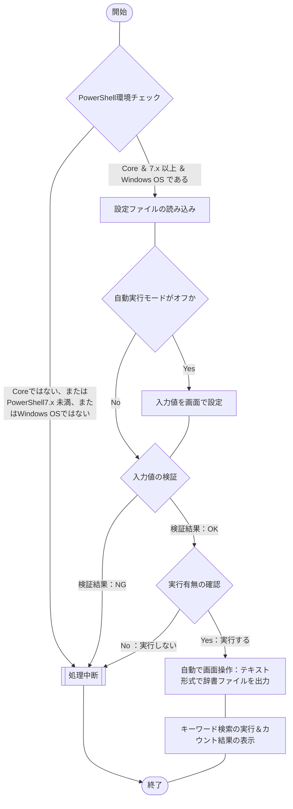

## 概要

[こちらの記事](https://haretokidoki-blog.com/pasocon_powershell-startup/)で文字だけを表示するスクリプトを使い、
PowerShellのはじめ方を紹介しましたが、より実践に近いサンプルコード（サンプルプログラム）を作成しました。

今回作成したPowerShellスクリプトは自動でMicrosoft IMEの単語辞書をテキスト形式で出力し、指定したキーワードで検索（キーワードは複数指定が可能）。
キーワード毎にヒットした件数を表示するという内容です。

今回のコードでポイントとなるのは、GUIのツールをPowerShellで画面操作（[RPA](https://ja.wikipedia.org/wiki/ロボティック・プロセス・オートメーション)）できるライブラリ「UI Automation」を使用している点です。

:::details 画面操作が可能なライブラリ「UI Automation」を使用した理由
辞書データをテキスト形式で出力できる唯一のツール、「ユーザー辞書ツール」を画面操作する為に使用しています。

詳しい状況を説明すると、Microsoft IMEの辞書ファイルの大本は拡張子が「`*.dic`」のファイルです。
しかし、dicファイルはバイナリ形式のファイルとなる為、テキスト形式のキーワードを検索する事ができません。
その為、テキスト形式のファイルを出力するコマンドを調査しましたが見つかりませんでした。

そこで今回、画面操作が可能となるライブラリ「UI Automation」を使用して“ユーザー辞書ツール”を操作し辞書データのテキスト形式を実現しました。
:::

PowerShellの始め方（スタートアップ）としても、ご参考頂ければと思います。
https://haretokidoki-blog.com/pasocon_powershell-startup/

## この記事のターゲット

- PowerShellユーザーの方
- PowerShellで辞書データをテキスト形式で出力したい方
- PowerShellのライブラリ「UI Automation」を使用して画面操作（RPA）したい方

## サンプルプログラムの紹介

サンプルプログラムのシナリオは、単語登録を大量に登録しているWindows OSの端末で新たな単語を登録する際、
すでに単語データを登録済みであるかチェックしたいときに使用するという、シナリオを想定しています。

### サンプルプログラム

https://github.com/akiGAMEBOY/PowerShell_IMEdictionarySearchTool

### 仕様

プログラム起動用：batファイルとプログラムの本体：ps1ファイル、個別の設定ファイル：setup.iniファイル、
の3つで構成されたプログラム。

なお、下記6件は設定ファイルにより変更可能とする

- 作業用フォルダー
- 検索するキーワード
- 大文字小文字の区別の設定
- 自動モードでのオンオフ
- 自動生成されるフォルダーの名前
- 自動生成されるファイルの名前

#### フローチャート

##### 処理全体

下記のプログラム本体と同様。

##### プログラム本体

ファイル名：Main.ps1



#### 画面仕様

バッチファイル（batファイル）を使いPowerShellスクリプトを実行する。
このPowerShellでは[.NET Frameworkのフォーム](https://learn.microsoft.com/ja-jp/powershell/scripting/samples/creating-a-custom-input-box?view=powershell-7.3)（以下、dotNETフォームと称する）を呼び出して使用しており、
dotNETフォームを使ったポップアップウィンドウで操作する。
他にコマンドプロンプトの操作で一時停止（PUASE）状態の確認画面に対し「Enterキー」を押すと処理が続行される操作方法がある。
https://learn.microsoft.com/ja-jp/powershell/scripting/samples/creating-a-custom-input-box?view=powershell-7.3

#### 機能仕様

1. 初期設定
    - 設定ファイル読み込み
        - 作業フォルダーの場所
        - 辞書ファイルの検索キーワード群（カンマ区切りで複数指定可）
        - 辞書ファイルの検索キーワードのオプション（大文字・小文字を区別する）
        - 自動実行モードの設定（true：自動実行、false：対話式実行）
        - 自動生成されるエクスポート用のフォルダー名
        - キーワード検索するファイル（テキスト形式の辞書ファイル）
1. PowerShell環境チェック
    実行環境の前提条件となる下記を検証。
    - PowerShell Core であること
    - PowerShell 7.x 以上 であること
    - Windows OS 環境 であること
1. 自動実行モード or 対話式モード での実行
    設定ファイル（`setting.ini`）の設定で自動実行がオンの場合、設定ファイルの情報を元に実行。
    自動実行がオフの場合、実行前にWindowsフォームで設定値の変更が可能となる。
1. テキスト形式で辞書ファイルを出力
    おそらくWindows環境で唯一、辞書ファイルをテキスト出力できるツール「ユーザー辞書ツール」をPowerShellのライブラリ「UI Automation」で画面を制御し操作。
    テキストファイルの出力先は、あらかじめ設定した作業フォルダー配下にエクスポート用のフォルダーを作成した上で出力する流れ。
1. キーワード検索の実行＆カウント結果の表示
    前項で出力したテキスト形式の辞書ファイルを対象にキーワード検索を行う。
    また、検索しカウントした結果を表示する。

#### 入出力ファイル

##### 入力ファイル

- iniファイル

https://github.com/akiGAMEBOY/PowerShell_IMEdictionarySearchTool/blob/master/source/powershell/setup.ini#L7-L8

##### 出力ファイル

なし

### GitHub Repository

https://github.com/akiGAMEBOY/PowerShell_IMEdictionarySearchTool

#### フォルダー構成

```
PowerShell_IMEdictionarySearchTool
│  LICENSE
│  PowerShell_DictionarySearchTool.bat  ・・・起動用バッチファイル
│  README.md
│
└─source
    ├─icon                            ・・・アイコンデータ
    │      shell32-296.ico
    │
    └─powershell
            Main.ps1                    ・・・プログラム本体
            setup.ini                   ・・・設定ファイル
```

## 参考記事

### 流用したサンプルプログラム

https://zenn.dev/haretokidoki/articles/cad8b141202136

### プログラム作成時に参考にした記事

- Microsoft公式ドキュメント：UIオートメーション
    https://learn.microsoft.com/ja-jp/windows/win32/winauto/entry-uiauto-win32

- PowerShellで画面操作が可能となるライブラリ「UI Automation」
    https://workspacememory.hatenablog.com/entry/2017/06/04/224653

- 記事を参考に「$notewndw = Get-UiaWindow -Name '*メモ帳'」の形式で実装できないか検証するもNGだった
    https://masuo.doorblog.jp/archives/51833976.html

- 画面制御で引用させて頂いたソースコードを公開していた記事
    https://sqripts.com/2023/05/11/47993/

- UI Automationの開発は中止されているらしく将来性はなさそう
    https://qiita.com/maohara/items/82afbccdd3ae62c05dd9

- UI Automation同梱の画面解析ツール「UIAutomationSpy」の解説
    画面上のオブジェクトを指定して操作したい場合に必要不可欠なツールの解説記事。
    http://xoxopigs.com/uiautomation-3

    :::detials UIAutomationSpyを使い単語の登録ウィンドウを解析した結果
    Microsoft IME - 単語の登録ウィンドウ 上にあるボタン「`ユーザー辞書ツール(T)`」を解析してみると、
    AutomationIdが `658` である事がわかる。
    
    *画像：UIAutomationSpy.exe でボタン「ユーザー辞書ツール」を確認した際の画面*
    :::

- PowerShellでTryParseを使用する方法
    https://postgresweb.com/powershell-numeric-check

## 補足情報

- 辞書ファイル（`*.dic`）を対象に辞書データをインポートする方法
    http://linux-story.seesaa.net/article/472940334.html

## 関連記事

https://haretokidoki-blog.com/pasocon_powershell-startup/
https://zenn.dev/haretokidoki/articles/7e6924ff0cc960
