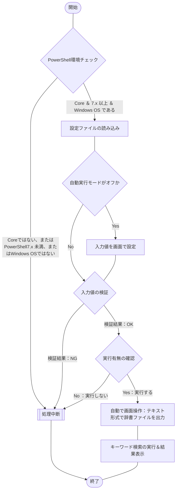

## 概要

[こちらの記事](https://haretokidoki-blog.com/pasocon_powershell-startup/)で文字だけを表示するスクリプトを使い、
PowerShellのはじめ方を紹介しましたが、より実践に近いサンプルコード（サンプルプログラム）を作成しました。

今回作成したPowerShellスクリプトは自動でMicrosoft IMEの単語辞書をテキスト形式で出力し、指定したキーワードで検索（キーワードは複数指定が可能）。
キーワード毎にヒットした件数を表示するという内容です。

今回のコードでポイントとなるのは、GUIのツールをPowerShellで画面操作（[RPA](https://ja.wikipedia.org/wiki/ロボティック・プロセス・オートメーション)）できるライブラリ「UI Automation」を使用している点です。

:::details 画面操作が可能なライブラリ「UI Automation」を使用した理由
辞書データをテキスト形式で出力できる唯一のツール、「ユーザー辞書ツール」を画面操作する為に使用しています。

詳しい状況を説明すると、拡張子が「`*.dic`」の辞書データをコマンドで出力する方法は見つかりましたが、
dicファイルはバイナリ形式のファイルとなる為、テキスト形式のキーワードを検索する事ができません。
さらに深掘りして調査しましたが、テキスト形式のファイルを出力するコマンドは見つかりませんでした。

そこで今回、画面操作が可能となるライブラリ「UI Automation」を使用して“ユーザー辞書ツール”を操作し辞書データをテキスト形式で出力しました。
:::

PowerShellの始め方（スタートアップ）としても、ご参考頂ければと思います。
https://haretokidoki-blog.com/pasocon_powershell-startup/

## この記事のターゲット

- PowerShellユーザーの方
- PowerShellで辞書データをテキスト形式で出力したい方
- PowerShellのライブラリ「UI Automation」を使用して画面操作（RPA）したい方

## サンプルプログラムの紹介

サンプルプログラムのシナリオは、単語登録を大量に登録しているWindows OSの端末で新たな単語を登録する際、
すでに単語データを登録済みであるかチェックしたいときに使用するという、シナリオを想定しています。

### サンプルプログラム

https://github.com/akiGAMEBOY/PowerShell_IMEdictionarySearchTool

### 仕様

プログラム起動用：batファイルとプログラムの本体：ps1ファイル、個別の設定ファイル：setup.iniファイル、
の3つで構成されたプログラム。

なお、下記6件は設定ファイルにより変更可能とする

- 作業用フォルダー
- 検索するキーワード
- 大文字小文字の区別の設定
- 自動モードでのオンオフ
- 自動生成されるフォルダーの名前
- 自動生成されるファイルの名前

#### フローチャート

##### 処理全体

下記のプログラム本体と同様。

##### プログラム本体

ファイル名：Main.ps1



#### 画面仕様

バッチファイル（batファイル）を使いPowerShellスクリプトを実行する。
このPowerShellでは[.NET Frameworkのフォーム](https://learn.microsoft.com/ja-jp/powershell/scripting/samples/creating-a-custom-input-box?view=powershell-7.3)（以下、dotNETフォームと称する）を呼び出して使用しており、
dotNETフォームを使ったポップアップウィンドウで操作する。
他にコマンドプロンプトの操作で一時停止（PUASE）状態の確認画面に対し「Enterキー」を押すと処理が続行される操作方法がある。
https://learn.microsoft.com/ja-jp/powershell/scripting/samples/creating-a-custom-input-box?view=powershell-7.3

#### 機能仕様

// TODO: ここから

1. 初期設定
    - 設定ファイル読み込み
        - 対象PDFファイル名
        - 対象検索文字列
1. 対象PDFファイルの存在チェック
    設定ファイルより取得した対象のPDFファイル名がバッチの起動場所と同じ階層にあるかチェックする。
    ない場合は、処理中断。
1. 指定文字列の検索
    設定ファイルより取得した対象検索文字列の有無をチェックする。
    ない場合は、異常終了と判断。

#### 入出力ファイル

##### 入力ファイル

- iniファイル

https://github.com/akiGAMEBOY/PowerShell_IMEdictionarySearchTool/blob/master/source/powershell/setup.ini#L7-L8

##### 出力ファイル

なし

### GitHub Repository

https://github.com/akiGAMEBOY/PowerShell_IMEdictionarySearchTool

#### フォルダー構成

```
PowerShell_IMEdictionarySearchTool
│  LICENSE
│  PowerShell_DictionarySearchTool.bat  ・・・起動用バッチファイル
│  README.md
│
└─source
    ├─icon                            ・・・アイコンデータ
    │      shell32-296.ico
    │
    └─powershell
            Main.ps1                    ・・・プログラム本体
            setup.ini                   ・・・設定ファイル
```

### 参考記事

#### 各iTestSharpのバージョンで動作確認した結果

| バージョン | 動作有無 | 備考 |
| ---- | ---- | ---- |
| 5.5.10 | ○ |  |
| 5.5.11 | ○ |  |
| 5.5.12 | ○ |  |
| 5.5.13 | ○ | サンプルプログラムで使用 |
| 5.5.13.1 | ○ |  |
| 5.5.13.2 | × | 原因不明だが動作しなかった。不具合？ |
| 5.5.13.3 | × | 原因不明だが動作しなかった。不具合？ |

#### 流用したサンプルプログラム

https://zenn.dev/haretokidoki/articles/a77765dd56f202

#### プログラム作成時に参考にした記事

- iTextSharp 5.5.13のダウンロード
    https://www.nuget.org/packages/iTextSharp/5.5.13
- nupkgファイルからデータを取り出す方法
    https://zenn.dev/haretokidoki/articles/d3ca9fe55ab0c5
- テキスト埋め込みのあるPDFファイルをテキストファイルで出力する方法
    http://35huyu.seesaa.net/article/446050464.html

- iTextSharpの情報がまとまっているサイト
    https://codezine.jp/article/detail/462
    https://qiita.com/AWtnb/items/215f77d97b7ea069a06a

- iTextSharpのライセンス関連の記事
    https://nokoshitamono.blogspot.com/2015/09/gplagpl.html
    https://caddiary.com/?p=4426
    https://qiita.com/toshi71/items/bc05d6e15edd645c8f46

- OSSライセンスに関する記事
    https://www.tohoho-web.com/ex/license.html
    https://future-architect.github.io/articles/20200821/
    https://coliss.com/articles/build-websites/operation/work/choose-a-license-by-github.html

- GitHubでライセンスを追加する方法
    - リポジトリ作成時にライセンスを追加する方法
        https://qiita.com/shibukk/items/67ad0a5eda5a94e5c032
    - リポジトリ作成後にライセンスを追加する方法
        https://docs.github.com/ja/communities/setting-up-your-project-for-healthy-contributions/adding-a-license-to-a-repository
        https://qiita.com/medi-y-sato/items/c3d5c357ab020290dccc

- iTextSharp以外のPDFが編集可能なライブラリ「pdfsharp」（未検証）
    https://plaza.rakuten.co.jp/satocchia/diary/202110220000/?scid=we_blg_pc_lastctgy_3_title
    https://zenn.dev/awtnb/articles/e54718efcd1b5b#pdfsharp

## 関連記事

https://haretokidoki-blog.com/pasocon_powershell-startup/
https://zenn.dev/haretokidoki/articles/7e6924ff0cc960


Select-String "文字列" 対象ファイル名 により検索その結果を表示。
複数キーワードと複数フォルダー、またはファイルで検索できた方が便利。

キーワードと対象リソースを1対1で設定するとわかりやすいかも。
大文字小文字の指定や正規表現のONやOFFができるとおそらく便利。

フォルダーを検索する際にサブフォルダーを含めるか否かを設定できた方がよさそう。
（個人的には使わないが、一般的なツールにはあるイメージ）

元々何を目的としたarticleか分からなくなったが、Windowsの辞書で登録済みかチェックする際の
スクリプトの作成を検討していたのか？

コマンドで登録した単語を出力する方法？

コマンドで登録する方法？

コマンドで削除する方法？

- 参考情報：IME辞書ファイルそのものをインポートするやり方
    http://linux-story.seesaa.net/article/472940334.html

```powershell:IMJPUEXCコマンド
PS C:\Users\"ユーザー名"> C:\Windows\System32\IME\IMEJP\imjpuexc.exe
Microsoft IME Property Command Line Tool (10.0.19041.3636)
Copyright (c) Microsoft Corporation.  All rights reserved.

The Syntax of this command is:

IMJPUEXC [ ADDSYSDICT | CHECKSYSDICT | REMOVESYSDICT | SETKANAINPUT | GETKANAINPUT | SETCUSTOMDICTPATH | GETCUSTOMDICTPATH | FIXCUSTOMDICT | CODEAREAFORCONVERT | SETOKURIGANAOPTION | GETOKURIGANAOPTION | SETKEYTEMPLATE | SETKUTOUTEN | RESET | LOADAUTOTUNEDATA | SAVEAUTOTUNEDATA | REMOVEAUTOTUNEDATA | SETFILTERDICT | GETFILTERDICT | REMOVEFILTERDICT | HELP ]
PS C:\Users\"ユーザー名">
```

```powershell
PS C:\Users\"ユーザー名"> C:\Windows\System32\IME\IMEJP\IMJPDCT.EXE
PS C:\Users\"ユーザー名">
```

- UI Automationというライブラリがあるみたい
    https://workspacememory.hatenablog.com/entry/2017/06/04/224653

- PowerShell x UI Automationで参考にした記事
    https://sqripts.com/2023/05/11/47993/

    https://masuo.doorblog.jp/archives/51833976.html
    →参考になると思ってこれ「$notewndw = Get-UiaWindow -Name '*メモ帳'」を試したがダメだった。

- Microsoft公式ドキュメント UI オートメーション
    https://learn.microsoft.com/ja-jp/windows/win32/winauto/entry-uiauto-win32

- UI Automaitionには将来性がないみたい
    <https://qiita.com/maohara/items/82afbccdd3ae62c05dd9>

- UIAutomationSpy.exeについて
    <http://xoxopigs.com/uiautomation-3>

    Microsoft IME - 単語の登録 にある 「`ユーザー辞書ツール(T)`」を指定した際、
    UIAutomationSpy.exeで実際のオブジェクト（ボタン）にふれて、
    -AutomationId '658'である事がわかった。

    
    *画像：UIAutomationSpy.exe でボタン「ユーザー辞書ツール」を確認した際の画面*

```powershell:サンプル
# Windows PowerShellでアプリを自動操作するスクリプト

# UI オートメーションを使うための準備
Add-Type -AssemblyName "UIAutomationClient"
Add-Type -AssemblyName "UIAutomationTypes"
$AutomationElement = [System.Windows.Automation.AutomationElement]
$TreeScope = [System.Windows.Automation.TreeScope]
$Condition = [System.Windows.Automation.Condition]
$InvokePattern = [System.Windows.Automation.InvokePattern]
$SendKeys = [System.Windows.Forms.SendKeys]
$Cursor = [System.Windows.Forms.Cursor]

# マウスの左クリック操作をおこなうための準備
$SendInputSource =@"
using System;
using System.Drawing;
using System.Runtime.InteropServices;
using System.Windows.Forms;

public class MouseClick {
    [StructLayout(LayoutKind.Sequential)]
    struct MOUSEINPUT {
        public int dx;
        public int dy;
        public int mouseData;
        public int dwFlags;
        public int time;
        public IntPtr dwExtraInfo;
    }
    
    [StructLayout(LayoutKind.Sequential)]
    struct INPUT
    {
        public int type;
        public MOUSEINPUT mi;
    }

    [System.Runtime.InteropServices.DllImport("user32.dll")]
    extern static uint SendInput(uint cInputs, INPUT[] pInputs, int cbSize);

    public static void Click() {
        INPUT[] input = new INPUT[2];
        input[0].mi.dwFlags = 0x0002;
        input[1].mi.dwFlags = 0x0004;
        SendInput(2, input, Marshal.SizeOf(input[0]));
    }
}
"@
Add-Type -TypeDefinition $SendInputSource -ReferencedAssemblies System.Windows.Forms, System.Drawing
$MouseClick = [MouseClick]

# 要素を取得する関数
function GetElements {
    Param($RootWindowName = $null)
    if ($RootWindowName -eq $null) {
        try {
            return $AutomationElement::RootElement.FindAll($TreeScope::Subtree, $Condition::TrueCondition)
        }
        catch {
            return $null
        }
    }
    else {
        $childrenElements = $AutomationElement::RootElement.FindAll($TreeScope::Children, $Condition::TrueCondition)
        foreach ($element in $childrenElements) {
            if ($element.GetCurrentPropertyValue($AutomationElement::NameProperty) -eq $RootWindowName) {
                return $element.FindAll($TreeScope::Subtree, $Condition::TrueCondition)
            }
        }
            Write-Host "指定された名前 '${RootWindowName}' のウィンドウが見つかりません。"
    }
    return $null
}

# 要素を検索する関数
function FindElement {
    Param($RootWindowName = $null, $PropertyType, $Identifier, $Timeout)
    $startTime = (Get-Date).Ticks
    do {
        foreach ($element in GetElements -RootWindowName $RootWindowName) {
            try {
                if ($element.GetCurrentPropertyValue($AutomationElement::$PropertyType) -eq $Identifier) {
                    return $element
                }
            }
            catch {
                continue
            }
        }
    }
    while (((Get-Date).Ticks - $startTime) -le ($Timeout * 10000))
    throw "指定された要素 '${Identifier}' が見つかりません。"
}

# クリック操作をおこなう関数
function ClickElement {
    Param($RootWindowName = $null, $PropertyType, $Identifier, $Timeout = 5000)
    $startTime = (Get-Date).Ticks
    do {
        $element = FindElement -RootWindowName $RootWindowName -PropertyType $PropertyType -Identifier $Identifier -Timeout $Timeout
        $isEnabled = $element.GetCurrentPropertyValue($AutomationElement::IsEnabledProperty)
        if ($isEnabled -eq "True") { break }
    }
    while (((Get-Date).Ticks - $startTime) -le ($Timeout * 10000))
    if ($isEnabled -ne "True") {
        throw "指定された要素 '${Identifier}' が有効状態になりません。"
    }

    if ($element.GetCurrentPropertyValue($AutomationElement::IsInvokePatternAvailableProperty) -eq "True") {
        $element.GetCurrentPattern($InvokePattern::Pattern).Invoke()
    }
    else {
        # IsInvokePatternAvailablePropertyがFalseの時はマウスカーソルを要素に移動して左クリックする
        $clickablePoint = $element.GetClickablePoint()
        $Cursor::Position = New-Object System.Drawing.Point($clickablePoint.X, $clickablePoint.Y)
        $MouseClick::Click()
    }
}

# キーボード操作をおこなう関数
function SendKeys {
    Param($RootWindowName = $null, $PropertyType, $Idendifier = $null, $Keys, $Timeout = 5000)
    if ($Idendifier -ne $null) {
        $element = FindElement -RootWindowName $RootWindowName -PropertyType $PropertyType -Identifier $Idendifier -Timeout $Timeout
        $element.SetFocus()
    }
    $SendKeys::SendWait($Keys)
}

# Microsoft EdgeでWebキャプチャの保存操作をおこなう関数
function SaveWebCaptureByMicrosoftEdge {
    SendKeys -Keys "^(+S)"
    ClickElement -PropertyType "AutomationIdProperty" -Identifier "view_52561"
    ClickElement -PropertyType "AutomationIdProperty" -Identifier "save_button_id"
    Start-Sleep -Seconds 3
    SendKeys -Keys "{ESCAPE}"
}

# ↓↓↓↓↓ この行以降にアプリを自動操作するスクリプトを書く ↓↓↓↓↓
################################################################################
# 電卓を自動操作する
################################################################################

# 足し算する値の範囲を設定する
$start = 1
$end = 10

# ボタンをクリックした後の待機ミリ秒を設定する
$waitMilliseconds = 300

# 電卓アプリを開始する
Start-Process calc -Wait

# 電卓アプリを操作する
foreach ($count in $start..$end) {
    # 数値を1桁ずつに分割する
    $array = $count.ToString().ToCharArray()

    # 電卓アプリの数値ボタンをクリックする
    foreach ($number in $array) {
        ClickElement -RootWindowName "電卓" -PropertyType "AutomationIdProperty" -Identifier "num${number}Button"
        Start-Sleep -Milliseconds $waitMilliseconds
    }

    # 現在のカウントで処理を分岐する
    if ($count -ne $end) {
        # 範囲の終わり以外の時は[＋]ボタンをクリックする
        ClickElement -RootWindowName "電卓" -PropertyType "AutomationIdProperty" -Identifier "plusButton"
        Start-Sleep -Milliseconds $waitMilliseconds
    }
    else {
        # 範囲の終わりの時は[＝]ボタンをクリックする
        ClickElement -RootWindowName "電卓" -PropertyType "AutomationIdProperty" -Identifier "equalButton"
        Start-Sleep -Milliseconds $waitMilliseconds
    }
}
```

```powershell:辞書ファイルの場所を確認
PS C:\Users\"ユーザー名"> C:\Windows\System32\IME\IMEJP\imjpuexc.exe GETCUSTOMDICTPATH
Microsoft IME Property Command Line Tool (10.0.19041.3636)
Copyright (c) Microsoft Corporation.  All rights reserved.

C:\Users\"ユーザー名"\AppData\Roaming\Microsoft\IME\15.0\IMEJP\UserDict\imjp15cu.dic
PS C:\Users\"ユーザー名">
```

PowerShell_DictionarySearchTool

## 参考情報

### PowerShellでTryParseを使用する方法

https://postgresweb.com/powershell-numeric-check