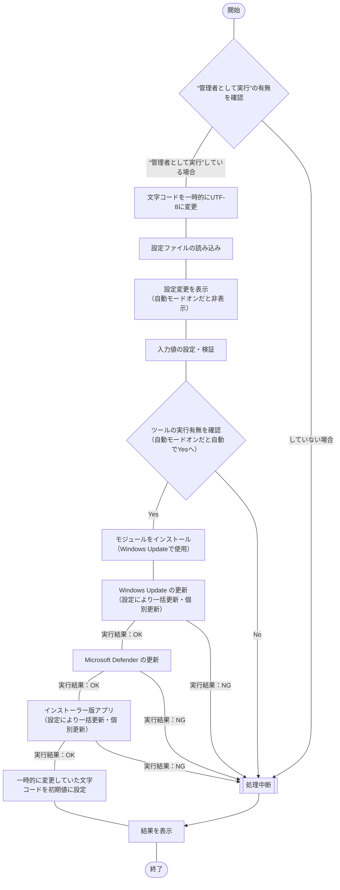

## 概要

あらゆる自動更新機能をオフにしているWindows OS 環境でアップデートする場合、個々の管理画面に移動して更新する必要があり面倒に感じていました。

今回は、“設定”内の更新とセキュリティにある下記の2点と、

- Windows Update 更新プログラム
- Microsoft Defender セキュリティー パターンファイルの更新
    （Windowsセキュリティ - ウイルスと脅威の防止 - ウイルスと脅威の防止の更新）

アップデート可能なアプリ（ソフトウェア）に制限はありますが、

- インストーラー版アプリ（ソース：winget）

の合計3点を一括でアップデートするPowerShellスクリプトを作成しました。

## この記事のターゲット

- Windows ユーザーの方
- 下記を手動で一括アップデートしたい方
    - 更新プログラム（Windows Update）
    - セキュリティー パターンファイル（Microsoft Defender）
    - インストーラー版アプリ（source = winget）
        ※ MSIX形式のMicrosoft Store版 アプリ（[UWP](https://ja.wikipedia.org/wiki/ユニバーサルWindowsプラットフォーム)）は非対応

## 前提条件

1. システムやアプリの手動アップデートを一括で行いたい場合に使用
    :::details 補足情報：システムやアプリを手動アップデートしている理由 < クリックで折りたたみが開く >
    わざわざ手動でアップデートせずに、自動更新機能をオンにすることで問題が発生しないのではと疑問に感じている方がいると思います。
    私なりに手動でアップデートしている理由があります。自動更新すると、大きく下記2つのデメリットがあると考えています。

    - 更新が起因となるトラブルが発生した際、自動更新だと何が更新されたのかわかりにくくなり、切り分けが難しくなる場合があること
    - 更新で仕様変更があった場合、変化に気づきにくいこと
    - 自動更新だと、予期しないタイミングでネットワークに負荷がかかってしまうこと

    普段使用しているアプリ・ソフトウェアが少なくシンプルな構成でパソコンを使用している方は、
    わざわざ手動で自動更新する必要はないと思います。

    :::

1. Windows Update は、PowerShellのモジュール「PSWindowsUpdate」でアップデート
    :::details 補足情報：そもそもWindows Updateって何をアップデートしているのか < クリックで折りたたみが開く >
    [Microsoft Update](https://ja.wikipedia.org/wiki/Microsoft_Update)とは、Microsoftが提供するWindows OS の機能で Windows OS や Microsoft のアプリ（ソフトウェア）、パソコンのデバイスドライバー などのセキュリティーアップデートや不具合（バグ）対応が主に実施される。
    :::

1. Microsoft Defender は、PowerShellのコマンドレット「Update-MpSignature」でアップデート
    :::details ウイルス対策でMicrosoft Defender を使用していない場合 < クリックで折りたたみが開く >
    Windows OS標準のウイルス対策ソフトは、Microsoft Defender。
    追加でウイルス対策ソフトを導入している場合、Microsoft Defenderは自動で無効となっている。

    このツールでは、Microsoft Defender のサービスが停止している場合、自動で処理をスキップします。
    サービスが起動状態でも処理をスキップしたい場合は、設定ファイル（`setup.ini`）で無効に設定可能。
    :::

1. インストーラー版アプリ は、Windowsのパッケージ管理システム「Windows Package Manager（winget）」でアップデート
    ::::details 補足情報：対象はソースが“winget”のアプリのみ < クリックで折りたたみが開く >
    winget listコマンドでインストールされているソフトウェア・アプリをみると項目「ソース」に“winget”と“msstore”、“（空欄）”の3種類が存在。
    
    2024年4月現在、検索するコマンド `winget search` や インストールするコマンド `winget install` については、Store版アプリも実行できるが、
    一括アップデートするコマンド [`winget upgrade`](https://learn.microsoft.com/ja-jp/windows/package-manager/winget/upgrade) では、Store版アプリ（ソースが"msstore"）は対応していません。

    その為、ソフトウェア・アプリのアップデートに関してはインストーラー版アプリ（ソースが“winget”）のみが対象となり、
    限定的な対応。
    今後の[アプリ インストーラー](https://www.microsoft.com/store/productId/9NBLGGH4NNS1?ocid=pdpshare)のアップデート次第では、Store版アプリも更新対象となる可能性はありそう。

    更新はないですが、GitHubの[winget-cliリポジトリ](https://github.com/microsoft/winget-cli)の[Isseu#2854](https://github.com/microsoft/winget-cli/issues/2854)でも要望があがっています。

    :::details 補足情報：Microsoft Store版アプリ（UWP）も対応しようと検証するもNGだった < クリックで折りたたみが開く >
    上記の補足事項で[アプリ インストーラー](https://www.microsoft.com/store/productId/9NBLGGH4NNS1?ocid=pdpshare)（wingetコマンド）による更新は不可という事はわかりましたが、
    他の手法で[Microsoft Store](https://ja.wikipedia.org/wiki/Microsoft_Store)のアプリもアップデートできないか検証したが、
    すべて正常動作せずNGだった。
    下記が検証した内容。
    - モジュール「Appx」を使用した更新
    - アプリ インストーラー（winget） 標準機能を使用した更新
    - アプリ インストーラー（winget） 試験運用中の機能を使用した更新
        winget の settings.jsonファイルで“experimentalFeatures - experimentalMSStore”の機能を使用。
        2024年4月現在、[こちらの公式ページ](https://github.com/microsoft/winget-cli/blob/master/doc/Settings.md)を確認すると、試験運用の設定にStore関連の項目がなかった。
        以前あったStoreの設定「`experimentalMSStore`」の試験運用は終わったのかも？
        もしかすると試験運用の結果、設定ファイルを変更せずとも `winget search` や `winget install` などのコマンドでStore版のアプリが指定できるようになっているのかもしれない。
    
    - 参考情報：従来のインストーラー版アプリ「MSI」とStore版のアプリ「MSIX」の違い
        https://atmarkit.itmedia.co.jp/ait/articles/2206/14/news008.html
    :::

    ::::

## 事前に必要な手動作業

PowerShellスクリプトを実行する前提条件を記載。

<!-- ### PowerShell Coreのインストール

Windows OS にPowerShell Core をインストール。

- 検索キーワードの例
    Windows 10 の場合「[`windows 10` ＋ `powershell` ＋ `core` ＋ `インストール`](https://www.google.com/search?q=windows+10+powershell+core+インストール)」
    Windows 11 の場合「[`windows 11` ＋ `powershell` ＋ `core` ＋ `インストール`](https://www.google.com/search?q=windows+11+powershell+core+インストール)」

    ※ メモ：余裕があれば、自分用に手順をまとめて記事にしておきたい！ -->

### wingetコマンドの導入

- Microsoft Storeで配信されている最新のアプリインストーラーをインストール
    https://www.microsoft.com/p/app-installer/9nblggh4nns1
- バージョンを指定してインストールしたい場合
    https://github.com/microsoft/winget-cli/releases

:::details wingetのアンインストール方法 < クリックで折りたたみが開く >

```powershell:コピー用
winget uninstall --id 'Microsoft.AppInstaller'
```

```powershell:実際に実行した結果
# winget uninstallコマンドでアプリインストーラーを削除
PS C:\Users\"ユーザー名"> winget uninstall --id 'Microsoft.AppInstaller'
見つかりました App Installer [Microsoft.AppInstaller]
パッケージのアンインストールを開始しています...
   / 操作を取り消しています
PS C:\Users\"ユーザー名">
# winget コマンドを実行すると削除した為、実行できなくなる
PS C:\Users\"ユーザー名"> winget
winget : 用語 'winget' は、コマンドレット、関数、スクリプト ファイル、または操作可能なプログラムの名前と して認識されません。名前が正しく記述されていることを確認し、パスが含まれている場合は
そのパスが正しいことを確認してから、再試行してください。
発生場所 行:1 文字:1
+ winget
+ ~~~~~~
    + CategoryInfo          : ObjectNotFound: (winget:String) [], CommandNotFoundException
    + FullyQualifiedErrorId : CommandNotFoundException

PS C:\Users\"ユーザー名">
```

:::

## 環境

### OSのバージョン

Windows 10 Pro環境

```powershell:Get-WmiObjectコマンド
PS C:\Users\"ユーザー名"> Get-CimInstance CIM_OperatingSystem

SystemDirectory     Organization BuildNumber RegisteredUser SerialNumber            Version
---------------     ------------ ----------- -------------- ------------            -------
C:\WINDOWS\system32              19045       XXXXX          00000-00000-00000-AAAAA 10.0.19045
                                             ^^^^^          ^^^^^ ^^^^^ ^^^^^ ^^^^^
                                             ↑マスク       ↑マスク

PS C:\Users\"ユーザー名">
```

- 参考記事：PowerShell Core ではGet-WmiObjectからGet-CimInstanceに変更
    https://www.vwnet.jp/windows/PowerShell/2021061301/PowerShellCore6xWMI.htm

- 参考記事：Win32_OperatingSystem クラスは CIM_OperatingSystem に変更
    https://learn.microsoft.com/ja-jp/windows/win32/cimwin32prov/cim-operatingsystem

### PowerShell

```powershell:PowerShellのバージョン
PS C:\WINDOWS\system32> $PSVersionTable

Name                           Value
----                           -----
PSVersion                      5.1.19041.4046
PSEdition                      Desktop
PSCompatibleVersions           {1.0, 2.0, 3.0, 4.0...}
BuildVersion                   10.0.19041.4046
CLRVersion                     4.0.30319.42000
WSManStackVersion              3.0
PSRemotingProtocolVersion      2.3
SerializationVersion           1.1.0.1


PS C:\WINDOWS\system32>
```

### winget（アプリインストーラー）

```powershell:wingetのバージョン
PS C:\Users\"ユーザー名"> winget -v
v1.6.3482
PS C:\Users\"ユーザー名">
```

## サンプルプログラムの紹介

### サンプルプログラム

https://github.com/akiGAMEBOY/PowerShell_WindowsUpdateTool

### 仕様

プログラム起動用：batファイルとプログラムの本体：ps1ファイル、個別の設定ファイル：setup.iniファイル、
の3つで構成されたプログラム。

なお、下記6件は設定ファイルにより変更可能とする

- 個別にインストールするモジュール
    初期値「`PSWindowsUpdate`」で設定
- Windows Update の更新有無
    初期値「`true`」で設定
- Microsoft Defender の更新有無
    初期値「`true`」で設定
- アプリ（インストーラー版） の更新有無
    初期値「`true`」で設定
- Win Update・アプリの更新方法（true: 一括更新、false: 個別更新）
    初期値「`false`」で設定
- アプリ個別更新時の更新対象外とするアプリID
    初期値「`"Zoom.Zoom,Dell.DisplayManager,Microsoft.VCRedist.2015+.x64,Microsoft.VCRedist.2013.x64"`」で設定
- 自動実行モードの設定
    初期値「`false`」で設定

#### フローチャート

##### 処理全体

下記のプログラム本体と同様。

##### プログラム本体

ファイル名：Main.ps1



#### 画面仕様

バッチファイル（batファイル）を使いPowerShellスクリプトを実行する。
このPowerShellでは[.NET Frameworkのフォーム](https://learn.microsoft.com/ja-jp/powershell/scripting/samples/creating-a-custom-input-box?view=powershell-7.3)（以下、dotNETフォームと称する）を呼び出して使用しており、
dotNETフォームを使ったポップアップウィンドウで操作する。
他にコマンドプロンプトが一時停止（PUASE）状態の確認画面の際に「Enterキー」を押し、処理続行させる操作方法も含まれる。
https://learn.microsoft.com/ja-jp/powershell/scripting/samples/creating-a-custom-input-box?view=powershell-7.3

#### 機能仕様

1. 初期設定
    - 設定ファイル読み込み
        - 個別にインストールするモジュール
            初期値「`PSWindowsUpdate`」
        - Windows Update の更新有無（true: 更新する、false: 更新しない）
        - Microsoft Defender の更新有無（true: 更新する、false: 更新しない）
        - アプリ（インストーラー版） の更新有無（true: 更新する、false: 更新しない）
        - Win Update・アプリの更新方法（true: 一括更新、false: 個別更新）
        - アプリ個別更新時の更新対象外とするアプリID
            初期値「`"Zoom.Zoom,Dell.DisplayManager,Microsoft.VCRedist.2015+.x64,Microsoft.VCRedist.2013.x64"`」
        - 自動実行モードの設定（true: 自動実行オン、false: 自動実行オフ）
1. 自動実行モード or 対話式モード での実行
    設定ファイル（`setup.ini`）の設定で自動実行がオンの場合、設定ファイルの情報を元に実行。
    自動実行がオフの場合、実行前にWindowsフォームで設定値の変更が可能となる。
1. Windows Update の更新
    [PSWindowsUpdate](https://www.powershellgallery.com/packages/PSWindowsUpdate/)モジュールを使ってWindows Update の更新プログラムを適用。

    更新がある場合、`[Y] Yes  [A] Yes to All  [N] No  [L] No to All  [S] Suspend  [?] Help (default is "Y"):` というメッセージがあり、個々の更新プログラムに対して応答する必要があり。

    ```powershell:更新があった場合、キーボード入力が必要となる
    Confirm
    Are you sure you want to perform this action?
    Performing the operation "(2024/05/15 10:58:34) 悪意のあるソフトウェアの削除ツール x64 - v5.124 (KB890830)[68MB]" on
    target "コンピューター名".
    [Y] Yes  [A] Yes to All  [N] No  [L] No to All  [S] Suspend  [?] Help (default is "Y"): y

    Confirm
    Are you sure you want to perform this action?
    Performing the operation "(2024/05/15 10:58:43) 2024-05 .NET 6.0.30 Security Update for x64 Client (KB5038350)[81MB]"
    on target "コンピューター名".
    [Y] Yes  [A] Yes to All  [N] No  [L] No to All  [S] Suspend  [?] Help (default is "Y"): y

    Confirm
    Are you sure you want to perform this action?
    Performing the operation "(2024/05/15 10:58:45) 2024-05 .NET 7.0.19 Security Update for x64 Client (KB5038351)[219MB]"
    on target "コンピューター名".
    [Y] Yes  [A] Yes to All  [N] No  [L] No to All  [S] Suspend  [?] Help (default is "Y"): y

    Confirm
    Are you sure you want to perform this action?
    Performing the operation "(2024/05/15 10:58:46) 2024-05 x64 ベース システム用 Windows 10 Version 22H2 更新プログラム
    (KB5001716)[809KB]" on target "コンピューター名".
    [Y] Yes  [A] Yes to All  [N] No  [L] No to All  [S] Suspend  [?] Help (default is "Y"): y

    Confirm
    Are you sure you want to perform this action?
    Performing the operation "(2024/05/15 10:58:59) 2024-05 x64 ベース システム用 Windows 10 Version 22H2
    の累積更新プログラム (KB5037768)[104GB]" on target "コンピューター名".
    [Y] Yes  [A] Yes to All  [N] No  [L] No to All  [S] Suspend  [?] Help (default is "Y"): y
    ```

1. Microsoft Defender の更新
    Microsoft Defender のサービスが起動状態（`Get-Service -Name "WinDefend"` のステータスが `Running`）の場合、更新を実行。

    更新は、[Update-MpSignature](https://learn.microsoft.com/ja-jp/powershell/module/defender/update-mpsignature)を実行。

1. インストーラー版アプリ の更新
    [winget](https://learn.microsoft.com/ja-jp/windows/package-manager/winget/)のアップデートコマンド「`winget upgrade`」を使用して更新。

#### 入出力ファイル

##### 入力ファイル

- iniファイル

https://github.com/akiGAMEBOY/PowerShell_WindowsUpdateTool/blob/master/source/powershell/setup.ini#L1-L27

##### 出力ファイル

なし

### GitHub Repository

https://github.com/akiGAMEBOY/PowerShell_WindowsUpdateTool

#### フォルダー構成

```
PowerShell_WindowsUpdateTool
│  LICENSE
│  PowerShell_WindowsUpdateTool.bat ・・・起動用バッチファイル
│  README.md
│
└─source
    ├─csharp
    │      ActiveWindow.cs          ・・・アクティブウィンドウの制御で使用
    │
    ├─icon
    │      shell32-296.ico          ・・・アイコンデータ
    │
    └─powershell
            Main.ps1                 ・・・プログラム本体
            setup.ini                ・・・設定ファイル
```

## 参考記事

https://github.com/microsoft/winget-cli/
https://atmarkit.itmedia.co.jp/ait/articles/2106/11/news021.html
https://dobon.net/vb/dotnet/process/appactivate.html

### WindowsUpdate｜公開モジュール「PSWindowsUpdate」を導入する方法

https://note.com/mahalo_/n/n9df78a3a2afc
https://qiita.com/NoTASK/items/8ba63aea7f037599b4f5
https://boonx4m312s.hatenablog.com/entry/2023/02/02/180000

### WindowsUpdate｜Appxモジュール → 対応不可

https://qiita.com/tsukamoto/items/ee1c58a1afb3cef468a6
https://qiita.com/sengoku/items/49ee1a35b88b65936d90
https://learn.microsoft.com/ja-jp/powershell/module/appx/add-appxpackage?view=windowsserver2022-ps

### WindowsUpdate｜UsoClientコマンド → 対応不可

https://jp.minitool.com/backup-tips/windows-update-command-line.html#コマンドラインからwindows-updateを実行する方法-553

### WindowsUpdate｜WindowsUpdateProviderモジュール → 廃止済みの為、未採用

https://potisan-programming-memo.hatenablog.jp/entry/2020/11/07/144913

### Microsoft Defender

https://4thsight.xyz/8270
https://qiita.com/shiso_no_ha/items/3b10119c564a86a214bc

### インストーラー版アプリ（winget）

https://astherier.com/blog/2021/08/winget-usage-1/
https://astherier.com/blog/2021/08/winget-usage-2/
https://astherier.com/blog/2021/09/winget-usage-3/

## 関連記事

https://haretokidoki-blog.com/pasocon_powershell-startup/
https://zenn.dev/haretokidoki/articles/7e6924ff0cc960
