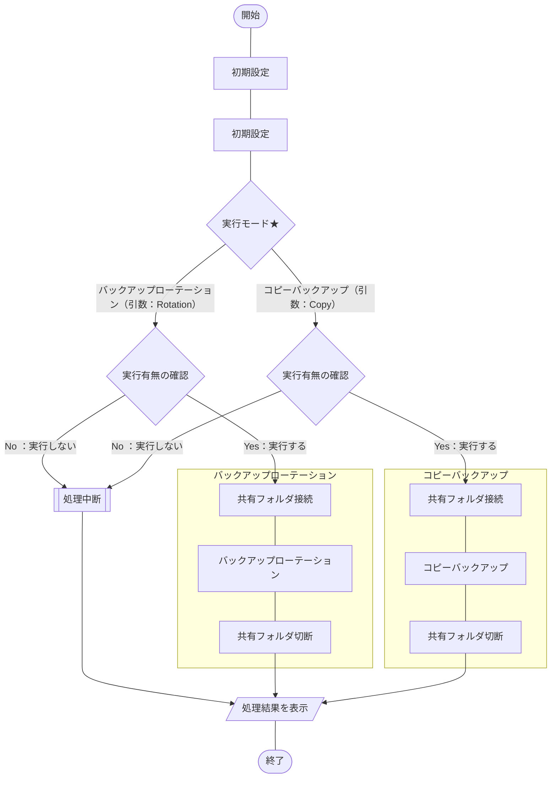

## 概要
[こちらの記事](https://haretokidoki-blog.com/pasocon_powershell-startup/)で文字だけを表示するスクリプトを使い、
PowerShellのはじめ方を紹介しましたが、より実践に近いサンプルプログラムを作成しました。

今回作成したPowerShellスクリプトはXMLファイルを読み込み、一部タグの属性を並び替えや文字列置換など、
整形するという内容です。

PowerShellの始め方（スタートアップ）としても、ご参考頂ければと思います。
https://haretokidoki-blog.com/pasocon_powershell-startup/
## ターゲット
- PowerShellユーザーの方
- PowerShellでXMLファイルを整形（加工）したい方
- 初心者でPowerShellスクリプト作成の参考にしたい方
## サンプルプログラムの紹介
サンプルプログラムのシナリオは、とあるシステムからアウトプットされた既定のXMLファイルを整形するという、シナリオを想定したツール。
### サンプルプログラム
https://github.com/akiGAMEBOY/PowerShell_ShapingXMLfileTool

### 仕様
プログラム起動用：batファイルとプログラムの本体：ps1ファイル、個別の設定ファイル：setup.iniファイル、
の3つで構成されたプログラム。

なお、対象のXMLファイル名については、設定ファイルにより変更可能とする。
#### フローチャート
##### 処理全体
##### プログラム本体
ファイル名：Main.ps1

#### 画面仕様
バッチファイル（batファイル）を使いPowerShellスクリプトを実行する。
このPowerShellでは[.NET Frameworkのフォーム](https://learn.microsoft.com/ja-jp/powershell/scripting/samples/creating-a-custom-input-box?view=powershell-7.3)（以下、dotNETフォームと称する）を呼び出して使用しており、
dotNETフォームを使ったポップアップウィンドウで操作する。
他にコマンドプロンプトでは確認画面で一時停止している処理を「Enterキー」で続行する操作方法がある。
https://learn.microsoft.com/ja-jp/powershell/scripting/samples/creating-a-custom-input-box?view=powershell-7.3
#### 機能仕様
1. 引数チェック
    - 引数の有無
    - 引数の値
        バックアップローテーションの場合は引数が`Rotatiion`
        コピーバックアップの場合は引数が`Copy`
2. 初期設定
    - 現在日付の取得
    - 設定ファイル読み込み
        - バックアップ先
            1. ホスト名、またはIPアドレス
            2. ユーザ名
            3. パスワード
            4. バックアップ先のパス（コピー先）
            5. 世代数

        - バックアップ元
            1. バックアップ対象（コピー元）
3. 実行モードの判定（ローテーション or コピーバックアップ）
    引数により実行モードを判定しバックアップローテーション、またはコピーバックアップを実行。
4. バックアップローテーション
    1. 共有フォルダ接続
    2. バックアップローテーション
        現在日付以前のバックアップ実績を確認[^2]し世代数[^3]以上の過去日付のバックアップデータを削除する。
        [^2]: バックアップ先のフォルダ名を確認。フォルダ名はバックアップ取得日、書式はYYYYMMDD。
        [^3]: サンプルプログラムでは`10`世代で設定

        - ローテーションの削除対象
            フォルダである
            かつ、書式がYYYYMMDDのフォルダ名
            かつ、現在日付以前のフォルダ
            かつ、世代数を超えた日付フォルダ
    3. 共有フォルダ切断
5. コピーバックアップ
    1. 共有フォルダ接続
    2. コピーバックアップ
        コピー先に現在日付のフォルダが存在する場合は、コピーバックアップ前に削除する。
        コピーバックアップではバックアップ対象のフォルダをコピーし、コピー先で現在日付フォルダにリネームして貼り付けする。
    3. 共有フォルダ切断
#### 入出力ファイル
##### 入力ファイル
- バックアップ元 - バックアップ対象（コピー元）
    Windows Updateのログファイル

https://github.com/akiGAMEBOY/PowerShell_FileCopybackupTool/blob/master/source/powershell/setup.ini#L20-L21
##### 出力ファイル
- バックアップ先 - バックアップ先のパス（コピー先）
    Windows共有フォルダ
    
https://github.com/akiGAMEBOY/PowerShell_FileCopybackupTool/blob/master/source/powershell/setup.ini#L14-L15
### GitHub
https://github.com/akiGAMEBOY/PowerShell_FileCopybackupTool
#### フォルダ構成
```
PowerShell_FileCopybackupTool
│  FileCopybackupTool.bat       ・・・起動用バッチファイル
│  LICENSE.md
│  README.md
│
└─source
    ├─icon
    │      shell32-296.ico      ・・・アイコンデータ
    │
    └─powershell
            Main.ps1            ・・・プログラム本体
            setup.ini           ・・・設定ファイル
```
### 参考記事
- dotNETフォームでYesNoポップアップウィンドウの作成方法
    http://kamifuji.dyndns.org/PS-Support/Form02/index.html
- DLLファイルやEXEファイルからアイコンを抽出する方法
    https://www.vwnet.jp/windows/PowerShell/2017122001/ExtractionIcon.htm
- Windows 10 標準アイコンのDLLファイルの保管（格納）場所
    https://4thsight.xyz/13325


----------------------------------------------------------------------------------


タグの対象の属性内容を表示
→表示結果により続行の有無を選択

タグの属性「バージョン」をチェック
→結果により、必須の属性チェックをわけて実施
→結果により、あらかじめ定めた順番で並び替え

タグの一部属性の削除

タグ内、複数行の属性を1行に変換


### 参考情報
Windows.Formでポップアップメッセージ
http://kamifuji.dyndns.org/PS-Support/Form04/index.html

正規表現でカウント
http://excel.wp.xdomain.jp/?p=149

LF改行の置換方法
https://teratail.com/questions/347291?link=qa_related_sp

正規表現
https://qiita.com/acuo/items/a4f83d886c4b8a7fcf52
→様々な正規表現
　https://atmarkit.itmedia.co.jp/ait/articles/1702/08/news023.html

改行を含む文字列の置換
https://teratail.com/questions/97931

.\define-xml_DelstringTool_Sub.ps1 "D:\ドキュメント\Git\powershell\define-xml_ReplaceTool"

Select-String -Path "..\..\define.xml" -Pattern '^     SourceSystem="Pinnacle 21 Community"$'

複数行の正規表現
https://tagook.blogspot.com/2019/05/blog-post_7.html
https://ja.stackoverflow.com/questions/69567/正規表現の-s-s-について

PowershellでのDiff
https://qiita.com/Kosen-amai/items/d97a16fa6f5e880b1432

powershell functionの戻り値の制御周りが特殊
https://trend-desk.com/archives/876

文字列のダブルクォート内に配列の変数を入れる方法
https://blog.radler.jp/2016/08/19/powercli-ダブルクォート内での配列型の変数の展開/