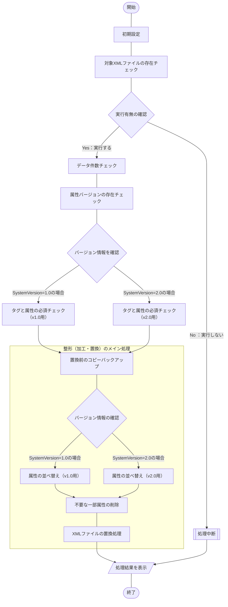

## 概要
[こちらの記事](https://haretokidoki-blog.com/pasocon_powershell-startup/)で文字だけを表示するスクリプトを使い、
PowerShellのはじめ方を紹介しましたが、より実践に近いサンプルコード（サンプルプログラム）を作成しました。

今回作成したPowerShellスクリプトはXMLファイルを読み込み、一部タグの属性の並べ替えや文字列置換など、
整形するという内容です。

PowerShellの始め方（スタートアップ）としても、ご参考頂ければと思います。
https://haretokidoki-blog.com/pasocon_powershell-startup/
## この記事のターゲット
- PowerShellユーザーの方
- PowerShellでXMLファイルを整形（加工）したい方
- 初心者でPowerShellスクリプト作成の参考にしたい方
## サンプルプログラムの紹介
サンプルプログラムのシナリオは、とあるシステムからアウトプットされた既定のXMLファイルを整形するという、シナリオを想定したツール。
なお、サンプルプログラムではXMLファイルを出力するシステムが2つある前提の作りとなっていて、各々の必須チェックの方法が異なっている。（詳細なチェック方法は後述）
### サンプルプログラム
https://github.com/akiGAMEBOY/PowerShell_ShapingXMLfileTool

### 仕様
プログラム起動用：batファイルとプログラムの本体：ps1ファイル、個別の設定ファイル：setup.iniファイル、
の3つで構成されたプログラム。

なお、対象のXMLファイル名については、設定ファイルにより変更可能とする。
#### フローチャート
##### 処理全体
##### プログラム本体
ファイル名：Main.ps1

#### 画面仕様
バッチファイル（batファイル）を使いPowerShellスクリプトを実行する。
このPowerShellでは[.NET Frameworkのフォーム](https://learn.microsoft.com/ja-jp/powershell/scripting/samples/creating-a-custom-input-box?view=powershell-7.3)（以下、dotNETフォームと称する）を呼び出して使用しており、
dotNETフォームを使ったポップアップウィンドウで操作する。
他にコマンドプロンプトでは確認画面で一時停止している処理を「Enterキー」で続行する操作方法がある。
https://learn.microsoft.com/ja-jp/powershell/scripting/samples/creating-a-custom-input-box?view=powershell-7.3
#### 機能仕様
1. 初期設定
    - 設定ファイル読み込み
        - 対象XMLファイル名
1. 対象XMLファイルの存在チェック
    設定ファイルより取得した対象のXMLファイル名がバッチの起動場所と同じ階層にあるかチェックする。
    ない場合は、処理中断。
1. データ件数チェック
    XMLファイル内のデータをチェックする。
    空ファイルであれば、処理中断。
1. タグと属性の必須チェック
    属性バージョンの存在チェックを確認して存在する場合は、バージョンにより下記内容の必須項目をチェック。
    存在しない場合は、処理中断。

    - v1.0用

        | 属性名 | 表記 | 必須 | 並び順 |
        | ---- | ---- | ---- | ---- |
        | システムバージョン | SystemVersion="1.0" | 〇 | 1 |
        | 注文番号 | PurchaseOrderNumber="XXXX" | 〇 | 2 |
        | 注文日 | OrderDate="XXXX-XX-XX" | 〇 | 3 |
        | 備考 | Ramarks="XXXX" | 〇 | 4 |

    - v2.0用

        | 属性名 | 表記 | 必須 | 並び順 |
        | ---- | ---- | ---- | ---- |
        | システムバージョン | SystemVersion="2.0" | 〇 | 1 |
        | 注文番号 | PurchaseOrderNumber="XXXX" | 〇 | 2 |
        | 注文日 | OrderDate="XXXX-XX-XX" | 〇 | 3 |
        | 作成日 | CreateDate="XXXX-XX-XX" | × | 4 |
        | 備考 | Ramarks="XXXX" | 〇 | 5 |

1. 置換前のコピーバックアップ
    対象XMLファイルを置換する前にコピーバックアップを取得。取得場所は対象XMLファイルと同じ場所。
1. 属性の並べ替え
    バージョン情報を確認した後、バージョンにより下記内容で並べ替えを実行。
    - v1.0用

        | 属性名 | 表記 | 必須 | 並び順 |
        | ---- | ---- | ---- | ---- |
        | システムバージョン | SystemVersion="1.0" | 〇 | 1 |
        | 注文番号 | PurchaseOrderNumber="XXXX" | 〇 | 2 |
        | 注文日 | OrderDate="XXXX-XX-XX" | 〇 | 3 |
        | 備考 | Ramarks="XXXX" | 〇 | 4 |

    - v2.0用

        | 属性名 | 表記 | 必須 | 並び順 |
        | ---- | ---- | ---- | ---- |
        | システムバージョン | SystemVersion="2.0" | 〇 | 1 |
        | 注文番号 | PurchaseOrderNumber="XXXX" | 〇 | 2 |
        | 注文日 | OrderDate="XXXX-XX-XX" | 〇 | 3 |
        | 作成日 | CreateDate="XXXX-XX-XX" | × | 4 |
        | 備考 | Ramarks="XXXX" | 〇 | 5 |

1. 不要な一部属性の削除
    属性「備考（Remarks="XXXX"）」を削除する。
1. XMLファイルの置換処理
    上記、6の「属性の並べ替え」と7の「不要な一部属性の削除」の内容でXMLファイルを保存する。

#### 入出力ファイル
##### 入力ファイル
- XMLファイル

https://github.com/akiGAMEBOY/PowerShell_ShapingXMLfileTool/blob/master/source/powershell/setup.ini#L7-L8
##### 出力ファイル
- XMLファイル

https://github.com/akiGAMEBOY/PowerShell_ShapingXMLfileTool/blob/master/source/powershell/setup.ini#L7-L8
- XMLバックアップファイル
    整形前に対象XMLファイルをコピーする。コピー先は同じ階層にファイル名を変更[^1]し出力する。
    [^1]: サンプルプログラムでは、「PurchaseOrder.xml_bk`yyyyMMdd-HHmmss`」です。`yyyyMMdd-HHmmss`は実行時の年月日時分秒が反映されます。
### GitHub Repository
https://github.com/akiGAMEBOY/PowerShell_ShapingXMLfileTool
#### フォルダ構成
```
PowerShell_ShapingXMLfileTool
│  LICENSE.md
│  README.md
│  ShapingXMLfileTool.bat       ・・・起動用バッチファイル
│  PurchaseOrder.xml            ・・・対象XMLファイル（v1.0）
│
├─sample-data                   ・・・テスト用のXMLサンプルファイル
│      PurchaseOrderv1.0.xml
│      PurchaseOrderv2.0.xml
│
└─source
    ├─icon                      ・・・アイコンデータ
    │      shell32-296.ico
    │
    └─powershell
            Main.ps1            ・・・プログラム本体
            setup.ini           ・・・設定ファイル
```
### 参考記事
#### 流用したサンプルプログラム
https://zenn.dev/haretokidoki/articles/d93f7608754bff
#### プログラム作成時に参考にした記事
- dotNETフォームでYesNoポップアップウィンドウの作成方法
    http://kamifuji.dyndns.org/PS-Support/Form02/index.html
- DLLファイルやEXEファイルからアイコンを抽出する方法
    https://www.vwnet.jp/windows/PowerShell/2017122001/ExtractionIcon.htm
- Windows 10 標準アイコンのDLLファイルの保管（格納）場所
    https://4thsight.xyz/13325
- 正規表現による様々な文字列のカウント方法（未使用）
    http://excel.wp.xdomain.jp/?p=149
- 改行コード、CRLFをLFへ置換する方法
    https://teratail.com/questions/347291?link=qa_related_sp
- PowerShellでの様々な正規表現のパターン1
    https://qiita.com/acuo/items/a4f83d886c4b8a7fcf52
- PowerShellでの様々な正規表現のパターン2
    https://atmarkit.itmedia.co.jp/ait/articles/1702/08/news023.html
- 改行を含む文字列の置換方法
    https://teratail.com/questions/97931
- 正規表現で複数行の文字列をヒットさせる方法
    https://tagook.blogspot.com/2019/05/blog-post_7.html
    https://ja.stackoverflow.com/questions/69567/正規表現の-s-s-について
- 2つのテキストファイルをPowerShellでDiffを取る方法
    https://qiita.com/Kosen-amai/items/d97a16fa6f5e880b1432
- PowerShellのfunctionの戻り値制御は特殊
    想定する戻り値はSystem.Int32だったが、System.Object[]で返ってきた。この記事で原因がわかった。
    https://trend-desk.com/archives/876
- 文字列のダブルクォート内に配列の変数を入れこむ方法
    https://blog.radler.jp/2016/08/19/powercli-ダブルクォート内での配列型の変数の展開/
