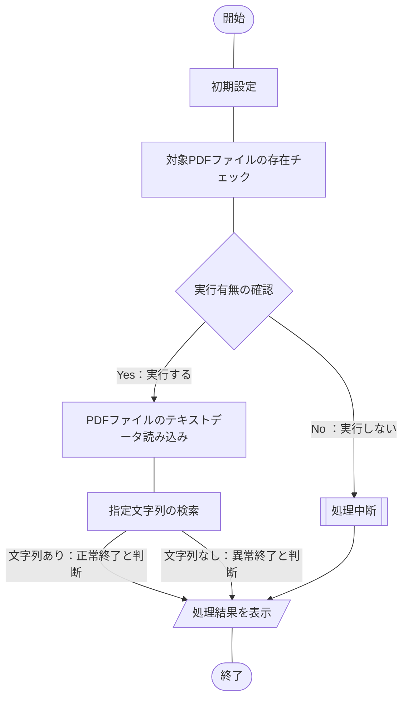

:::message
**注意事項**

この記事ではライセンスにも触れていますが、私はライセンスの専門家ではありません。

以降の内容は正確な情報を発信しようと可能な限り努力していますが、
個人な調査による為、誤った情報が含まれている可能性があります。

**ライセンスの部分は、あくまでも参考情報**として見て頂き、ご自身で調べてた上で、
ご活用頂ければと思います。

もし、読者の中で有識者の方がおられ、この記事の内容に誤りがある場合、
コメント等でやさしく、ご指摘いただけると助かります。
:::
:::message alert
**ライセンス関連で取り扱い注意**

この記事で紹介している内容は、AGPL[^1]のライセンスの[iTextSharp](https://github.com/itext/itextsharp)ライブラリを使用しています。
それにともない作成したサンプルプログラムのライセンスもAGPLで設定しています。

このライブラリを使用するプログラム[^2]を**商用利用する場合**、[iText](https://itextpdf.com/)と**有償契約が必要**となるプログラムです。
ライセンスの詳細は[こちら](https://github.com/itext/itextsharp/blob/develop/LICENSE.md)をご参照ください。
:::
[^1]: GNU Affero General Public License v3.0の略。
[^2]: この記事で紹介しているサンプルプログラム。

## 概要
[こちらの記事](https://haretokidoki-blog.com/pasocon_powershell-startup/)で文字だけを表示するスクリプトを使い、
PowerShellのはじめ方を紹介しましたが、より実践に近いサンプルプログラムを作成しました。

今回作成したPowerShellスクリプトは**テキストが埋め込まれている**PDFファイルを読み込み[^3]、あらかじめ設定した検索文字列により処理結果の正常／異常を判定するするという内容です。
[^3]: テキストが埋め込まれていない画像データのみのPDFファイルである場合、中身は読み取れず機能しません。

PowerShellの始め方（スタートアップ）としても、ご参考頂ければと思います。
https://haretokidoki-blog.com/pasocon_powershell-startup/
## ターゲット
- PowerShellユーザーの方
- PowerShellでPDFファイル内の文字列を検索し判定したい方
- 初心者でPowerShellスクリプト作成の参考にしたい方
## サンプルプログラムの紹介
サンプルプログラムのシナリオは、とあるプログラムからアウトプットされたPDFファイルを対象に文字列を検索、文字列の有無により処理結果が正常終了したか／異常終了したかを判定するという、シナリオを想定したツール。
### サンプルプログラム
https://github.com/akiGAMEBOY/PowerShell_SearchForPdffileStrings

### 仕様
プログラム起動用：batファイルとプログラムの本体：ps1ファイル、個別の設定ファイル：setup.iniファイル、
の3つで構成されたプログラム。

なお、対象のPDFファイル名や検索文字列については、設定ファイルにより変更可能とする。
#### フローチャート
##### 処理全体
##### プログラム本体
ファイル名：Main.ps1

#### 画面仕様
バッチファイル（batファイル）を使いPowerShellスクリプトを実行する。
このPowerShellでは[.NET Frameworkのフォーム](https://learn.microsoft.com/ja-jp/powershell/scripting/samples/creating-a-custom-input-box?view=powershell-7.3)（以下、dotNETフォームと称する）を呼び出して使用しており、
dotNETフォームを使ったポップアップウィンドウで操作する。
他にコマンドプロンプトでは確認画面で一時停止している処理を「Enterキー」で続行する操作方法がある。
https://learn.microsoft.com/ja-jp/powershell/scripting/samples/creating-a-custom-input-box?view=powershell-7.3
#### 機能仕様
1. 初期設定
    - 設定ファイル読み込み
        - 対象PDFファイル名
        - 対象検索文字列
2. 対象PDFファイルの存在チェック
    設定ファイルより取得した対象のPDFファイル名がバッチの起動場所と同じ階層にあるかチェックする。
    ない場合は、処理中断。
3. 指定文字列の検索
    設定ファイルより取得した対象検索文字列の有無をチェックする。
    ない場合は、異常終了と判断。

#### 入出力ファイル
##### 入力ファイル
- XMLファイル

https://github.com/akiGAMEBOY/PowerShell_SearchPdffileStrings/blob/master/source/powershell/setup.ini#L7-L8
##### 出力ファイル
なし
### GitHub
https://github.com/akiGAMEBOY/PowerShell_SearchForPdffileStrings
#### フォルダ構成
```
PowerShell_SearchForPdffileStrings
│  LICENSE
│  README.md
│  SearchForPdffileStrings.bat          ・・・起動用バッチファイル
│  ProcessingResult.pdf                 ・・・対象PDFファイル（Success）
│
├─sample-data                           ・・・テスト用のPDFサンプルファイル
│      ProcessingResult_Failure.docx
│      ProcessingResult_Failure.pdf
│      ProcessingResult_Success.docx
│      ProcessingResult_Success.pdf
│
└─source
    ├─icon                              ・・・アイコンデータ
    │      shell32-296.ico
    │
    ├─lib                               ・・・ライブラリ（iTextSharp 5.5.13のDLL）
    │      itextsharp.dll
    │
    ├─powershell
    │      Main.ps1                     ・・・プログラム本体
    │      setup.ini                    ・・・設定ファイル
    │
    └─tmp                               ・・・PDFファイル内テキストデータの一時書き出し用
            pdf_textdata.txt
```
### 参考記事
#### 各iTestSharpのバージョンをテストしてみた結果
| iTextSharpバージョン | 動作有無 | 備考 |
| ---- | ---- |
| 5.5.10 | ○ |  |
| 5.5.11 | ○ |  |
| 5.5.12 | ○ |  |
| 5.5.13 | ○ | このサンプルプログラムで使用 |
| 5.5.13.1 | ○ |  |
| 5.5.13.2 | × | 原因不明だが動作しなかった。不具合？ |
| 5.5.13.3 | × | 原因不明だが動作しなかった。不具合？ |

#### 流用したサンプルプログラム
https://zenn.dev/haretokidoki/articles/a77765dd56f202
#### プログラム作成時に参考にした記事
- テキスト埋め込みのあるPDFファイルをテキストファイルで出力する方法
    http://35huyu.seesaa.net/article/446050464.html

- iTextSharpの情報がまとまっているサイト
    https://codezine.jp/article/detail/462
    https://qiita.com/AWtnb/items/215f77d97b7ea069a06a

- iTextSharpのライセンス関連の記事
    https://nokoshitamono.blogspot.com/2015/09/gplagpl.html
    https://caddiary.com/?p=4426
    https://qiita.com/toshi71/items/bc05d6e15edd645c8f46

- OSSライセンスに関する記事
    https://www.tohoho-web.com/ex/license.html
    https://future-architect.github.io/articles/20200821/
    https://coliss.com/articles/build-websites/operation/work/choose-a-license-by-github.html

- GitHubでライセンスを追加する方法
    https://qiita.com/shibukk/items/67ad0a5eda5a94e5c032

- iTextSharp以外のPDFが編集可能なライブラリ「pdfsharp」（未検証）
    https://plaza.rakuten.co.jp/satocchia/diary/202110220000/?scid=we_blg_pc_lastctgy_3_title
    https://zenn.dev/awtnb/articles/e54718efcd1b5b#pdfsharp
