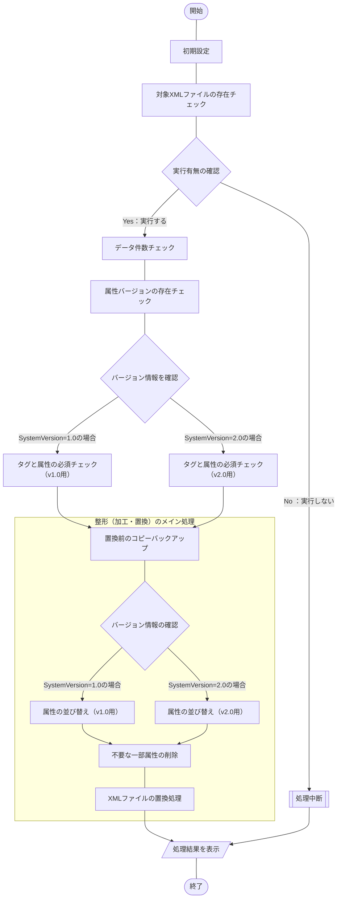

:::message
**注意事項**

この記事ではライセンスにも触れていますが、私はライセンスの専門家ではありません。

以降の内容は正確な情報を発信しようと可能な限り努力していますが、
個人な調査による為、誤った情報が含まれている可能性があります。

**ライセンスの部分は、あくまでも参考情報**として見て頂き、ご自身で調べてた上で、
ご活用頂ければと思います。

もし、読者の中で有識者の方がおられ、この記事の内容に誤りがある場合、
コメント等でやさしく、ご指摘いただけると助かります。
:::
:::message alert
**ライセンス関連で取り扱い注意**

この記事で紹介している内容は、AGPL[^1]のライセンスの[iTextSharp](https://github.com/itext/itextsharp)ライブラリを使用しています。
このライブラリを使用するプログラムを**商用利用する場合**、[iText](https://itextpdf.com/)と**有償契約が必要**となるプログラムです。
ライセンスの詳細は[こちら](https://github.com/itext/itextsharp/blob/develop/LICENSE.md)をご参照ください。
:::
[^1]: GNU Affero General Public License v3.0の略

## 概要
[こちらの記事](https://haretokidoki-blog.com/pasocon_powershell-startup/)で文字だけを表示するスクリプトを使い、
PowerShellのはじめ方を紹介しましたが、より実践に近いサンプルプログラムを作成しました。

今回作成したPowerShellスクリプトは**テキストが埋め込まれている**PDFファイルを読み込み[^2]、あらかじめ設定した検索文字列により処理結果の正常／異常を判定するするという内容です。
[^2]: テキストが埋め込まれていない画像データのみのPDFファイルである場合、このプログラムは機能しません。

PowerShellの始め方（スタートアップ）としても、ご参考頂ければと思います。
https://haretokidoki-blog.com/pasocon_powershell-startup/
## ターゲット
- PowerShellユーザーの方
- PowerShellでPDFファイル内の文字列を検索し判定したい方
- 初心者でPowerShellスクリプト作成の参考にしたい方
## サンプルプログラムの紹介
サンプルプログラムのシナリオは、とあるプログラムからアウトプットされたPDFファイルを対象に文字列を検索し、その結果により処理結果が正常終了したか／異常終了したかを判定するという、シナリオを想定したツール。
### サンプルプログラム
https://github.com/akiGAMEBOY/PowerShell_SearchForPdffileStrings

### 仕様
プログラム起動用：batファイルとプログラムの本体：ps1ファイル、個別の設定ファイル：setup.iniファイル、
の3つで構成されたプログラム。

なお、対象のPDFファイル名や検索文字列については、設定ファイルにより変更可能とする。
#### フローチャート
##### 処理全体
##### プログラム本体
ファイル名：Main.ps1

#### 画面仕様
バッチファイル（batファイル）を使いPowerShellスクリプトを実行する。
このPowerShellでは[.NET Frameworkのフォーム](https://learn.microsoft.com/ja-jp/powershell/scripting/samples/creating-a-custom-input-box?view=powershell-7.3)（以下、dotNETフォームと称する）を呼び出して使用しており、
dotNETフォームを使ったポップアップウィンドウで操作する。
他にコマンドプロンプトでは確認画面で一時停止している処理を「Enterキー」で続行する操作方法がある。
https://learn.microsoft.com/ja-jp/powershell/scripting/samples/creating-a-custom-input-box?view=powershell-7.3
#### 機能仕様
1. 初期設定
    - 設定ファイル読み込み
        - 対象XMLファイル名
2. 対象XMLファイルの存在チェック
    設定ファイルより取得した対象のXMLファイル名がバッチの起動場所と同じ階層にあるかチェックする。
    ない場合は、処理中断。
3. データ件数チェック
    XMLファイル内のデータをチェックする。
    空ファイルであれば、処理中断。
4. タグと属性の必須チェック
    属性バージョンの存在チェックを確認して存在する場合は、バージョンにより下記内容の必須項目をチェック。
    存在しない場合は、処理中断。

    - v1.0用

        | 属性名 | 表記 | 必須 | 並び順 |
        | ---- | ---- | ---- | ---- |
        | システムバージョン | SystemVersion="1.0" | 〇 | 1 |
        | 注文番号 | PurchaseOrderNumber="XXXX" | 〇 | 2 |
        | 注文日 | OrderDate="XXXX-XX-XX" | 〇 | 3 |
        | 備考 | Ramarks="XXXX" | 〇 | 4 |

    - v2.0用

        | 属性名 | 表記 | 必須 | 並び順 |
        | ---- | ---- | ---- | ---- |
        | システムバージョン | SystemVersion="1.0" | 〇 | 1 |
        | 注文番号 | PurchaseOrderNumber="XXXX" | 〇 | 2 |
        | 注文日 | OrderDate="XXXX-XX-XX" | 〇 | 3 |
        | 作成日 | CreateDate="XXXX-XX-XX" | × | 4 |
        | 備考 | Ramarks="XXXX" | 〇 | 5 |

5. 置換前のコピーバックアップ
    対象XMLファイルを置換する前にコピーバックアップを取得。取得場所は対象XMLファイルと同じ場所。
6. 属性の並び替え
    バージョン情報を確認した後、バージョンにより下記内容で並び替えを実行。
    - v1.0用

        | 属性名 | 表記 | 必須 | 並び順 |
        | ---- | ---- | ---- | ---- |
        | システムバージョン | SystemVersion="1.0" | 〇 | 1 |
        | 注文番号 | PurchaseOrderNumber="XXXX" | 〇 | 2 |
        | 注文日 | OrderDate="XXXX-XX-XX" | 〇 | 3 |
        | 備考 | Ramarks="XXXX" | 〇 | 4 |

    - v2.0用

        | 属性名 | 表記 | 必須 | 並び順 |
        | ---- | ---- | ---- | ---- |
        | システムバージョン | SystemVersion="1.0" | 〇 | 1 |
        | 注文番号 | PurchaseOrderNumber="XXXX" | 〇 | 2 |
        | 注文日 | OrderDate="XXXX-XX-XX" | 〇 | 3 |
        | 作成日 | CreateDate="XXXX-XX-XX" | × | 4 |
        | 備考 | Ramarks="XXXX" | 〇 | 5 |

7. 不要な一部属性の削除
    属性「備考（Remarks="XXXX"）」を削除する。
8. XMLファイルの置換処理
    上記、6の「属性の並び替え」と7の「不要な一部属性の削除」の内容でXMLファイルを保存する。

#### 入出力ファイル
##### 入力ファイル
- XMLファイル

https://github.com/akiGAMEBOY/PowerShell_ShapingXMLfileTool/blob/master/source/powershell/setup.ini#L7-L8
##### 出力ファイル
- XMLファイル

https://github.com/akiGAMEBOY/PowerShell_ShapingXMLfileTool/blob/master/source/powershell/setup.ini#L7-L8
- XMLバックアップファイル
    整形前に対象XMLファイルをコピーする。コピー先は同じ階層にファイル名を変更[^1]し出力する。
    [^1]: サンプルプログラムでは、「PurchaseOrder.xml_bk`yyyyMMdd-HHmmss`」です。`yyyyMMdd-HHmmss`は実行時の年月日時分秒が反映されます。
### GitHub
https://github.com/akiGAMEBOY/PowerShell_SearchForPdffileStrings
#### フォルダ構成
```
PowerShell_ShapingXMLfileTool
│  LICENSE.md
│  README.md
│  ShapingXMLfileTool.bat       ・・・起動用バッチファイル
│  PurchaseOrder.xml            ・・・対象XMLファイル（v1.0）
│
├─sample-data                   ・・・テスト用のXMLサンプルファイル
│      PurchaseOrderv1.0.xml
│      PurchaseOrderv2.0.xml
│
└─source
    ├─icon                      ・・・アイコンデータ
    │      shell32-296.ico
    │
    └─powershell
            Main.ps1            ・・・プログラム本体
            setup.ini           ・・・設定ファイル
```
### 参考記事
#### 流用したサンプルプログラム
https://zenn.dev/haretokidoki/articles/a77765dd56f202
#### プログラム作成時に参考にした記事
- テキストベースのPDFファイルから文字列をPowerShellで取得する方法
    http://35huyu.seesaa.net/article/446050464.html

- iTextSharpがまとまっているところについて
    https://codezine.jp/article/detail/462　
    https://qiita.com/AWtnb/items/215f77d97b7ea069a06a

- 終わったことを知らせる為にBEEP音を鳴らす
    https://qiita.com/mima_ita/items/ac33542ae3f2fb5c8778

- iTextSharpのライセンスについて
    https://nokoshitamono.blogspot.com/2015/09/gplagpl.html
    https://caddiary.com/?p=4426
    https://qiita.com/toshi71/items/bc05d6e15edd645c8f46
    https://www.tohoho-web.com/ex/license.html
    https://future-architect.github.io/articles/20200821/

- GitHub ライセンス追加
    https://coliss.com/articles/build-websites/operation/work/choose-a-license-by-github.html


- 他のPDF編集ツール「pdfsharp」
    https://plaza.rakuten.co.jp/satocchia/diary/202110220000/?scid=we_blg_pc_lastctgy_3_title
    https://zenn.dev/awtnb/articles/e54718efcd1b5b#pdfsharp
