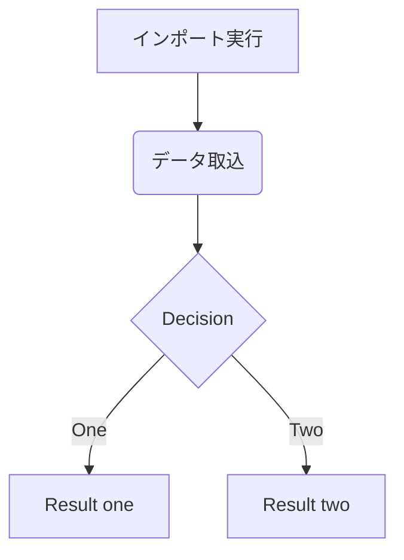
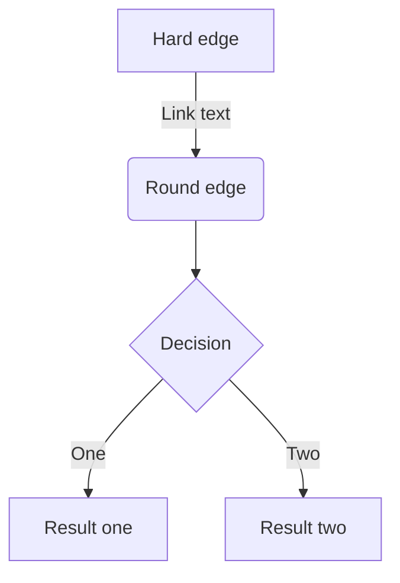

## 概要
[こちらの記事](https://zenn.dev/haretokidoki/articles/8bde585e299549)で紹介した自作モジュールを使用して、
実際にExcel VBA（xlsmファイル）でサンプルプログラムを作成してみましたので紹介します。

特に初心者の方は個々の情報はインターネットで収集できるものの集約方法がわからないという、
悩みをお持ちかと思います。
（私が初心者の時はそうでした。）

自作モジュールの使い方やExcel VBAツールのはじめ方として、ご参考ください。

https://zenn.dev/haretokidoki/articles/8bde585e299549

## ターゲット
- Excel VBAユーザーの方
- 初心者の方（モジュールの使い方が分からない方）
## サンプルプログラムの紹介
:::message
**注意事項**
- **参照渡し(ByRef)と値渡し(ByVal)**
Excel VBAを作成する際は簡易なツールのみ作成しており、可読性を優先し引数の属性を省略しています。
省略している為、すべての引数は参照渡しとなっていますが、プロシージャ側で引数の値は変更していません。
:::
### 仕様
Excel VBA(xlsmファイル)でデータの加工と出力（整形）を行う。

画面操作はフォームではなくExcelシート上に配置したセルやボタンにより実行する。
入力ファイルはCSVファイルで一時的にExcelシート（非表示シート）に取り込む。
データ整形は取り込んだExcelシートを元に処理しExcelシート（非表示シート）に出力。
出力ファイルは整形後のExcelシートを元に処理しExcelファイルを出力。

#### 画面仕様
#### 機能仕様
#### 入出力ファイル
##### 入力ファイル
6種類のCSVファイル形式
##### 出力ファイル
#### 外部連携
1. **ariawase**
2. **GitHub**
### 説明

### GitHub
### 参考記事
1. Excel VBA + vbac(ariawase) + VS Code
https://zenn.dev/haretokidoki/scraps/e545be2947c43c
2. GitHubへのアップロード構成
https://blog.ue-y.me/vba2021/
