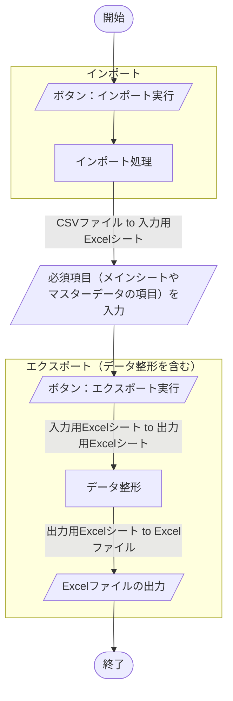

## 概要
[こちらの記事](https://zenn.dev/haretokidoki/articles/8bde585e299549)で紹介した自作モジュールを使用して、
Excel VBA（xlsmファイル）のサンプルプログラム（サンプルコード）を作成してみました。
作成したプログラムの機能は大きく分けてCSVファイルを取り込み、整形（加工）、Excelファイルを出力するという
3点の機能があるプログラムです。

初心者の方は「インターネットで個々の情報は収集できるが、その情報を集約し実装する方法がわからない」という、
悩みをお持ちの方がいると思います。
（私が初心者の時は、そのような悩みを持っていました。）

データ整形ツールとしての参考情報だけでなく、私個人で作成してみた[自作モジュール](https://zenn.dev/haretokidoki/articles/8bde585e299549)の使い方や、
Excel VBAの始め方（スタートアップ）としても、ご参考いただければと思います。
https://zenn.dev/haretokidoki/articles/8bde585e299549
## この記事のターゲット
- Excel VBAユーザーの方
- Excel VBAでデータ整形ツールを作成したい方
- 初心者の方（モジュールの使い方が分からない方）
## サンプルプログラムの紹介
サンプルプログラムのシナリオはゲームのソフトもしくはハードの情報があるCSVファイルをツールに取り込み、
あらかじめ定めた出力形式のExcelファイルを出力するという想定のツール。
なお、ツール取り込み時に入力データの販売元と開発元を元に自動でマスターデータ（集計表）を作成する。
マスターデータでは販売元・開発元ごとにスター情報（評価）を記入できるようになっており、
エクスポートでは値が参照され最終アウトプットのExcelファイルに反映される仕組みとなっている。
https://github.com/akiGAMEBOY/ExcelVBA_csv-to-excel
### 仕様
Excel VBA(xlsmファイル)でデータの加工と出力（整形）を行う。

画面はユーザフォームではなくExcelシートを直接操作する。
Excelシート上のセルにある入力欄や直接配置されたボタンを操作する事でツールを実行する。

入力ファイルはCSVファイル。
インポート実行時はCSVファイルのデータを一時的に入力用Excelシート（非表示シート）に取り込む。

エクスポート実行時はデータ整形とファイルの出力を行う。
データ整形では、入力用Excelシートとマスターデータを元に加工し出力用Excelシート（非表示シート）に出力する。
ファイルの出力では、加工後の出力用のExcelシートを元にExcelファイルを出力する動きとなる。

#### 画面仕様
##### 画面構成
7種類のExcelシートで構成。
1. シート「設定情報」
変化点の情報を外だししたシート。
　
ツールの根幹（基本的な仕様）は変わらず一部内容（入出力ファイルの構成など）のみが変化する場合、
ツールを流用しやすくする為、変化点の情報を外だししている。
1. シート「改版履歴」
改版履歴。
1. シート「メイン」
ユーザーが操作するメインのシート。
　
入出力データの参照先やボタンが配置されている。
1. シート「エラー情報」
ツールで発生したエラー情報が自動的に蓄積されるシート。
　
エラーが発生した際、エラーメッセージがポップアップで表示されるが、ポップアップ表示のみだと、
ユーザーが見落としてしまう可能性があり、ツール管理者に正確な情報が伝わる事を目的に作成。
1. シート「Master_Star」※マスターデータ
マスターデータがあるシート。
　
インポート実行時、自動的にマスターデータ（集計表）が作成される。
マスターデータの作成では、入力データの項目「販売元・開発元」がキーとなり集計され、
集計キー毎に入力項目「スター情報（評価）」も自動的に作成される。
「スター情報（評価）」はエクスポート実行での必須項目となる為、実行前に入力する必要がある。
1. シート「入力用Excelシート」※非表示シート
インポート実行時に入力データを一時的に取り込む用のシート。
　
このツールを流用する場合は、入力ファイルのファイル数や構成の違いなどにより修正が必要となる。
1. シート「出力用Excelシート」※非表示シート
エクスポート実行時にデータ整形やファイルの出力の際に使用する出力用のExcelシート。
　
このツールを流用する場合は、データ整形の方法や出力ファイルの構成の違いなどにより修正が必要となる。
#### 機能仕様
1. インポート
指定したフォルダ内のファイル名を検索。
対象のファイル名がある場合に入力データとしてツールに取り込む。
1. マスターデータ ※手入力する項目あり
入力データ以外の情報（スター情報）を補完する事を目的とした表。
インポート実行時、項目「販売元・開発元」をキーとし自動的に表が作成される。
エクスポート実行時、表の必須項目「スター情報」に入力された値を参照し最終アウトプットに反映される。
1. データ整形とエクスポート
入力データとメイン画面、マスターデータの情報を元にデータ整形とファイルが出力される。
    - 入力データ
        | DATAID | MODEL | NAME | DISTRIBUTOR | DEVELOPER | RELEASE |
        | ---- | ---- | ---- | ---- | ---- | ---- |
        | 入力1 | 入力2 | 入力3 | 入力4 | 入力5 | 入力6 |
        | 出力する | 出力する | 出力する | 出力する | 出力する | 出力する |
    - メイン画面（入力項目）
        | 作業者名 | データ種別 |
        | ---- | ---- |
        | メイン1 | メイン2 |
        | 出力する | 出力する |
    - マスターデータ（Master_Star）
        | DataID | Distributor | Developer | Star |
        | ---- | ---- | ---- | ---- |
        | マスター1 | マスター2 | マスター3 | マスター4 |
        | 出力しない | 出力しない | 出力しない | 出力する |
    - 出力データ
    入力データもしくはメイン画面、マスターデータの情報より「PS1～PS6」のデータを整形。
    データ整形後、1つのExcelファイルに6つのシート構成（Out_PS1～Out_PS6）でファイルを出力。
        | Data Id | Operator | Datatype | Distributor | Developer | Star | Comment | Release date | Name |
        | ---- | ---- | ---- | ---- | ---- | ---- | ---- | ---- | ---- |
        | 入力1 | メイン1 | メイン2 | 入力4 | 入力5 | マスター4 | "空文字" | 入力6 | 入力3 |
#### 入出力ファイル
##### 入力ファイル
6種類のCSVファイルを想定。
項目は「DATAID, MODEL, NAME, DISTRIBUTOR, DEVELOPER, RELEASE」の6個で構成。
1. 入力情報 PS1
ファイル名が「_PS1」を含むCSVファイルを取り込む
1. 入力情報 PS2
ファイル名が「_PS2」を含むCSVファイルを取り込む
1. 入力情報 PS3
ファイル名が「_PS3」を含むCSVファイルを取り込む
1. 入力情報 PS4
ファイル名が「_PS4」を含むCSVファイルを取り込む
1. 入力情報 PS5
ファイル名が「_PS5」を含むCSVファイルを取り込む
1. 入力情報 PS6
ファイル名が「_PS6」を含むCSVファイルを取り込む
##### マスターデータ
1. スター情報のマスター（Master_Star）
入力データの項目「Distributor（販売元）、Developer（開発元）」を元に自動的に集計される表。
集計表の項目は「DataID, Distributor, Developer, Star」で構成。
項目「Star」は集計表が作成された直後は未記入の状態。エクスポート実行前に入力するべき必須項目。
##### 出力ファイル
Excel 1ファイル内、6個のシートで構成された出力ファイル。
項目は「Data Id, Operator, Datatype, Distributor, Developer, Star, Comment, Release date, Name」の9個で構成。
1. 出力情報 PS1（Out_PS1）
入力情報 PS1とマスターデータを元に整形したデータ
1. 出力情報 PS2（Out_PS2）
入力情報 PS2とマスターデータを元に整形したデータ
1. 出力情報 PS3（Out_PS3）
入力情報 PS2とマスターデータを元に整形したデータ
1. 出力情報 PS4（Out_PS4）
入力情報 PS4とマスターデータを元に整形したデータ
1. 出力情報 PS5（Out_PS5）
入力情報 PS5とマスターデータを元に整形したデータ
1. 出力情報 PS6（Out_PS6）
入力情報 PS6とマスターデータを元に整形したデータ
### GitHub Repository
https://github.com/akiGAMEBOY/ExcelVBA_csv-to-excel
#### フォルダ構成
```:ExcelVBA_csv-to-excelフォルダ内
ExcelVBA_csv-to-excel
│
│  LICENSE.md
│  README.md
│  vbac.wsf                                         ・・・ソース管理支援ツール（ariawase）
│  vbac_Export.bat                                  ・・・xlsmファイル to テキストファイル（dcm or bas ...）
│  vbac_Import.bat                                  ・・・テキストファイル to xlsmファイル
│
├─bin
│  │  ExcelVBA_csv-to-excel.xlsm                    ・・・ツール本体
│  │
│  └─sample_ルートフォルダ_ExcelVBA_csv-to-excel    ・・・サンプルの入力データ
│          DATA0001_PS1.csv
│          DATA0001_PS2.csv
│          DATA0001_PS3.csv
│          DATA0001_PS4.csv
│          DATA0001_PS5.csv
│          DATA0001_PS6.csv
│
└─src
    └─ExcelVBA_csv-to-excel.xlsm                    ・・・テキストファイル群（vbac_Export.batの結果）
            mdlCommon.bas                           ・・・自作モジュール
            Sheet1.dcm                              ・・・設定情報の処理（初期化ボタン）
            Sheet3.dcm                              ・・・メインの処理（データ整形）
```
### 参考記事
- Excel VBA + ソース管理支援ツール(ariawase：vbac) + VS Code
    https://zenn.dev/haretokidoki/scraps/e545be2947c43c
- GitHubへのアップロード構成
    https://blog.ue-y.me/vba2021/
