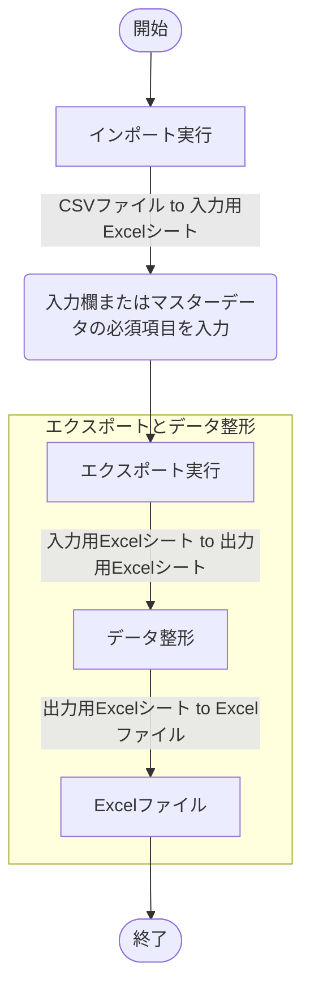

## 概要
[こちらの記事](https://zenn.dev/haretokidoki/articles/8bde585e299549)で紹介した自作モジュールを使用して、
実際にExcel VBA（xlsmファイル）でサンプルプログラムを作成してみましたので紹介します。

作成したプログラムはCSVファイルを取り込み、加工、Excelファイルを出力するデータを整形する
プログラムです。

特に初心者の方は個々の情報はインターネットで収集できるものの、集約方法がわからないという悩みをお持ちかと思います。
（私が初心者の時はそうでした。）

自作モジュールの使い方やExcel VBAツールのはじめ方としても、ご参考ください。

https://zenn.dev/haretokidoki/articles/8bde585e299549

## ターゲット
- Excel VBAユーザーの方
- Excel VBAでデータ整形ツールを作成したい方
- 初心者の方（モジュールの使い方が分からない方）
## サンプルプログラムの紹介
:::message
**注意事項**
- **参照渡し(ByRef)と値渡し(ByVal)**
Excel VBAを作成する際は簡易なツールのみ作成しており、可読性を優先し引数の属性を省略しています。
省略している為、すべての引数は参照渡しとなっていますが、プロシージャ側で引数の値は変更していません。
:::
### 仕様
Excel VBA(xlsmファイル)でデータの加工と出力（整形）を行う。

画面操作はフォームではなくExcelシート上に配置したセルやボタンにより実行する。
入力ファイルはCSVファイルで一時的に取込み用Excelシート（非表示シート）に取り込む。
データ整形は取り込んだExcelシートを元に処理し出力用のExcelシート（非表示シート）に出力。
出力ファイルは整形後の出力用のExcelシートを元に処理しExcelファイルを出力。

#### 画面仕様
##### 画面構成
7種類のExcelシートで構成。
1. シート「設定情報」
ツールの根幹の仕様は変わらず、一部内容（入出力ファイルの構成など）のみ変化する場合、
変化点の情報を予め外だしすることでツールを流用しやすくする。
2. シート「改版履歴」
言葉の通り、改版履歴。
3. シート「メイン」
ユーザーが操作するメインの画面。
入出力データの参照先の設定やボタンを配置。
4. シート「エラー情報」
エラーが発生した際、ポップアップ表示のみの場合に見落としてしまう可能性がある。
その為、エラー情報を蓄積する表を配置。
5. シート「マスターデータ」※必要あれば
入力データに加えて情報を手入力などで補完する必要がある場合に使用。
6. シート「入力用Excelシート」※非表示シート
インポート実行で入力データを取り込む用のExcelシート。
取り込むファイル数や構成の違いなどにより修正が必要。
7. シート「出力用Excelシート」※非表示シート
データ整形や出力する際に使用する整形・出力用のExcelシート
データ整形の内容や出力ファイルの構成の違いなどにより修正が必要。
#### 機能仕様
1. インポート
指定した入力データ（CSVファイル）をExcelに取り込む機能。
2. マスターデータ（手入力）
入力データを補完する必要がある場合、
インポート時に手入力用の表を作成しユーザーで入力させる。
3. エクスポート
入力データとマスターデータ（必要ある場合のみ）を元にデータ整形とファイルの出力を行う。
#### 入出力ファイル
##### 入力ファイル
6種類のCSVファイル形式。
項目は「DATAID, MODEL, NAME, DISTRIBUTOR, DEVELOPER, RELEASE」6個で構成。
1. 入力情報 PS1
ファイル名が「_PS1」を含むCSVファイルを取り込む
2. 入力情報 PS2
ファイル名が「_PS2」を含むCSVファイルを取り込む
3. 入力情報 PS3
ファイル名が「_PS3」を含むCSVファイルを取り込む
4. 入力情報 PS4
ファイル名が「_PS4」を含むCSVファイルを取り込む
5. 入力情報 PS5
ファイル名が「_PS5」を含むCSVファイルを取り込む
6. 入力情報 PS6
ファイル名が「_PS6」を含むCSVファイルを取り込む
##### マスターデータ
1. スター情報のマスター
タイトルのスター（評価）を入力
##### 出力ファイル
Excel 1ファイルにつき6種類のシートで構成。
項目は「Data Id, Operator, Datatype, Distributor, Developer, Star, Comment, Release date, Name」の9個で構成。
1. 出力情報 PS1
入力情報 PS1とマスターデータを元に整形したデータ
2. 出力情報 PS2
入力情報 PS2とマスターデータを元に整形したデータ
3. 出力情報 PS3
入力情報 PS2とマスターデータを元に整形したデータ
4. 出力情報 PS4
入力情報 PS4とマスターデータを元に整形したデータ
5. 出力情報 PS5
入力情報 PS5とマスターデータを元に整形したデータ
6. 出力情報 PS6
入力情報 PS6とマスターデータを元に整形したデータ
### GitHub
https://github.com/akiGAMEBOY/ExcelVBA_csv-to-excel
### 参考記事
1. Excel VBA + vbac(ariawase) + VS Code
https://zenn.dev/haretokidoki/scraps/e545be2947c43c
2. GitHubへのアップロード構成
https://blog.ue-y.me/vba2021/
