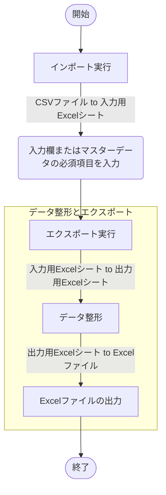

## 概要
[こちらの記事](https://zenn.dev/haretokidoki/articles/8bde585e299549)で紹介した自作モジュールを使用して、
Excel VBA（xlsmファイル）のサンプルプログラムを作成してみました。

作成したプログラムの機能は大きく分けてCSVファイルを取り込み、整形（加工）、Excelファイルを出力するという
3点の機能があるプログラムです。

特に初心者の方についてはインターネットで個々の情報は収集できると思いますが、
その後の集約して実装する方法がわからないという悩みがあると思っています。
（私はそのような悩みを持っていました。）

直近、Excel VBAプログラムを作成する機会があり、作成した自作モジュールの使い方や、
Excel VBAツールの始め方（スタートアップ）としても、ご参考頂ければと思います。

https://zenn.dev/haretokidoki/articles/8bde585e299549
## ターゲット
- Excel VBAユーザーの方
- Excel VBAでデータ整形ツールを作成したい方
- 初心者の方（モジュールの使い方が分からない方）
## サンプルプログラムの紹介
サンプルプログラムのシナリオはゲームのソフトもしくはハードの情報があるCSVファイルをツールに取り込み、
決められた出力形式のExcelファイルで出力するという内容を想定したツール。
なお、ツール取り込み時に入力データの販売元・開発元を元とした集計表（マスターデータ）を自動的に作成している。
集計表では販売元・開発元ごとに評価（スター情報）を入力しエクスポートを実行する事で最終アウトプットの
Excelファイルの項目に反映される仕組みとなる。
https://github.com/akiGAMEBOY/ExcelVBA_csv-to-excel
### 仕様
Excel VBA(xlsmファイル)でデータの加工と出力（整形）を行う。

画面はユーザフォームではなくExcelシートを直接操作する。
Excelシート上のセルにある入力欄や直接配置されたボタンを操作する事でツールを実行する。

入力ファイルはCSVファイルで一時的に入力用Excelシート（非表示シート）に取り込む。
データ整形は入力用Excelシートを元に加工し出力用Excelシート（非表示シート）に出力。
最終アウトプットは加工後の出力用のExcelシートを元に処理しExcelファイルを出力する動きとなる。

#### 画面仕様
##### 画面構成
7種類のExcelシートで構成。
1. シート「設定情報」
変化点の情報を外だししたシート。
ツールの根幹（基本的な仕様）は変わらず、一部内容（入出力ファイルの構成など）のみが変化する場合、
ツールを流用しやすくする為、変化点の情報を外だししている。
2. シート「改版履歴」
改版履歴。
3. シート「メイン」
ユーザーが操作するメインのシート。
入出力データの参照先やボタンが配置されている。
4. シート「エラー情報」
ツール実行で発生したエラー情報が自動的に蓄積されるシート。
エラーが発生した際、エラーのポップアップ表示のみだとユーザーが見落としてしまう可能性がある。
ユーザーからツール管理者にエラーの連絡がある際、適切かつ正確なエラー内容が伝わりやすくなるよう、
エラー情報の表を作成。
5. シート「Master_Star」※マスターデータ
マスターデータがあるシート。
インポート実行時、自動的に集計表が作成される。
また、エクスポート実行時はユーザーで入力した表の値が最終アウトプットに反映。
表は入力データの項目「販売元・開発元」をキーとしてインポート実行時、自動的に作成される。
エクスポート実行前に表の必須項目「スター情報」を入力する事で最終アウトプットのExcelファイルに反映される。
6. シート「入力用Excelシート」※非表示シート
インポート実行で入力データを取り込む用のシート。
流用する場合は、取り込むファイル数や構成の違いなどにより修正が必要。
7. シート「出力用Excelシート」※非表示シート
データ整形や出力する際に使用する整形・出力用のExcelシート
流用する場合は、データ整形の内容や出力ファイルの構成の違いなどにより修正が必要。
#### 機能仕様
1. インポート
指定したフォルダ内のファイル名を検索。
対象のファイル名がある場合に入力データとしてツールに取り込む機能。
2. マスターデータ ※手入力あり
入力データ以外の情報を補完する為の表。
インポート実行時、項目「販売元・開発元」をキーとし自動的に表が作成される。
エクスポート実行前に表の必須項目「スター情報」を入力する必要あり。
3. データ整形とエクスポート
入力データとメイン画面、マスターデータの情報を元にデータ整形とファイルが出力される。
- 入力データ

| DATAID | MODEL | NAME | DISTRIBUTOR | DEVELOPER | RELEASE |
| ---- | ---- | ---- | ---- | ---- | ---- |
| 入力1 | 入力2 | 入力3 | 入力4 | 入力5 | 入力6 |
| 出力する | 出力する | 出力する | 出力する | 出力する | 出力する |

- メイン画面（入力項目）

| 作業者名 | データ種別 |
| ---- | ---- |
| メイン1 | メイン2 |
| 出力する | 出力する |

- マスターデータ（Master_Star）

| DataID | Distributor | Developer | Star |
| ---- | ---- | ---- | ---- |
| マスター1 | マスター2 | マスター3 | マスター4 |
| 出力しない | 出力しない | 出力しない | 出力する |

- 出力データ
入力データもしくはメイン画面、マスターデータの情報より「PS1～PS6」のデータを整形。
データ整形後、1つのExcelファイルに6つのシート「Out_PS1～Out_PS6」の構成でファイルを出力。

| Data Id | Operator | Datatype | Distributor | Developer | Star | Comment | Release date | Name |
| ---- | ---- | ---- | ---- | ---- | ---- | ---- | ---- | ---- |
| 入力1 | メイン1 | メイン2 | 入力4 | 入力5 | マスター4 | "空文字" | 入力6 | 入力3 |
#### 入出力ファイル
##### 入力ファイル
6種類のCSVファイルを想定。
項目は「DATAID, MODEL, NAME, DISTRIBUTOR, DEVELOPER, RELEASE」の6個で構成。
1. 入力情報 PS1
ファイル名が「_PS1」を含むCSVファイルを取り込む
2. 入力情報 PS2
ファイル名が「_PS2」を含むCSVファイルを取り込む
3. 入力情報 PS3
ファイル名が「_PS3」を含むCSVファイルを取り込む
4. 入力情報 PS4
ファイル名が「_PS4」を含むCSVファイルを取り込む
5. 入力情報 PS5
ファイル名が「_PS5」を含むCSVファイルを取り込む
6. 入力情報 PS6
ファイル名が「_PS6」を含むCSVファイルを取り込む
##### マスターデータ
1. スター情報のマスター（Master_Star）
入力データの項目「Distributor（販売元）、Developer（開発元）」を元に自動的に集計される表。
集計表の項目は「DataID, Distributor, Developer, Star」で構成。
項目「Star」は集計表が作成された直後は未記入の状態。エクスポート実行前に入力するべき必須項目。
##### 出力ファイル
Excel 1ファイル内、6個のシートで構成された出力ファイル。
項目は「Data Id, Operator, Datatype, Distributor, Developer, Star, Comment, Release date, Name」の9個で構成。
1. 出力情報 PS1
入力情報 PS1とマスターデータを元に整形したデータ
2. 出力情報 PS2
入力情報 PS2とマスターデータを元に整形したデータ
3. 出力情報 PS3
入力情報 PS2とマスターデータを元に整形したデータ
4. 出力情報 PS4
入力情報 PS4とマスターデータを元に整形したデータ
5. 出力情報 PS5
入力情報 PS5とマスターデータを元に整形したデータ
6. 出力情報 PS6
入力情報 PS6とマスターデータを元に整形したデータ
### GitHub
https://github.com/akiGAMEBOY/ExcelVBA_csv-to-excel
#### フォルダ構成
```
ExcelVBA_csv-to-excel
│
│  LICENSE.md
│  README.md
│  vbac.wsf                                         ・・・ソース管理支援ツール（ariawase）
│  vbac_Export.bat                                  ・・・xlsmファイル to テキストファイル（dcm or bas ...）
│  vbac_Import.bat                                  ・・・テキストファイル to xlsmファイル
│
├─bin
│  │  ExcelVBA_csv-to-excel.xlsm                    ・・・ツール本体
│  │
│  └─sample_ルートフォルダ_ExcelVBA_csv-to-excel    ・・・サンプルの入力データ
│          DATA0001_PS1.csv
│          DATA0001_PS2.csv
│          DATA0001_PS3.csv
│          DATA0001_PS4.csv
│          DATA0001_PS5.csv
│          DATA0001_PS6.csv
│
└─src
    └─ExcelVBA_csv-to-excel.xlsm                    ・・・テキストファイル群（vbac_Export.batの結果）
            mdlCommon.bas                           ・・・自作モジュール
            Sheet1.dcm                              ・・・設定情報の処理（初期化ボタン）
            Sheet3.dcm                              ・・・メインの処理（データ整形）
```
### 参考記事
1. Excel VBA + ソース管理支援ツール(ariawase : vbac) + VS Code
https://zenn.dev/haretokidoki/scraps/e545be2947c43c
2. GitHubへのアップロード構成
https://blog.ue-y.me/vba2021/
