## 概要

PowerShellでイベントログを出力する場合、Write-EventLogコマンドレットで簡単に実現できましたが、
バージョン6.0のCore Editionから[「*-EventLog」関連のコマンドレットが削除](https://learn.microsoft.com/en-us/powershell/scripting/whats-new/differences-from-windows-powershell#-eventlog-cmdlets)されました。

その為、PowerShell 6.0以降では、`*-EventLog`関連のコマンドレットを実行できません。
そこで今回は、6.0以降のPowerShell Core環境下でもPowerShell 5.1環境のコマンドレットを実行する方法を調べました。

## この記事のターゲット

- PowerShell ユーザーの方
- PowerShell 6.0以降の環境で5.1のコマンドレットを実行したい方

## 環境

### Windows OS

Windows 10 Pro環境

```powershell:Get-WmiObjectコマンド
PS C:\Users\"ユーザー名"> Get-CimInstance CIM_OperatingSystem

SystemDirectory     Organization BuildNumber RegisteredUser SerialNumber            Version
---------------     ------------ ----------- -------------- ------------            -------
C:\WINDOWS\system32              19045       XXXXX          00000-00000-00000-AAAAA 10.0.19045
                                             ^^^^^          ^^^^^ ^^^^^ ^^^^^ ^^^^^
                                             ↑マスク       ↑マスク

PS C:\Users\"ユーザー名">
```

- 参考記事：PowerShell Core ではGet-WmiObjectからGet-CimInstanceに変更
    https://www.vwnet.jp/windows/PowerShell/2021061301/PowerShellCore6xWMI.htm

- 参考記事：Win32_OperatingSystem クラスは CIM_OperatingSystem に変更
    https://learn.microsoft.com/ja-jp/windows/win32/cimwin32prov/cim-operatingsystem

### PowerShell

#### 実行元：PowerShell 7.x

```PowerShell 7.x（pwsh）のバージョン
PS C:\Users\"ユーザー名"> $PSVersionTable

Name                           Value
----                           -----
PSVersion                      7.4.1
PSEdition                      Core
GitCommitId                    7.4.1
OS                             Microsoft Windows 10.0.19045
Platform                       Win32NT
PSCompatibleVersions           {1.0, 2.0, 3.0, 4.0…}
PSRemotingProtocolVersion      2.3
SerializationVersion           1.1.0.1
WSManStackVersion              3.0

PS C:\Users\"ユーザー名">
```

#### 実行先：PowerShell 5.x

```PowerShell 5.x（powershell）のバージョン
PS C:\Users\"ユーザー名"> $PSVersionTable

Name                           Value
----                           -----
PSVersion                      5.1.19041.4046
PSEdition                      Desktop
PSCompatibleVersions           {1.0, 2.0, 3.0, 4.0...}
BuildVersion                   10.0.19041.4046
CLRVersion                     4.0.30319.42000
WSManStackVersion              3.0
PSRemotingProtocolVersion      2.3
SerializationVersion           1.1.0.1


PS C:\Users\"ユーザー名">
```

## 対応方法

全体的な流れをシーケンス図に起こすと、下記のとおり。

```mermaid
sequenceDiagram
    autonumber
    actor user as 実行者
    participant pscore as PowerShell Core（6.0以降）環境
    participant ps51 as PowerShell 5.1 環境
    user ->>+ pscore: PowerShellウィンドウより5.1環境で動作するコマンドを実行
    pscore ->>+ ps51: 5.1環境で実行
    ps51 -->>- pscore: 5.1環境での実行結果を返す
    pscore -->>- user: PowerShellウィンドウに実行結果を表示
```



以降より下記3つの方法を記載。

- A\. powershellコマンドで実行
- B\. 一般権限の状態でコマンド実行時に管理者として実行
- C\. \.NET Frameworkで実行

### A\. powershellコマンドで実行

1. PowerShell Core ウィンドウを起動
    :::message
    **管理者としてPowerShell Core ウィンドウを起動したい場合**

    “ファイル名を指定して実行”の起動後、最後のEnterキーを「 `Ctrl ＋ Shift ＋ Enter` 」とすると対応可能。
    :::
    「 ⊞Windowsキー ＋ R 」で“ファイル名を指定して実行”を起動し「 `pwsh` 」と入力しEnter。

1. 実行するコマンドを変数に代入
    5.1環境のみ動作する`Get-EventLog`コマンドレットを記述。

    ```powershell:コピー用
    [System.String]$command_text = @"
    Get-Date
    Get-EventLog -LogName 'Application' -EntryType Information -Source 'System Restore'
    "@
    ```

1. powershellコマンドにより5.1環境でコマンドを実行

    ```powershell:コピー用
    powershell -Command $command_text
    ```

:::details 実際に実行した結果

```powershell:実際に実行した結果
PS C:\Users\"ユーザー名"> [System.String]$command_text = @"
>> Get-Date
>> Get-EventLog -LogName 'Application' -EntryType Information -Source 'System Restore'
>> "@
PS C:\Users\"ユーザー名">
PS C:\Users\"ユーザー名"> powershell -Command $command_text

2024年3月7日 10:35:57

MachineName        : "コンピューター名"
Data               : {0, 0, 0, 0...}
Index              : 182058
Category           : (0)
CategoryNumber     : 0
EventID            : 8212
EntryType          : Information
Message            : スケジュールされた復元ポイントは正常に作成されました。
Source             : System Restore
ReplacementStrings : {}
InstanceId         : 8212
TimeGenerated      : 2024/03/06 13:08:59
TimeWritten        : 2024/03/06 13:08:59
UserName           :
Site               :
Container          :


MachineName        : "コンピューター名"
Data               : {0, 0, 0, 0...}
Index              : 182057
Category           : (0)
CategoryNumber     : 0
EventID            : 8194
EntryType          : Information
Message            : 復元ポイントが作成されました (プロセス = C:\WINDOWS\system32\srtasks.exe ExecuteScheduledSPPCreati
                     on; 説明 = スケジュールされたチェックポイント)。
Source             : System Restore
ReplacementStrings : {C:\WINDOWS\system32\srtasks.exe ExecuteScheduledSPPCreation, スケジュールされたチェックポイント}
InstanceId         : 8194
TimeGenerated      : 2024/03/06 13:08:59
TimeWritten        : 2024/03/06 13:08:59
UserName           :
Site               :
Container          :

～～～ 省略 ～～～

PS C:\Users\"ユーザー名">
```

:::

なお、実行元のPowerShell Core ウィンドウ（6.0以降の環境）のコンソールを管理者として実行した場合、
実行先の5.1環境でも管理者権限がある状態で実行されます。

下記は管理者権限が必要なコマンドレット`New-EventLog`を実行したケース。

```PowerShell Core（pwsh）を一般権限で起動し実行した場合はエラー
PS C:\Users\"ユーザー名"> [System.String]$command_text = @"
>> Get-Date
>> New-EventLog -LogName Application -Source MyAppSource
>> "@
PS C:\Users\"ユーザー名">
PS C:\Users\"ユーザー名"> powershell -Command $command_text

2024年3月6日 16:30:43
New-EventLog : アクセスが拒否されました。昇格されたユーザー権限 (つまり、[管理者として実行]) を使用して開かれたセッショ
ンでコマンドを再実行してください。
発生場所 行:2 文字:1
+ New-EventLog -LogName Application -Source MyAppSource
+ ~~~~~~~~~~~~~~~~~~~~~~~~~~~~~~~~~~~~~~~~~~~~~~~~~~~~~
    + CategoryInfo          : InvalidOperation: (:) [New-EventLog]、Exception
    + FullyQualifiedErrorId : AccessIsDenied,Microsoft.PowerShell.Commands.NewEventLogCommand


PS C:\Users\"ユーザー名">
```

上記の場合、5.1環境で実行するも管理者権限が必要なコマンドがあった為、異常終了する。

```PowerShell Core（pwsh）を管理者権限で起動し実行した場合は正常終了
PS C:\Users\"ユーザー名"> [System.String]$command_text = @"
>> Get-Date
>> New-EventLog -LogName Application -Source MyAppSource
>> "@
PS C:\Users\"ユーザー名">
PS C:\Users\"ユーザー名"> powershell -Command $command_text

2024年3月6日 16:31:19


PS C:\Users\"ユーザー名">
```

上記は、管理者権限があるので問題なく5.1環境で実行できる。

:::details 補足情報：powershellコマンドの実行ファイルの場所

Get-Command（gcm）で確認可能。
私の環境では「`C:\WINDOWS\System32\WindowsPowerShell\v1.0\powershell.exe`」だった。

```powershell:実際に実行した結果
PS C:\Users\"ユーザー名"> gcm powershell

CommandType     Name                                               Version    Source
-----------     ----                                               -------    ------
Application     powershell.exe                                     10.0.1904… C:\WINDOWS\System32\WindowsPowerShell\v1.0\powershell.exe

PS C:\Users\"ユーザー名">
```

:::

### B\. 一般権限の状態でコマンド実行時に管理者として実行

1. PowerShell Core ウィンドウを一般権限で起動
    「 ⊞Windowsキー ＋ R 」で“ファイル名を指定して実行”を起動し「 `pwsh` 」と入力しEnter。

1. 実行するコマンドを変数に代入

    :::message
    **注意事項："-Command"の後ろには半角スペースがあり**

    半角スペースがないと"-Command" と 次の"Get-Date"コマンドレットをわけて解釈されません。
    :::

    ```powershell:実行するコマンドを変数に代入
    $command_text = @"
    -Command 
    Get-Date > D:\Downloads\output.txt
    Remove-EventLog -Source MyAppSource >> D:\Downloads\output.txt
    "@
    ```

1. Start-Process経由で管理者として実行

    :::message
    **注意事項：ココのコマンド実行するとユーザーアカウント制御（UAC）が起動します。**

    Windows PowerShell “このアプリがデバイスに変更を加えることを許可しますか？”というメッセージが表示。
    「はい」ボタンで応答してください。

    ログインユーザーが一般ユーザーの場合、管理者権限を持っているユーザーのIDとパスワードを入力する必要があります。
    :::

    ```powershell:5.1環境では管理者として実行
    Start-Process -Verb RunAs -FilePath powershell.exe -ArgumentList $command_text
    ```

1. 実行した結果を表示

    :::message
    **注意事項：Start-Process経由で実行すると標準出力やエラー出力がされない。**

    今回の例では実行するコマンドレットすべての出力結果を外部ファイル（`D:\Downloads\output.txt`）にリダイレクトしています。
    :::

    ```powershell:実行した結果を表示
    Get-Content D:\Downloads\output.txt
    ```

:::deitails 実際に実行した結果

```powershell:実際に実行した結果
PS C:\Users\"ユーザー名"> $command_text = @"
>> -Command
>> Get-Date > D:\Downloads\output.txt
>> Remove-EventLog -Source MyAppSource >> D:\Downloads\output.txt
>> "@
PS C:\Users\"ユーザー名">
PS C:\Users\"ユーザー名"> Start-Process -Verb RunAs -FilePath powershell.exe -ArgumentList $command_text
PS C:\Users\"ユーザー名">
PS C:\Users\"ユーザー名"> Get-Content D:\Downloads\output.txt

2024年3月7日 10:45:08


PS C:\Users\"ユーザー名">
```

::

### C\. \.NET Frameworkで実行

PowerShell Core ウィンドウを起動するまでは、「1\. powershellコマンドで実行」と同じ手順。
その後、下記を実行することで\.NET Frameworkのコードを実行できます。

なお、5.1環境で管理者権限が必要なコマンドレットを実行したい場合は「1\. powershellコマンドで実行」と同様、
PowerShell Core ウィンドウを起動する際に、管理者として実行してください。

```powershell:.NET Frameworkで実行
$ps_setdata = New-Object System.Diagnostics.ProcessStartInfo
$ps_setdata.FileName = "powershell"
$ps_setdata.RedirectStandardError = $true
$ps_setdata.RedirectStandardOutput = $true
$ps_setdata.UseShellExecute = $false
$ps_setdata.Arguments = @"
Get-Date
New-EventLog -LogName 'Application' -Source 'MyAppSource'
Get-EventLog -LogName 'Application' -EntryType Error -Source 'System Restore'
"@
$ps = New-Object System.Diagnostics.Process
$ps.StartInfo = $ps_setdata
$ps.Start() > $null
$ps.WaitForExit()
$ps_output = $ps.StandardOutput.ReadToEnd()
$ps_error = $ps.StandardError.ReadToEnd()
Write-Host ''
Write-Host ''
Write-Host 'Standard Output --- Start ---'
Write-Host "$ps_output"
Write-Host 'Standard Output ---  End  ---'
Write-Host ''
Write-Host ''
Write-Host 'Error Output --- Start ---'
Write-Host "$ps_error"
Write-Host 'Error Output ---  End  ---'
Write-Host ''
Write-Host ''
Write-Host "Exit Code: [$($ps.ExitCode)]"
Write-Host ''
```

:::details 実際に実行した結果

```powershell:実際に実行した結果
PS C:\Users\"ユーザー名"> $ps_setdata = New-Object System.Diagnostics.ProcessStartInfo
>> $ps_setdata.FileName = "powershell"
>> $ps_setdata.RedirectStandardError = $true
>> $ps_setdata.RedirectStandardOutput = $true
>> $ps_setdata.UseShellExecute = $false
>> $ps_setdata.Arguments = @"
>> Get-Date
>> New-EventLog -LogName 'Application' -Source 'MyAppSource'
>> Get-EventLog -LogName 'Application' -EntryType Error -Source 'System Restore'
>> "@
>> $ps = New-Object System.Diagnostics.Process
>> $ps.StartInfo = $ps_setdata
>> $ps.Start() > $null
>> $ps.WaitForExit()
>> $ps_output = $ps.StandardOutput.ReadToEnd()
>> $ps_error = $ps.StandardError.ReadToEnd()
>> Write-Host ''
>> Write-Host ''
>> Write-Host 'Standard Output --- Start ---'
>> Write-Host "$ps_output"
>> Write-Host 'Standard Output ---  End  ---'
>> Write-Host ''
>> Write-Host ''
>> Write-Host 'Error Output --- Start ---'
>> Write-Host "$ps_error"
>> Write-Host 'Error Output ---  End  ---'
>> Write-Host ''
>> Write-Host ''
>> Write-Host "Exit Code: [$($ps.ExitCode)]"
>> Write-Host ''


Standard Output --- Start ---

2024年3月7日 11:12:28


Standard Output ---  End  ---


Error Output --- Start ---
Get-EventLog : 一致する項目が見つかりません
発生場所 行:2 文字:1
+ Get-EventLog -LogName 'Application' -EntryType Error -Source 'System  ...
+ ~~~~~~~~~~~~~~~~~~~~~~~~~~~~~~~~~~~~~~~~~~~~~~~~~~~~~~~~~~~~~~~~~~~~~
    + CategoryInfo          : ObjectNotFound: (:) [Get-EventLog], ArgumentException
    + FullyQualifiedErrorId : GetEventLogNoEntriesFound,Microsoft.PowerShell.Commands.GetEventLogCommand


Error Output ---  End  ---


Exit Code: [1]

PS C:\Users\"ユーザー名">
```

## 参考情報

[Windows PowerShell 5.1 と PowerShell 7.x の違い](https://learn.microsoft.com/en-us/powershell/scripting/whats-new/differences-from-windows-powershell)

[Capturing standard out and error with Start-Process - Stack Overflow](https://stackoverflow.com/questions/8761888/capturing-standard-out-and-error-with-start-process)

## まとめ

それぞれの実行方法を試した結果、

- powershellコマンドで実行
    一番対応しやすい方法。ちょっとした5.1環境のコマンドを実行するのであればオススメ。
- 一般権限の状態でコマンド実行時に管理者として実行
    ちょっとクセがある方法だが、ログインユーザーが一般ユーザーだった場合に活用できるかも。
- \.NET Frameworkで実行
    C#のコードを使用できるので、実施できる範囲が広い。ただ、処理速度は遅いのがネック。

という感触でした。

## 関連記事

https://haretokidoki-blog.com/pasocon_powershell-startup/
https://zenn.dev/haretokidoki/articles/7e6924ff0cc960
