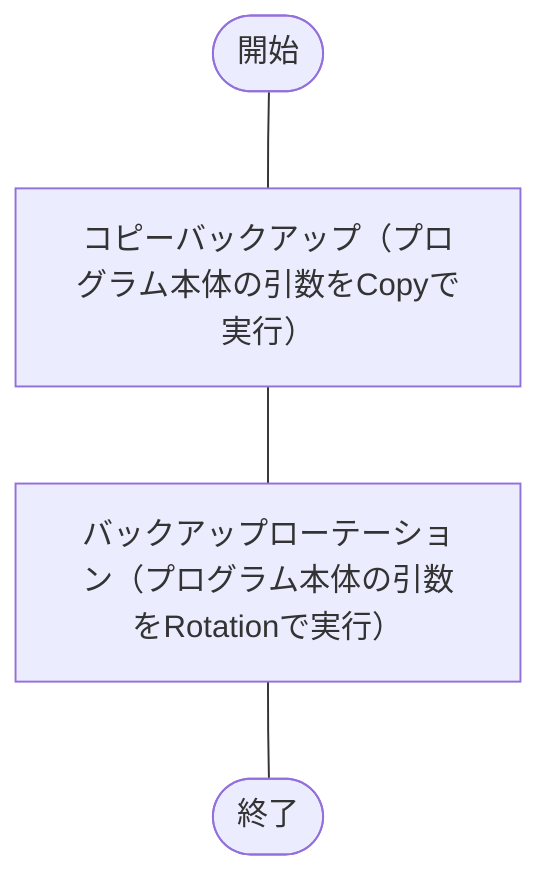
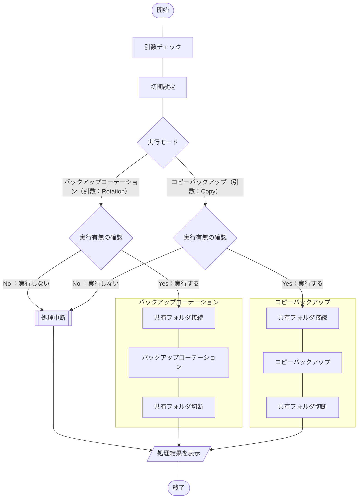

## 概要
[こちらの記事](https://haretokidoki-blog.com/pasocon_powershell-startup/)で文字だけを表示するスクリプトを使い、
PowerShellのはじめ方を紹介しましたが、より実践に近いサンプルプログラムを作成しました。

今回作成したPowerShellスクリプトはWindows共有フォルダ（NAS）と連携し、
ファイルのコピーバックアップを取得するという内容です。

PowerShellの始め方（スタートアップ）としても、ご参考頂ければと思います。
https://haretokidoki-blog.com/pasocon_powershell-startup/
## ターゲット
- PowerShellユーザーの方
- PowerShellでコピーバックアップのスクリプトを作成したい方
- 初心者でPowerShellスクリプト作成の参考にしたい方
## サンプルプログラムの紹介
サンプルプログラムのシナリオは、ジョブスケジューラに登録し定期的（毎日夜間など）にファイルのコピーバックアップを取得するという、シナリオを想定したツール。
### サンプルプログラム
https://github.com/akiGAMEBOY/PowerShell_FileCopybackupTool

### 仕様
プログラム起動用：batファイルとプログラムの本体：ps1ファイル、個別の設定ファイル：setup.iniファイル、
の3つで構成されたプログラム。

なお、共有フォルダに接続する為の下記情報は設定ファイルにより変更可能とする。
1. ホスト名、またはIPアドレス
2. ユーザ名
3. パスワード[^1]
4. バックアップ先のパス（コピー先）
5. 世代数
6. バックアップ対象（コピー元）
[^1]: 平文でパスワードを保存しています。必要に応じて暗号化・複合化の処理を追加してください。

#### フローチャート
##### 処理全体（batファイル）

##### プログラム本体（Main.ps1）

#### 画面仕様
バッチファイル（batファイル）を使いPowerShellスクリプトを実行するので、
画面操作はコマンドプロンプト上で行う。
画面操作は表示された文字列に従ってキーボード入力する。
入力操作は入力の応答待ちで指示された内容を入力する画面と、
確認画面で一時停止している処理を「Enterキー」で続行する2種類の操作方法が主となる。
#### 機能仕様
1. 初期設定
    - MySQL接続用のDLL読み込み
    - ダウンロードフォルダのパスを取得
    - 設定ファイルの読み込み
        1. ホスト名、またはIPアドレス
        2. ポート番号
        3. ユーザ名
        4. パスワード[^3]
        5. データベース名
        6. SQL文
2. 入力処理
    1. 集計開始日付の入力
    書式は[ yyyymmdd ]
    2. 集計終了日付の入力
    書式は[ yyyymmdd ]
3. 日付チェック
    1. 日付の書式チェック
    下記の書式が正しいかチェック。
        - 集計開始日付
        - 集計終了日付
    2. 日付の期間チェック
    下記の関係性かチェック。
        - 集計開始日付 <= 集計終了日付
4. データ取得
MySQL接続用のDLL（MySQL Connector/NET）を使用し、MySQLのデータベースに接続。
接続後、SQL文を実行しデータを取得する。
なお、取得後のデータが0件の場合は処理を中断する。
5. CSVファイル出力
ダウンロードフォルダ（C:¥Users¥`ユーザ名`\Downloads 等）の配下に、
ファイル名「MySQL-to-csv_`集計開始日付`-`集計終了日付`.csv」で新規保存。
既にファイルが存在する場合は上書き保存する。
#### 入出力ファイル
##### 入力ファイル
- 販売実績テーブル（PROD_ENV.SALES_JISSEKI）
    | 項目名 | ORDER_NUM | SALES_DATE | CUSTOMER | UNITS | PRICE |
    | ---- | ---- | ---- | ---- | ---- | ---- |
    | 説明 | 注文番号 | 販売実績日 | 顧客名 | 販売台数 | 販売単価 |
    | 集計条件 |  | ＊ |  |  |  |
    | ID | 入力1 | 入力2 | 入力3 | 入力4 | 入力5 |

##### 出力ファイル
- CSVファイル（MySQL-to-csv_`YYYYMMDD`-`YYYYMMDD`.csv）
保存先：ダウンロードフォルダー（C:¥Users¥`ユーザ名`\Downloads 等）
    | 注文番号 | 販売実績日 | 顧客名 | 販売台数 | 販売単価 |
    | ---- | ---- | ---- | ---- | ---- |
    | 入力1 | 入力2 | 入力3 | 入力4 | 入力5 |
### GitHub
https://github.com/akiGAMEBOY/PowerShell_mysql-to-csv
#### フォルダ構成
```
PowerShell_mysql-to-csv
│  mysql-to-csv.bat     ・・・起動用バッチファイル
│
└─source
        Main.ps1        ・・・プログラム本体
        MySql.Data.dll  ・・・MySQL接続用DLLファイル
        setup.ini       ・・・設定ファイル
```
### 参考記事
https://zenn.dev/haretokidoki/articles/f1634c386ffc1d
