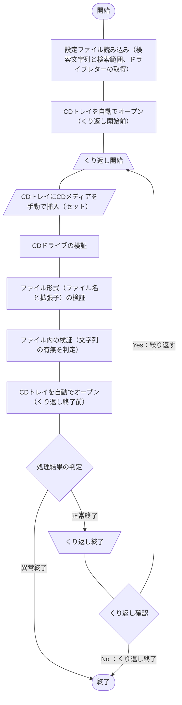

## 概要
[こちらの記事](https://haretokidoki-blog.com/pasocon_powershell-startup/)で文字だけを表示するスクリプトを使い、
PowerShellのはじめ方を紹介しましたが、より実践に近いサンプルコード（サンプルプログラム）を作成しました。

今回作成したPowerShellスクリプトは起動したパソコンのCDドライブ（他のSDカードやDVD、Blu-ray、外部HDD、NASなどの外部記憶装置でも可）を参照し、
CD内のファイルに特定の文字列[^1]の有無を確認するという内容です。
[^1]: 特定の文字列とは、あらかじめ設定ファイル（setup.ini）で設定した値となる。設定ファイルにより値の変更可能。（サンプルのsetup.iniでは“Status=Success”で設定）

PowerShellの始め方（スタートアップ）としても、ご参考頂ければと思います。
https://haretokidoki-blog.com/pasocon_powershell-startup/
## この記事のターゲット
- PowerShellユーザーの方
- PowerShellで外部記憶装置内のデータをチェックするツールを作成したい方
- 初心者でPowerShellスクリプト作成の参考にしたい方
## サンプルプログラムの紹介
サンプルプログラムのシナリオは、チェックしたい複数のCDがあり、そのCD内のデータ[^2]の中身をチェックするという、
シナリオを想定したツール。
[^2]: ログファイル等のテキストベースのファイルである事が前提。

データをチェックする方法は、データの最終桁から指定の行数分[^3]までの中に特定の文字列があるか確認する。
[^3]: 指定の行数分とは、あらかじめ設定ファイル（setup.ini）で設定した値となる。設定ファイルにより値の変更可能。（サンプルのsetup.iniでは10行分で設定）

https://github.com/akiGAMEBOY/PowerShell_CD-DetermineStringTool
### 仕様
プログラム起動用：batファイルとプログラムの本体：ps1ファイル、個別の設定ファイル：setup.iniファイル、
の3つで構成されたプログラム。
大きく分けて下記2点のチェックを実施する。
1. ファイル形式（ファイル名と拡張子）の検証
1. ファイル内の検証（文字列の有無を判定）

なお、チェックする条件となる下記3点については設定ファイルで変更可能とする。
1. 検索する文字列
1. 最終桁から検索する範囲（行数を設定）
1. CDドライブのドライブレター

また、CDトレイは自動でオープンするが、CDメディアを挿入（セット）とCDトレイを閉じる作業は手動で実施する。

#### 画面仕様
##### 画面構成
バッチファイル（batファイル）を使いPowerShellスクリプトを実行するので、
画面操作はコマンドプロンプト上で行う。
画面操作は表示された文字列に従ってキーボード入力する。
入力操作は入力の応答待ちで指示された内容を入力する画面と、
確認画面で一時停止している処理を「Enterキー」で続行する2種類の操作方法が主となる。
#### 機能仕様
1. 設定ファイル読み込み
スクリプトと同じ階層にある設定ファイル（setup.ini）を参照し、
検索文字列（FindString）と検索範囲（FindRange）、CDドライブのドライブレター（DriveLatter）を読み込む。
1. CDトレイを自動でオープン
対象CDドライブのトレイを自動でオープンする
1. CDトレイにCDメディアを手動で挿入（セット）
処理を一時停止し、画面にCDメディアのセットするよう指示メッセージを表示する。
手動でセット後、続行するかのYesNoのメッセージに対し応答する事で処理が再開される。
1. ファイル形式（ファイル名と拡張子）の検証
    - ファイル名の1～4桁目までがアルファベットであること
    - ファイルの種類がCSVファイル（*.csv）、またはテキストファイル（*.txt）であること
1. ファイル内の検証（文字列の有無を判定）
対象ドライブ内にあるすべてのファイルに対し下記の条件に合致するか確認する。
文字列が見つかった場合は正常終了として後続のくり返し確認[^4]に移る。
文字列が見つからない場合は異常終了として処理を中断する。
    - 検索範囲：最終桁から10行分（設定ファイルで変更可能）
    - 検索文字列：“Status=Success”で検索（設定ファイルで変更可能）
[^4]: 別のCDをチェックするかのYes/No確認
#### 入出力ファイル
##### 入力ファイル
CSVファイル、またはテキストファイルの2種類を想定。
CDドライブ内にあるファイルすべてがチェック対象。チェックするファイル数に制限なし。
##### 出力ファイル
出力ファイルなし。画面表示で処理結果を表示するのみ。
### GitHub Repository
https://github.com/akiGAMEBOY/PowerShell_CD-DetermineStringTool
#### フォルダ構成
```
PowerShell_CD-DetermineStringTool
│  CD-DetermineStringTool.bat       ・・・起動用バッチファイル
│  Main.ps1                         ・・・プログラム本体
│  setup.ini                        ・・・設定ファイル
│  LICENSE.md
│  README.md
│
├─.vscode
│      launch.json
│
└─sample_data                       ・・・サンプルの入力データ
    ├─iso                           ・・・ISO化する後の入力データ
    │      csv-failed.iso
    │      csv-failed.mds
    │      csv-success.iso
    │      csv-success.mds
    │      not-data.iso
    │      not-data.mds
    │      not-targetdata.iso
    │      not-targetdata.mds
    │      text-failed.iso
    │      text-failed.mds
    │      text-success.iso
    │      text-success.mds
    │
    └─source-data                   ・・・ISO化する前の入力データ
        ├─csv-failed
        │      data0001.csv
        │      data0002.CSV
        │
        ├─csv-success
        │      data0001.CSV
        │      data0002.csv
        │
        ├─not-data
        ├─not-targetdata
        │      data0001.dat
        │      data0002.dat
        │
        ├─text-failed
        │      data0001.TXT
        │      data0002.txt
        │
        └─text-success
                data0001.txt
                data0002.TXT
```
### 参考記事
- PowerShellのif文の書き方
    https://microsoftou.com/powershell-if/
- PowerShellを使ってiniファイルで設定した値を取得する方法
    https://bags-lab.com/2020/11/01/powershell-environment-ini/
- 設定ファイルを“ConvertFrom-StringData”を使い読み込むとHashtableにならない場合の解決方法
    https://coffeekemuri.blogspot.com/2018/05/powershell-convertfrom.html
    https://stackoverflow.com/questions/35369001/convertfrom-stringdata-fails-casting-to-hashtable
- PowerShellでCDトレイをオープン（イジェクト：取り出し）する方法
    https://guitarrapc-tech.hatenablog.com/entry/2013/01/15/050140
- PowerShellでの正規表現
    https://yomon.hatenablog.com/entry/2014/05/28/PowerShell_正規表現を使ってコマンド一本で文字列抽出

## 関連記事
https://haretokidoki-blog.com/pasocon_powershell-startup/
https://zenn.dev/haretokidoki/articles/7e6924ff0cc960
