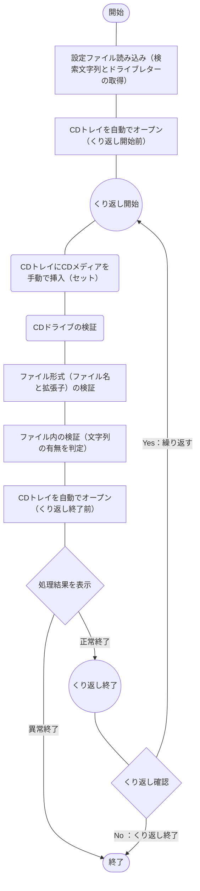

## 概要
[こちらの記事](https://haretokidoki-blog.com/pasocon_powershell-startup/)で文字表示するだけのスクリプトを紹介していますが、
より実践に近しいサンプルプログラムを作成しました。

作成したスクリプトは起動したパソコンのCDドライブ（他のDVDやBlu-ray、外部HDDなども可）を参照し、
ドライブ内のCSVファイルもしくはテキストファイルに特定の文字列[^1]が存在するかチェックするというプログラムです。
[^1]: 特定の文字列とは、あらかじめ設定ファイル（setup.ini）で設定した値となる。変更可能。（サンプルでは“Status=Success”で設定）

PowerShellを始め方（スタートアップ）としても、ご参考頂ければと思います。
https://haretokidoki-blog.com/pasocon_powershell-startup/
## ターゲット
- PowerShellユーザーの方
- PowerShellでCDドライブ内のデータをチェックするツールを作成したい方
- 初心者の方（PowerShellスクリプトの作成方法が分からない方）
## サンプルプログラムの紹介
サンプルプログラムのシナリオは、複数のCDを所持しており、その個々のCD内にあるログファイルの中身をチェックするという想定で作成したツール。
チェック方法はログファイルの最終桁から指定の行分[^2]の中に特定の文字列があるか確認するという内容。
[^2]: 指定の行分とは、あらかじめ設定ファイル（setup.ini）で設定した値となる。変更可能。（サンプルでは、10行で設定）
https://github.com/akiGAMEBOY/PowerShell_CD-DetermineStringTool
### 仕様
PowerShellスクリプト（プログラム起動用：batファイル、プログラムの中身：ps1ファイル）で構成されたツール。
ファイルをチェックする手法は下記2点を実施。
1. ファイル形式（ファイル名と拡張子）の検証
2. ファイル内の検証（文字列の有無を判定）

なお、チェック条件である検索する文字列とCDドライブのドライブレター（EドライブやFドライブ等）については、
設定ファイルにより変更可能とする。
また、CDトレイは自動でオープンするが、CDメディアを挿入（セット）とCDトレイを閉じる作業は手動で実施。

#### 画面仕様
##### 画面構成
プログラム起動用のバッチファイル（batファイル）で実行する為、
画面操作はコマンドプロンプト上で実施。
操作は画面に表示された文字列に従ってキーボード入力する。
基本的な操作は入力の応答待ちで「はい(y) か いいえ(n)」を入力。

#### 機能仕様
1. 設定ファイル読み込み
スクリプトと同じ階層にある設定ファイル（setup.ini）を参照し、
検索文字列（FindString）と検索範囲（FindRange）、CDドライブのドライブレター（DriveLatter）を読み込む。
2. CDトレイを自動でオープン
対象CDドライブのトレイをオープンする
3. CDトレイにCDメディアを手動で挿入（セット）
処理を一時停止し、画面にCDメディアのセットするよう指示メッセージを表示する。
作業者でセット後、YesNoのメッセージに対し応答する事で処理が再開される。
4. ファイル形式（ファイル名と拡張子）の検証
- ファイル名の1～4桁目までがアルファベットであること
- ファイルの種類がCSVファイル（*.csv）、またはテキストファイル（*.txt）であること
5. ファイル内の検証（文字列の有無を判定）
対象ドライブ内にあるファイルを下記の条件に合致するか一つひとつ確認する。
- 検索範囲は最終桁から10行分
- 検索文字列は“Status=Success”で検索（設定ファイルで変更可能）
→文字列があった場合は正常終了として、後続のくり返し処理するかの確認に行く。
　文字列がなかった場合は異常終了として、処理を中断する。
#### 入出力ファイル
##### 入力ファイル
CSVファイル、またはテキストファイルの2種類を想定。
CDドライブにあるファイルすべてをチェックする。チェックのファイル数に制限なし。
##### 出力ファイル
なし。画面表示で処理結果を表示するのみ。
### GitHub
https://github.com/akiGAMEBOY/PowerShell_CD-DetermineStringTool
#### フォルダ構成
```
PowerShell_CD-DetermineStringTool
│  CD-DetermineStringTool.bat       ・・・起動用バッチファイル
│  Main.ps1                         ・・・プログラム本体
│  setup.ini                        ・・・設定ファイル
│
├─.vscode
│      launch.json
│
└─sample_data                       ・・・サンプルの入力データ
    ├─iso                           ・・・ISO化する後の入力データ
    │      csv-failed.iso
    │      csv-failed.mds
    │      csv-success.iso
    │      csv-success.mds
    │      not-data.iso
    │      not-data.mds
    │      not-targetdata.iso
    │      not-targetdata.mds
    │      text-failed.iso
    │      text-failed.mds
    │      text-success.iso
    │      text-success.mds
    │
    └─source-data                   ・・・ISO化する前の入力データ
        ├─csv-failed
        │      data0001.csv
        │      data0002.CSV
        │
        ├─csv-success
        │      data0001.CSV
        │      data0002.csv
        │
        ├─not-data
        ├─not-targetdata
        │      data0001.dat
        │      data0002.dat
        │
        ├─text-failed
        │      data0001.TXT
        │      data0002.txt
        │
        └─text-success
                data0001.txt
                data0002.TXT
```
### 参考記事
1. PowerShellのif文の書き方
https://microsoftou.com/powershell-if/
2. PowerShellを使ってiniファイルで設定した値を取得する方法
https://bags-lab.com/2020/11/01/powershell-environment-ini/
3. 設定ファイルを“ConvertFrom-StringData”を使い読み込むとHashtableにならない場合の解決方法
https://coffeekemuri.blogspot.com/2018/05/powershell-convertfrom.html
https://stackoverflow.com/questions/35369001/convertfrom-stringdata-fails-casting-to-hashtable
4. PowerShellでCDトレイをオープン（イジェクト：取り出し）する方法
https://guitarrapc-tech.hatenablog.com/entry/2013/01/15/050140
5. PowerShellでの正規表現
https://yomon.hatenablog.com/entry/2014/05/28/PowerShell_正規表現を使ってコマンド一本で文字列抽出
