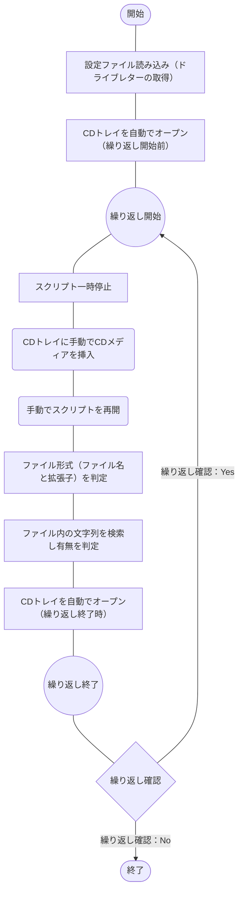

## 概要
[こちらの記事](https://haretokidoki-blog.com/pasocon_powershell-startup/)で文字表示するだけのスクリプトを紹介していますが、
より実践に近しいサンプルプログラムを作成しました。

作成したスクリプトは起動したパソコンのCDドライブ（他のDVDやBlu-ray、外部HDDなども可）を参照し、
ドライブ内のCSVファイルもしくはテキストファイルにある特定の文字列が存在するかチェックするというプログラムです。

PowerShellを始め方（スタートアップ）としても、ご参考頂ければと思います。
https://haretokidoki-blog.com/pasocon_powershell-startup/
## ターゲット
- PowerShellユーザーの方
- PowerShellでCDドライブ内のデータをチェックするツールを作成したい方
- 初心者の方（PowerShellスクリプトの作成方法が分からない方）
## サンプルプログラムの紹介
サンプルプログラムのシナリオは、複数のCDを所持しており、その個々のCD内にあるログファイルの中身をチェックするという想定で作成したツール。
チェック方法はログファイルの最終桁から10行分の中で特定の文字列[^1]の有無を確認する。
[^1]: 特定の文字列とは、あらかじめ設定ファイル（setup.ini）で設定している値（サンプルでは“Status=Success”で設定）
https://github.com/akiGAMEBOY/PowerShell_CD-DetermineStringTool
### 仕様
PowerShellスクリプト（プログラム起動用：batファイル、プログラムの中身：ps1ファイル）により、
CD内にあるファイルが既定の形式（ファイル名や拡張子）かのチェックと、
ファイル内の文字列[^1]を検索し特定の文字列の有無をチェックするツール。

検索する文字列とCDドライブのドライブレター（EドライブやFドライブ等）は設定ファイルにより変更可能とする。
なお、CDトレイは自動でオープンするが、CDメディアを挿入（セット）とCDトレイを閉じる作業は手動で実施。

#### 画面仕様
##### 画面構成
プログラム起動用のバッチファイル（batファイル）で実行する為、
画面操作はコマンドプロンプト上で実施。

#### 機能仕様
1. 設定ファイル読み込み
スクリプトと同じ階層にある設定ファイル（setup.ini）を参照し、
検索文字列（FindString）とCDドライブのドライブレター（DriveLatter）を読み込む。
2. 既定の形式（ファイル名と拡張子）か判定
3. 特定の文字列の有無を判定

1. インポート
指定したフォルダ内のファイル名を検索。
対象のファイル名がある場合に入力データとしてツールに取り込む機能。
2. マスターデータ ※手入力あり
入力データ以外の情報を補完する為の表。
インポート実行時、項目「販売元・開発元」をキーとし自動的に表が作成される。
エクスポート実行前に表の必須項目「スター情報」を入力する必要あり。
3. データ整形とエクスポート
入力データとメイン画面、マスターデータの情報を元にデータ整形とファイルが出力される。
- 入力データ

| DATAID | MODEL | NAME | DISTRIBUTOR | DEVELOPER | RELEASE |
| ---- | ---- | ---- | ---- | ---- | ---- |
| 入力1 | 入力2 | 入力3 | 入力4 | 入力5 | 入力6 |

- メイン画面（入力項目）

| 作業者名 | データ種別 |
| ---- | ---- |
| メイン1 | メイン2 |

- マスターデータ（Master_Star）

| DataID | Distributor | Developer | Star |
| ---- | ---- | ---- | ---- |
| マスター1 | マスター2 | マスター3 | マスター4 |

- 出力データ
入力データもしくはメイン画面、マスターデータの情報より「PS1～PS6」のデータを整形。
データ整形後、1つのExcelファイルに6つのシート「Out_PS1～Out_PS6」の構成でファイルを出力。

| Data Id | Operator | Datatype | Distributor | Developer | Star | Comment | Release date | Name |
| ---- | ---- | ---- | ---- | ---- | ---- | ---- | ---- | ---- |
| 入力1 | メイン1 | メイン2 | 入力4 | 入力5 | マスター4 | "空文字" | 入力6 | 入力3 |
#### 入出力ファイル
##### 入力ファイル
6種類のCSVファイルを想定。
項目は「DATAID, MODEL, NAME, DISTRIBUTOR, DEVELOPER, RELEASE」の6個で構成。
1. 入力情報 PS1
ファイル名が「_PS1」を含むCSVファイルを取り込む
2. 入力情報 PS2
ファイル名が「_PS2」を含むCSVファイルを取り込む
3. 入力情報 PS3
ファイル名が「_PS3」を含むCSVファイルを取り込む
4. 入力情報 PS4
ファイル名が「_PS4」を含むCSVファイルを取り込む
5. 入力情報 PS5
ファイル名が「_PS5」を含むCSVファイルを取り込む
6. 入力情報 PS6
ファイル名が「_PS6」を含むCSVファイルを取り込む
##### マスターデータ
1. スター情報のマスター（Master_Star）
入力データの項目「Distributor（販売元）、Developer（開発元）」を元に自動的に集計される表。
集計表の項目は「DataID, Distributor, Developer, Star」で構成。
項目「Star」は集計表が作成された直後は未記入の状態。エクスポート実行前に入力するべき必須項目。
##### 出力ファイル
Excel 1ファイル内、6個のシートで構成された出力ファイル。
項目は「Data Id, Operator, Datatype, Distributor, Developer, Star, Comment, Release date, Name」の9個で構成。
1. 出力情報 PS1
入力情報 PS1とマスターデータを元に整形したデータ
2. 出力情報 PS2
入力情報 PS2とマスターデータを元に整形したデータ
3. 出力情報 PS3
入力情報 PS2とマスターデータを元に整形したデータ
4. 出力情報 PS4
入力情報 PS4とマスターデータを元に整形したデータ
5. 出力情報 PS5
入力情報 PS5とマスターデータを元に整形したデータ
6. 出力情報 PS6
入力情報 PS6とマスターデータを元に整形したデータ
### GitHub
https://github.com/akiGAMEBOY/ExcelVBA_csv-to-excel
#### フォルダ構成
```
ExcelVBA_csv-to-excel
│
│  LICENSE.md
│  README.md
│  vbac.wsf                                         ・・・ソース管理支援ツール（ariawase）
│  vbac_Export.bat                                  ・・・xlsmファイル to テキストファイル（dcm or bas ...）
│  vbac_Import.bat                                  ・・・テキストファイル to xlsmファイル
│
├─bin
│  │  ExcelVBA_csv-to-excel.xlsm                    ・・・ツール本体
│  │
│  └─sample_ルートフォルダ_ExcelVBA_csv-to-excel     ・・・サンプルの入力データ
│          DATA0001_PS1.csv
│          DATA0001_PS2.csv
│          DATA0001_PS3.csv
│          DATA0001_PS4.csv
│          DATA0001_PS5.csv
│          DATA0001_PS6.csv
│
└─src
    └─ExcelVBA_csv-to-excel.xlsm                    ・・・テキストファイル群（vbac_Export.batの結果）
            mdlCommon.bas                           ・・・自作モジュール
            Sheet1.dcm                              ・・・設定情報の処理（初期化ボタン）
            Sheet3.dcm                              ・・・メインの処理（データ整形）
```
### 参考記事
1. Excel VBA + vbac(ariawase) + VS Code
https://zenn.dev/haretokidoki/scraps/e545be2947c43c
2. GitHubへのアップロード構成
https://blog.ue-y.me/vba2021/

